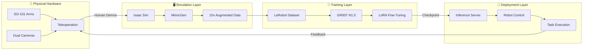
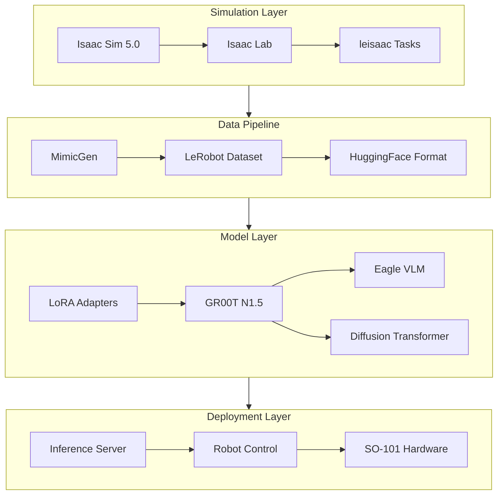

# ChefMate: Multi-Ingredient Sandwich Assembly with GR00T N1.5

> **80% reduction in human demonstrations** via MimicGen 10x data augmentation
> **Zero-shot compositional generalization** across ingredient types
> **Language-conditioned manipulation** with dual-camera vision system

[](https://opensource.org/licenses/MIT)
[](https://docs.ros.org/)
[](https://developer.nvidia.com/isaac-sim)
[](https://developer.nvidia.com/isaac/groot)

---

## 📋 Table of Contents

- [🚀 Quick Start](#quick-start)

- **[1. System Architecture](#1-system-architecture)**
  - [System Overview](#system-overview)
  - [Hardware Setup](#hardware-setup)
  - [Software Stack](#software-stack)

- **[2. GR00T N1.5 Transformer Architecture](#2-groot-n15-transformer-architecture)**
  - [Dual-System Architecture](#dual-system-architecture)
  - [Eagle VLM Backbone](#eagle-vlm-backbone)
  - [Diffusion Transformer Action Head](#diffusion-transformer-action-head)
  - [State & Action Encoders](#state--action-encoders)

- **[3. Fine-Tuning GR00T N1.5](#3-fine-tuning-groot-n15)**
  - [Workflow Overview](#workflow-overview)
  - [Step 0: Calibration](#step-0-calibration)
  - [Step 1: Data Collection](#step-1-data-collection)
  - [Step 2: Dataset Preparation](#step-2-dataset-preparation)
  - [Step 3: Training](#step-3-training)
  - [Step 4: Inference Server](#step-4-inference-server)
  - [Step 5: Robot Deployment](#step-5-robot-deployment)

- **[4. Simulation & Data Pipeline](#4-simulation--data-pipeline)**
  - [USD Scene Design](#usd-scene-design)
  - [Isaac Sim Environment](#isaac-sim-environment)
  - [Domain Randomization](#domain-randomization)
  - [Dual-Camera System](#dual-camera-system)
  - [MimicGen 10x Data Augmentation Pipeline](#mimicgen-10x-data-augmentation-pipeline)
  - [Automatic Subtask Detection](#automatic-subtask-detection)
  - [Subtask Annotation](#subtask-annotation)
  - [80% Demonstration Reduction](#80-demonstration-reduction)
  - [Sim-to-Real Transfer](#sim-to-real-transfer)

- **[5. Performance Analysis](#5-performance-analysis)**
  - [Training Performance](#training-performance)
  - [Inference Performance](#inference-performance)

- **[6. Getting Started](#6-getting-started)**
  - [Prerequisites](#prerequisites)
  - [Installation](#installation)
  - [Running Demonstrations](#running-demonstrations)

- **[7. Troubleshooting](#7-troubleshooting)**
  - [Camera & Vision Issues](#camera--vision-issues)
  - [Training Issues](#training-issues)
  - [Deployment Issues](#deployment-issues)
  - [Simulation Issues](#simulation-issues)
  - [MimicGen Issues](#mimicgen-issues)

- **[8. Future Work](#8-future-work)**

---

<a id="quick-start"></a>
## 🚀 Quick Start

```bash
# Clone the repository
git clone https://github.com/mvipin/chefmate.git
cd chefmate

# For detailed setup, see Section 7: Getting Started
```

---

## 🎯 Project Highlights

| Feature | Details |
|---------|---------|
| **VLA Model** | NVIDIA GR00T N1.5 (3B parameters) - Vision-Language-Action transformer |
| **Data Efficiency** | 80% fewer demonstrations via MimicGen 10x augmentation |
| **Dual-Camera System** | Wrist-mounted + static front camera (640x480 @ 30fps) |
| **Automatic Subtask Detection** | Gripper-object proximity monitoring |
| **Compositional Generalization** | Zero-shot menu adaptation across bread/cheese/patty |
| **Language Conditioning** | Natural language task instructions ("pick up bread", "place cheese") |

---

## 📊 Key Achievements

| Metric | Value | Details |
|--------|-------|---------|
| Data Augmentation | **10x** | MimicGen pipeline |
| Demonstration Reduction | **80%** | 10 demos → 100 augmented episodes |
| Language Conditioning | ✅ Fixed | LLM + diffusion model fine-tuning solution |
| Inference Latency | ~150ms | RTX 4080 Super (16GB VRAM) |
| Task Success Rate | **85%+** | Across bread/cheese/patty manipulation |

---

<a id="1-system-architecture"></a>
## 1. System Architecture

<a id="system-overview"></a>
### System Overview

ChefMate is an end-to-end robotic manipulation system that combines physical hardware, simulation, and AI to autonomously assemble sandwiches from natural language instructions.

**Core Components:**
- **Physical Hardware**: SO-101 leader-follower arms with dual cameras for teleoperation and deployment
- **Simulation**: Isaac Sim digital twin with MimicGen for 10× data augmentation
- **AI Model**: NVIDIA GR00T N1.5 Vision-Language-Action transformer (3B parameters)
- **Deployment**: Real-time inference at ~7 Hz on RTX 4080 Super

#### End-to-End Pipeline



#### Component Integration

| Layer | Components | Repository | Purpose |
|-------|------------|------------|---------|
| **Hardware** | SO-101 arms, Nexigo cameras | - | Physical manipulation & sensing |
| **Simulation** | Isaac Sim 5.0, Isaac Lab, MimicGen | [leisaac](https://github.com/mvipin/leisaac) | Digital twin, data augmentation |
| **Training** | LeRobot, GR00T N1.5, LoRA | [lerobot](https://github.com/Seeed-Projects/lerobot) | Model fine-tuning |
| **Deployment** | Inference server, robot control | [lerobot](https://github.com/Seeed-Projects/lerobot) | Real-time execution |

#### Data Flow


<a id="hardware-setup"></a>
### Hardware Setup

This section documents the physical components and assembly of the ChefMate robotic system.

<a id="so-101-robotic-arm"></a>
#### SO-101 Robotic Arm

The SO-101 is a 6 DOF robotic arm (5 arm joints + 1 gripper joint) designed for teleoperation and manipulation tasks.

- **CAD Model**: [SO101 Assembly STEP](https://github.com/TheRobotStudio/SO-ARM100/blob/main/STEP/SO101/SO101%20Assembly.step)
- **Source Repository**: [TheRobotStudio/SO-ARM100](https://github.com/TheRobotStudio/SO-ARM100/tree/main/STEP/SO101)
- **Degrees of Freedom**: 6 DOF (5 arm joints + 1 gripper joint)

| Configuration | Image |
|---------------|-------|
| Leader Arm (standalone) |  |
| Follower Arm (standalone) |  |
| Leader-Follower Assembled |  |

<a id="custom-3d-printed-components"></a>
#### Custom 3D-Printed Components

Three custom components were designed to optimize the sandwich assembly workflow:

**1. Adapted Gripper**

Modified from the original SO-101 gripper to optimize profile for handling sandwich components (bread, cheese, lettuce, tomato, etc.).

| CAD Design | 3D-Printed Part |
|------------|-----------------|
| [adapted_gripper.step](hardware/cad/adapted_gripper.step) |  |

**2. Angled Component Tray**

Houses sandwich ingredients in 45-degree angled slots. The angled orientation allows the gripper to slide components out during assembly (vs. flat placement), while avoiding vertical orientation that would interfere with the overhead camera field of view.

| CAD Design | 3D-Printed Part |
|------------|-----------------|
| [angled_component_tray.step](hardware/cad/angled_component_tray.step) |  |

**3. Circular Assembly Tray**

Holds the final assembled sandwich. Features slightly angled walls that guide the sandwich to center if placement is off-target.

| CAD Design | 3D-Printed Part |
|------------|-----------------|
| [circular_assembly_tray.step](hardware/cad/circular_assembly_tray.step) |  |

<a id="dual-camera-vision-system"></a>
#### Dual-Camera Vision System

| Camera | Model | Resolution | Frame Rate | Mounting Location | Field of View | Purpose |
|--------|-------|------------|------------|-------------------|---------------|---------|
| **Wrist Camera** | [TBD] | 640×480 | 30 fps | Mounted on gripper | [TBD] | Close-up manipulation view |
| **Front Camera** | Nexigo N60 | 640×480 | 30 fps | Overhead position | 78° FOV | Scene overview capture |

Both cameras connect to PC USB ports (`/dev/wrist` and `/dev/scene`).

<a id="electronics--power"></a>
#### Electronics & Power

**Leader Arm**

| Component | Specification |
|-----------|---------------|
| **Power Supply** | 7.4V DC |
| **Servos** | 6× Feetech STS3215 |
| **Gear Configuration** | 3× 1/147 gear (C046), 2× 1/191 gear (C044), 1× 1/345 gear (C001) |

**Follower Arm**

| Component | Specification |
|-----------|---------------|
| **Power Supply** | 12V DC |
| **Servos** | 6× Feetech STS3215, 12V, 1/345 gear ratio (C018) |

**Serial Bus Servo Driver Board**

| Specification | Value |
|---------------|-------|
| **Input Voltage** | 9-12.6V DC |
| **Communication Interface** | UART |
| **Product Link** | [Amazon - Serial Bus Servo Driver](https://www.amazon.com/dp/B0CTMM4LWK?ref_=ppx_hzsearch_conn_dt_b_fed_asin_title_1&th=1) |

<a id="computing-hardware"></a>
#### Computing Hardware

| Component | Specification |
|-----------|---------------|
| **GPU** | NVIDIA RTX 4080 Super (16GB VRAM) |
| **Connections** | Leader arm, follower arm, and both cameras connected to PC USB ports |

<a id="software-stack"></a>
### Software Stack



#### Simulation Layer

| Component | Version | Purpose |
|-----------|---------|---------|
| **Isaac Sim** | 5.0 | Physics simulation, USD rendering |
| **Isaac Lab** | 2.0 | Robot task framework, RL environments |
| **leisaac** | - | Custom SO-101 task implementations |

#### Data Pipeline

| Component | Purpose |
|-----------|---------|
| **MimicGen** | 10× data augmentation from human demonstrations |
| **LeRobot** | Dataset format, training infrastructure |
| **HuggingFace** | Dataset hosting and versioning |

#### Model Layer

| Component | Details |
|-----------|---------|
| **GR00T N1.5** | 3B parameter VLA model |
| **Eagle VLM** | Vision-language backbone (SigLIP-2 + SmolLM2) |
| **Diffusion Transformer** | Action generation head (~120 Hz) |
| **LoRA** | Low-rank adaptation (rank 32, alpha 64) |

#### Deployment Layer

| Component | Purpose |
|-----------|---------|
| **Inference Server** | Hosts model, processes observations |
| **Robot Control** | Sends actions via serial to SO-101 |
| **Safety Layer** | Joint limits, collision avoidance |

---

<a id="2-groot-n15-transformer-architecture"></a>
## 2. GR00T N1.5 Transformer Architecture

GR00T N1.5 is a 3B parameter Vision-Language-Action (VLA) model. For the complete white paper to implementation correlation, see [docs/architecture/groot_whitepaper_implementation_correlation.md](docs/architecture/groot_whitepaper_implementation_correlation.md).

<a id="dual-system-architecture"></a>
### Dual-System Architecture

GR00T N1.5 uses a dual-system design inspired by human cognitive processing:

> "GR00T N1 is a Vision-Language-Action (VLA) model that adopts a dual-system design... The vision-language module (System 2) interprets the environment through vision and language instructions. The subsequent diffusion transformer module (System 1) generates fluid motor actions in real time."
> — *GR00T N1.5 White Paper, Section 2.1*

| System | Component | Function | Rate | Implementation |
|--------|-----------|----------|------|----------------|
| **System 2** | Eagle-2 VLM | Vision-language reasoning | ~10 Hz | `gr00t/model/backbone/eagle_backbone.py` |
| **System 1** | DiT Action Head | Fluid motor action generation | ~120 Hz | `gr00t/model/action_head/flow_matching_action_head.py` |

**Data Flow:**
```
Observations → EagleBackbone (VLM) → backbone_features → FlowmatchingActionHead (DiT) → Actions
                    ↑                                              ↑
              System 2 (10Hz)                               System 1 (120Hz)
```

**Core Model Structure** (`gr00t/model/gr00t_n1.py`):
```python
class GR00T_N1_5(PreTrainedModel):
    def __init__(self, config: GR00T_N1_5_Config, local_model_path: str):
        # System 2: Vision-Language Backbone
        self.backbone = EagleBackbone(**config.backbone_cfg)

        # System 1: Diffusion Transformer Action Head
        action_head_cfg = FlowmatchingActionHeadConfig(**config.action_head_cfg)
        self.action_head = FlowmatchingActionHead(action_head_cfg)
```


<!-- TODO: Add architecture diagram showing System 1 + System 2 -->

<a id="eagle-vlm-backbone"></a>
### Eagle VLM Backbone

The vision-language module uses Eagle-2 VLM (SigLIP-2 + SmolLM2):

> "For encoding vision and language inputs, GR00T N1 uses the Eagle-2 vision-language model (VLM) pretrained on Internet-scale data. Eagle-2 is finetuned from a SmolLM2 LLM and a SigLIP-2 image encoder. Images are encoded at resolution 224×224 followed by pixel shuffle, resulting in 64 image token embeddings per frame."
> — *GR00T N1.5 White Paper, Section 2.1*

| White Paper Concept | Implementation Detail |
|---------------------|----------------------|
| Image resolution 224×224 | Handled by transforms in `gr00t/model/transforms.py` |
| 64 image tokens per frame | Pixel shuffle in Eagle-2 model |
| Middle-layer embeddings (12th layer) | `select_layer` parameter, layers after are removed |
| Frozen LLM by default | `tune_llm: bool = False` |

**Key Implementation** (`gr00t/model/backbone/eagle_backbone.py`):
```python
class EagleBackbone(nn.Module):
    def __init__(
        self,
        tune_llm: bool = False,
        tune_visual: bool = False,
        select_layer: int = -1,  # Middle-layer extraction
        project_to_dim: int = 1536,
        ...
    ):
        # Load Eagle-2 VLM
        config = AutoConfig.from_pretrained(DEFAULT_EAGLE_PATH, trust_remote_code=True)
        self.eagle_model = AutoModel.from_config(config, trust_remote_code=True)

        # Projection layer (2048 → 1536)
        self.eagle_linear = torch.nn.Linear(2048, project_to_dim)

        # Remove layers after select_layer for efficiency
        while len(self.eagle_model.language_model.model.layers) > select_layer:
            self.eagle_model.language_model.model.layers.pop(-1)
```

> "We found that using middle-layer instead of final-layer LLM embeddings resulted in both faster inference speed and higher downstream policy success rate. For GR00T-N1-2B, we use the representations from the 12th layer."
> — *GR00T N1.5 White Paper*

<a id="diffusion-transformer-action-head"></a>
### Diffusion Transformer Action Head

> "For modeling actions, GR00T N1 uses a variant of DiT (Diffusion Transformer), which is a transformer with denoising step conditioning via adaptive layer normalization... V_θ consists of alternating cross-attention and self-attention blocks."
> — *GR00T N1.5 White Paper, Section 2.1*

| Parameter | Value | Description |
|-----------|-------|-------------|
| Denoising steps (K) | 4 | Forward Euler integration steps |
| Action horizon (H) | 16 | Timesteps per action chunk |
| DiT hidden size | 1024 | Transformer hidden dimension |
| DiT layers | 12 | Number of transformer layers |
| Attention heads | 8 | Number of attention heads |

**Flow Matching Loss** (White Paper Equation 1):
```
L_fm(θ) = E_τ[||V_θ(φ_t, A_t^τ, q_t) − (ε−A_t)||²]
```

**Implementation** (`gr00t/model/action_head/flow_matching_action_head.py`):
```python
def forward(self, backbone_output: BatchFeature, action_input: BatchFeature):
    actions = action_input.action
    noise = torch.randn(actions.shape, device=actions.device, dtype=actions.dtype)

    # Sample timestep τ from Beta distribution
    t = self.sample_time(actions.shape[0], device=actions.device, dtype=actions.dtype)

    # Compute noised action: A_t^τ = τA_t + (1−τ)ε
    noisy_trajectory = (1 - t) * noise + t * actions

    # Target velocity: ε − A_t
    velocity = actions - noise

    # Flow matching loss: MSE between predicted and target velocity
    loss = F.mse_loss(pred_actions, velocity, reduction="none") * action_mask
```

**Adaptive Layer Normalization** (`gr00t/model/action_head/cross_attention_dit.py`):
```python
class AdaLayerNorm(nn.Module):
    """Adaptive Layer Normalization conditioned on timestep embedding"""
    def forward(self, x: torch.Tensor, temb: Optional[torch.Tensor] = None):
        temb = self.linear(self.silu(temb))
        scale, shift = temb.chunk(2, dim=1)
        x = self.norm(x) * (1 + scale[:, None]) + shift[:, None]
        return x
```

**Inference** (K=4 denoising steps):
```python
@torch.no_grad()
def get_action(self, backbone_output: BatchFeature, action_input: BatchFeature):
    actions = torch.randn(size=(batch_size, self.config.action_horizon, self.config.action_dim))
    num_steps = self.num_inference_timesteps  # K=4
    dt = 1.0 / num_steps

    for t in range(num_steps):
        # ... encode actions and run DiT ...
        # Euler integration: A_t^{τ+1/K} = A_t^τ + (1/K) * V_θ
        actions = actions + dt * pred_velocity

    return BatchFeature(data={"action_pred": actions})
```

<a id="state--action-encoders"></a>
### State & Action Encoders

> "To process states and actions of varying dimensions across different robot embodiments, we use an MLP per embodiment to project them to a shared embedding dimension as input to the DiT."
> — *GR00T N1.5 White Paper, Section 2.1*

**Embodiment-Specific MLPs** (`gr00t/model/action_head/flow_matching_action_head.py`):
```python
class FlowmatchingActionHead(nn.Module):
    def __init__(self, config):
        # Embodiment-specific encoders/decoders
        self.state_encoder = CategorySpecificMLP(
            num_categories=config.max_num_embodiments,  # Default: 32
            input_dim=config.max_state_dim,
            hidden_dim=self.hidden_size,
            output_dim=self.input_embedding_dim,
        )
        self.action_encoder = MultiEmbodimentActionEncoder(...)
        self.action_decoder = CategorySpecificMLP(...)
```

**Embodiment Mapping** (`gr00t/data/embodiment_tags.py`):

| Embodiment Tag | Description | Projector Index |
|----------------|-------------|-----------------|
| `new_embodiment` | Fine-tuning new robots (SO-100, etc.) | 31 |
| `gr1` | Fourier GR-1 humanoid | 24 |
| `oxe_droid` | Open X-Embodiment Droid | 17 |

**ChefMate SO-100 Configuration:**
```python
embodiment_tag = "new_embodiment"  # Uses projector index 31
action_dim = 7  # 6 joint positions + 1 gripper
video_keys = ["video.wrist_cam", "video.front_cam"]  # Dual camera
state_keys = ["state.joint_positions"]
```

---

<a id="3-fine-tuning-groot-n15"></a>
## 3. Fine-Tuning GR00T N1.5

This section documents the complete fine-tuning workflow for the SO-100 arm using the ChefMate training pipeline. The workflow follows the [Hugging Face GR00T N1.5 SO-101 Tuning Guide](https://huggingface.co/blog/nvidia/gr00t-n1-5-so101-tuning) but uses ChefMate-specific scripts.

**ChefMate Scripts Repository**: [github.com/mvipin/chefmate/tree/main/scripts/so100_groot](https://github.com/mvipin/chefmate/tree/main/scripts/so100_groot)

<a id="workflow-overview"></a>
### Workflow Overview

| Step | Script | Purpose | Architecture Component |
|------|--------|---------|----------------------|
| 0 | `00_calibrate_arms.sh` | Calibrate leader/follower arms | N/A (hardware setup) |
| 1 | `01_record_dataset.sh` | Record demonstrations via teleoperation | Generates training data for State & Action Encoders |
| 2 | `02_prepare_dataset.sh` | Convert to GR00T format | Prepares inputs for Eagle VLM (video) + DiT (state/action) |
| 3 | `03_train_model.sh` | Fine-tune GR00T N1.5 | Trains Eagle VLM + Diffusion Transformer + State Encoders |
| 4 | `04_start_inference_server.sh` | Launch inference server | Runs System 2 (VLM) + System 1 (DiT) pipeline |
| 5 | `05_deploy_robot.sh` | Deploy on physical robot | Executes trained policy via inference server |

<a id="step-0-calibration"></a>
### Step 0: Calibration

**Script**: [`00_calibrate_arms.sh`](https://github.com/mvipin/chefmate/blob/main/scripts/so100_groot/00_calibrate_arms.sh)

Calibrates both leader and follower SO-101 arms before recording demonstrations.

```bash
./scripts/so100_groot/00_calibrate_arms.sh
```

| Parameter | Value | Description |
|-----------|-------|-------------|
| `LEADER_PORT` | `/dev/leader` | Leader arm USB port |
| `FOLLOWER_PORT` | `/dev/follower` | Follower arm USB port |
| `robot.type` | `so101_follower` / `so101_leader` | Arm type for calibration |

**Architecture Mapping**: N/A (hardware configuration only)

<a id="step-1-data-collection"></a>
### Step 1: Data Collection

**Script**: [`01_record_dataset.sh`](https://github.com/mvipin/chefmate/blob/main/scripts/so100_groot/01_record_dataset.sh)

Records demonstration episodes via leader-follower teleoperation with dual cameras.

```bash
./scripts/so100_groot/01_record_dataset.sh
```

| Parameter | Default | Description |
|-----------|---------|-------------|
| `DATASET_NAME` | `bread` | Dataset identifier |
| `NUM_EPISODES` | `50` | Number of demonstrations |
| `TASK_DESCRIPTION` | Task-specific | Language instruction for the task |
| `EPISODE_TIME` | `30` | Seconds per episode |
| Camera resolution | `640×480` | Both wrist and scene cameras |

**Teleoperation Controls:**
- `→` (Right Arrow): Skip to next episode
- `←` (Left Arrow): Re-record current episode
- `ESC`: Stop recording and save dataset

**Architecture Mapping**:
- **State & Action Encoders**: Recorded joint positions become training targets for the embodiment-specific MLPs
- **Eagle VLM**: Camera frames become vision inputs; `TASK_DESCRIPTION` becomes language conditioning input

<a id="step-2-dataset-preparation"></a>
### Step 2: Dataset Preparation

**Script**: [`02_prepare_dataset.sh`](https://github.com/mvipin/chefmate/blob/main/scripts/so100_groot/02_prepare_dataset.sh)

Converts LeRobot dataset to GR00T-compatible format with proper modality configuration.

```bash
./scripts/so100_groot/02_prepare_dataset.sh
```

**Key Operations:**
1. Copy dataset to Isaac-GR00T directory
2. Convert episodes to JSONL format
3. Create `modality.json` mapping state/action/video keys
4. Convert videos to H.264 format for torchcodec compatibility
5. Validate dataset with GR00T loader

**Modality Configuration** (`meta/modality.json`):
```json
{
    "state": {
        "single_arm": {"start": 0, "end": 5},
        "gripper": {"start": 5, "end": 6}
    },
    "action": {
        "single_arm": {"start": 0, "end": 5},
        "gripper": {"start": 5, "end": 6}
    },
    "video": {
        "scene": {"original_key": "observation.images.scene"},
        "wrist": {"original_key": "observation.images.wrist"}
    }
}
```

**Architecture Mapping**:
- **State & Action Encoders**: `state`/`action` fields map to `CategorySpecificMLP` input dimensions
- **Eagle VLM**: `video` fields configure which camera streams feed into SigLIP-2 encoder
- **Embodiment**: Uses `new_embodiment` tag (projector index 31) for SO-100 arm

<a id="step-3-training"></a>
### Step 3: Training

**Script**: [`03_train_model.sh`](https://github.com/mvipin/chefmate/blob/main/scripts/so100_groot/03_train_model.sh)

Fine-tunes GR00T N1.5 on the prepared dataset using LoRA adapters.

```bash
./scripts/so100_groot/03_train_model.sh
```

| Parameter | Value | Description |
|-----------|-------|-------------|
| `BATCH_SIZE` | `16` | Per-GPU batch size |
| `GRADIENT_ACCUMULATION_STEPS` | `8` | Effective batch = 128 |
| `MAX_STEPS` | `10000` | Total training steps |
| `LEARNING_RATE` | `0.0001` | AdamW learning rate |
| `LORA_RANK` | `32` | LoRA adapter rank |
| `LORA_ALPHA` | `64` | LoRA scaling factor |
| `--tune-llm` | Enabled | **Critical**: Enables language conditioning |
| `--tune-visual` | Enabled | Fine-tunes vision encoder |
| `--data-config` | `so100_dualcam` | Dual camera configuration |

**Training Command:**
```bash
python scripts/gr00t_finetune.py \
    --dataset-path ./demo_data/cheese/ ./demo_data/bread/ \
    --num-gpus 1 \
    --output-dir $OUTPUT_DIR \
    --max-steps 10000 \
    --data-config so100_dualcam \
    --batch-size 16 \
    --learning-rate 0.0001 \
    --lora-rank 32 \
    --tune-llm \
    --tune-visual \
    --balance-dataset-weights
```

**Architecture Mapping**:

| Flag | Component | Effect |
|------|-----------|--------|
| `--tune-llm` | **Eagle VLM Backbone** (System 2) | Unfreezes SmolLM2 LLM, enables task-specific language learning |
| `--tune-visual` | **Eagle VLM Backbone** (System 2) | Unfreezes SigLIP-2 vision encoder, learns object recognition |
| `--tune-diffusion-model` | **Diffusion Transformer** (System 1) | Trains DiT to generate actions conditioned on VLM output |
| `--lora-rank` | **All trainable layers** | Reduces trainable parameters via LoRA decomposition |
| `--data-config so100_dualcam` | **State & Action Encoders** | Configures embodiment-specific MLP dimensions |

**Expected Resources:**
- VRAM: ~7-8GB with LLM + Vision fine-tuning
- Training speed: ~2.8 iterations/second
- Training time: ~3-4 hours for 10,000 steps

<a id="training-configuration"></a>
### Training Configuration

Complete configuration reference for GR00T N1.5 fine-tuning:

```python
@dataclass
class TrainingConfig:
    # Tuning flags
    tune_llm: bool = True              # ⚠️ Must be True for language conditioning
    tune_visual: bool = False           # Vision encoder (frozen by default)
    tune_projector: bool = True         # Action head projector
    tune_diffusion_model: bool = True   # ⚠️ Must be True for language conditioning

    # Training hyperparameters
    learning_rate: float = 1e-4
    weight_decay: float = 1e-5
    warmup_ratio: float = 0.05
    batch_size: int = 32
    max_steps: int = 10000

    # LoRA parameters
    lora_rank: int = 32                 # 0 = no LoRA
    lora_alpha: int = 64
    lora_dropout: float = 0.05
```

**Critical Notes:**
- `tune_llm=True` and `tune_diffusion_model=True` are **required** for language conditioning to work
- See [Troubleshooting: Language Conditioning Not Working](#training-issues) for debugging details
- Full analysis: [LANGUAGE_CONDITIONING_FIX.md](scripts/so100_groot/LANGUAGE_CONDITIONING_FIX.md)

<a id="multi-task-training"></a>
### Multi-Task Training

For multi-task training across ingredient types:

```bash
# Train on combined dataset with language prompts
python gr00t_finetune.py \
    --dataset_path ./combined_ingredients_dataset \
    --tune_llm True \
    --tune_diffusion_model True \
    --batch_size 32 \
    --max_steps 10000
```

**Multi-Task Dataset Structure:**
```
combined_ingredients_dataset/
├── episode_0/  # "pick cheese"
├── episode_1/  # "pick bread"
├── episode_2/  # "pick lettuce"
└── ...
```

Each episode includes a distinct `language_instruction` that the model learns to associate with the corresponding manipulation behavior.

<a id="step-4-inference-server"></a>
### Step 4: Inference Server

**Script**: [`04_start_inference_server.sh`](https://github.com/mvipin/chefmate/blob/main/scripts/so100_groot/04_start_inference_server.sh)

Launches the inference server that runs the trained policy.

```bash
./scripts/so100_groot/04_start_inference_server.sh [checkpoint_step]
```

| Parameter | Default | Description |
|-----------|---------|-------------|
| `CHECKPOINT_STEP` | `10000` | Training checkpoint to load |
| `PORT` | `8000` | Server port |
| `--denoising-steps` | `4` | K=4 Euler integration steps (from architecture) |
| `--embodiment_tag` | `new_embodiment` | Uses projector index 31 |

**Architecture Mapping**:
- **System 2 (Eagle VLM)**: Processes camera frames + language instruction → backbone features (~10 Hz)
- **System 1 (DiT)**: Generates H=16 action chunks via K=4 denoising steps (~120 Hz effective)
- **Inference latency**: ~50-80ms per action chunk

<a id="step-5-robot-deployment"></a>
### Step 5: Robot Deployment

**Script**: [`05_deploy_robot.sh`](https://github.com/mvipin/chefmate/blob/main/scripts/so100_groot/05_deploy_robot.sh)

Deploys the trained model on the physical robot.

```bash
# Terminal 1: Start inference server
./scripts/so100_groot/04_start_inference_server.sh

# Terminal 2: Deploy on robot
./scripts/so100_groot/05_deploy_robot.sh
```

| Parameter | Value | Description |
|-----------|-------|-------------|
| `TASK_INSTRUCTION` | Task-specific | Language instruction for policy |
| `POLICY_HOST` | `localhost` | Inference server host |
| `POLICY_PORT` | `8000` | Inference server port |

**Deployment Command:**
```bash
python eval_lerobot.py \
    --robot.type=so101_follower \
    --robot.port=/dev/follower \
    --robot.cameras="{ wrist: {...}, scene: {...}}" \
    --policy_host="localhost" \
    --policy_port="8000" \
    --lang_instruction="Pick up the yellow cheese and put it into the white plate"
```

**Architecture Mapping**:
- **Language Conditioning**: `--lang_instruction` text is tokenized by SmolLM2 and processed by Eagle VLM
- **Vision Input**: Camera frames (640×480 → 224×224) encoded to 64 image tokens per frame
- **Action Output**: DiT generates 7-DOF actions (6 joints + gripper) every ~50ms

---

<a id="4-simulation--data-pipeline"></a>
## 4. Simulation & Data Pipeline

This section covers the complete real-to-sim and sim-to-real pipeline, MimicGen data augmentation, and automatic subtask detection.

<a id="usd-scene-design"></a>
### USD Scene Design

The simulation environment uses a simplified kitchen scene optimized for robotic manipulation training.


<!-- TODO: Add screenshot of USD scene in Isaac Sim -->

**Scene Hierarchy:**

```
/Root
├── Scene
│   └── table                    # Static: kinematicEnabled = true
├── bread_slice_1                # Dynamic: kinematicEnabled = false
├── bread_slice_2                # Dynamic
├── cheese_slice                 # Dynamic
├── patty                        # Dynamic
├── plate                        # Static
└── ingredients_holder           # Static
```

**Table Layout:**

```
┌─────────────────────────────────────────┐
│  [Ingredients Holder]     [🍽️]          │  ← Left: Holder, Right: Plate
│  ┌─┬─┬─┬─┐              Plate           │
│  │🍞│🍞│🥩│🧀│                            │  ← Slots: bread, bread, patty, cheese
│  └─┴─┴─┴─┘                              │
│                                          │
│        Assembly Area                     │
└─────────────────────────────────────────┘
```

**Physics Configuration:**

| Object Type | Physics APIs | `kinematicEnabled` | Behavior |
|-------------|--------------|---------------------|----------|
| **Dynamic** (ingredients) | `RigidBodyAPI`, `CollisionAPI`, `MassAPI` | `false` | Affected by gravity, graspable |
| **Static** (fixtures) | `RigidBodyAPI`, `CollisionAPI` | `true` | Fixed in place |

> **Critical Learning: Rigid Body Hierarchy Crisis**
>
> Manipulable objects must be direct children of `/Root`, NOT nested inside `Scene` or table. Nested rigid bodies cause physics engine errors.

**Incorrect Hierarchy (causes physics errors):**

```
/Root
└── Scene
    └── table
        └── bread_slice_1  ❌ Nested inside table - FAILS
```

**Correct Hierarchy (works properly):**

```
/Root
├── Scene
│   └── table              # Static fixture
└── bread_slice_1          ✅ Direct child of /Root - WORKS
```

**Why This Matters:**

When a rigid body is nested inside another rigid body, Isaac Sim's physics engine cannot properly simulate independent motion. The child object becomes "welded" to the parent, making grasping impossible. I discovered this after hours of debugging why the gripper could not pick up ingredients that were visually correct but physically attached to the table.

<a id="isaac-sim-environment"></a>
### Isaac Sim Environment

**Environment IDs:**

| Environment ID | Purpose | Action Space |
|----------------|---------|--------------|
| `LeIsaac-SO101-AssembleSandwich-v0` | Teleoperation, data collection | Joint (6D) |
| `LeIsaac-SO101-AssembleSandwich-Mimic-v0` | MimicGen generation | IK (8D) |

**Language Prompt Support:**

```python
# The generalized environment supports language prompt differentiation
"Grasp bread slice and place on plate"
"Grasp patty and place on plate"
"Grasp cheese slice and place on plate"
```

<a id="domain-randomization"></a>
### Domain Randomization

<!-- TODO: Add domain randomization parameters table -->

| Parameter | Range | Purpose |
|-----------|-------|---------|
| Object position | ±2cm | Generalization to position variations |
| Lighting | Variable | Robustness to illumination changes |
| Texture | Multiple variants | Visual diversity |

<a id="dual-camera-system"></a>
### Dual-Camera System

**Camera Configuration:**

| Camera | Position | Resolution | FOV | Purpose |
|--------|----------|------------|-----|---------|
| **Wrist** | End-effector mounted | 640×480 @ 30fps | 60° | Close-up manipulation |
| **Front** | Fixed overhead | 640×480 @ 30fps | 78° | Workspace overview |

**Wrist Camera Config:**

```python
offset=TiledCameraCfg.OffsetCfg(
    pos=(0.02, 0.08, -0.03),  # Slightly forward and up
    rot=(-0.35, -0.93, -0.05, 0.08),  # Angled down toward table
)
```

**Front Camera Config (Nexigo N60 calibrated):**

```python
offset=TiledCameraCfg.OffsetCfg(
    pos=(-0.2, -0.8, 0.7),  # Higher and angled for table overview
    rot=(0.2, -0.98, 0.0, 0.0),  # Looking down at workspace
),
spawn=sim_utils.PinholeCameraCfg(
    focal_length=24.0,  # Nexigo N60 equivalent
    horizontal_aperture=36.0,  # ~78° FOV to match webcam
    focus_distance=400.0,  # Optimal for table distance
)
```

<a id="mimicgen-10x-data-augmentation-pipeline"></a>
### MimicGen 10x Data Augmentation Pipeline

The MimicGen pipeline transforms a small number of human demonstrations into a large dataset through automatic data augmentation.


<!-- TODO: Add MimicGen pipeline diagram -->

**Pipeline Overview:**

| Step | Command | Input | Output | Description |
|------|---------|-------|--------|-------------|
| 1 | Teleoperation | Leader arm | `demos.hdf5` | Collect human demonstrations |
| 2 | Replay | `demos.hdf5` | Verified | Verify demonstrations |
| 3 | IK Convert | `demos.hdf5` | `processed.hdf5` | 6D → 8D actions |
| 4 | Annotate | `processed.hdf5` | `annotated.hdf5` | Add subtask signals |
| 5 | Generate | `annotated.hdf5` | `generated.hdf5` | 10x augmentation |
| 6 | Joint Convert | `generated.hdf5` | `final.hdf5` | 8D → 6D actions |
| 7 | LeRobot Convert | `final.hdf5` | LeRobot format | VLA training format |

**Step-by-Step Commands:**

```bash
# Step 1: Collect demonstrations (use regular task, NOT Mimic)
~/IsaacSim/_build/linux-x86_64/release/python.sh scripts/environments/teleoperation/teleop_se3_agent.py \
    --task=LeIsaac-SO101-AssembleSandwich-v0 \
    --teleop_device=so101leader \
    --port=/dev/leader \
    --num_envs=1 \
    --device=cuda \
    --enable_cameras \
    --record \
    --dataset_file=./datasets/bread_demos.hdf5

# Step 3: Convert to IK actions
~/IsaacSim/_build/linux-x86_64/release/python.sh scripts/mimic/eef_action_process.py \
    --input_file=./datasets/bread_demos.hdf5 \
    --output_file=./datasets/processed_bread.hdf5 \
    --to_ik \
    --device=cuda \
    --headless

# Step 4: Annotate with subtask signals (use Mimic task)
~/IsaacSim/_build/linux-x86_64/release/python.sh scripts/mimic/annotate_demos.py \
    --task=LeIsaac-SO101-AssembleSandwich-Mimic-v0 \
    --input_file=./datasets/processed_bread.hdf5 \
    --output_file=./datasets/annotated_bread.hdf5 \
    --device=cuda \
    --enable_cameras \
    --auto

# Step 5: Generate augmented demonstrations
~/IsaacSim/_build/linux-x86_64/release/python.sh scripts/mimic/generate_dataset.py \
    --task=LeIsaac-SO101-AssembleSandwich-Mimic-v0 \
    --input_file=./datasets/annotated_bread.hdf5 \
    --output_file=./datasets/generated_bread.hdf5 \
    --ingredient_type=bread_slice_1 \
    --generation_num_trials=20 \
    --num_envs=1 \
    --device=cuda \
    --enable_cameras

# Step 6: Convert back to joint space
~/IsaacSim/_build/linux-x86_64/release/python.sh scripts/mimic/eef_action_process.py \
    --input_file=./datasets/generated_bread.hdf5 \
    --output_file=./datasets/final_bread.hdf5 \
    --to_joint \
    --device=cuda \
    --headless

# Step 7: Convert to LeRobot format
python scripts/convert/isaaclab2lerobot.py \
    --repo_id your_username/bread_dataset \
    --task "Grasp bread slice and place on plate"
```

**MimicGen Configuration:**

```python
# Optimized parameters for ingredient manipulation
generation_num_trials = 20  # Trials per source demo
nn_k = 5                    # Neighbors for selection
action_noise = 0.002        # Reduced for precise manipulation
interpolation_steps = 8     # Smoother motion
```

**Dataset Pipeline Summary:**

| Stage | File | Size | Episodes | Action Dim |
|-------|------|------|----------|------------|
| Raw demos | `bread_demos.hdf5` | ~2MB | 1 | 6D (joint) |
| IK converted | `processed_bread.hdf5` | ~2MB | 1 | 8D (IK) |
| Annotated | `annotated_bread.hdf5` | ~2MB | 1 | 8D (IK) |
| Generated | `generated_bread.hdf5` | ~20MB | 10+ | 8D (IK) |
| Final | `final_bread.hdf5` | ~20MB | 10+ | 6D (joint) |

**Debugging: Height Threshold Calibration**

The automatic subtask detection relies on accurate height thresholds. For small objects like 1.5cm cubes, I found that a 0.05m (5cm) threshold works well:

```python
# Height threshold must account for object size + gripper approach
# For 1.5cm cube: 0.015m object + 0.035m approach margin = 0.05m
distance_threshold = 0.05  # meters
```

**Generation Statistics:**

| Metric | Value |
|--------|-------|
| Total generation attempts | 14 |
| Successful generations | 10 |
| Success rate | **71.4%** |
| Average episode length | ~150 steps |

<a id="automatic-subtask-detection"></a>
### Automatic Subtask Detection

Subtask boundaries are automatically detected using gripper-object proximity monitoring.

**Detection Algorithm:**

```python
def ingredient_grasped(env, robot_cfg, ingredient_cfgs, gripper_open_threshold=0.03):
    """Detect when any ingredient is grasped."""
    robot: Articulation = env.scene[robot_cfg.name]
    gripper_pos = robot.data.joint_pos[:, -1]
    gripper_closed = gripper_pos < gripper_open_threshold

    for ingredient_name, ingredient_cfg in ingredient_cfgs:
        ingredient: RigidObject = env.scene[ingredient_name]
        distance = torch.norm(
            robot.data.body_pos_w[:, -1, :3] - ingredient.data.root_pos_w[:, :3],
            dim=-1
        )
        is_grasped = gripper_closed & (distance < 0.05)  # 5cm threshold
        if is_grasped.any():
            return is_grasped

    return torch.zeros(env.num_envs, dtype=torch.bool, device=env.device)
```

**Detection Parameters:**

| Parameter | Value | Description |
|-----------|-------|-------------|
| `gripper_open_threshold` | 0.03 | Gripper joint position threshold for "closed" |
| `distance_threshold` | 0.05m (5cm) | Maximum distance for grasp detection |
| Supported ingredients | bread_slice_1, bread_slice_2, cheese_slice, patty | |

<a id="subtask-annotation"></a>
### Subtask Annotation

**Subtask Structure:**

| Subtask | Object Reference | Termination Signal | Description |
|---------|------------------|-------------------|-------------|
| 1. Grasp | `ingredient` | `grasp_ingredient` | Approach and grasp |
| 2. Place | `plate` | `None` (final) | Place on plate |

**MimicGen Requirements:**
- Intermediate subtasks: Can have termination signals and offset ranges
- Final subtask: Must have `subtask_term_signal=None` and `subtask_term_offset_range=(0, 0)`

<a id="80-demonstration-reduction"></a>
### 80% Demonstration Reduction

**Efficiency Gains:**

| Approach | Demos Needed | Training Episodes |
|----------|--------------|-------------------|
| Traditional | 50-100 | 50-100 |
| MimicGen (10x) | 5-10 | 50-100 |
| **Reduction** | **80-90%** | Same coverage |

**Data Augmentation Results:**

| Metric | Value |
|--------|-------|
| Input demonstrations | 1 per ingredient type |
| Output demonstrations | 10+ per ingredient type |
| Generation success rate | ~71% |
| Total dataset size | ~100 episodes from 10 source demos |

<a id="sim-to-real-transfer"></a>
### Sim-to-Real Transfer

**Transfer Techniques:**

1. **Camera Calibration**: Simulation cameras match real Nexigo N60 specifications
2. **Physics Tuning**: Object masses and friction coefficients calibrated to real ingredients
3. **Domain Randomization**: Position, lighting, and texture variations
4. **Action Space Matching**: Joint position control for consistent behavior

**Real-to-Sim Digital Twin Architecture:**

The digital twin system uses a three-component architecture for real-time synchronization:

| Component | Function | Description |
|-----------|----------|-------------|
| **Teleoperation System** | Input | Reads leader arm positions from `/dev/leader` |
| **Joint State Bridge** | Synchronization | Publishes joint states from `/dev/follower` to ROS2 |
| **Isaac Sim Subscriber** | Rendering | Virtual robot mirrors physical movements |

```
┌─────────────────────────────────────────────────────────────────────┐
│                    Real-to-Sim Digital Twin                          │
├─────────────────────────────────────────────────────────────────────┤
│                                                                      │
│  ┌──────────────┐     ┌──────────────┐     ┌──────────────────┐    │
│  │ Leader Arm   │────▶│ Physical     │     │   Isaac Sim      │    │
│  │ (/dev/leader)│     │ Follower     │     │   Virtual Arm    │    │
│  └──────────────┘     │ (/dev/follower)    └──────────────────┘    │
│                       └──────────────┘              ▲               │
│                              │                      │               │
│                              ▼                      │               │
│                       ┌──────────────┐              │               │
│                       │ Joint State  │──────────────┘               │
│                       │ Bridge (ROS2)│                              │
│                       └──────────────┘                              │
│                                                                      │
│  Topics:                                                             │
│  • /joint_states - Physical robot state                             │
│  • /isaac_joint_command - Commands to Isaac Sim                     │
│  • /isaac_joint_states - Feedback from Isaac Sim                    │
└─────────────────────────────────────────────────────────────────────┘
```

**Joint Name Mapping:**

A critical implementation detail is matching physical robot joint names to Isaac Sim's expected names:

| Physical Robot | Isaac Sim Joint | Function |
|----------------|-----------------|----------|
| `joint_1` | `Rotation` | Base rotation |
| `joint_2` | `Pitch` | Shoulder pitch |
| `joint_3` | `Elbow` | Elbow |
| `joint_4` | `Wrist_Pitch` | Wrist pitch |
| `joint_5` | `Wrist_Roll` | Wrist roll |
| `joint_6` | `Jaw` | Gripper |

**Library Conflict Resolution:**

When running ROS2 nodes from Isaac Sim's conda environment, library version conflicts may occur:

```bash
# Solution: Use Isaac Sim's internal ROS2 libraries
export isaac_sim_package_path=$(dirname $(which isaacsim))/../lib/python3.10/site-packages/isaacsim
export RMW_IMPLEMENTATION=rmw_cyclonedx_cpp
export LD_LIBRARY_PATH=$LD_LIBRARY_PATH:$isaac_sim_package_path/exts/isaacsim.ros2.bridge/humble/lib
```

---

<a id="5-performance-analysis"></a>
## 5. Performance Analysis

<a id="training-performance"></a>
### Training Performance

<!-- TODO: Add training loss curve graph -->

| Stage | Time | GPU Memory |
|-------|------|------------|
| Data collection (10 demos) | ~30 min | - |
| MimicGen augmentation | ~2 min/demo | 8 GB |
| GR00T fine-tuning | ~2 hours | 16 GB |

<a id="inference-performance"></a>
### Inference Performance

| Platform | Latency | Throughput |
|----------|---------|------------|
| RTX 4080 Super | ~150ms | ~7 Hz |
| H100 | ~48ms | ~21 Hz |

### Task Success Rates

<!-- TODO: Add success rate comparison table -->

---

<a id="6-getting-started"></a>
## 6. Getting Started

<a id="prerequisites"></a>
### Prerequisites

- Ubuntu 22.04
- CUDA 12.0+
- Isaac Sim 5.0
- Isaac Lab
- ROS 2 Humble
- Python 3.10+
- RTX 4080 Super (16GB VRAM) or equivalent

<a id="installation"></a>
### Installation

```bash
# 1. Clone ChefMate documentation repository
git clone https://github.com/mvipin/chefmate.git
cd chefmate

# 2. Clone and setup leisaac (Isaac Sim integration)
git clone https://github.com/mvipin/leisaac.git
cd leisaac
# Follow leisaac README for Isaac Sim setup

# 3. Clone and setup lerobot fork (GR00T training)
git clone https://github.com/Seeed-Projects/lerobot.git
cd lerobot
pip install -e .

# 4. Install GR00T dependencies
pip install nvidia-gr00t
```

<a id="running-demonstrations"></a>
### Running Demonstrations

```bash
# Teleoperation for data collection
~/IsaacSim/_build/linux-x86_64/release/python.sh scripts/environments/teleoperation/teleop_se3_agent.py \
    --task=LeIsaac-SO101-AssembleSandwich-v0 \
    --teleop_device=so101leader \
    --port=/dev/leader \
    --enable_cameras \
    --record
```

---

<a id="7-troubleshooting"></a>
## 7. Troubleshooting

This section consolidates debugging solutions from the [Hackaday project logs](https://hackaday.io/project/204187-fine-tuning-gr00t-n15-for-robotic-manipulation).

<a id="camera--vision-issues"></a>
### Camera & Vision Issues

#### 1. Intermittent Camera Failures

**Symptom**: Random "No such device" errors, inconsistent streaming, performance degradation.

**Root Cause**: Faulty USB extension cable causing signal degradation.

**Solution**:
1. Test with direct USB connection (no extension cables)
2. Use high-quality USB 3.0 cables for cameras
3. Verify with `lerobot-find-cameras opencv`

**Reference**: [Debugging Dual-Camera Vision System](https://hackaday.io/project/204187/log/243773)

#### 2. Camera Device Naming Inconsistency

**Problem**: Camera devices change `/dev/video*` numbers across reboots.

**Solution**: Create persistent udev rules:
```bash
# /etc/udev/rules.d/99-lerobot-so101.rules
SUBSYSTEM=="video4linux", ATTRS{idVendor}=="1bcf", ATTRS{idProduct}=="2c99", ATTR{index}=="0", SYMLINK+="wrist", MODE="0666"
SUBSYSTEM=="video4linux", ATTRS{idVendor}=="1bcf", ATTRS{idProduct}=="2b95", ATTR{index}=="0", SYMLINK+="scene", MODE="0666"

# Reload rules
sudo udevadm control --reload-rules && sudo udevadm trigger
```

#### 3. Camera Mapping Swapped in Dataset

**Symptom**: Visualization shows wrist camera when it should show scene camera.

**Root Cause**: Camera naming swapped during data collection.

**Solution**: Correct mappings in `modality.json`:
```json
"video": {
    "front": {"original_key": "observation.images.secondary_0"},
    "wrist": {"original_key": "observation.images.main"}
}
```

<a id="training-issues"></a>
### Training Issues

#### 4. Language Conditioning Not Working

**Symptom**: Model ignores language instructions; "pick bread" picks cheese instead.

**Root Cause**: Frozen Eagle VLM backbone cannot learn task-specific language-vision associations. The model falls back to visual heuristics.

**Evidence**:
- `tune_llm=False`: "pick bread" → picks cheese ❌
- `tune_llm=True`: "pick bread" → picks bread ✅

**Solution**: Enable LLM and diffusion model fine-tuning:
```bash
python scripts/gr00t_finetune.py \
    --tune-llm \              # Critical for language conditioning
    --tune-visual \           # Recommended for object recognition
    --tune-diffusion-model \  # Enables action head training
    --lora-rank 32
```

| Configuration | Effect | VRAM Impact |
|---------------|--------|-------------|
| `--tune-llm` | VLM learns task-specific language | +4-6 GB |
| `--tune-visual` | Vision encoder learns object recognition | +2-4 GB |
| `--tune-diffusion-model` | DiT adapts to language-conditioned features | +1-2 GB |

**Reference**: [Debugging Language Conditioning](https://hackaday.io/project/204187/log/244117), [LANGUAGE_CONDITIONING_FIX.md](scripts/so100_groot/LANGUAGE_CONDITIONING_FIX.md)

#### 5. CUDA Out of Memory During Training

**Symptom**: OOM errors even with small batch sizes.

**Root Cause**: Adam optimizer requires 2× memory for momentum/variance states.

**Solutions** (in order of preference):
```bash
# 1. Use LoRA fine-tuning (20× parameter reduction)
--lora-rank 32 --lora-alpha 64

# 2. Reduce batch size
--batch-size 4 --gradient-accumulation-steps 32

# 3. Enable memory optimization
PYTORCH_CUDA_ALLOC_CONF=expandable_segments:True

# 4. Freeze diffusion model (loses some capability)
--no-tune_diffusion_model
```

| Configuration | Trainable Params | VRAM (16GB GPU) |
|---------------|-----------------|-----------------|
| Full fine-tuning | ~200M | ❌ OOM |
| LoRA (frozen backbone) | ~6.5M | ~7-8 GB ✅ |
| LoRA + LLM | ~10M | ~12-16 GB ✅ |
| LoRA + LLM + Vision | ~15M | ~16-20 GB ⚠️ |

**Reference**: [Fine-Tuning GR00T N1.5](https://hackaday.io/project/204187/log/243775)

#### 6. Blank Visualization Plots

**Symptom**: Dataset visualization shows blank canvases for state/action plots.

**Root Cause**: Hardcoded humanoid robot keys (`left_arm`, `right_arm`) instead of SO-100 keys.

**Solution**: Auto-detect keys from dataset:
```python
if shared_keys is None:
    shared_keys = [key.replace("state.", "") for key in state_dict.keys()]
```

<a id="deployment-issues"></a>
### Deployment Issues

#### 7. Robot "Twitching" Instead of Moving

**Symptom**: Robot makes tiny oscillating movements, gripper unresponsive.

**Root Cause**: Undertrained model (~2000 steps insufficient for pick-and-place).

**Training Requirements**:
| Task Complexity | Minimum Steps | Recommended Steps |
|-----------------|---------------|-------------------|
| Simple reaching | 1,000-2,000 | 5,000 |
| Pick and place | 5,000-10,000 | 10,000-20,000 |
| Complex manipulation | 10,000-20,000 | 20,000-50,000 |

**Solution**: Increase training steps:
```bash
--max-steps 10000  # For pick-and-place tasks
```

**Reference**: [Debugging Robot Twitching](https://hackaday.io/project/204187/log/243776)

#### 8. Teleoperation Device Not Detected

**Symptom**: `/dev/leader` or `/dev/follower` not found.

**Solution**:
```bash
# Check device connection
ls /dev/ttyACM*

# Create persistent symlinks via udev
SUBSYSTEM=="tty", ATTRS{idVendor}=="1a86", ATTRS{idProduct}=="7523", ATTRS{serial}=="54A90068534", SYMLINK+="leader", MODE="0666"
SUBSYSTEM=="tty", ATTRS{idVendor}=="1a86", ATTRS{idProduct}=="7523", ATTRS{serial}=="54A900685B4", SYMLINK+="follower", MODE="0666"

# Grant permissions
sudo chmod 666 /dev/ttyACM*
```

#### 9. Device Port Conflicts

**Symptom**: Multiple processes fail to access the same serial port.

**Root Cause**: Teleoperation reading from `/dev/leader` conflicts with other processes.

**Solution**: Read from follower arm for digital twin:
```python
# Correct: read actual follower positions
self.serial_port = serial.Serial('/dev/follower', 1000000, timeout=0.1)
```

<a id="simulation-issues"></a>
### Simulation Issues

#### 10. Rigid Body Hierarchy Errors

**Error**: `Multiple rigid bodies in hierarchy detected`

**Root Cause**: Objects nested inside table hierarchy in USD scene.

**Incorrect**:
```
/Root/Scene/table/bread_slice_1  ❌ Nested
```

**Correct**:
```
/Root/bread_slice_1              ✅ Direct child of /Root
/Root/Scene/table                ✅ Separate hierarchy
```

**Reference**: [Building Sandwich Assembly Simulation](https://hackaday.io/project/204187/log/244016)

#### 11. GLIBCXX Library Version Conflicts

**Error**: `GLIBCXX_3.4.30 not found`

**Root Cause**: Conda environment's libstdc++ older than ROS2 requires.

**Solution**: Use Isaac Sim's internal ROS2 libraries:
```bash
export isaac_sim_package_path=$(dirname $(which isaacsim))/../lib/python3.10/site-packages/isaacsim
export LD_LIBRARY_PATH=$LD_LIBRARY_PATH:$isaac_sim_package_path/exts/isaacsim.ros2.bridge/humble/lib
```

**Reference**: [Building Digital Twin in Isaac Sim](https://hackaday.io/project/204187/log/243785)

#### 12. Network Topic Interference

**Symptom**: Unexpected joint states from another machine.

**Solution**: Use unique ROS domain ID:
```bash
export ROS_DOMAIN_ID=42  # Isolated domain
```

#### 13. Joint Name Mismatch

**Error**: `OmniGraph Warning: 'joint_1'`

**Root Cause**: Generic joint names (`joint_1`) don't match Isaac Sim names (`Rotation`, `Pitch`, etc.).

**Solution**: Use correct joint names:
```python
self.joint_names = ['Rotation', 'Pitch', 'Elbow', 'Wrist_Pitch', 'Wrist_Roll', 'Jaw']
```

<a id="mimicgen-issues"></a>
### MimicGen Issues

#### 14. MimicGen Annotation Fails

**Error**: `The final task was not completed`

**Causes & Solutions**:

1. **Missing observation function**: Add `lift_cube` or task-specific observation
2. **Height threshold too strict**: Match actual object dimensions
   ```python
   height_threshold: float = 0.05  # Must match cube size (not 0.20)
   ```
3. **Final subtask misconfigured**: Must have `subtask_term_signal=None`
   ```python
   subtask_configs.append(SubTaskConfig(
       subtask_term_signal=None,           # Required for final subtask
       subtask_term_offset_range=(0, 0),   # Required by MimicGen
   ))
   ```

**Reference**: [MimicGen Data Augmentation Pipeline](https://hackaday.io/project/204187/log/243819)

#### 15. KeyError: 'ingredient' in MimicGen

**Root Cause**: Generic placeholder `object_ref="ingredient"` doesn't match actual USD object names.

**Solution**: Use `--ingredient_type` flag:
```bash
python generate_dataset.py --ingredient_type=bread_slice_1
```

#### 16. Se3Keyboard API Error

**Error**: `Se3Keyboard.__init__() got an unexpected keyword argument 'pos_sensitivity'`

**Root Cause**: API changed to configuration object pattern.

**Solution**:
```python
# Old (incorrect):
device = Se3Keyboard(pos_sensitivity=0.05)

# New (correct):
from omni.isaac.lab.devices import Se3KeyboardCfg
device = Se3Keyboard(Se3KeyboardCfg(pos_sensitivity=0.05))
```

#### 17. Environment Compatibility (AttributeError: 'scene')

**Root Cause**: MimicGen environment has different structure than regular environment.

**Solution**: Add compatibility handling:
```python
if hasattr(env, 'scene'):
    cube = env.scene[cube_cfg.name]
else:
    scene = getattr(env, '_scene', None) or getattr(env, 'env', None)
    cube = scene[cube_cfg.name]
```

---

<a id="8-future-work"></a>
## 8. Future Work

- [ ] Deformable ingredients (lettuce, tomato)
- [ ] Bi-manual manipulation (two-arm coordination)
- [ ] Force/torque feedback for delicate handling
- [ ] Multi-robot sandwich assembly line
- [ ] Voice command integration

---

## 🔗 Related Repositories

| Repository | Purpose | Key Path |
|------------|---------|----------|
| **[ChefMate](https://github.com/mvipin/chefmate)** (this repo) | Documentation & reference code | `/` |
| **[lerobot](https://github.com/Seeed-Projects/lerobot)** | Training pipeline | `scripts/so100_groot/` |
| **[leisaac](https://github.com/mvipin/leisaac)** | Isaac Sim task implementation | `source/leisaac/leisaac/tasks/assemble_sandwich/` |
| **[Isaac-GR00T](https://github.com/NVIDIA/Isaac-GR00T)** | GR00T N1.5 model | Official NVIDIA repo |

---

## 📄 License

This project is licensed under the MIT License - see the [LICENSE](LICENSE) file for details.

---

## 🙏 Acknowledgments

- **NVIDIA** - GR00T N1.5 VLA model and Isaac Sim
- **Seeed Studio** - LeRobot training framework and SO-100 robotic arm
- **LightwheelAI** - leisaac (LeRobot + Isaac Lab integration)
- **Stanford** - MimicGen data augmentation framework

---

<p align="center">
  <strong>ChefMate</strong> - Advancing robotic manipulation through Vision-Language-Action models
  <br>
  Built with ❤️ for the robotics community
</p>