# ChefMate: Multi-Ingredient Sandwich Assembly with GR00T N1.5

> **80% reduction in human demonstrations** via MimicGen 10x data augmentation
> **Zero-shot compositional generalization** across ingredient types
> **Language-conditioned manipulation** with dual-camera vision system

[](https://opensource.org/licenses/MIT)
[](https://docs.ros.org/)
[](https://developer.nvidia.com/isaac-sim)
[](https://developer.nvidia.com/isaac/groot)

---

## 📋 Table of Contents

- [🚀 Quick Start](#quick-start)

- **[1. System Architecture](#1-system-architecture)**
  - [System Overview](#system-overview)
  - [Hardware Setup](#hardware-setup)
  - [Software Stack](#software-stack)

- **[2. GR00T N1.5 Transformer Architecture](#2-groot-n15-transformer-architecture)**
  - [Dual-System Architecture](#dual-system-architecture)
  - [Eagle VLM Backbone](#eagle-vlm-backbone)
  - [Diffusion Transformer Action Head](#diffusion-transformer-action-head)
  - [State & Action Encoders](#state--action-encoders)

- **[3. Fine-Tuning GR00T N1.5](#3-fine-tuning-groot-n15)**
  - [Workflow Overview](#workflow-overview)
  - [Step 0: Calibration](#step-0-calibration)
  - [Step 1: Data Collection](#step-1-data-collection)
  - [Step 2: Dataset Preparation](#step-2-dataset-preparation)
  - [Step 3: Training](#step-3-training)
  - [Step 4: Inference Server](#step-4-inference-server)
  - [Step 5: Robot Deployment](#step-5-robot-deployment)

- **[4. Simulation & Data Pipeline](#4-simulation--data-pipeline)**
  - [USD Scene Design](#usd-scene-design)
  - [Isaac Sim Environment](#isaac-sim-environment)
  - [Workflow Overview](#simulation-workflow-overview)
  - [Step 1: Teleoperation Recording](#isaac-sim-teleoperation-recording)
  - [Step 2: Convert to IK Actions](#convert-to-ik-actions)
  - [Step 3: Annotate Subtasks](#annotate-demonstrations)
  - [Step 4: MimicGen Augmentation](#generate-augmented-demonstrations)
  - [Step 5: Joint Reconstruction](#convert-to-joint-actions)
  - [Step 6: LeRobot Conversion](#convert-to-lerobot-format)
  - [Dual-Camera System](#dual-camera-system)
  - [Sim-to-Real Transfer](#sim-to-real-transfer)

- **[5. Performance Analysis](#5-performance-analysis)**
  - [Training Performance](#training-performance)
  - [Inference Performance](#inference-performance)

- **[6. Getting Started](#6-getting-started)**
  - [Prerequisites](#prerequisites)
  - [Installation](#installation)
  - [Running Demonstrations](#running-demonstrations)

- **[7. Troubleshooting](#7-troubleshooting)**
  - [Camera & Vision Issues](#camera--vision-issues)
  - [Training Issues](#training-issues)
  - [Deployment Issues](#deployment-issues)
  - [Simulation Issues](#simulation-issues)
  - [MimicGen Issues](#mimicgen-issues)

- **[8. Future Work](#8-future-work)**

---

<a id="quick-start"></a>
## 🚀 Quick Start

```bash
# Clone the repository
git clone https://github.com/mvipin/chefmate.git
cd chefmate

# For detailed setup, see Section 7: Getting Started
```

---

## 🎯 Project Highlights

| Feature | Details |
|---------|---------|
| **VLA Model** | NVIDIA GR00T N1.5 (3B parameters) - Vision-Language-Action transformer |
| **Data Efficiency** | 80% fewer demonstrations via MimicGen 10x augmentation |
| **Dual-Camera System** | Wrist-mounted + static front camera (640x480 @ 30fps) |
| **Automatic Subtask Detection** | Gripper-object proximity monitoring |
| **Compositional Generalization** | Zero-shot menu adaptation across bread/cheese/patty |
| **Language Conditioning** | Natural language task instructions ("pick up bread", "place cheese") |

---

## 📊 Key Achievements

| Metric | Value | Details |
|--------|-------|---------|
| Data Augmentation | **10x** | MimicGen pipeline |
| Demonstration Reduction | **80%** | 10 demos → 100 augmented episodes |
| Language Conditioning | ✅ Fixed | LLM + diffusion model fine-tuning solution |
| Inference Latency | ~150ms | RTX 4080 Super (16GB VRAM) |
| Task Success Rate | **85%+** | Across bread/cheese/patty manipulation |

---

<a id="1-system-architecture"></a>
## 1. System Architecture

<a id="system-overview"></a>
### System Overview

ChefMate is an end-to-end robotic manipulation system that combines physical hardware, simulation, and AI to autonomously assemble sandwiches from natural language instructions.

**Core Components:**
- **Physical Hardware**: SO-101 leader-follower arms with dual cameras for teleoperation and deployment
- **Simulation**: Isaac Sim digital twin with MimicGen for 10× data augmentation
- **AI Model**: NVIDIA GR00T N1.5 Vision-Language-Action transformer (3B parameters)
- **Deployment**: Real-time inference at ~7 Hz on RTX 4080 Super

#### End-to-End Pipeline


#### Component Integration

| Layer | Components | Repository | Purpose |
|-------|------------|------------|---------|
| **Hardware** | SO-101 arms, Nexigo cameras | - | Physical manipulation & sensing |
| **Simulation** | Isaac Sim 5.0, Isaac Lab, MimicGen | [leisaac](https://github.com/mvipin/leisaac) | Digital twin, data augmentation |
| **Training** | LeRobot, GR00T N1.5, LoRA | [lerobot](https://github.com/Seeed-Projects/lerobot) | Model fine-tuning |
| **Deployment** | Inference server, robot control | [lerobot](https://github.com/Seeed-Projects/lerobot) | Real-time execution |

#### Data Flow


<a id="hardware-setup"></a>
### Hardware Setup

This section documents the physical components and assembly of the ChefMate robotic system.

<a id="so-101-robotic-arm"></a>
#### SO-101 Robotic Arm

The SO-101 is a 6 DOF robotic arm (5 arm joints + 1 gripper joint) designed for teleoperation and manipulation tasks.

- **CAD Model**: [SO101 Assembly STEP](https://github.com/TheRobotStudio/SO-ARM100/blob/main/STEP/SO101/SO101%20Assembly.step)
- **Source Repository**: [TheRobotStudio/SO-ARM100](https://github.com/TheRobotStudio/SO-ARM100/tree/main/STEP/SO101)
- **Degrees of Freedom**: 6 DOF (5 arm joints + 1 gripper joint)

| Configuration | Image |
|---------------|-------|
| Leader Arm (standalone) |  |
| Follower Arm (standalone) |  |
| Leader-Follower Assembled |  |

<a id="custom-3d-printed-components"></a>
#### Custom 3D-Printed Components

Three custom components were designed to optimize the sandwich assembly workflow:

**1. Adapted Gripper**

Modified from the original SO-101 gripper to optimize profile for handling sandwich components (bread, cheese, lettuce, tomato, etc.).

| CAD Design | 3D-Printed Part |
|------------|-----------------|
| [adapted_gripper.step](hardware/cad/adapted_gripper.step) |  |

**2. Angled Component Tray**

Houses sandwich ingredients in 45-degree angled slots. The angled orientation allows the gripper to slide components out during assembly (vs. flat placement), while avoiding vertical orientation that would interfere with the overhead camera field of view.

| CAD Design | 3D-Printed Part |
|------------|-----------------|
| [angled_component_tray.step](hardware/cad/angled_component_tray.step) |  |

**3. Circular Assembly Tray**

Holds the final assembled sandwich. Features slightly angled walls that guide the sandwich to center if placement is off-target.

| CAD Design | 3D-Printed Part |
|------------|-----------------|
| [circular_assembly_tray.step](hardware/cad/circular_assembly_tray.step) |  |

<a id="dual-camera-vision-system"></a>
#### Dual-Camera Vision System

| Camera | Model | Resolution | Frame Rate | Mounting Location | Field of View | Purpose |
|--------|-------|------------|------------|-------------------|---------------|---------|
| **Wrist Camera** | [TBD] | 640×480 | 30 fps | Mounted on gripper | [TBD] | Close-up manipulation view |
| **Front Camera** | Nexigo N60 | 640×480 | 30 fps | Overhead position | 78° FOV | Scene overview capture |

Both cameras connect to PC USB ports (`/dev/wrist` and `/dev/scene`).

<a id="electronics--power"></a>
#### Electronics & Power

**Leader Arm**

| Component | Specification |
|-----------|---------------|
| **Power Supply** | 7.4V DC |
| **Servos** | 6× Feetech STS3215 |
| **Gear Configuration** | 3× 1/147 gear (C046), 2× 1/191 gear (C044), 1× 1/345 gear (C001) |

**Follower Arm**

| Component | Specification |
|-----------|---------------|
| **Power Supply** | 12V DC |
| **Servos** | 6× Feetech STS3215, 12V, 1/345 gear ratio (C018) |

**Serial Bus Servo Driver Board**

| Specification | Value |
|---------------|-------|
| **Input Voltage** | 9-12.6V DC |
| **Communication Interface** | UART |
| **Product Link** | [Amazon - Serial Bus Servo Driver](https://www.amazon.com/dp/B0CTMM4LWK?ref_=ppx_hzsearch_conn_dt_b_fed_asin_title_1&th=1) |

<a id="computing-hardware"></a>
#### Computing Hardware

| Component | Specification |
|-----------|---------------|
| **GPU** | NVIDIA RTX 4080 Super (16GB VRAM) |
| **Connections** | Leader arm, follower arm, and both cameras connected to PC USB ports |

<a id="software-stack"></a>
### Software Stack


#### Simulation Layer

| Component | Version | Purpose |
|-----------|---------|---------|
| **Isaac Sim** | 5.0 | Physics simulation, USD rendering |
| **Isaac Lab** | 2.0 | Robot task framework, RL environments |
| **leisaac** | - | Custom SO-101 task implementations |

#### Data Pipeline

| Component | Purpose |
|-----------|---------|
| **MimicGen** | 10× data augmentation from human demonstrations |
| **LeRobot** | Dataset format, training infrastructure |
| **HuggingFace** | Dataset hosting and versioning |

#### Model Layer

| Component | Details |
|-----------|---------|
| **GR00T N1.5** | 3B parameter VLA model |
| **Eagle VLM** | Vision-language backbone (SigLIP-2 + SmolLM2) |
| **Diffusion Transformer** | Action generation head (~120 Hz) |
| **LoRA** | Low-rank adaptation (rank 32, alpha 64) |

#### Deployment Layer

| Component | Purpose |
|-----------|---------|
| **Inference Server** | Hosts model, processes observations |
| **Robot Control** | Sends actions via serial to SO-101 |
| **Safety Layer** | Joint limits, collision avoidance |

---

<a id="2-groot-n15-transformer-architecture"></a>
## 2. GR00T N1.5 Transformer Architecture

GR00T N1.5 is a 3B parameter Vision-Language-Action (VLA) model. For the complete white paper to implementation correlation, see [docs/architecture/groot_whitepaper_implementation_correlation.md](docs/architecture/groot_whitepaper_implementation_correlation.md).

<a id="dual-system-architecture"></a>
### Dual-System Architecture

GR00T N1.5 uses a dual-system design inspired by human cognitive processing:

> "GR00T N1 is a Vision-Language-Action (VLA) model that adopts a dual-system design... The vision-language module (System 2) interprets the environment through vision and language instructions. The subsequent diffusion transformer module (System 1) generates fluid motor actions in real time."
> — *GR00T N1.5 White Paper, Section 2.1*

| System | Component | Function | Rate | Implementation |
|--------|-----------|----------|------|----------------|
| **System 2** | Eagle-2 VLM | Vision-language reasoning | ~10 Hz | `gr00t/model/backbone/eagle_backbone.py` |
| **System 1** | DiT Action Head | Fluid motor action generation | ~120 Hz | `gr00t/model/action_head/flow_matching_action_head.py` |

**Data Flow:**
```
Observations → EagleBackbone (VLM) → backbone_features → FlowmatchingActionHead (DiT) → Actions
                    ↑                                              ↑
              System 2 (10Hz)                               System 1 (120Hz)
```

**Core Model Structure** (`gr00t/model/gr00t_n1.py`):
```python
class GR00T_N1_5(PreTrainedModel):
    def __init__(self, config: GR00T_N1_5_Config, local_model_path: str):
        # System 2: Vision-Language Backbone
        self.backbone = EagleBackbone(**config.backbone_cfg)

        # System 1: Diffusion Transformer Action Head
        action_head_cfg = FlowmatchingActionHeadConfig(**config.action_head_cfg)
        self.action_head = FlowmatchingActionHead(action_head_cfg)
```


<!-- TODO: Add architecture diagram showing System 1 + System 2 -->

<a id="eagle-vlm-backbone"></a>
### Eagle VLM Backbone

The vision-language module uses Eagle-2 VLM (SigLIP-2 + SmolLM2):

> "For encoding vision and language inputs, GR00T N1 uses the Eagle-2 vision-language model (VLM) pretrained on Internet-scale data. Eagle-2 is finetuned from a SmolLM2 LLM and a SigLIP-2 image encoder. Images are encoded at resolution 224×224 followed by pixel shuffle, resulting in 64 image token embeddings per frame."
> — *GR00T N1.5 White Paper, Section 2.1*

| White Paper Concept | Implementation Detail |
|---------------------|----------------------|
| Image resolution 224×224 | Handled by transforms in `gr00t/model/transforms.py` |
| 64 image tokens per frame | Pixel shuffle in Eagle-2 model |
| Middle-layer embeddings (12th layer) | `select_layer` parameter, layers after are removed |
| Frozen LLM by default | `tune_llm: bool = False` |

**Key Implementation** (`gr00t/model/backbone/eagle_backbone.py`):
```python
class EagleBackbone(nn.Module):
    def __init__(
        self,
        tune_llm: bool = False,
        tune_visual: bool = False,
        select_layer: int = -1,  # Middle-layer extraction
        project_to_dim: int = 1536,
        ...
    ):
        # Load Eagle-2 VLM
        config = AutoConfig.from_pretrained(DEFAULT_EAGLE_PATH, trust_remote_code=True)
        self.eagle_model = AutoModel.from_config(config, trust_remote_code=True)

        # Projection layer (2048 → 1536)
        self.eagle_linear = torch.nn.Linear(2048, project_to_dim)

        # Remove layers after select_layer for efficiency
        while len(self.eagle_model.language_model.model.layers) > select_layer:
            self.eagle_model.language_model.model.layers.pop(-1)
```

> "We found that using middle-layer instead of final-layer LLM embeddings resulted in both faster inference speed and higher downstream policy success rate. For GR00T-N1-2B, we use the representations from the 12th layer."
> — *GR00T N1.5 White Paper*

<a id="diffusion-transformer-action-head"></a>
### Diffusion Transformer Action Head

> "For modeling actions, GR00T N1 uses a variant of DiT (Diffusion Transformer), which is a transformer with denoising step conditioning via adaptive layer normalization... V_θ consists of alternating cross-attention and self-attention blocks."
> — *GR00T N1.5 White Paper, Section 2.1*

| Parameter | Value | Description |
|-----------|-------|-------------|
| Denoising steps (K) | 4 | Forward Euler integration steps |
| Action horizon (H) | 16 | Timesteps per action chunk |
| DiT hidden size | 1024 | Transformer hidden dimension |
| DiT layers | 12 | Number of transformer layers |
| Attention heads | 8 | Number of attention heads |

**Flow Matching Loss** (White Paper Equation 1):
```
L_fm(θ) = E_τ[||V_θ(φ_t, A_t^τ, q_t) − (ε−A_t)||²]
```

**Implementation** (`gr00t/model/action_head/flow_matching_action_head.py`):
```python
def forward(self, backbone_output: BatchFeature, action_input: BatchFeature):
    actions = action_input.action
    noise = torch.randn(actions.shape, device=actions.device, dtype=actions.dtype)

    # Sample timestep τ from Beta distribution
    t = self.sample_time(actions.shape[0], device=actions.device, dtype=actions.dtype)

    # Compute noised action: A_t^τ = τA_t + (1−τ)ε
    noisy_trajectory = (1 - t) * noise + t * actions

    # Target velocity: ε − A_t
    velocity = actions - noise

    # Flow matching loss: MSE between predicted and target velocity
    loss = F.mse_loss(pred_actions, velocity, reduction="none") * action_mask
```

**Adaptive Layer Normalization** (`gr00t/model/action_head/cross_attention_dit.py`):
```python
class AdaLayerNorm(nn.Module):
    """Adaptive Layer Normalization conditioned on timestep embedding"""
    def forward(self, x: torch.Tensor, temb: Optional[torch.Tensor] = None):
        temb = self.linear(self.silu(temb))
        scale, shift = temb.chunk(2, dim=1)
        x = self.norm(x) * (1 + scale[:, None]) + shift[:, None]
        return x
```

**Inference** (K=4 denoising steps):
```python
@torch.no_grad()
def get_action(self, backbone_output: BatchFeature, action_input: BatchFeature):
    actions = torch.randn(size=(batch_size, self.config.action_horizon, self.config.action_dim))
    num_steps = self.num_inference_timesteps  # K=4
    dt = 1.0 / num_steps

    for t in range(num_steps):
        # ... encode actions and run DiT ...
        # Euler integration: A_t^{τ+1/K} = A_t^τ + (1/K) * V_θ
        actions = actions + dt * pred_velocity

    return BatchFeature(data={"action_pred": actions})
```

<a id="state--action-encoders"></a>
### State & Action Encoders

> "To process states and actions of varying dimensions across different robot embodiments, we use an MLP per embodiment to project them to a shared embedding dimension as input to the DiT."
> — *GR00T N1.5 White Paper, Section 2.1*

**Embodiment-Specific MLPs** (`gr00t/model/action_head/flow_matching_action_head.py`):
```python
class FlowmatchingActionHead(nn.Module):
    def __init__(self, config):
        # Embodiment-specific encoders/decoders
        self.state_encoder = CategorySpecificMLP(
            num_categories=config.max_num_embodiments,  # Default: 32
            input_dim=config.max_state_dim,
            hidden_dim=self.hidden_size,
            output_dim=self.input_embedding_dim,
        )
        self.action_encoder = MultiEmbodimentActionEncoder(...)
        self.action_decoder = CategorySpecificMLP(...)
```

**Embodiment Mapping** (`gr00t/data/embodiment_tags.py`):

| Embodiment Tag | Description | Projector Index |
|----------------|-------------|-----------------|
| `new_embodiment` | Fine-tuning new robots (SO-100, etc.) | 31 |
| `gr1` | Fourier GR-1 humanoid | 24 |
| `oxe_droid` | Open X-Embodiment Droid | 17 |

**ChefMate SO-100 Configuration:**
```python
embodiment_tag = "new_embodiment"  # Uses projector index 31
action_dim = 7  # 6 joint positions + 1 gripper
video_keys = ["video.wrist_cam", "video.front_cam"]  # Dual camera
state_keys = ["state.joint_positions"]
```

---

<a id="3-fine-tuning-groot-n15"></a>
## 3. Fine-Tuning GR00T N1.5

This section documents the complete fine-tuning workflow for the SO-100 arm using the ChefMate training pipeline. The workflow follows the [Hugging Face GR00T N1.5 SO-101 Tuning Guide](https://huggingface.co/blog/nvidia/gr00t-n1-5-so101-tuning) but uses ChefMate-specific scripts.

**ChefMate Scripts Repository**: [github.com/mvipin/chefmate/tree/main/scripts/so100_groot](https://github.com/mvipin/chefmate/tree/main/scripts/so100_groot)

<a id="workflow-overview"></a>
### Workflow Overview

| Step | Script | Purpose | Architecture Component |
|------|--------|---------|----------------------|
| 0a | `00_calibrate_arms.sh` | Calibrate leader/follower arms | N/A (hardware setup) |
| 0b | `00_test_teleoperation.sh` | Verify teleoperation before recording | N/A (validation) |
| 1 | `01_record_dataset.sh` | Record demonstrations via teleoperation | Generates training data for State & Action Encoders |
| 2 | `02_prepare_dataset.sh` | Convert to GR00T format | Prepares inputs for Eagle VLM (video) + DiT (state/action) |
| 3 | `03_train_model.sh` | Fine-tune GR00T N1.5 | Trains Eagle VLM + Diffusion Transformer + State Encoders |
| 4 | `04_start_inference_server.sh` | Launch inference server | Runs System 2 (VLM) + System 1 (DiT) pipeline |
| 5 | `05_deploy_robot.sh` | Deploy on physical robot | Executes trained policy via inference server |

<a id="step-0-calibration"></a>
### Step 0: Calibration

**Scripts**:
- [`00_calibrate_arms.sh`](https://github.com/mvipin/chefmate/blob/main/scripts/so100_groot/00_calibrate_arms.sh) - Calibrate both arms
- [`00_test_teleoperation.sh`](https://github.com/mvipin/chefmate/blob/main/scripts/so100_groot/00_test_teleoperation.sh) - Verify teleoperation works

#### Why Calibration is Necessary

Calibration solves three critical problems:

1. **Encoder Zero-Point Variability**: Each Feetech STS3215 servo has a different absolute encoder position at assembly. Without calibration, "position 0" means something different on each motor.

2. **Range Normalization**: The same physical joint angle may correspond to different encoder values across motors. Calibration maps the physical range of motion to a consistent normalized range (`-100` to `+100` for body joints, `0` to `100` for gripper).

3. **Leader-Follower Alignment**: For teleoperation, both arms must agree on what "center position" means. If the leader reads `45°` but the follower interprets it as `60°`, movements will be distorted.

#### Calibration Process

```bash
# Step 0a: Calibrate both arms
./scripts/so100_groot/00_calibrate_arms.sh

# Step 0b: Test teleoperation
./scripts/so100_groot/00_test_teleoperation.sh
```

The calibration process involves two phases per arm:


#### Calibration Data Structure

**MotorCalibration** stores 5 values per motor:

| Field | Type | Units | Description |
|-------|------|-------|-------------|
| `id` | int | - | Motor ID (1-6) |
| `drive_mode` | int | - | Direction flag (0 = normal) |
| `homing_offset` | int | encoder ticks | Offset to center position (raw - 2047) |
| `range_min` | int | encoder ticks | Minimum observed encoder value |
| `range_max` | int | encoder ticks | Maximum observed encoder value |

**Units**: All values are in **encoder ticks** (0-4095 for 12-bit STS3215 servos). The firmware converts to/from degrees or normalized ranges during read/write operations.

#### Calibration File Storage

Calibration files are JSON files stored at:

```
~/.cache/huggingface/lerobot/calibration/
├── robots/
│   └── so101_follower/
│       └── so101_follower.json      # Follower arm calibration
└── teleoperators/
    └── so101_leader/
        └── so101_leader.json        # Leader arm calibration
```

**Example calibration file** (`so101_follower.json`):

```json
{
    "shoulder_pan": {
        "id": 1,
        "drive_mode": 0,
        "homing_offset": -156,
        "range_min": 1024,
        "range_max": 3072
    },
    "shoulder_lift": {
        "id": 2,
        "drive_mode": 0,
        "homing_offset": 89,
        "range_min": 1200,
        "range_max": 2900
    },
    // ... other joints
}
```

#### lerobot-calibrate Command

The `lerobot-calibrate` command runs the calibration wizard:

```bash
# Calibrate follower arm
lerobot-calibrate \
    --robot.type=so101_follower \
    --robot.port=/dev/follower \
    --robot.id=so101_follower

# Calibrate leader arm
lerobot-calibrate \
    --teleop.type=so101_leader \
    --teleop.port=/dev/leader \
    --teleop.id=so101_leader
```

**Calibration Algorithm**:

1. **Disable torque** on all motors (allows manual movement)
2. **Prompt user** to move arm to center of range
3. **Read raw encoder positions** for all 6 motors
4. **Calculate homing offsets**: `homing_offset = raw_position - 2047` (half of 4095)
5. **Write homing offsets** to motor EEPROM registers
6. **Prompt user** to move each joint through full range
7. **Record min/max** encoder values during movement
8. **Write range limits** to motor EEPROM
9. **Save JSON file** to `~/.cache/huggingface/lerobot/calibration/`

#### lerobot-teleoperate Command

After calibration, test with `lerobot-teleoperate`:

```bash
lerobot-teleoperate \
    --robot.type=so101_follower \
    --robot.port=/dev/follower \
    --robot.id=so101_follower \
    --teleop.type=so101_leader \
    --teleop.port=/dev/leader \
    --teleop.id=so101_leader
```

**How Teleoperation Uses Calibration**:


**Leader-Follower Relationship**:

1. **Leader reads** raw position → subtracts `homing_offset` → normalizes using `range_min`/`range_max`
2. **Normalized value** (e.g., `45.2` in range `-100` to `+100`) is transferred
3. **Follower receives** normalized value → denormalizes using its own `range_min`/`range_max` → adds its `homing_offset` → writes to motor

This ensures that when you move the leader's shoulder to 50% of its range, the follower's shoulder also moves to 50% of *its* range—even if the raw encoder values differ.

| Parameter | Value | Description |
|-----------|-------|-------------|
| `LEADER_PORT` | `/dev/leader` | Leader arm USB port (via udev symlink) |
| `FOLLOWER_PORT` | `/dev/follower` | Follower arm USB port (via udev symlink) |
| `robot.type` | `so101_follower` | Follower arm driver class |
| `teleop.type` | `so101_leader` | Leader arm driver class |
| `robot.id` / `teleop.id` | Unique identifier | Used to locate calibration JSON file |

**Architecture Mapping**: N/A (hardware configuration only, but calibration accuracy directly affects training data quality)

<a id="step-1-data-collection"></a>
### Step 1: Data Collection

**Script**: [`01_record_dataset.sh`](https://github.com/mvipin/chefmate/blob/main/scripts/so100_groot/01_record_dataset.sh)

Records demonstration episodes via leader-follower teleoperation with dual cameras.

```bash
./scripts/so100_groot/01_record_dataset.sh
```

#### lerobot-record Command

The recording script wraps the `lerobot-record` command with ChefMate-specific defaults:

```bash
lerobot-record \
    --robot.type=so101_follower \
    --robot.port=/dev/follower \
    --robot.id=so101_follower \
    --robot.cameras="{ wrist: {type: opencv, index_or_path: /dev/wrist, width: 640, height: 480, fps: 30}, scene: {type: opencv, index_or_path: /dev/scene, width: 640, height: 480, fps: 30}}" \
    --teleop.type=so101_leader \
    --teleop.port=/dev/leader \
    --teleop.id=so101_leader \
    --display_data=false \
    --dataset.repo_id="rubbotix/${DATASET_NAME}" \
    --dataset.num_episodes="${NUM_EPISODES}" \
    --dataset.single_task="${TASK_DESCRIPTION}" \
    --dataset.push_to_hub=false \
    --dataset.episode_time_s="${EPISODE_TIME}" \
    --dataset.reset_time_s="${RESET_TIME}"
```

#### Command Parameters

**Robot Configuration:**

| Parameter | Value | Description |
|-----------|-------|-------------|
| `robot.type` | `so101_follower` | Robot driver class (loads calibration, controls motors) |
| `robot.port` | `/dev/follower` | USB serial port (via udev symlink) |
| `robot.id` | `so101_follower` | Identifier for calibration file lookup |
| `robot.cameras` | JSON dict | Camera configuration (see below) |

**Camera Configuration:**

The `robot.cameras` parameter accepts a JSON dictionary mapping camera names to OpenCVCamera configurations:

```json
{
    "wrist": {
        "type": "opencv",
        "index_or_path": "/dev/wrist",
        "width": 640,
        "height": 480,
        "fps": 30
    },
    "scene": {
        "type": "opencv",
        "index_or_path": "/dev/scene",
        "width": 640,
        "height": 480,
        "fps": 30
    }
}
```

| Field | Type | Description |
|-------|------|-------------|
| `type` | string | Camera driver (`opencv` or `realsense`) |
| `index_or_path` | int/string | Camera index (0, 1, ...) or device path (`/dev/video0`, `/dev/wrist`) |
| `width` | int | Frame width in pixels |
| `height` | int | Frame height in pixels |
| `fps` | int | Target frame rate (matches dataset FPS) |

**Teleoperation Configuration:**

| Parameter | Value | Description |
|-----------|-------|-------------|
| `teleop.type` | `so101_leader` | Teleoperator driver class |
| `teleop.port` | `/dev/leader` | Leader arm USB port |
| `teleop.id` | `so101_leader` | Identifier for calibration file lookup |

**Dataset Configuration:**

| Parameter | Example | Description |
|-----------|---------|-------------|
| `dataset.repo_id` | `rubbotix/bread` | HuggingFace-style ID: `{username}/{dataset_name}` |
| `dataset.num_episodes` | `50` | Total episodes to record |
| `dataset.single_task` | `"Pick up the bread"` | Language instruction for this task |
| `dataset.episode_time_s` | `30` | Recording duration per episode (seconds) |
| `dataset.reset_time_s` | `5` | Time allowed for environment reset between episodes |
| `dataset.push_to_hub` | `false` | Push to HuggingFace Hub after recording |
| `dataset.fps` | `30` | Frames per second (default) |
| `dataset.video` | `true` | Encode frames as MP4 videos (default) |

**Display Options:**

| Parameter | Default | Description |
|-----------|---------|-------------|
| `display_data` | `false` | Enable Rerun visualization (requires GUI) |

#### Recording Data Flow


**Per-frame data captured:**

| Field | Shape | Source | Description |
|-------|-------|--------|-------------|
| `action` | `(6,)` | Leader arm | Target joint positions (normalized) |
| `observation.state` | `(6,)` | Follower arm | Current joint positions (normalized) |
| `observation.images.wrist` | `(480, 640, 3)` | Wrist camera | RGB frame |
| `observation.images.scene` | `(480, 640, 3)` | Scene camera | RGB frame |
| `task` | string | CLI arg | Language instruction for the episode |

#### Dataset Directory Structure

Recording creates a LeRobot v2 dataset at `~/.cache/huggingface/lerobot/{repo_id}/`:

```
~/.cache/huggingface/lerobot/rubbotix/bread/
├── meta/
│   ├── info.json              # Schema, FPS, features, path templates
│   ├── stats.json             # Global statistics (mean/std/min/max)
│   ├── tasks.parquet          # Task descriptions mapped to IDs
│   └── episodes/
│       └── chunk-000/
│           └── file-000.parquet   # Episode metadata (length, tasks)
├── data/
│   └── chunk-000/
│       └── file-000.parquet   # Frame-by-frame data (action, state)
└── videos/
    ├── observation.images.wrist/
    │   └── chunk-000/
    │       └── file-000.mp4   # Encoded wrist camera video
    └── observation.images.scene/
        └── chunk-000/
            └── file-000.mp4   # Encoded scene camera video
```

**Key Metadata Files:**

| File | Purpose |
|------|---------|
| `meta/info.json` | Dataset schema, FPS (30), robot type, feature shapes/dtypes |
| `meta/stats.json` | Normalization statistics for each feature |
| `meta/tasks.parquet` | Maps task strings to integer IDs for training |
| `meta/episodes/*.parquet` | Episode lengths, task assignments, chunk indices |

**Example `info.json`:**

```json
{
    "codebase_version": "v2.1",
    "robot_type": "so101_follower",
    "fps": 30,
    "features": {
        "action": {"dtype": "float32", "shape": [6], "names": ["shoulder_pan", "shoulder_lift", "elbow", "wrist_pitch", "wrist_roll", "gripper"]},
        "observation.state": {"dtype": "float32", "shape": [6], "names": ["shoulder_pan", "shoulder_lift", "elbow", "wrist_pitch", "wrist_roll", "gripper"]},
        "observation.images.wrist": {"dtype": "video", "shape": [480, 640, 3]},
        "observation.images.scene": {"dtype": "video", "shape": [480, 640, 3]}
    }
}
```

#### How Calibration Affects Recording

1. **Robot connects** → loads calibration from `~/.cache/huggingface/lerobot/calibration/robots/so101_follower/so101_follower.json`
2. **Teleoperator connects** → loads calibration from `~/.cache/huggingface/lerobot/calibration/teleoperators/so101_leader/so101_leader.json`
3. **Leader arm** reads raw encoder → applies homing offset → normalizes to `-100..+100`
4. **Action stored** as normalized float32 values in parquet
5. **Follower arm** receives normalized action → denormalizes → applies homing offset → writes to motor

Without calibration, the recorded actions would contain raw encoder values specific to your hardware, making the dataset non-transferable and training less effective.

#### Teleoperation Controls

| Key | Action |
|-----|--------|
| `→` (Right Arrow) | End current episode, start next |
| `←` (Left Arrow) | Discard and re-record current episode |
| `ESC` | Stop recording, save dataset, exit |

**Architecture Mapping**:
- **State & Action Encoders**: Recorded joint positions become training targets for the embodiment-specific MLPs
- **Eagle VLM**: Camera frames become vision inputs; `TASK_DESCRIPTION` becomes language conditioning input

<a id="step-2-dataset-preparation"></a>
### Step 2: Dataset Preparation

**Script**: [`02_prepare_dataset.sh`](https://github.com/mvipin/chefmate/blob/main/scripts/so100_groot/02_prepare_dataset.sh)

Converts LeRobot dataset to GR00T-compatible format with proper modality configuration.

```bash
./scripts/so100_groot/02_prepare_dataset.sh
```

#### Why Conversion is Necessary

LeRobot and GR00T use different dataset schemas. This conversion bridges the gap:

| Aspect | LeRobot v3.0 | GR00T Extension |
|--------|--------------|-----------------|
| Episode metadata | `meta/episodes/chunk-000/file-000.parquet` | `meta/episodes.jsonl` (one JSON per line) |
| Task descriptions | `meta/tasks.parquet` | `meta/tasks.jsonl` (JSON lines) |
| Data files | Combined `data/chunk-000/file-000.parquet` | Per-episode `data/chunk-000/episode_000000.parquet` |
| Video files | Combined `videos/*/chunk-000/file-000.mp4` | Per-episode `videos/*/chunk-000/episode_000000.mp4` |
| Modality mapping | Inferred from `info.json` | Explicit `meta/modality.json` |
| Video codec | libsvtav1 (AV1) | H.264 (for torchcodec) |


#### Conversion Pipeline

The `02_prepare_dataset.sh` script executes these steps:

```bash
# 1. Copy dataset from LeRobot cache to Isaac-GR00T demo_data
cp -r ~/.cache/huggingface/lerobot/rubbotix/${DATASET_NAME} \
      ~/Isaac-GR00T/demo_data/${DATASET_NAME}

# 2. Convert episode metadata to JSONL
python convert_episodes_to_jsonl.py ${DEST_DATASET}

# 3. Split combined files into per-episode files
python convert_to_groot_format.py ${DEST_DATASET}

# 4. Create modality.json
cat > ${DEST_DATASET}/meta/modality.json << 'EOF'
{ ... }
EOF

# 5. Convert videos to H.264
python convert_videos_to_h264.py ${DEST_DATASET}

# 6. Validate with GR00T loader
python -c "from gr00t.data.dataset import LeRobotSingleDataset; ..."
```

#### Episode JSONL Format

GR00T requires `meta/episodes.jsonl` with one JSON object per line:

```jsonl
{"episode_index": 0, "length": 284, "tasks": ["Pick up the bread slice"]}
{"episode_index": 1, "length": 291, "tasks": ["Pick up the bread slice"]}
{"episode_index": 2, "length": 278, "tasks": ["Pick up the bread slice"]}
```

| Field | Type | Description |
|-------|------|-------------|
| `episode_index` | int | Zero-based episode ID |
| `length` | int | Number of frames in this episode |
| `tasks` | list[str] | Task descriptions (language instructions) |

**Conversion Script** (`convert_episodes_to_jsonl.py`):

```python
# Read LeRobot parquet
episodes_df = pd.read_parquet("meta/episodes/chunk-000/file-000.parquet")

# Write JSONL
with open("meta/episodes.jsonl", 'w') as f:
    for idx, row in episodes_df.iterrows():
        episode_data = {
            "episode_index": int(row['episode_index']),
            "length": int(row['length']),
            "tasks": row['tasks'].tolist()
        }
        f.write(json.dumps(episode_data) + '\n')
```

The script also creates `meta/tasks.jsonl`:

```jsonl
{"task": "Pick up the bread slice", "task_index": 0}
```

#### Modality Configuration Deep Dive

The `meta/modality.json` file tells GR00T how to interpret the dataset:

```json
{
    "state": {
        "single_arm": {"start": 0, "end": 5},
        "gripper": {"start": 5, "end": 6}
    },
    "action": {
        "single_arm": {"start": 0, "end": 5},
        "gripper": {"start": 5, "end": 6}
    },
    "video": {
        "scene": {"original_key": "observation.images.scene"},
        "wrist": {"original_key": "observation.images.wrist"}
    },
    "annotation": {
        "human.task_description": {"original_key": "task_index"}
    }
}
```

**Why modality.json is Required:**

1. **Semantic Grouping**: GR00T's `CategorySpecificMLP` needs to know which joints belong together
2. **Key Remapping**: LeRobot uses verbose keys (`observation.images.scene`), GR00T uses short keys (`scene`)
3. **Action Chunking**: GR00T predicts action sequences; modality config defines which indices to predict
4. **Annotation Routing**: Maps task indices to language descriptions for Eagle VLM conditioning

**Index Mapping for SO-101 (6 DOF):**

```
observation.state / action = [shoulder_pan, shoulder_lift, elbow, wrist_pitch, wrist_roll, gripper]
                              |<--------- single_arm -------->|                           |gripper|
                              index: 0      1         2       3           4                5
```

| Modality | Split | Start | End | Joints |
|----------|-------|-------|-----|--------|
| state/action | `single_arm` | 0 | 5 | shoulder_pan, shoulder_lift, elbow, wrist_pitch, wrist_roll |
| state/action | `gripper` | 5 | 6 | gripper |

**What Happens If Indices Are Wrong:**

| Error | Consequence |
|-------|-------------|
| `end` > actual DOF | Index out of bounds during training, crash |
| `start`/`end` overlap | Same joint counted twice, incorrect gradient updates |
| Missing joints | Model learns incomplete actions, robot moves erratically |
| Wrong grouping | MLP learns wrong joint correlations, poor generalization |

**Video Key Remapping:**

```json
"video": {
    "scene": {"original_key": "observation.images.scene"},
    "wrist": {"original_key": "observation.images.wrist"}
}
```

- **`scene`**: External camera view → feeds into Eagle VLM for scene understanding
- **`wrist`**: Gripper-mounted camera → provides close-up for precise manipulation

GR00T's `LeRobotSingleDataset` uses these mappings to locate video files:

```python
# video_path pattern from info.json
video_path = "videos/{video_key}/chunk-{episode_chunk:03d}/episode_{episode_index:06d}.mp4"

# For scene camera, episode 0:
videos/observation.images.scene/chunk-000/episode_000000.mp4
```

#### Video Format Conversion

**Why H.264 is Required:**

LeRobot v3.0 uses **libsvtav1 (AV1)** codec for better compression, but GR00T's default video backend is **torchcodec**, which has limited AV1 support:

| Codec | Compression | Decode Speed | torchcodec Support |
|-------|-------------|--------------|-------------------|
| AV1 (libsvtav1) | Excellent | Slow | ❌ Limited/Broken |
| H.264 (libx264) | Good | Fast | ✅ Full |
| HEVC (H.265) | Better | Medium | ⚠️ Partial |

**torchcodec** is Meta's high-performance video decoder built on FFmpeg, optimized for ML training:

```python
# GR00T's video loading (gr00t/utils/video.py)
import torchcodec
decoder = torchcodec.decoders.VideoDecoder(
    video_path,
    device="cpu",           # Can also use "cuda" for GPU decode
    dimension_order="NHWC", # Channel-last for transformer input
    num_ffmpeg_threads=0    # Auto-detect thread count
)
frames = decoder.get_frames_at(indices=[0, 30, 60])  # Efficient random access
```

**Conversion Process** (`convert_videos_to_h264.py`):

```bash
ffmpeg -i input.mp4 \
    -c:v libx264 \      # H.264 encoder
    -preset medium \    # Balance speed/quality
    -crf 23 \           # Constant Rate Factor (18-28 typical)
    -pix_fmt yuv420p \  # Standard pixel format
    -y output.mp4
```

| Parameter | Value | Purpose |
|-----------|-------|---------|
| `-c:v libx264` | H.264 | Encoder selection |
| `-preset medium` | Speed/quality balance | `ultrafast` to `veryslow` |
| `-crf 23` | Quality (0-51, lower=better) | 18-28 visually lossless range |
| `-pix_fmt yuv420p` | Color format | Maximum compatibility |

**File Size Comparison:**

| Codec | 50 Episodes (wrist) | 50 Episodes (scene) |
|-------|---------------------|---------------------|
| AV1 | ~120 MB | ~150 MB |
| H.264 | ~180 MB | ~220 MB |

The ~50% size increase is acceptable for reliable decoding during training.

#### Dataset Validation

After conversion, the script validates the dataset with GR00T's loader:

```python
from gr00t.data.dataset import LeRobotSingleDataset, ModalityConfig
from gr00t.model.gr00t_n1 import GR00T_N1

# Load model config for modality settings
model = GR00T_N1.from_pretrained("nvidia/GR00T-N1.5-3B")
modality_configs = model.get_modality_config()

# Attempt to load dataset
dataset = LeRobotSingleDataset(
    dataset_path="~/Isaac-GR00T/demo_data/bread",
    modality_configs=modality_configs,
    embodiment_tag="new_embodiment",
    video_backend="torchcodec"
)

# Verify sample loading
sample = dataset[0]
print(f"Loaded {len(dataset)} samples")
```

**Validation Checks:**

| Check | Source | Error if Missing |
|-------|--------|------------------|
| `meta/modality.json` exists | `_get_lerobot_modality_meta()` | `AssertionError: Please provide meta/modality.json` |
| `meta/info.json` exists | `_get_lerobot_info_meta()` | `FileNotFoundError` |
| `meta/episodes.jsonl` exists | `_get_trajectories()` | `FileNotFoundError` |
| `meta/tasks.jsonl` exists | `_get_tasks()` | `FileNotFoundError` |
| Video files decode | `get_frames_by_indices()` | `RuntimeError: No valid stream found` |
| Modality keys valid | `_check_integrity()` | `ValueError: Unable to find key in modality metadata` |

**Common Errors and Solutions:**

| Error | Cause | Solution |
|-------|-------|----------|
| `No valid stream found in input file` | AV1 codec not supported | Run `convert_videos_to_h264.py` |
| `Unable to find key 'state.single_arm'` | Missing modality.json section | Add state/action keys to modality.json |
| `Index out of bounds` | Wrong start/end indices | Verify indices match SO-101's 6 DOF |
| `Failed to load dataset statistics` | Missing stats.json (normal) | GR00T auto-calculates and caches |

#### GR00T Dataset Directory Structure

After conversion, the dataset at `~/Isaac-GR00T/demo_data/{dataset}/` should look like:

```
~/Isaac-GR00T/demo_data/bread/
├── meta/
│   ├── info.json              # Schema (updated with per-episode paths)
│   ├── stats.json             # Statistics (auto-generated if missing)
│   ├── modality.json          # GR00T-specific modality mapping
│   ├── episodes.jsonl         # Episode metadata (JSONL format)
│   ├── tasks.jsonl            # Task descriptions (JSONL format)
│   └── episodes/              # Original LeRobot metadata (unused)
├── data/
│   └── chunk-000/
│       ├── episode_000000.parquet  # Episode 0 frames
│       ├── episode_000001.parquet  # Episode 1 frames
│       └── ...
└── videos/
    ├── observation.images.wrist/
    │   └── chunk-000/
    │       ├── episode_000000.mp4  # Wrist camera, episode 0 (H.264)
    │       ├── episode_000001.mp4
    │       └── ...
    └── observation.images.scene/
        └── chunk-000/
            ├── episode_000000.mp4  # Scene camera, episode 0 (H.264)
            ├── episode_000001.mp4
            └── ...
```

**Architecture Mapping**:
- **State & Action Encoders**: `state`/`action` fields map to `CategorySpecificMLP` input dimensions
- **Eagle VLM**: `video` fields configure which camera streams feed into SigLIP-2 encoder
- **Embodiment**: Uses `new_embodiment` tag (projector index 31) for SO-100 arm

<a id="step-3-training"></a>
### Step 3: Training

**Script**: [`03_train_model.sh`](https://github.com/mvipin/chefmate/blob/main/scripts/so100_groot/03_train_model.sh)

Fine-tunes GR00T N1.5 on the prepared dataset using LoRA adapters.

```bash
./scripts/so100_groot/03_train_model.sh
```

#### gr00t_finetune.py Command

The training script wraps the GR00T fine-tuning command with ChefMate-specific settings:

```bash
python scripts/gr00t_finetune.py \
    --dataset-path ./demo_data/cheese/ ./demo_data/bread/ \
    --num-gpus 1 \
    --output-dir ~/so100-groot-checkpoints/cheese_bread_multitask \
    --max-steps 10000 \
    --data-config so100_dualcam \
    --video-backend torchvision_av \
    --batch-size 16 \
    --gradient-accumulation-steps 8 \
    --dataloader-num-workers 8 \
    --save-steps 500 \
    --learning-rate 0.0001 \
    --lora-rank 32 \
    --lora-alpha 64 \
    --lora-dropout 0.1 \
    --tune-llm \
    --tune-visual \
    --tune-projector \
    --tune-diffusion-model \
    --balance-dataset-weights \
    --balance-trajectory-weights \
    --report-to tensorboard
```

#### Command Parameters

**Dataset Configuration:**

| Parameter | Value | Description |
|-----------|-------|-------------|
| `--dataset-path` | `./demo_data/cheese/ ./demo_data/bread/` | One or more GR00T-format dataset paths |
| `--data-config` | `so100_dualcam` | Predefined config for SO-100 with dual cameras |
| `--video-backend` | `torchvision_av` | Video decoder backend (also: `torchcodec`, `decord`) |
| `--balance-dataset-weights` | Flag | Equal sampling probability across datasets |
| `--balance-trajectory-weights` | Flag | Equal sampling probability across trajectories |

**Training Hyperparameters:**

| Parameter | Value | Description |
|-----------|-------|-------------|
| `--batch-size` | `16` | Per-GPU batch size |
| `--gradient-accumulation-steps` | `8` | Accumulate gradients over N steps |
| `--max-steps` | `10000` | Total training steps |
| `--learning-rate` | `0.0001` | AdamW optimizer learning rate |
| `--warmup-ratio` | `0.05` | 5% of steps for LR warmup |
| `--weight-decay` | `1e-5` | L2 regularization strength |

**Effective Batch Size:**
```
effective_batch_size = batch_size × gradient_accumulation_steps × num_gpus
                     = 16 × 8 × 1 = 128
```

**LoRA Configuration:**

| Parameter | Value | Description |
|-----------|-------|-------------|
| `--lora-rank` | `32` | Low-rank decomposition dimension |
| `--lora-alpha` | `64` | Scaling factor (typically 2× rank) |
| `--lora-dropout` | `0.1` | Dropout rate for LoRA layers |
| `--lora-full-model` | `false` | If true, applies LoRA to entire model |

**LoRA Target Modules** (when `--tune-llm` enabled):
```python
lora_config = LoraConfig(
    r=32,                    # rank
    lora_alpha=64,           # scaling factor
    lora_dropout=0.1,
    target_modules=[
        "self_attn.q_proj",  # Query projection
        "self_attn.k_proj",  # Key projection
        "self_attn.v_proj",  # Value projection
        "self_attn.o_proj",  # Output projection
        "mlp.gate_proj",     # FFN gate
        "mlp.down_proj",     # FFN down projection
        "mlp.up_proj",       # FFN up projection
    ],
    task_type="CAUSAL_LM",
)
```

**Component Tuning Flags:**

| Flag | Component | Default | Effect |
|------|-----------|---------|--------|
| `--tune-llm` | SmolLM2 LLM | `False` | ⚠️ **Required** for language conditioning |
| `--tune-visual` | SigLIP-2 Vision | `False` | Recommended for object recognition |
| `--tune-projector` | VL→Action Projector | `True` | Maps VLM output to action space |
| `--tune-diffusion-model` | DiT Action Head | `True` | ⚠️ **Required** for action generation |

**Checkpointing:**

| Parameter | Value | Description |
|-----------|-------|-------------|
| `--save-steps` | `500` | Save checkpoint every N steps |
| `--save-total-limit` | `8` | Keep only the N most recent checkpoints |
| `--resume` | Flag | Resume from latest checkpoint in output-dir |

#### Training Data Flow


**Forward Pass Details:**

1. **Dataset Sample** → Batch of (video frames, state, action, task)
2. **SigLIP-2** → Encodes 224×224 images to 64 tokens per frame
3. **Tokenizer** → Converts task string to text tokens
4. **Eagle VLM** → Fuses vision + language into joint embeddings
5. **State Encoder** → Encodes robot joint positions via `CategorySpecificMLP`
6. **Action Encoder** → Encodes target actions + diffusion timestep
7. **DiT** → Cross-attends state/action to VL embeddings, predicts velocity
8. **Loss** → MSE between predicted and ground-truth velocity

**Loss Computation** (`flow_matching_action_head.py`):
```python
# Predict velocity field
model_output = self.model(
    hidden_states=sa_embs,           # State + action embeddings
    encoder_hidden_states=vl_embs,   # Vision-language conditioning
    timestep=t_discretized,          # Diffusion timestep
)
pred = self.action_decoder(model_output, embodiment_id)

# MSE loss with action mask
loss = F.mse_loss(pred_actions, velocity, reduction="none") * action_mask
loss = loss.sum() / action_mask.sum()
```

#### Modality Configuration Usage

During training, the `data_config` (e.g., `so100_dualcam`) defines how modalities are sampled:

```python
# From data config
modality_configs = {
    "video": ModalityConfig(
        delta_indices=[0],                    # Current frame only
        modality_keys=["video.scene", "video.wrist"]
    ),
    "state": ModalityConfig(
        delta_indices=[0],                    # Current state
        modality_keys=["state.single_arm", "state.gripper"]
    ),
    "action": ModalityConfig(
        delta_indices=[0, 1, 2, ..., 15],     # Action horizon = 16
        modality_keys=["action.single_arm", "action.gripper"]
    ),
}
```

**Action Chunking:**
- **Action horizon**: 16 timesteps (default)
- **Delta indices**: `[0, 1, 2, ..., 15]` samples actions at t, t+1, ..., t+15
- Model learns to predict entire action chunk in one forward pass

**Embodiment Tag:**
```python
# new_embodiment uses projector index 31 (reserved for custom robots)
dataset = LeRobotSingleDataset(
    dataset_path="demo_data/cheese",
    modality_configs=modality_configs,
    embodiment_tag="new_embodiment",  # Maps to projector index 31
)
```

#### Hardware Requirements

**GPU Memory Scaling:**

| Configuration | VRAM Usage | Notes |
|---------------|------------|-------|
| Frozen backbone, batch=16 | ~6 GB | Fastest, no language conditioning |
| +tune-llm, batch=16 | ~8 GB | Required for multi-task |
| +tune-visual, batch=16 | ~10 GB | Best for novel objects |
| +tune-llm +tune-visual, batch=16 | ~12 GB | Full fine-tuning |
| +tune-llm +tune-visual, batch=32 | ~16 GB | Maximum for RTX 4080 |

**Memory Optimization:**

| Technique | Flag/Setting | Effect |
|-----------|--------------|--------|
| BFloat16 | `bf16=True` (default) | 50% memory reduction vs FP32 |
| TensorFloat32 | `tf32=True` (default) | Faster matmul on Ampere+ GPUs |
| Flash Attention 2 | Automatic | 2-4× faster attention, less memory |
| Gradient Accumulation | `--gradient-accumulation-steps 8` | Simulates larger batch |
| LoRA | `--lora-rank 32` | 90%+ parameter reduction |

**Flash Attention** is automatically enabled for Eagle VLM:
```python
# Eagle VLM config
_attn_implementation = "flash_attention_2"
```

**Expected Training Time:**

| Steps | Time (RTX 4080) | Time (A100) |
|-------|-----------------|-------------|
| 1,000 | ~6 min | ~4 min |
| 5,000 | ~30 min | ~18 min |
| 10,000 | ~1 hour | ~35 min |
| 15,000 | ~1.5 hours | ~50 min |

#### Checkpoint Management

**Checkpoint Location:**
```
~/so100-groot-checkpoints/cheese_bread_multitask/
├── checkpoint-500/
│   ├── config.json              # Training config
│   ├── model.safetensors        # Model weights
│   ├── optimizer.pt             # Optimizer state
│   ├── scheduler.pt             # LR scheduler state
│   ├── trainer_state.json       # Training progress
│   └── adapter_model.safetensors # LoRA weights (if using LoRA)
├── checkpoint-1000/
├── checkpoint-1500/
└── ...
```

**Checkpoint Contents:**

| File | Contents | Size |
|------|----------|------|
| `model.safetensors` | Full model weights | ~6 GB |
| `adapter_model.safetensors` | LoRA adapters only | ~50-100 MB |
| `optimizer.pt` | AdamW momentum/variance | ~12 GB |
| `scheduler.pt` | LR scheduler state | ~1 KB |
| `trainer_state.json` | Step count, loss history | ~10 KB |

**Resume Training:**
```bash
# Automatic resume from latest checkpoint
./scripts/so100_groot/03_train_model.sh  # with RESUME_TRAINING="true"

# Or manually specify
python scripts/gr00t_finetune.py \
    --resume \
    --output-dir ~/so100-groot-checkpoints/cheese_bread_multitask \
    ...
```

**Best Checkpoint Selection:**

After training, evaluate each checkpoint:
```bash
python scripts/eval_policy.py \
    --model_path ~/so100-groot-checkpoints/checkpoint-5000 \
    --dataset_path demo_data/cheese \
    --data_config so100_dualcam \
    --embodiment_tag new_embodiment \
    --plot
```

Select checkpoint with:
- Lowest validation loss
- Highest task success rate on held-out episodes
- Best visual alignment between predicted and recorded actions

#### Training Monitoring

**TensorBoard Setup:**
```bash
# Terminal 1: Start TensorBoard
tensorboard --logdir ~/so100-groot-checkpoints/cheese_bread_multitask/

# Terminal 2: Open in browser
# Navigate to http://localhost:6006
```

**Key Metrics to Watch:**

| Metric | Good | Bad | Action |
|--------|------|-----|--------|
| `train/loss` | Decreases smoothly | Oscillates wildly | Reduce LR |
| `train/loss` | ~0.01-0.1 | >1.0 | Check data pipeline |
| `train/learning_rate` | Cosine decay curve | Flat | Verify warmup_ratio |
| GPU utilization | >90% | <50% | Increase batch size |

**Loss Curve Interpretation:**

```
Loss
│
│  ┌──────┐
│ /        \                  ← Overfitting: val loss increases
│/          \                    Solution: Early stopping, reduce steps
│            ──────────────── ← Good: loss plateaus
│                               Solution: Stop training
│
└──────────────────────────── Steps
```

**Signs of Problems:**

| Symptom | Diagnosis | Solution |
|---------|-----------|----------|
| Loss stays flat from start | Learning rate too low | Increase `--learning-rate` |
| Loss explodes (NaN) | Learning rate too high | Reduce `--learning-rate` by 10× |
| Loss drops then rises | Overfitting | Reduce `--max-steps`, add regularization |
| Loss oscillates | Batch size too small | Increase `--gradient-accumulation-steps` |
| OOM error | Insufficient VRAM | Reduce `--batch-size`, use LoRA |

**GPU Monitoring:**
```bash
# Real-time GPU usage
watch -n 1 nvidia-smi

# Expected output during training:
# GPU Memory: 12-14 GB / 16 GB
# GPU Util: 95-100%
# Power: 250-300W
```

**When to Stop Training:**

1. **Loss plateau**: Training loss hasn't improved in 1000+ steps
2. **Overfitting**: Validation loss starts increasing while training loss decreases
3. **Good enough**: Evaluation shows acceptable task success rate (>80%)
4. **Budget**: Reached maximum allocated training time/cost

**Architecture Mapping**:

| Flag | Component | Effect |
|------|-----------|--------|
| `--tune-llm` | **Eagle VLM Backbone** (System 2) | Unfreezes SmolLM2 LLM, enables task-specific language learning |
| `--tune-visual` | **Eagle VLM Backbone** (System 2) | Unfreezes SigLIP-2 vision encoder, learns object recognition |
| `--tune-diffusion-model` | **Diffusion Transformer** (System 1) | Trains DiT to generate actions conditioned on VLM output |
| `--lora-rank` | **All trainable layers** | Reduces trainable parameters via LoRA decomposition |
| `--data-config so100_dualcam` | **State & Action Encoders** | Configures embodiment-specific MLP dimensions |

**Expected Resources:**
- VRAM: ~7-8GB with LLM + Vision fine-tuning
- Training speed: ~2.8 iterations/second
- Training time: ~3-4 hours for 10,000 steps

<a id="training-configuration"></a>
### Training Configuration

Complete configuration reference for GR00T N1.5 fine-tuning:

```python
@dataclass
class TrainingConfig:
    # Tuning flags
    tune_llm: bool = True              # ⚠️ Must be True for language conditioning
    tune_visual: bool = False           # Vision encoder (frozen by default)
    tune_projector: bool = True         # Action head projector
    tune_diffusion_model: bool = True   # ⚠️ Must be True for language conditioning

    # Training hyperparameters
    learning_rate: float = 1e-4
    weight_decay: float = 1e-5
    warmup_ratio: float = 0.05
    batch_size: int = 32
    max_steps: int = 10000

    # LoRA parameters
    lora_rank: int = 32                 # 0 = no LoRA
    lora_alpha: int = 64
    lora_dropout: float = 0.05
```

**Critical Notes:**
- `tune_llm=True` and `tune_diffusion_model=True` are **required** for language conditioning to work
- See [Troubleshooting: Language Conditioning Not Working](#training-issues) for debugging details
- Full analysis: [LANGUAGE_CONDITIONING_FIX.md](scripts/so100_groot/LANGUAGE_CONDITIONING_FIX.md)

<a id="multi-task-training"></a>
<a id="step-4-inference-server"></a>
### Step 4: Inference Server

**Script**: [`04_start_inference_server.sh`](https://github.com/mvipin/chefmate/blob/main/scripts/so100_groot/04_start_inference_server.sh)

Launches the inference server that runs the trained policy.

```bash
./scripts/so100_groot/04_start_inference_server.sh [checkpoint_step]
```

#### inference_service.py Command

The script wraps the GR00T inference service with ChefMate-specific settings:

```bash
python scripts/inference_service.py \
    --model-path ~/so100-groot-checkpoints/cheese_bread_multitask/checkpoint-10000 \
    --server \
    --port 8000 \
    --embodiment_tag new_embodiment \
    --data_config so100_dualcam \
    --denoising-steps 4 \
    --http-server
```

#### Command Parameters

| Parameter | Value | Description |
|-----------|-------|-------------|
| `--model-path` | `checkpoint-10000` | Path to trained model checkpoint |
| `--server` | Flag | Run in server mode (vs client mode for testing) |
| `--port` | `8000` | Port for HTTP/ZMQ server |
| `--host` | `0.0.0.0` | Bind to all network interfaces |
| `--embodiment_tag` | `new_embodiment` | Robot type identifier (projector index 31) |
| `--data_config` | `so100_dualcam` | Modality configuration for SO-100 |
| `--denoising-steps` | `4` | K=4 Euler integration steps for DiT |
| `--http-server` | Flag | Use HTTP/REST API (vs ZMQ for low-latency) |
| `--api-token` | Optional | Authentication token for secure access |

#### Server Architecture

GR00T supports two server backends:

| Backend | Port | Protocol | Latency | Use Case |
|---------|------|----------|---------|----------|
| **HTTP (FastAPI)** | 8000 | REST/JSON | ~60-100ms | Web integration, debugging |
| **ZMQ** | 5555 | MessagePack | ~40-60ms | Low-latency robot control |

**HTTP Server Stack:**

```mermaid
flowchart TB
    subgraph FastAPI["FastAPI App"]
        POST["POST /act → predict_action()"]
        GET["GET /health → health_check()"]
    end

    subgraph Policy["Gr00tPolicy"]
        APPLY["apply_transforms(obs)"]
        GETACT["model.get_action(normalized_input)"]
        UNAPPLY["unapply_transforms(action)"]
    end

    subgraph Model["GR00T_N1_5 Model"]
        EAGLE["EagleBackbone (VLM)"]
        FLOW["FlowmatchingActionHead (DiT)"]
    end

    FastAPI --> Policy
    Policy --> Model
```



#### Model Loading Process

When the server starts, `Gr00tPolicy` initializes the model:

```python
class Gr00tPolicy:
    def __init__(self, model_path, embodiment_tag, modality_config, ...):
        # 1. Try HuggingFace Hub, fallback to local path
        model_path = snapshot_download(model_path, repo_type="model")

        # 2. Load model weights (includes LoRA adapters if trained with LoRA)
        model = GR00T_N1_5.from_pretrained(model_path, torch_dtype=torch.bfloat16)

        # 3. Set to evaluation mode (disables dropout, batchnorm training)
        model.eval()

        # 4. Move to GPU
        model.to(device="cuda")

        # 5. Load normalization stats from metadata.json
        self._load_metadata(model_path / "experiment_cfg")

        # 6. Configure denoising steps for DiT
        model.action_head.num_inference_timesteps = denoising_steps  # K=4
```

**Embodiment Tag Mapping:**
```python
# new_embodiment → projector index 31 (custom robots)
embodiment_tag = EmbodimentTag("new_embodiment")
# Determines which CategorySpecificMLP to use for state/action encoding
```

#### Inference Data Flow


#### get_action() Deep Dive

The core inference method in `Gr00tPolicy`:

```python
def get_action(self, observations: Dict[str, Any]) -> Dict[str, Any]:
    # Input format:
    # obs = {
    #     "video.scene": np.ndarray (1, 480, 640, 3),      # Scene camera
    #     "video.wrist": np.ndarray (1, 480, 640, 3),      # Wrist camera
    #     "state.single_arm": np.ndarray (1, 5),           # Joint positions
    #     "state.gripper": np.ndarray (1, 1),              # Gripper position
    #     "annotation.human.action.task_description": ["Pick cheese..."],
    # }

    # 1. Normalize inputs using training statistics
    normalized_input = self.apply_transforms(obs_copy)

    # 2. Run model inference with autocast
    with torch.inference_mode(), torch.autocast(device_type="cuda", dtype=torch.bfloat16):
        model_pred = self.model.get_action(normalized_input)

    # 3. Extract predicted actions (shape: 16, 6)
    normalized_action = model_pred["action_pred"].float()

    # 4. Denormalize to robot joint space
    unnormalized_action = self.unapply_transforms({"action": normalized_action})

    # Output format:
    # {
    #     "action.single_arm": np.ndarray (16, 5),  # 16 future arm positions
    #     "action.gripper": np.ndarray (16, 1),     # 16 future gripper positions
    # }
    return unnormalized_action
```

**Action Chunking During Inference:**
- Model predicts **16 future actions** in one forward pass
- Client executes actions at **30 Hz** (one every ~33ms)
- Total chunk duration: 16 × 33ms = **~533ms**
- Client requests new prediction before chunk completes
- Overlapping predictions provide smooth, reactive control

#### API Endpoints

**POST /act** - Get action prediction from observation

Request:
```json
{
  "observation": {
    "video.scene": [[...pixel data...]],
    "video.wrist": [[...pixel data...]],
    "state.single_arm": [[0.1, 0.2, 0.3, 0.4, 0.5]],
    "state.gripper": [[0.8]],
    "annotation.human.action.task_description": ["Pick up the cheese"]
  }
}
```

Response:
```json
{
  "action.single_arm": [[...16 x 5 array...]],
  "action.gripper": [[...16 x 1 array...]]
}
```

**GET /health** - Health check

Response:
```json
{
  "status": "healthy",
  "model": "GR00T"
}
```

**Example curl commands:**

```bash
# Health check
curl http://localhost:8000/health

# Test prediction (Python script recommended for numpy arrays)
python -c "
import requests
import json_numpy
json_numpy.patch()
import numpy as np

obs = {
    'video.scene': np.random.randint(0, 256, (1, 480, 640, 3), dtype=np.uint8),
    'video.wrist': np.random.randint(0, 256, (1, 480, 640, 3), dtype=np.uint8),
    'state.single_arm': np.random.rand(1, 5).astype(np.float32),
    'state.gripper': np.random.rand(1, 1).astype(np.float32),
    'annotation.human.action.task_description': ['Pick up the cheese'],
}
response = requests.post('http://localhost:8000/act', json={'observation': obs})
print(response.json())
"
```

#### Performance Characteristics

**Inference Latency Breakdown:**

| Stage | Time | Description |
|-------|------|-------------|
| Network I/O | 5-15ms | Request/response serialization |
| Image preprocessing | 3-5ms | Resize 640×480 → 224×224 |
| SigLIP-2 encoding | 8-12ms | Vision encoder forward pass |
| Eagle VLM forward | 15-25ms | Language model inference |
| DiT denoising (K=4) | 12-20ms | 4 Euler integration steps |
| Action denormalization | 1-2ms | Scale to robot joint space |
| **Total** | **50-80ms** | End-to-end latency |

**Throughput:**

| Configuration | Actions/Second | Notes |
|---------------|----------------|-------|
| Batch size 1 | 12-20 Hz | Single observation |
| Batch size 4 | 40-60 Hz | Parallel inference |
| With action chunking | **Effective 30 Hz** | Execute from chunk buffer |

**GPU Memory Usage:**

| Component | VRAM | Notes |
|-----------|------|-------|
| Model weights | ~5.5 GB | GR00T N1.5 in BF16 |
| Activation memory | ~0.5-1 GB | Inference mode (no gradients) |
| CUDA context | ~0.5 GB | PyTorch overhead |
| **Total** | **~6-7 GB** | Fits on RTX 3060+ |

**CPU vs GPU Inference:**

| Device | Latency | Throughput | Recommended |
|--------|---------|------------|-------------|
| GPU (RTX 4080) | 50-80ms | 12-20 Hz | ✅ Production |
| GPU (RTX 3060) | 80-120ms | 8-12 Hz | ✅ Development |
| CPU only | 2-5 seconds | 0.2-0.5 Hz | ❌ Not recommended |

#### Error Handling

**Camera Feed Lost:**
```python
# Client-side handling (eval_lerobot.py)
try:
    frame = camera.capture()
except CameraError:
    # Use last valid frame or zero array
    frame = self.last_valid_frame or np.zeros((480, 640, 3), dtype=np.uint8)
    logging.warning("Camera frame unavailable, using fallback")
```

**Invalid Robot State:**
```python
# Server-side validation in apply_transforms()
if np.any(np.isnan(obs["state.single_arm"])):
    raise ValueError("NaN values in robot state")
if np.any(np.abs(obs["state.single_arm"]) > 10):
    raise ValueError("State values out of expected range")
```

**Timeout Handling (ZMQ):**
```python
# Client timeout configuration
client = RobotInferenceClient(
    host="localhost",
    port=5555,
    timeout_ms=15000,  # 15 second timeout
)
# Automatic socket recreation on timeout
```

**Graceful Shutdown:**
```bash
# Server responds to Ctrl+C (SIGINT)
# ZMQ server has kill endpoint:
# client.call_endpoint("kill", requires_input=False)

# HTTP server stops when uvicorn receives SIGTERM
# Cleanup: socket.close(), context.term()
```

**Common Errors and Solutions:**

| Error | Cause | Solution |
|-------|-------|----------|
| `Port 8000 in use` | Server already running | Kill existing: `lsof -ti:8000 \| xargs kill` |
| `CUDA out of memory` | Insufficient VRAM | Reduce batch size or use smaller GPU |
| `No metadata found for embodiment` | Wrong embodiment_tag | Check `experiment_cfg/metadata.json` for valid tags |
| `Model not found` | Invalid checkpoint path | Verify checkpoint directory exists |
| `Action shape mismatch` | Wrong data_config | Ensure data_config matches training config |

**Architecture Mapping**:
- **System 2 (Eagle VLM)**: Processes camera frames + language instruction → backbone features (~10 Hz)
- **System 1 (DiT)**: Generates H=16 action chunks via K=4 denoising steps (~120 Hz effective)
- **Inference latency**: ~50-80ms per action chunk

<a id="step-5-robot-deployment"></a>
### Step 5: Robot Deployment

**Script**: [`05_deploy_robot.sh`](https://github.com/mvipin/chefmate/blob/main/scripts/so100_groot/05_deploy_robot.sh)

Deploys the trained model on the physical robot.

```bash
# Terminal 1: Start inference server
./scripts/so100_groot/04_start_inference_server.sh

# Terminal 2: Deploy on robot
./scripts/so100_groot/05_deploy_robot.sh
```

#### eval_lerobot.py Command

The deployment script wraps the GR00T evaluation script with ChefMate-specific settings:

```bash
python eval_lerobot.py \
    --robot.type=so101_follower \
    --robot.port=/dev/follower \
    --robot.id=so101_follower \
    --robot.cameras="{ wrist: {type: opencv, index_or_path: 0, width: 640, height: 480, fps: 30}, scene: {type: opencv, index_or_path: 2, width: 640, height: 480, fps: 30}}" \
    --policy_host="localhost" \
    --policy_port="8000" \
    --action_horizon=8 \
    --lang_instruction="Pick up the yellow cheese and put it into the white plate"
```

#### Command Parameters

**Robot Configuration:**

| Parameter | Value | Description |
|-----------|-------|-------------|
| `--robot.type` | `so101_follower` | Robot type identifier (SO-101 follower arm) |
| `--robot.port` | `/dev/follower` | Serial port for motor communication |
| `--robot.id` | `so101_follower` | Robot instance identifier for calibration lookup |
| `--robot.cameras` | JSON dict | Camera configuration (see below) |

**Camera Configuration:**

```json
{
  "wrist": {
    "type": "opencv",
    "index_or_path": 0,
    "width": 640,
    "height": 480,
    "fps": 30
  },
  "scene": {
    "type": "opencv",
    "index_or_path": 2,
    "width": 640,
    "height": 480,
    "fps": 30
  }
}
```

| Field | Value | Description |
|-------|-------|-------------|
| `type` | `opencv` | Camera backend (OpenCV VideoCapture) |
| `index_or_path` | `0`, `2` | V4L2 device index or `/dev/videoN` path |
| `width` | `640` | Capture width in pixels |
| `height` | `480` | Capture height in pixels |
| `fps` | `30` | Target frame rate |

**Policy Server Connection:**

| Parameter | Value | Description |
|-----------|-------|-------------|
| `--policy_host` | `localhost` | Inference server hostname or IP |
| `--policy_port` | `8000` | Inference server port (HTTP) or `5555` (ZMQ) |
| `--action_horizon` | `8` | Number of actions to execute per inference call |

**Language Instruction:**

| Parameter | Description |
|-----------|-------------|
| `--lang_instruction` | Natural language task description |

**Example Instructions:**
```bash
# Pick and place
"Pick up the yellow cheese and put it into the white plate"

# Multi-step assembly
"Stack the bread, cheese, and patty to make a sandwich"

# Specific object
"Grab the red block and place it on the left side"
```

#### Deployment Data Flow


#### Control Loop Timing

The deployment runs an infinite control loop:

```python
# Control loop at ~6 Hz (inference) with 30 Hz action execution
while True:
    # 1. Get observation (~30ms)
    observation_dict = robot.get_observation()  # Read motors + capture frames

    # 2. Get action chunk from server (~60ms)
    action_chunk = policy.get_action(observation_dict, language_instruction)
    # Returns 16 actions, but we only execute action_horizon=8

    # 3. Execute actions at 50 Hz
    for i in range(cfg.action_horizon):  # action_horizon=8
        action_dict = action_chunk[i]
        robot.send_action(action_dict)
        time.sleep(0.02)  # 20ms = 50 Hz motor command rate
```

**Timing Breakdown:**

| Stage | Duration | Frequency |
|-------|----------|-----------|
| Motor position read | ~5ms | Per loop |
| Camera frame capture | ~25ms (2 cameras) | Per loop |
| Network round-trip | ~10-50ms | Per loop |
| Model inference | ~50-80ms | Per loop |
| Action execution | 8 × 20ms = 160ms | Per chunk |
| **Total loop time** | ~250-300ms | ~3-4 Hz |

#### Robot Control Process

**SO-101 Initialization:**

```python
class SO101Follower(Robot):
    def __init__(self, config):
        # Motor configuration with normalization mode
        norm_mode = MotorNormMode.RANGE_M100_100  # -100 to +100 range

        self.bus = FeetechMotorsBus(
            port=config.port,  # /dev/follower
            motors={
                "shoulder_pan":  Motor(1, "sts3215", norm_mode),
                "shoulder_lift": Motor(2, "sts3215", norm_mode),
                "elbow_flex":    Motor(3, "sts3215", norm_mode),
                "wrist_flex":    Motor(4, "sts3215", norm_mode),
                "wrist_roll":    Motor(5, "sts3215", norm_mode),
                "gripper":       Motor(6, "sts3215", MotorNormMode.RANGE_0_100),
            },
            calibration=self.calibration,  # From ~/.cache/huggingface/lerobot/calibration/
        )
```

**Motor Configuration on Connect:**

```python
def configure(self):
    with self.bus.torque_disabled():
        for motor in self.bus.motors:
            # Position control mode
            self.bus.write("Operating_Mode", motor, OperatingMode.POSITION.value)

            # PID tuning for smooth motion (reduce shakiness)
            self.bus.write("P_Coefficient", motor, 16)   # Default: 32
            self.bus.write("I_Coefficient", motor, 0)    # Default: 0
            self.bus.write("D_Coefficient", motor, 32)   # Default: 32

            # Gripper-specific safety limits
            if motor == "gripper":
                self.bus.write("Max_Torque_Limit", motor, 500)     # 50% max
                self.bus.write("Protection_Current", motor, 250)  # 50% max
                self.bus.write("Overload_Torque", motor, 25)      # 25% on overload
```

**Reading Robot State:**

```python
def get_observation(self) -> dict:
    # Read all motor positions in one bus transaction
    obs_dict = self.bus.sync_read("Present_Position")
    # Returns: {"shoulder_pan": 0.45, "shoulder_lift": -0.12, ...}

    # Rename to .pos suffix format
    obs_dict = {f"{motor}.pos": val for motor, val in obs_dict.items()}
    # Returns: {"shoulder_pan.pos": 0.45, "shoulder_lift.pos": -0.12, ...}

    # Capture camera frames
    for cam_key, cam in self.cameras.items():
        obs_dict[cam_key] = cam.async_read(timeout_ms=1000)

    return obs_dict
```

**Sending Motor Commands:**

```python
def send_action(self, action: dict) -> dict:
    goal_pos = {key.removesuffix(".pos"): val for key, val in action.items()}
    # Convert: {"shoulder_pan.pos": 0.5} → {"shoulder_pan": 0.5}

    # Safety: Cap goal position when too far from current position
    if self.config.max_relative_target is not None:
        present_pos = self.bus.sync_read("Present_Position")
        goal_pos = ensure_safe_goal_position(goal_pos, self.config.max_relative_target)

    # Send to all motors simultaneously
    self.bus.sync_write("Goal_Position", goal_pos)
    return action
```

#### Camera Setup and Calibration

**Identifying Camera Indices:**

```bash
# List all video devices
ls -la /dev/video*

# Check which camera is which
v4l2-ctl --list-devices

# Example output:
# USB Camera (usb-0000:00:14.0-1):
#     /dev/video0   # Wrist camera
#     /dev/video1
#
# USB Camera (usb-0000:00:14.0-2):
#     /dev/video2   # Scene camera
#     /dev/video3
```

**Camera Mounting:**

| Camera | Position | Angle | Purpose |
|--------|----------|-------|---------|
| **Wrist** (index 0) | Mounted on wrist link | 45° down | Close-up gripper view |
| **Scene** (index 2) | Fixed overhead | 45° front | Workspace overview |

**Troubleshooting Camera Detection:**

| Issue | Symptom | Solution |
|-------|---------|----------|
| Camera not found | `OpenCV: Camera 0 failed to open` | Check USB connection, try different index |
| Wrong camera | Scene shows gripper view | Swap indices (0 ↔ 2) |
| Low FPS | Jerky video | Reduce resolution or use USB 3.0 port |
| Permission denied | `VIDIOC_STREAMON: Permission denied` | Run `sudo chmod 666 /dev/video*` |

**Creating Persistent Device Names:**

```bash
# /etc/udev/rules.d/99-cameras.rules
SUBSYSTEM=="video4linux", ATTRS{idVendor}=="1234", ATTRS{serial}=="WRIST001", SYMLINK+="wrist"
SUBSYSTEM=="video4linux", ATTRS{idVendor}=="1234", ATTRS{serial}=="SCENE001", SYMLINK+="scene"

# Reload rules
sudo udevadm control --reload-rules
sudo udevadm trigger
```

#### Performance Characteristics

**End-to-End Latency:**

| Component | Latency | Notes |
|-----------|---------|-------|
| Camera capture (2 cams) | 25-35ms | Parallel async capture |
| Motor state read | 3-5ms | Serial bus sync_read |
| Network to server | 5-15ms | Localhost: ~5ms |
| Model inference | 50-80ms | GPU inference |
| Network from server | 5-15ms | JSON response |
| Motor command write | 2-3ms | Serial bus sync_write |
| **Total round-trip** | **90-150ms** | Per inference call |

**Control Loop Frequency:**

| Configuration | Inference Rate | Effective Rate |
|---------------|----------------|----------------|
| action_horizon=1 | 4-6 Hz | 4-6 Hz |
| action_horizon=4 | 4-6 Hz | 16-24 Hz |
| action_horizon=8 | 4-6 Hz | 32-48 Hz |
| **action_horizon=8 + 20ms sleep** | 4-6 Hz | **~50 Hz motor commands** |

**Network Latency Impact:**

| Server Location | Round-Trip | Usable? |
|-----------------|------------|---------|
| Localhost | 5-10ms | ✅ Optimal |
| Same LAN | 10-30ms | ✅ Good |
| VPN/Remote | 50-200ms | ⚠️ Marginal |
| Cloud server | 100-500ms | ❌ Too slow |

#### Error Handling and Safety

**Server Unreachable:**

```python
# In Gr00tRobotInferenceClient
try:
    action_chunk = self.policy.get_action(obs_dict)
except ConnectionError:
    logging.error("Inference server unreachable")
    # Robot stops - no new commands sent
    # Last motor position is held (servos maintain position)
```

**Camera Feed Lost:**

```python
# In SO101Follower.get_observation()
try:
    frame = cam.async_read(timeout_ms=1000)
except TimeoutError:
    logging.warning(f"Camera {cam_key} timeout, using last frame")
    frame = self.last_valid_frames.get(cam_key, np.zeros((480, 640, 3)))
```

**Robot State Read Failure:**

```python
# FeetechMotorsBus handles serial errors
try:
    obs_dict = self.bus.sync_read("Present_Position")
except SerialException:
    logging.error("Motor bus communication failed")
    raise DeviceNotConnectedError("Robot disconnected")
```

**Emergency Stop:**

```bash
# Ctrl+C in terminal triggers graceful shutdown
# Robot holds last position (servos maintain torque)

# For hardware E-stop:
# 1. Cut power to motor bus
# 2. Motors go limp (no torque)
# 3. Arm may fall - ensure safe workspace
```

**Joint Limit Enforcement:**

```python
def ensure_safe_goal_position(goal_present_pos, max_relative_target):
    """Caps relative action magnitude for safety."""
    for key, (goal_pos, present_pos) in goal_present_pos.items():
        diff = goal_pos - present_pos
        # Clamp to [-max_diff, +max_diff]
        safe_diff = max(min(diff, max_relative_target), -max_relative_target)
        safe_goal_pos = present_pos + safe_diff

        if abs(safe_goal_pos - goal_pos) > 1e-4:
            logging.warning(f"{key}: clamped {goal_pos:.2f} → {safe_goal_pos:.2f}")

    return safe_goal_positions
```

**Safety Checklist (from deploy script):**

```
Before deploying, ensure:
  1. ✓ Inference server is running
  2. Robot workspace is clear
  3. Emergency stop is accessible
  4. Target object is in starting position
  5. Destination (plate) is positioned correctly
  6. Both cameras have clear view
  7. You are ready to monitor robot behavior
```

**Common Deployment Errors:**

| Error | Cause | Solution |
|-------|-------|----------|
| `Device /dev/follower not found` | USB disconnected | Reconnect robot, check udev rules |
| `No server listening on port 8000` | Server not started | Run `04_start_inference_server.sh` first |
| `Permission denied: /dev/ttyACM0` | No serial access | Run `sudo chmod 666 /dev/ttyACM*` |
| `robot_state_keys should be size 6` | Wrong robot type | Verify `--robot.type=so101_follower` |
| `Action shape mismatch` | Wrong data_config | Ensure server uses `so100_dualcam` |

**Architecture Mapping**:
- **Language Conditioning**: `--lang_instruction` text is tokenized by SmolLM2 and processed by Eagle VLM
- **Vision Input**: Camera frames (640×480 → 224×224) encoded to 64 image tokens per frame
- **Action Output**: DiT generates 6-DOF actions (5 arm joints + gripper) every ~50ms

---

<a id="4-simulation--data-pipeline"></a>
## 4. Simulation & Data Pipeline

This section covers the complete real-to-sim and sim-to-real pipeline, MimicGen data augmentation, and automatic subtask detection.

<a id="usd-scene-design"></a>
### USD Scene Design

The simulation environment uses a simplified kitchen scene optimized for robotic manipulation training.


<!-- TODO: Add screenshot of USD scene in Isaac Sim -->

**Scene Hierarchy:**

```
/Root
├── Scene
│   └── table                    # Static: kinematicEnabled = true
├── bread_slice_1                # Dynamic: kinematicEnabled = false
├── bread_slice_2                # Dynamic
├── cheese_slice                 # Dynamic
├── patty                        # Dynamic
├── plate                        # Static
└── ingredients_holder           # Static
```

**Table Layout:**

```
┌─────────────────────────────────────────┐
│  [Ingredients Holder]     [🍽️]          │  ← Left: Holder, Right: Plate
│  ┌─┬─┬─┬─┐              Plate           │
│  │🍞│🍞│🥩│🧀│                            │  ← Slots: bread, bread, patty, cheese
│  └─┴─┴─┴─┘                              │
│                                          │
│        Assembly Area                     │
└─────────────────────────────────────────┘
```

**Physics Configuration:**

| Object Type | Physics APIs | `kinematicEnabled` | Behavior |
|-------------|--------------|---------------------|----------|
| **Dynamic** (ingredients) | `RigidBodyAPI`, `CollisionAPI`, `MassAPI` | `false` | Affected by gravity, graspable |
| **Static** (fixtures) | `RigidBodyAPI`, `CollisionAPI` | `true` | Fixed in place |

> **Critical Learning: Rigid Body Hierarchy Crisis**
>
> Manipulable objects must be direct children of `/Root`, NOT nested inside `Scene` or table. Nested rigid bodies cause physics engine errors.

**Incorrect Hierarchy (causes physics errors):**

```
/Root
└── Scene
    └── table
        └── bread_slice_1  ❌ Nested inside table - FAILS
```

**Correct Hierarchy (works properly):**

```
/Root
├── Scene
│   └── table              # Static fixture
└── bread_slice_1          ✅ Direct child of /Root - WORKS
```

**Why This Matters:**

When a rigid body is nested inside another rigid body, Isaac Sim's physics engine cannot properly simulate independent motion. The child object becomes "welded" to the parent, making grasping impossible. I discovered this after hours of debugging why the gripper could not pick up ingredients that were visually correct but physically attached to the table.

<a id="isaac-sim-environment"></a>
### Isaac Sim Environment

**Environment IDs:**

| Environment ID | Purpose | Action Space |
|----------------|---------|--------------|
| `LeIsaac-SO101-AssembleSandwich-v0` | Teleoperation, data collection | Joint (6D) |
| `LeIsaac-SO101-AssembleSandwich-Mimic-v0` | MimicGen generation | IK (8D) |

**Language Prompt Support:**

```python
# The generalized environment supports language prompt differentiation
"Grasp bread slice and place on plate"
"Grasp patty and place on plate"
"Grasp cheese slice and place on plate"
```

<a id="simulation-workflow-overview"></a>
### Workflow Overview

The simulation data pipeline transforms a small number of human teleoperation demonstrations into a large, augmented training dataset suitable for GR00T N1.5 fine-tuning. The 6-step pipeline achieves **10× data augmentation** via MimicGen, reducing the required human demonstrations by **80%**.

**Simulation Scripts Repository**: [github.com/mvipin/leisaac](https://github.com/mvipin/leisaac)

| Step | Script | Purpose | Architecture Component |
|------|--------|---------|----------------------|
| 1 | `record_demonstrations.py` | Record teleoperation demos in Isaac Sim | Generates source HDF5 with joint-space actions |
| 2 | `convert_joint_to_ik.py` | Convert joint actions to IK-space | Prepares pose-based actions for MimicGen |
| 3 | `annotate_subtasks.py` | Mark subtask boundaries via gripper proximity | Enables MimicGen segment-wise augmentation |
| 4 | `generate_augmented_demos.py` | Run MimicGen 10× data augmentation | Multiplies demonstrations with pose variations |
| 5 | `convert_ik_to_joint.py` | Convert IK-space back to joint actions | Reconstructs trainable joint-space trajectories |
| 6 | `convert_to_lerobot.py` | Convert Isaac Lab HDF5 to LeRobot format | Prepares inputs for Eagle VLM (video) + DiT (state/action) |

```mermaid
flowchart TB
    subgraph Step1["Step 1: Teleoperation Recording"]
        A[Isaac Sim Environment] --> B[Human Teleoperation]
        B --> C[("demo.hdf5<br>Joint-Space Actions<br>(N, 6)")]
    end

    subgraph Step2["Step 2: IK Conversion"]
        C --> D[Forward Kinematics]
        D --> E[("demo_ik.hdf5<br>IK-Space Actions<br>(N, 7: pose + gripper)")]
    end

    subgraph Step3["Step 3: Subtask Annotation"]
        E --> F[Gripper-Object Proximity Detection]
        F --> G[("demo_annotated.hdf5<br>+ subtask_indices<br>+ subtask_boundaries")]
    end

    subgraph Step4["Step 4: MimicGen Augmentation"]
        G --> H[MimicGen DataGenerator]
        H --> I[Pose Randomization]
        I --> J[("augmented_demos.hdf5<br>10× Demonstrations<br>(10 source → 100 output)")]
    end

    subgraph Step5["Step 5: Joint Reconstruction"]
        J --> K[Inverse Kinematics Solver]
        K --> L[("augmented_joint.hdf5<br>Joint-Space Actions<br>(N, 6)")]
    end

    subgraph Step6["Step 6: LeRobot Conversion"]
        L --> M[Format Transformer]
        M --> N[Video Encoding]
        N --> O[("LeRobot Dataset<br>Parquet + MP4<br>Ready for GR00T Training")]
    end

    style C fill:#e3f2fd
    style E fill:#e8f5e9
    style G fill:#fff3e0
    style J fill:#fce4ec
    style L fill:#f3e5f5
    style O fill:#e0f7fa
```



**Key Data Transformations:**

| Step | Input Format | Output Format | Key Transformation |
|------|--------------|---------------|-------------------|
| 1 → 2 | Joint positions `(N, 6)` | EE pose + gripper `(N, 7)` | Forward kinematics |
| 2 → 3 | Clean trajectories | Annotated trajectories | Subtask boundary detection |
| 3 → 4 | 10 source demos | 100 augmented demos | Pose randomization within workspace |
| 4 → 5 | EE pose + gripper `(N, 7)` | Joint positions `(N, 6)` | Inverse kinematics |
| 5 → 6 | Isaac Lab HDF5 | LeRobot Parquet + MP4 | Schema conversion + video encoding |

<a id="isaac-sim-teleoperation-recording"></a>
### Isaac Sim Teleoperation Recording

This section provides comprehensive documentation for collecting demonstration data using the SO-101 leader arm to control a simulated follower arm in Isaac Sim.

#### Teleoperation Script Command

The teleoperation script `teleop_se3_agent.py` enables real-time control of the simulated SO-101 follower arm using a physical SO-101 leader arm:

```bash
~/IsaacSim/_build/linux-x86_64/release/python.sh \
    scripts/environments/teleoperation/teleop_se3_agent.py \
    --task=LeIsaac-SO101-AssembleSandwich-v0 \
    --teleop_device=so101leader \
    --port=/dev/leader \
    --num_envs=1 \
    --device=cuda \
    --enable_cameras \
    --record \
    --step_hz=60 \
    --dataset_file=./datasets/bread_demos.hdf5
```

**Command-Line Arguments:**

| Argument | Type | Default | Description |
|----------|------|---------|-------------|
| `--task` | str | None | Isaac Lab environment ID (e.g., `LeIsaac-SO101-AssembleSandwich-v0`) |
| `--teleop_device` | str | `keyboard` | Teleoperation device: `keyboard`, `so101leader`, `bi-so101leader` |
| `--port` | str | `/dev/ttyACM0` | Serial port for SO-101 leader arm |
| `--left_arm_port` | str | `/dev/ttyACM0` | Left arm port for bi-manual setup |
| `--right_arm_port` | str | `/dev/ttyACM1` | Right arm port for bi-manual setup |
| `--num_envs` | int | 1 | Number of parallel environments |
| `--device` | str | `cuda` | Compute device (`cuda` or `cpu`) |
| `--enable_cameras` | flag | False | Enable camera rendering for observations |
| `--record` | flag | False | Enable HDF5 dataset recording |
| `--step_hz` | int | 60 | Control loop frequency in Hz |
| `--dataset_file` | str | `./datasets/dataset.hdf5` | Output HDF5 file path |
| `--resume` | flag | False | Resume recording to existing dataset |
| `--num_demos` | int | 0 | Target demo count (0 = infinite) |
| `--recalibrate` | flag | False | Force leader arm recalibration |
| `--quality` | flag | False | Enable high-quality rendering (FXAA) |
| `--seed` | int | None | Random seed (defaults to current timestamp) |

#### Teleoperation Configuration Deep Dive

**Task Configuration:**

The environment configuration is parsed and modified for teleoperation:

```python
env_cfg = parse_env_cfg(args_cli.task, device=args_cli.device, num_envs=args_cli.num_envs)
env_cfg.use_teleop_device(args_cli.teleop_device)  # Configure action space for device
env_cfg.seed = args_cli.seed if args_cli.seed is not None else int(time.time())

# Disable automatic termination for manual control
env_cfg.terminations.time_out = None
env_cfg.terminations.success = None
```

**Teleop Device Setup:**

```python
# Single-arm teleoperation
if args_cli.teleop_device == "so101leader":
    teleop_interface = SO101Leader(env, port=args_cli.port, recalibrate=args_cli.recalibrate)

# Bi-manual teleoperation
elif args_cli.teleop_device == "bi-so101leader":
    teleop_interface = BiSO101Leader(
        env,
        left_port=args_cli.left_arm_port,
        right_port=args_cli.right_arm_port,
        recalibrate=args_cli.recalibrate
    )
```

**Serial Port Mapping:**

Create persistent device symlinks for reliable port identification:

```bash
# Create udev rule for consistent port naming
sudo nano /etc/udev/rules.d/99-lerobot.rules

# Add rules based on USB device serial numbers
SUBSYSTEM=="tty", ATTRS{idVendor}=="1a86", ATTRS{idProduct}=="7523", \
    ATTRS{serial}=="LEADER_SERIAL", SYMLINK+="leader"
SUBSYSTEM=="tty", ATTRS{idVendor}=="1a86", ATTRS{idProduct}=="7523", \
    ATTRS{serial}=="FOLLOWER_SERIAL", SYMLINK+="follower"

# Reload udev rules
sudo udevadm control --reload-rules && sudo udevadm trigger
```

**Isaac Sim Environment Settings:**

```python
# High-quality rendering mode (optional)
if args_cli.quality:
    env_cfg.sim.render.antialiasing_mode = 'FXAA'
    env_cfg.sim.render.rendering_mode = 'quality'

# Recording configuration
if args_cli.record:
    env_cfg.recorders.dataset_export_mode = DatasetExportMode.EXPORT_ALL
    env_cfg.recorders.dataset_export_dir_path = output_dir
    env_cfg.recorders.dataset_filename = output_file_name
```

**Camera Rendering:**

Cameras are enabled with `--enable_cameras` flag. The dual-camera system captures:

| Camera | Resolution | FPS | Purpose |
|--------|------------|-----|---------|
| Wrist | 640×480 | 30 | Close-up manipulation view |
| Front | 640×480 | 30 | Workspace overview |

**Recording Mode:**

The `StreamingRecorderManager` replaces the default recorder for efficient HDF5 streaming:

```python
if args_cli.record:
    del env.recorder_manager
    env.recorder_manager = StreamingRecorderManager(env_cfg.recorders, env)
    env.recorder_manager.flush_steps = 100  # Flush every 100 steps
    env.recorder_manager.compression = 'lzf'  # Fast compression
```

#### Teleoperation Data Flow

```mermaid
flowchart TB
    subgraph Leader["🎮 SO-101 Leader Arm"]
        SERVO[Feetech STS3215 Servos<br>6 motors × 12-bit encoder]
        BUS[FeetechMotorsBus<br>Serial @ 1Mbps]
        READ[sync_read Present_Position]
    end

    subgraph Calibration["📐 Calibration Layer"]
        CALIB[Load so101_leader.json<br>homing_offset, range_min/max]
        NORM[Normalize to -100..+100<br>gripper: 0..100]
    end

    subgraph Mapping["🔄 Position Mapping"]
        MOTOR_LIM[Motor Limits<br>-100 to +100 normalized]
        JOINT_LIM[USD Joint Limits<br>degrees per joint]
        CONVERT[convert_action_from_so101_leader<br>Linear interpolation + deg→rad]
    end

    subgraph IsaacSim["🖥️ Isaac Sim Environment"]
        ENV[ManagerBasedRLEnv<br>LeIsaac-SO101-AssembleSandwich-v0]
        PHYSICS[PhysX Simulation<br>60 Hz physics step]
        RENDER[Camera Rendering<br>Wrist + Front @ 30 FPS]
    end

    subgraph Recording["💾 HDF5 Recording"]
        RECORDER[StreamingRecorderManager<br>flush every 100 steps]
        HDF5[StreamingHDF5DatasetFileHandler<br>LZF compression]
        DATASET[dataset.hdf5<br>demo_0, demo_1, ...]
    end

    subgraph Control["⏱️ Control Loop"]
        RATE[RateLimiter<br>60 Hz target]
        LOOP[while simulation_app.is_running<br>torch.inference_mode]
    end

    SERVO --> BUS
    BUS --> READ
    READ --> CALIB
    CALIB --> NORM
    NORM --> MOTOR_LIM
    MOTOR_LIM --> CONVERT
    JOINT_LIM --> CONVERT
    CONVERT --> ENV
    ENV --> PHYSICS
    PHYSICS --> RENDER
    ENV --> RECORDER
    RECORDER --> HDF5
    HDF5 --> DATASET
    RATE --> LOOP
    LOOP --> READ
```



#### Leader-Follower Mapping Process

**Motor Configuration:**

The SO-101 leader arm uses 6 Feetech STS3215 servos with different normalization modes:

```python
self._bus = FeetechMotorsBus(
    port=self.port,
    motors={
        "shoulder_pan": Motor(1, "sts3215", MotorNormMode.RANGE_M100_100),   # -100 to +100
        "shoulder_lift": Motor(2, "sts3215", MotorNormMode.RANGE_M100_100),
        "elbow_flex": Motor(3, "sts3215", MotorNormMode.RANGE_M100_100),
        "wrist_flex": Motor(4, "sts3215", MotorNormMode.RANGE_M100_100),
        "wrist_roll": Motor(5, "sts3215", MotorNormMode.RANGE_M100_100),
        "gripper": Motor(6, "sts3215", MotorNormMode.RANGE_0_100),           # 0 to 100
    },
    calibration=calibration,
)
```

**Joint Limits Mapping:**

| Joint | Motor Limits (normalized) | USD Limits (degrees) | Conversion |
|-------|---------------------------|----------------------|------------|
| shoulder_pan | -100 to +100 | -110° to +110° | Linear interpolation |
| shoulder_lift | -100 to +100 | -100° to +100° | Linear interpolation |
| elbow_flex | -100 to +100 | -100° to +90° | Linear interpolation |
| wrist_flex | -100 to +100 | -95° to +95° | Linear interpolation |
| wrist_roll | -100 to +100 | -160° to +160° | Linear interpolation |
| gripper | 0 to 100 | -10° to +100° | Linear interpolation |

**Position Conversion Algorithm:**

```python
def convert_action_from_so101_leader(joint_state, motor_limits, teleop_device):
    processed_action = torch.zeros(teleop_device.env.num_envs, 6, device=teleop_device.env.device)
    joint_limits = SO101_FOLLOWER_USD_JOINT_LIMLITS

    for joint_name, motor_id in joint_names_to_motor_ids.items():
        motor_limit_range = motor_limits[joint_name]      # e.g., (-100, 100)
        joint_limit_range = joint_limits[joint_name]      # e.g., (-110, 110) degrees

        # Linear interpolation from motor space to joint space
        processed_degree = (joint_state[joint_name] - motor_limit_range[0]) \
            / (motor_limit_range[1] - motor_limit_range[0]) \
            * (joint_limit_range[1] - joint_limit_range[0]) \
            + joint_limit_range[0]

        # Convert degrees to radians for physics simulation
        processed_radius = processed_degree / 180.0 * torch.pi
        processed_action[:, motor_id] = processed_radius

    return processed_action
```

**Calibration Process:**

The leader arm requires calibration to establish homing offsets and range limits:

```bash
# Run with --recalibrate flag to force recalibration
~/IsaacSim/_build/linux-x86_64/release/python.sh \
    scripts/environments/teleoperation/teleop_se3_agent.py \
    --task=LeIsaac-SO101-AssembleSandwich-v0 \
    --teleop_device=so101leader \
    --port=/dev/leader \
    --recalibrate
```

Calibration steps:
1. Move leader arm to middle of range of motion
2. Press ENTER to record homing offsets
3. Move each joint through full range of motion
4. Press ENTER to save calibration to `so101_leader.json`

**Calibration File Format:**

```json
{
    "shoulder_pan": {
        "id": 1,
        "drive_mode": 0,
        "homing_offset": 2048,
        "range_min": 1024,
        "range_max": 3072
    },
    "shoulder_lift": { ... },
    "elbow_flex": { ... },
    "wrist_flex": { ... },
    "wrist_roll": { ... },
    "gripper": { ... }
}
```

#### HDF5 Dataset Format

**Dataset Structure:**

```
dataset.hdf5
├── data/
│   ├── attrs: {total: N}
│   ├── demo_0/
│   │   ├── attrs: {num_samples: T, seed: S, success: true/false}
│   │   ├── actions              # [T, 6] joint positions (radians)
│   │   ├── states/
│   │   │   └── robot_joint_pos  # [T, 6] current joint positions
│   │   ├── obs/
│   │   │   ├── wrist            # [T, 480, 640, 3] RGB images
│   │   │   ├── front            # [T, 480, 640, 3] RGB images
│   │   │   └── joint_pos        # [T, 6] joint positions
│   │   └── initial_state/
│   │       └── robot_joint_pos  # [1, 6] initial joint positions
│   ├── demo_1/
│   │   └── ...
│   └── demo_N/
└── env_args: {env_name: "...", type: 2}
```

**Data Captured Per Timestep:**

| Data Type | Shape | Description |
|-----------|-------|-------------|
| `actions` | [6] | Target joint positions in radians |
| `obs/wrist` | [480, 640, 3] | Wrist camera RGB image (uint8) |
| `obs/front` | [480, 640, 3] | Front camera RGB image (uint8) |
| `obs/joint_pos` | [6] | Current joint positions (float32) |
| `states/robot_joint_pos` | [6] | Robot state joint positions |

**Compression Options:**

| Compression | Ratio | Latency | Use Case |
|-------------|-------|---------|----------|
| `lzf` | 30-50% | Low | **Recommended** for real-time recording |
| `gzip` | 50-80% | High | Post-processing, archival |
| `None` | 0% | Minimal | Maximum performance, large files |

**Streaming Write Mode:**

The `StreamingHDF5DatasetFileHandler` uses chunked writing for efficient real-time recording:

```python
# Chunk configuration
chunks_length = 100  # Flush every 100 timesteps
compression = 'lzf'  # Fast compression

# Dynamic dataset resizing
dataset = group.create_dataset(
    key,
    shape=data.shape,
    maxshape=(None, *data.shape[1:]),  # Unlimited first dimension
    chunks=(chunks_length, *data.shape[1:]),
    dtype=data.dtype,
    compression=compression,
)
```

#### RateLimiter Implementation

The control loop uses a `RateLimiter` class to maintain consistent timing while keeping the simulation responsive:

```python
class RateLimiter:
    def __init__(self, hz):
        self.hz = hz
        self.sleep_duration = 1.0 / hz
        self.render_period = min(0.0166, self.sleep_duration)  # ~60 FPS render

    def sleep(self, env):
        next_wakeup_time = self.last_time + self.sleep_duration
        while time.time() < next_wakeup_time:
            time.sleep(self.render_period)
            env.sim.render()  # Keep rendering during wait
        self.last_time = self.last_time + self.sleep_duration
```

#### Keyboard Controls During Teleoperation

| Key | Action | Description |
|-----|--------|-------------|
| `B` | Start control | Begin leader-follower synchronization |
| `R` | Reset (fail) | Reset environment, mark episode as failed |
| `N` | Reset (success) | Reset environment, mark episode as successful |
| `Ctrl+C` | Quit | Exit teleoperation and save dataset |

**Control State Machine:**


#### Troubleshooting and Best Practices

**Leader Arm Disconnection:**

```python
# Error: DeviceNotConnectedError
# Solution: Check USB connection and port permissions

# Verify port exists
ls -la /dev/ttyACM*

# Add user to dialout group
sudo usermod -a -G dialout $USER
# Log out and back in for changes to take effect
```

**Isaac Sim Crashes During Recording:**

Common causes and solutions:

| Issue | Cause | Solution |
|-------|-------|----------|
| OOM crash | Large dataset in memory | Use `flush_steps=100` |
| Physics explosion | Invalid joint positions | Check calibration |
| Render timeout | GPU overload | Reduce `--step_hz` |

**Dataset Integrity Verification:**

```python
import h5py

def verify_dataset(filepath):
    with h5py.File(filepath, 'r') as f:
        data = f['data']
        print(f"Total episodes: {len(data)}")
        print(f"Total samples: {data.attrs['total']}")

        for demo_name in data.keys():
            demo = data[demo_name]
            num_samples = demo.attrs['num_samples']
            success = demo.attrs.get('success', False)
            print(f"  {demo_name}: {num_samples} samples, success={success}")

            # Verify data shapes
            if 'actions' in demo:
                assert demo['actions'].shape[0] == num_samples
            if 'obs/wrist' in demo:
                assert demo['obs/wrist'].shape[0] == num_samples

verify_dataset('./datasets/bread_demos.hdf5')
```

**Resume Recording After Interruption:**

```bash
# Use --resume flag to continue recording to existing dataset
~/IsaacSim/_build/linux-x86_64/release/python.sh \
    scripts/environments/teleoperation/teleop_se3_agent.py \
    --task=LeIsaac-SO101-AssembleSandwich-v0 \
    --teleop_device=so101leader \
    --port=/dev/leader \
    --enable_cameras \
    --record \
    --resume \
    --dataset_file=./datasets/bread_demos.hdf5
```

The script validates the existing file and continues from the last recorded episode:

```python
if args_cli.resume:
    env_cfg.recorders.dataset_export_mode = EnhanceDatasetExportMode.EXPORT_ALL_RESUME
    assert os.path.exists(args_cli.dataset_file), "Dataset file must exist for resume"
else:
    env_cfg.recorders.dataset_export_mode = DatasetExportMode.EXPORT_ALL
    assert not os.path.exists(args_cli.dataset_file), "Dataset file must not exist"
```

**Tips for Smooth Teleoperation:**

1. **Workspace Setup:**
   - Position leader arm at comfortable height
   - Ensure clear line of sight to Isaac Sim display
   - Minimize cable tension on leader arm

2. **Motion Quality:**
   - Move slowly and deliberately (avoid jerky motions)
   - Pause briefly at grasp/release points
   - Complete full task before pressing N (success)

3. **Recording Strategy:**
   - Record 10-15 demonstrations per ingredient type
   - Vary starting positions slightly between demos
   - Discard failed attempts with R key immediately

4. **Performance Optimization:**
   - Use `--step_hz=30` for slower, more stable control
   - Disable `--quality` flag during data collection
   - Close unnecessary applications to free GPU memory

<a id="convert-to-ik-actions"></a>
### Convert to IK Actions

This section documents the conversion of joint-space teleoperation demonstrations to end-effector (IK) action space for MimicGen compatibility.

#### Why IK Conversion is Necessary

MimicGen requires end-effector (EEF) pose-based actions to perform trajectory generalization across different object positions. The teleoperation recording captures joint-space actions, which must be converted:

| Action Space | Dimensions | Description | Use Case |
|--------------|------------|-------------|----------|
| **Joint Space** | 6D | `[shoulder_pan, shoulder_lift, elbow_flex, wrist_flex, wrist_roll, gripper]` | Teleoperation, final deployment |
| **End-Effector (IK)** | 8D | `[x, y, z, qw, qx, qy, qz, gripper]` | MimicGen data augmentation |

**Why MimicGen needs EEF actions:**

1. **Trajectory Generalization**: MimicGen warps trajectories based on object pose differences, requiring Cartesian coordinates
2. **Object-Relative Motion**: End-effector poses can be expressed relative to target objects for pose-invariant learning
3. **Subtask Segmentation**: Grasp/release detection uses EEF-to-object distance thresholds
4. **Interpolation**: Smooth trajectory generation requires continuous pose representation

#### Script Command and Parameters

The `eef_action_process.py` script converts between joint-space and IK action representations:

```bash
~/IsaacSim/_build/linux-x86_64/release/python.sh \
    scripts/mimic/eef_action_process.py \
    --input_file=./datasets/bread_demos.hdf5 \
    --output_file=./datasets/processed_bread.hdf5 \
    --to_ik \
    --device=cuda \
    --headless
```

**Command-Line Arguments:**

| Argument | Type | Default | Description |
|----------|------|---------|-------------|
| `--input_file` | str | `./datasets/mimic-lift-cube-example.hdf5` | Input HDF5 dataset with joint-space actions |
| `--output_file` | str | `./datasets/processed_mimic-lift-cube-example.hdf5` | Output HDF5 dataset with converted actions |
| `--to_ik` | flag | False | Convert joint actions → IK actions (6D → 8D) |
| `--to_joint` | flag | False | Convert IK actions → joint actions (8D → 6D) |
| `--device` | str | `cuda` | Compute device (`cuda` or `cpu`) |
| `--headless` | flag | False | Run without GUI (recommended for batch processing) |

**Mutually Exclusive Flags:**

- `--to_ik` and `--to_joint` cannot be used together
- Exactly one must be specified

#### Conversion Process Deep Dive

**Joint-to-IK Conversion (`--to_ik`):**

The conversion uses pre-recorded end-effector state observations, not forward kinematics computation. During teleoperation, the environment records both joint actions AND the corresponding end-effector pose at each timestep.

**Implementation**: [`scripts/mimic/eef_action_process.py::joint_action_to_ik()`](https://github.com/mvipin/leisaac/blob/main/scripts/mimic/eef_action_process.py#L37-L46)

Key transformation: Concatenates `ee_frame_state` (7D pose) with gripper action → 8D IK action: `[x, y, z, qw, qx, qy, qz, gripper]`

**IK-to-Joint Conversion (`--to_joint`):**

After MimicGen generates new trajectories with IK actions, they must be converted back to joint space for robot execution:

**Implementation**: [`scripts/mimic/eef_action_process.py::ik_action_to_joint()`](https://github.com/mvipin/leisaac/blob/main/scripts/mimic/eef_action_process.py#L49-L56)

Key transformation: Extracts `joint_pos_target` observation (pre-computed by IK controller during MimicGen) as new 6D joint actions.

**End-Effector Frame Computation:**

The `ee_frame_state` observation is computed by the Isaac Lab `FrameTransformer` sensor during recording. The sensor transforms the gripper pose from world frame to robot base frame and outputs a 7D vector: `[x, y, z, qw, qx, qy, qz]`.

**FrameTransformer Configuration:**

```python
ee_frame: FrameTransformerCfg = FrameTransformerCfg(
    prim_path="{ENV_REGEX_NS}/Robot/base",
    debug_vis=False,
    target_frames=[
        FrameTransformerCfg.FrameCfg(
            prim_path="{ENV_REGEX_NS}/Robot/gripper",
            name="gripper"
        ),
    ]
)
```

#### Data Flow Diagram


#### HDF5 Format Transformation

**Input Format (Joint-Space Recording):**

```
bread_demos.hdf5
├── data/
│   ├── attrs: {total: N}
│   ├── demo_0/
│   │   ├── attrs: {num_samples: T, seed: S, success: true}
│   │   ├── actions              # [T, 6] joint positions (radians)
│   │   ├── obs/
│   │   │   ├── ee_frame_state   # [T, 7] x,y,z,qw,qx,qy,qz (preserved)
│   │   │   ├── joint_pos        # [T, 6] current joint positions
│   │   │   ├── joint_pos_target # [T, 6] target joint positions
│   │   │   ├── wrist            # [T, H, W, 3] wrist camera
│   │   │   └── front            # [T, H, W, 3] front camera
│   │   └── states/
│   │       └── robot_joint_pos  # [T, 6] robot joint state
```

**Output Format (IK-Space for MimicGen):**

```
processed_bread.hdf5
├── data/
│   ├── attrs: {total: N}
│   ├── demo_0/
│   │   ├── attrs: {num_samples: T, seed: S, success: true}
│   │   ├── actions              # [T, 8] x,y,z,qw,qx,qy,qz,gripper ← CHANGED
│   │   ├── obs/
│   │   │   ├── ee_frame_state   # [T, 7] unchanged (preserved)
│   │   │   ├── joint_pos        # [T, 6] unchanged
│   │   │   ├── joint_pos_target # [T, 6] unchanged
│   │   │   ├── wrist            # [T, H, W, 3] unchanged
│   │   │   └── front            # [T, H, W, 3] unchanged
│   │   └── states/              # unchanged
```

**Data Transformation Summary:**

| Data Field | Input Shape | Output Shape | Transformation |
|------------|-------------|--------------|----------------|
| `actions` | [T, 6] | [T, 8] | Joint → EEF pose + gripper |
| `obs/ee_frame_state` | [T, 7] | [T, 7] | Preserved (source for actions) |
| `obs/joint_pos_target` | [T, 6] | [T, 6] | Preserved (used for reverse conversion) |
| `obs/wrist`, `obs/front` | [T, H, W, 3] | [T, H, W, 3] | Preserved |
| Episode metadata | - | - | Preserved (seed, success) |

**Action Space Details:**

| Index | Joint-Space (6D) | IK-Space (8D) |
|-------|------------------|---------------|
| 0 | shoulder_pan (rad) | x position (m) |
| 1 | shoulder_lift (rad) | y position (m) |
| 2 | elbow_flex (rad) | z position (m) |
| 3 | wrist_flex (rad) | qw (quaternion w) |
| 4 | wrist_roll (rad) | qx (quaternion x) |
| 5 | gripper (rad) | qy (quaternion y) |
| 6 | - | qz (quaternion z) |
| 7 | - | gripper (rad) |

#### Isaac Sim Initialization

The script requires Isaac Sim to be launched (AppLauncher) even though no simulation is performed. This is because:
1. Torch tensor operations use Isaac Sim's CUDA context
2. HDF5 file handler is part of Isaac Lab utilities
3. Episode data structures depend on Isaac Lab classes

#### Troubleshooting and Best Practices

**Common Errors:**

| Error | Cause | Solution |
|-------|-------|----------|
| `KeyError: 'ee_frame_state'` | Missing EEF observation in recording | Re-record with `ee_frame_state` observation enabled |
| `KeyError: 'joint_pos_target'` | Missing joint target observation | Re-record with `joint_pos_target` observation enabled |
| `FileNotFoundError` | Input file doesn't exist | Verify `--input_file` path |
| `FileExistsError` | Output file already exists | Remove existing file or use different name |
| `Cannot convert to both` | Both `--to_ik` and `--to_joint` specified | Use only one conversion flag |

**Verify Observation Availability:**

Before conversion, verify the required observations exist in the dataset:

```python
import h5py

def check_dataset_observations(filepath):
    with h5py.File(filepath, 'r') as f:
        demo = f['data/demo_0']
        print("Available observations:")
        for key in demo['obs'].keys():
            shape = demo['obs'][key].shape
            print(f"  obs/{key}: {shape}")

        # Check required keys for --to_ik
        if 'ee_frame_state' in demo['obs']:
            print("✅ ee_frame_state available for --to_ik")
        else:
            print("❌ ee_frame_state MISSING - cannot use --to_ik")

        # Check required keys for --to_joint
        if 'joint_pos_target' in demo['obs']:
            print("✅ joint_pos_target available for --to_joint")
        else:
            print("❌ joint_pos_target MISSING - cannot use --to_joint")

check_dataset_observations('./datasets/bread_demos.hdf5')
```

**Dataset Validation After Conversion:**

```python
import h5py
import numpy as np

def validate_ik_conversion(input_file, output_file):
    with h5py.File(input_file, 'r') as f_in, h5py.File(output_file, 'r') as f_out:
        for demo_name in f_in['data'].keys():
            # Check action dimensions
            in_actions = f_in[f'data/{demo_name}/actions'][:]
            out_actions = f_out[f'data/{demo_name}/actions'][:]

            assert in_actions.shape[0] == out_actions.shape[0], "Timestep mismatch"
            assert in_actions.shape[1] == 6, f"Input should be 6D, got {in_actions.shape[1]}"
            assert out_actions.shape[1] == 8, f"Output should be 8D, got {out_actions.shape[1]}"

            # Verify gripper is preserved
            gripper_in = in_actions[:, -1]
            gripper_out = out_actions[:, -1]
            assert np.allclose(gripper_in, gripper_out), "Gripper mismatch"

            # Verify EEF state matches
            eef_state = f_in[f'data/{demo_name}/obs/ee_frame_state'][:]
            eef_in_output = out_actions[:, :7]
            assert np.allclose(eef_state, eef_in_output), "EEF state mismatch"

            print(f"✅ {demo_name}: validated successfully")

validate_ik_conversion('./datasets/bread_demos.hdf5', './datasets/processed_bread.hdf5')
```

**Batch Processing Script:**

```bash
#!/bin/bash
# batch_convert_ik.sh - Convert multiple datasets to IK space

PYTHON="~/IsaacSim/_build/linux-x86_64/release/python.sh"
SCRIPT="scripts/mimic/eef_action_process.py"

for ingredient in bread patty cheese; do
    echo "Converting ${ingredient} demos to IK..."
    $PYTHON $SCRIPT \
        --input_file=./datasets/${ingredient}_demos.hdf5 \
        --output_file=./datasets/processed_${ingredient}.hdf5 \
        --to_ik \
        --device=cuda \
        --headless

    if [ $? -eq 0 ]; then
        echo "✅ ${ingredient} conversion successful"
    else
        echo "❌ ${ingredient} conversion failed"
        exit 1
    fi
done

echo "All conversions complete!"
```

**Tips for Efficient Processing:**

1. **Use Headless Mode:**
   ```bash
   --headless  # Faster startup, lower memory
   ```

2. **GPU Acceleration:**
   ```bash
   --device=cuda  # Faster tensor operations
   ```

3. **Verify Before Large Batches:**
   - Test conversion on a single demo first
   - Validate output structure matches expectations

4. **Failed Episode Filtering:**
   - The script automatically skips episodes with `success=False`
   - Only successful demonstrations are included in output

5. **Disk Space Considerations:**
   - Output file size ≈ input file size (observations preserved)
   - Actions increase from 6D to 8D (minimal size impact)
   - Use separate directories for input/output to avoid confusion

<a id="annotate-demonstrations"></a>
### Annotate Demonstrations with Subtasks

This section documents the annotation of demonstrations with subtask boundaries for MimicGen data augmentation.

#### Why Subtask Annotation is Necessary

MimicGen requires demonstrations to be segmented into subtasks for trajectory generalization. Subtask boundaries define where one manipulation phase ends and another begins, enabling:

| Concept | Description | Example |
|---------|-------------|---------|
| **Subtask** | A contiguous trajectory segment achieving a single manipulation objective | "Grasp bread", "Place on plate" |
| **Subtask Boundary** | The timestep where one subtask ends and another begins | Grasp completes at timestep 45 |
| **Termination Signal** | Binary flag (0→1) indicating subtask completion | `grasp_ingredient` signal |
| **Object Reference** | The object used as spatial reference for trajectory warping | `bread_slice_1`, `plate` |

**Why MimicGen needs subtask segmentation:**

1. **Trajectory Warping**: MimicGen warps each subtask segment independently based on new object positions
2. **Segment Selection**: The `nearest_neighbor_object` strategy selects source segments based on object proximity
3. **Interpolation**: Smooth transitions between subtask segments require known boundary points
4. **Generalization**: Object-centric subtasks transfer better to new object configurations

#### Script Command and Parameters

The `annotate_demos.py` script adds subtask annotations to IK-converted demonstrations:

```bash
~/IsaacSim/_build/linux-x86_64/release/python.sh \
    scripts/mimic/annotate_demos.py \
    --task=LeIsaac-SO101-AssembleSandwich-Mimic-v0 \
    --input_file=./datasets/processed_bread.hdf5 \
    --output_file=./datasets/annotated_bread.hdf5 \
    --device=cuda \
    --enable_cameras \
    --auto
```

**Command-Line Arguments:**

| Argument | Type | Default | Description |
|----------|------|---------|-------------|
| `--task` | str | None | Task environment name (must implement MimicEnv API) |
| `--input_file` | str | `./datasets/dataset.hdf5` | Input HDF5 dataset with IK actions |
| `--output_file` | str | `./datasets/dataset_annotated.hdf5` | Output HDF5 dataset with subtask annotations |
| `--task_type` | str | None | Task type (`keyboard` for teleoperated demos) |
| `--auto` | flag | False | Enable automatic subtask detection |
| `--force_completion` | flag | False | Accept incomplete demos (testing mode) |
| `--enable_pinocchio` | flag | False | Enable Pinocchio IK solver |
| `--device` | str | `cuda` | Compute device (`cuda` or `cpu`) |
| `--enable_cameras` | flag | False | Enable camera rendering during replay |
| `--headless` | flag | False | Run without GUI (batch processing) |

**Automatic vs Manual Mode:**

| Mode | Flag | Behavior | Use Case |
|------|------|----------|----------|
| **Automatic** | `--auto` | Detects subtask boundaries using environment signals | High-quality demos with clear grasp events |
| **Manual** | (no `--auto`) | User presses 'S' key at subtask boundaries | Ambiguous demos, custom segmentation |

#### Subtask Detection Process Deep Dive

**Automatic Detection (`--auto`):**

The automatic detection replays each episode in the Isaac Sim environment and queries the `get_subtask_term_signals()` method at each timestep. This method retrieves subtask termination signals from the environment's observation buffer.

**Grasp Detection Algorithm (`ingredient_grasped`):**

**Implementation**: [`leisaac/tasks/assemble_sandwich/mdp/observations.py::ingredient_grasped()`](https://github.com/mvipin/leisaac/blob/main/source/leisaac/leisaac/tasks/assemble_sandwich/mdp/observations.py#L8-L70)

The AssembleSandwich task uses dual-criteria grasp detection:
- **Distance check**: EEF-to-ingredient distance < 5cm (`diff_threshold=0.05`)
- **Gripper check**: Gripper position < 0.60 (`grasp_threshold=0.60`)

The function iterates through all ingredients (`bread_slice_1`, `bread_slice_2`, `patty`, `cheese_slice`) and returns `True` if any is grasped.

**Detection Parameters:**

| Parameter | Value | Description |
|-----------|-------|-------------|
| `diff_threshold` | 0.05m (5cm) | Maximum EEF-to-object distance for grasp |
| `grasp_threshold` | 0.60 | Gripper joint position threshold (closed < 0.60) |
| `ee_frame_idx` | 1 | Index of "jaw" frame in FrameTransformer |

**Subtask Signal Storage:**

During replay, the `PreStepSubtaskTermsObservationsRecorder` captures subtask signals at each timestep and stores them under `obs/datagen_info/subtask_term_signals/`.

**Signal Format:**

For each subtask signal, a boolean tensor is created:
- `False` (0) until subtask completes
- `True` (1) after subtask completes

```python
# Example: grasp_ingredient signal for 100 timesteps, grasp at t=45
# [0, 0, 0, ..., 0, 1, 1, 1, ..., 1]
#  t=0           t=44 t=45        t=99
```

#### Data Flow Diagram

```mermaid
flowchart TB
    subgraph Input["📥 Input Dataset (IK Actions)"]
        IN_HDF5[processed_bread.hdf5]
        IN_ACTIONS["actions [T, 8]<br>x,y,z,qw,qx,qy,qz,gripper"]
        IN_OBS["obs/*<br>observations"]
        IN_STATE["initial_state<br>simulator state"]
    end

    subgraph Env["🎮 Isaac Sim Environment"]
        TASK[LeIsaac-SO101-AssembleSandwich-Mimic-v0]
        RESET[reset_to(initial_state)]
        STEP["env.step(action)"]
        SIGNAL["get_subtask_term_signals()"]
    end

    subgraph Detection["🔍 Subtask Detection"]
        AUTO{--auto flag?}
        GRASP["ingredient_grasped()<br>distance + gripper check"]
        MANUAL["Manual mode:<br>User presses 'S' key"]
        RECORD["Record signal at timestep"]
    end

    subgraph Output["📤 Output Dataset (Annotated)"]
        OUT_HDF5[annotated_bread.hdf5]
        OUT_ACTIONS["actions [T, 8]<br>(unchanged)"]
        OUT_SIGNALS["obs/datagen_info/<br>subtask_term_signals/"]
        OUT_DATAGEN["obs/datagen_info/<br>object_pose, eef_pose"]
    end

    IN_HDF5 --> TASK
    IN_STATE --> RESET
    RESET --> STEP
    IN_ACTIONS --> STEP
    STEP --> SIGNAL
    SIGNAL --> AUTO
    AUTO -->|Yes| GRASP
    AUTO -->|No| MANUAL
    GRASP --> RECORD
    MANUAL --> RECORD
    RECORD --> OUT_SIGNALS
    IN_OBS --> OUT_HDF5
    IN_ACTIONS --> OUT_ACTIONS
    OUT_SIGNALS --> OUT_HDF5
    OUT_DATAGEN --> OUT_HDF5
```

#### HDF5 Format Transformation

**Input Format (IK Actions, no annotations):**

```
processed_bread.hdf5
├── data/
│   ├── attrs: {total: N, env_args: {...}}
│   ├── demo_0/
│   │   ├── attrs: {num_samples: T, seed: S, success: true}
│   │   ├── actions              # [T, 8] IK actions
│   │   ├── initial_state/       # Initial simulator state
│   │   ├── obs/
│   │   │   ├── ee_frame_state   # [T, 7]
│   │   │   ├── joint_pos        # [T, 6]
│   │   │   ├── wrist            # [T, H, W, 3]
│   │   │   └── front            # [T, H, W, 3]
│   │   └── states/              # Per-timestep states
```

**Output Format (Annotated with subtask signals):**

```
annotated_bread.hdf5
├── data/
│   ├── attrs: {total: N, env_args: {...}}
│   ├── demo_0/
│   │   ├── attrs: {num_samples: T, seed: S, success: true}
│   │   ├── actions              # [T, 8] unchanged
│   │   ├── initial_state/       # unchanged
│   │   ├── obs/
│   │   │   ├── ee_frame_state   # [T, 7] unchanged
│   │   │   ├── joint_pos        # [T, 6] unchanged
│   │   │   ├── wrist            # [T, H, W, 3] unchanged
│   │   │   ├── front            # [T, H, W, 3] unchanged
│   │   │   └── datagen_info/    # ← NEW: MimicGen metadata
│   │   │       ├── object_pose/ # Object poses per timestep
│   │   │       │   ├── bread_slice_1  # [T, 4, 4] pose matrices
│   │   │       │   └── plate          # [T, 4, 4] pose matrices
│   │   │       ├── eef_pose/    # End-effector poses
│   │   │       │   └── eef      # [T, 4, 4] pose matrices
│   │   │       ├── target_eef_pose/   # Target EEF poses
│   │   │       │   └── eef      # [T, 4, 4] pose matrices
│   │   │       └── subtask_term_signals/  # ← Subtask boundaries
│   │   │           └── grasp_ingredient   # [T] bool: 0→1 at grasp
│   │   └── states/              # unchanged
```

**Subtask Signal Structure:**

| Signal Name | Shape | Type | Description |
|-------------|-------|------|-------------|
| `grasp_ingredient` | [T] | bool | True after ingredient is grasped |

**Signal Value Timeline:**

```
Timestep:     0    10    20    30    40    50    60    70    80
Action:      reach→approach→close→lift→move→lower→open→retract
Signal:       0     0     0     0     1     1     1     1     1
                                     ↑ Grasp detected at t=40
```

#### SubTaskConfig Parameters

The task configuration defines how subtasks are used during MimicGen data generation:

```python
@configclass
class AssembleSandwichMimicEnvCfg(MimicEnvCfg):
    def __post_init__(self):
        subtask_configs = []

        # Subtask 1: Grasp ingredient
        subtask_configs.append(
            SubTaskConfig(
                object_ref="bread_slice_1",       # Object for trajectory warping
                subtask_term_signal="grasp_ingredient",  # Signal name
                subtask_term_offset_range=(10, 20),  # Random offset range
                selection_strategy="nearest_neighbor_object",
                selection_strategy_kwargs={"nn_k": 5},
                action_noise=0.002,
                num_interpolation_steps=8,
                description="Grasp bread slice from cartridge",
            )
        )

        # Subtask 2: Place on plate (final subtask)
        subtask_configs.append(
            SubTaskConfig(
                object_ref="plate",
                subtask_term_signal=None,  # Final subtask: no signal
                subtask_term_offset_range=(0, 0),  # Required: (0,0) for final
                selection_strategy="nearest_neighbor_object",
                selection_strategy_kwargs={"nn_k": 5},
                action_noise=0.002,
                num_interpolation_steps=8,
                description="Place bread slice on plate",
            )
        )

        self.subtask_configs = {"eef": subtask_configs}
```

**SubTaskConfig Parameters:**

| Parameter | Type | Default | Description |
|-----------|------|---------|-------------|
| `object_ref` | str | None | Object name for spatial reference |
| `subtask_term_signal` | str | None | Signal name (None for final subtask) |
| `subtask_term_offset_range` | tuple | (0, 0) | Random offset added to boundary |
| `selection_strategy` | str | `"random"` | How to select source segments |
| `selection_strategy_kwargs` | dict | {} | Additional strategy parameters |
| `action_noise` | float | 0.03 | Noise amplitude for augmentation |
| `num_interpolation_steps` | int | 5 | Steps for inter-subtask transitions |
| `num_fixed_steps` | int | 0 | Fixed steps before segment |
| `apply_noise_during_interpolation` | bool | False | Apply noise in transitions |
| `description` | str | "" | Human-readable description |

**Selection Strategies:**

| Strategy | Description | Use Case |
|----------|-------------|----------|
| `random` | Random source segment selection | General purpose |
| `nearest_neighbor_object` | Select based on object pose similarity | Object manipulation |
| `nearest_neighbor_robot_distance` | Select based on robot pose similarity | Robot-centric tasks |

#### Manual Annotation Workflow

When `--auto` is not used, the script enters manual annotation mode:

**Keyboard Controls:**

| Key | Action |
|-----|--------|
| `N` | Start/resume episode playback |
| `B` | Pause playback |
| `S` | Mark subtask boundary at current timestep |
| `Q` | Skip current episode |

**Manual Workflow:**

1. Script displays expected subtask signals for each end-effector
2. Episode begins playing (paused initially, press `N` to start)
3. Watch the visualization and press `S` when subtask completes
4. Script validates that all expected signals were marked
5. If incorrect count, episode replays for re-marking

```
Annotating episode #0 (demo_0)
    Playing the episode for subtask annotations for eef "eef".
    Subtask signals to annotate:
        - Termination:	['grasp_ingredient']

    Press "N" to begin.
    Press "B" to pause.
    Press "S" to annotate subtask signals.
    Press "Q" to skip the episode.

Marked a subtask signal at action index: 47
    Subtasks marked at action indices: [47]
    All 1 subtask signals for eef "eef" were annotated.
    Exported the annotated episode.
```

#### Troubleshooting and Best Practices

**Common Errors:**

| Error | Cause | Solution |
|-------|-------|----------|
| `NotImplementedError: get_subtask_term_signals` | Task doesn't implement MimicEnv API | Use manual mode or implement `get_subtask_term_signals()` |
| `Did not detect completion for subtask "grasp_ingredient"` | Grasp thresholds too strict | Adjust `diff_threshold` or `grasp_threshold` in config |
| `The final task was not completed.` | Episode doesn't satisfy success criteria | Use `--force_completion` for testing |
| `No episodes found in the dataset.` | Empty or invalid input file | Verify input file contains demos |

**Verify Annotation Quality:**

```python
import h5py
import numpy as np

def verify_annotations(filepath):
    """Verify subtask annotations in dataset."""
    with h5py.File(filepath, 'r') as f:
        for demo_name in f['data'].keys():
            demo = f[f'data/{demo_name}']

            # Check datagen_info exists
            if 'obs/datagen_info' not in demo:
                print(f"❌ {demo_name}: Missing datagen_info")
                continue

            # Check subtask_term_signals
            if 'obs/datagen_info/subtask_term_signals' not in demo:
                print(f"❌ {demo_name}: Missing subtask_term_signals")
                continue

            signals = demo['obs/datagen_info/subtask_term_signals']
            for signal_name in signals.keys():
                signal = signals[signal_name][:]

                # Find boundary index (first True)
                boundary_indices = np.where(signal)[0]
                if len(boundary_indices) == 0:
                    print(f"❌ {demo_name}/{signal_name}: Never triggered")
                else:
                    boundary_idx = boundary_indices[0]
                    total_steps = len(signal)
                    print(f"✅ {demo_name}/{signal_name}: boundary at {boundary_idx}/{total_steps}")

verify_annotations('./datasets/annotated_bread.hdf5')
```

**Visualize Subtask Boundaries:**

```python
import h5py
import matplotlib.pyplot as plt
import numpy as np

def plot_subtask_timeline(filepath, demo_name="demo_0"):
    """Visualize subtask signals over time."""
    with h5py.File(filepath, 'r') as f:
        demo = f[f'data/{demo_name}']
        signals = demo['obs/datagen_info/subtask_term_signals']

        fig, axes = plt.subplots(len(signals), 1, figsize=(12, 2*len(signals)))
        if len(signals) == 1:
            axes = [axes]

        for ax, signal_name in zip(axes, signals.keys()):
            signal = signals[signal_name][:].astype(float)
            ax.fill_between(range(len(signal)), signal, alpha=0.3)
            ax.plot(signal, linewidth=2)
            ax.set_ylabel(signal_name)
            ax.set_ylim(-0.1, 1.1)

            # Mark boundary
            boundary = np.where(signal)[0]
            if len(boundary) > 0:
                ax.axvline(boundary[0], color='red', linestyle='--', label=f'Boundary: {boundary[0]}')
                ax.legend()

        axes[-1].set_xlabel('Timestep')
        plt.suptitle(f'Subtask Signals: {demo_name}')
        plt.tight_layout()
        plt.savefig('subtask_timeline.png')
        print("Saved: subtask_timeline.png")

plot_subtask_timeline('./datasets/annotated_bread.hdf5')
```

**Tips for Improving Automatic Detection:**

1. **Tune Detection Thresholds:**
   ```python
   # In assemble_sandwich_mimic_env_cfg.py
   grasp_ingredient = ObsTerm(
       func=mdp.ingredient_grasped,
       params={
           "diff_threshold": 0.08,   # Increase for looser detection (8cm)
           "grasp_threshold": 0.70,  # Increase for earlier trigger
       },
   )
   ```

2. **Use Force Completion for Testing:**
   ```bash
   --force_completion  # Accept incomplete demos for pipeline testing
   ```

3. **Handle Edge Cases:**
   - Failed grasps: Use `--force_completion` or manual mode
   - Multiple grasps: Only first grasp is detected
   - Ambiguous boundaries: Use manual mode for precise control

4. **Batch Processing Script:**

```bash
#!/bin/bash
# batch_annotate.sh - Annotate multiple datasets

PYTHON="~/IsaacSim/_build/linux-x86_64/release/python.sh"
SCRIPT="scripts/mimic/annotate_demos.py"
TASK="LeIsaac-SO101-AssembleSandwich-Mimic-v0"

for ingredient in bread patty cheese; do
    echo "Annotating ${ingredient} demos..."
    $PYTHON $SCRIPT \
        --task=$TASK \
        --input_file=./datasets/processed_${ingredient}.hdf5 \
        --output_file=./datasets/annotated_${ingredient}.hdf5 \
        --device=cuda \
        --enable_cameras \
        --auto \
        --headless

    if [ $? -eq 0 ]; then
        echo "✅ ${ingredient} annotation successful"
    else
        echo "❌ ${ingredient} annotation failed"
    fi
done

echo "All annotations complete!"
```

<a id="generate-augmented-demonstrations"></a>
### Generate Augmented Demonstrations with MimicGen

This section documents the MimicGen data augmentation pipeline that generates new demonstrations from annotated source demonstrations.

#### Why MimicGen Data Augmentation is Necessary

MimicGen enables 10x data augmentation from a small set of human demonstrations, dramatically reducing the number of required teleoperated demonstrations:

| Approach | Required Human Demos | Generated Demos | Total Training Data |
|----------|---------------------|-----------------|---------------------|
| Direct Training | 50+ | 0 | 50+ |
| MimicGen 10x | 5 | 50 | 55 |
| **Reduction** | **90%** | - | - |

**What MimicGen Does:**

1. **Trajectory Warping**: Transforms source EEF poses relative to new object positions
2. **Segment Recombination**: Combines subtask segments from different source demos
3. **Interpolation**: Smoothly connects subtask segments with linear interpolation
4. **Noise Injection**: Adds action noise for trajectory diversity

**Key Concepts:**

| Concept | Description |
|---------|-------------|
| **Source Demonstration** | Human-collected demo with subtask annotations (5-10 demos) |
| **Generated Demonstration** | Automatically created demo via trajectory warping (50+ demos) |
| **Object-Centric Warping** | Transforms EEF trajectory to new object pose while preserving relative motion |
| **Subtask Segment** | Portion of demo between subtask boundaries (e.g., approach→grasp) |
| **Selection Strategy** | Algorithm for choosing source segments (random, nearest_neighbor) |

#### Script Command and Parameters

The `generate_dataset.py` script generates augmented demonstrations from annotated source data:

```bash
~/IsaacSim/_build/linux-x86_64/release/python.sh \
    scripts/mimic/generate_dataset.py \
    --task=LeIsaac-SO101-AssembleSandwich-Mimic-v0 \
    --input_file=./datasets/annotated_bread.hdf5 \
    --output_file=./datasets/generated_bread.hdf5 \
    --ingredient_type=bread_slice_1 \
    --generation_num_trials=20 \
    --num_envs=1 \
    --device=cuda \
    --enable_cameras
```

**Command-Line Arguments:**

| Argument | Type | Default | Description |
|----------|------|---------|-------------|
| `--task` | str | None | Task environment name (must implement MimicEnv API) |
| `--input_file` | str | Required | Input HDF5 dataset with subtask annotations |
| `--output_file` | str | `./datasets/output_dataset.hdf5` | Output HDF5 dataset for generated demos |
| `--ingredient_type` | str | None | Object reference for subtask config (`bread_slice_1`, `bread_slice_2`, `cheese_slice`, `patty`) |
| `--generation_num_trials` | int | 10 | Number of demos to generate |
| `--num_envs` | int | 1 | Parallel environments for generation |
| `--task_type` | str | None | Set to `keyboard` for teleoperated demos |
| `--pause_subtask` | flag | False | Pause after each subtask (debugging) |
| `--enable_pinocchio` | flag | False | Enable Pinocchio IK solver |
| `--device` | str | `cuda` | Compute device (`cuda` or `cpu`) |
| `--enable_cameras` | flag | False | Enable camera rendering |
| `--headless` | flag | False | Run without GUI |

**Ingredient Type Mapping:**

| `--ingredient_type` | Object Reference | Description |
|---------------------|------------------|-------------|
| `bread_slice_1` | `bread_slice_1` | Bottom bread slice |
| `bread_slice_2` | `bread_slice_2` | Top bread slice |
| `cheese_slice` | `cheese_slice` | Cheese layer |
| `patty` | `patty` | Burger patty |

#### MimicGen Generation Process Deep Dive

**1. Source Demonstration Selection (`nearest_neighbor_object`):**

The `NearestNeighborObjectStrategy` selects source segments based on object pose similarity. It computes weighted distances (position + rotation) between source object poses and the current scene, then samples from the top-K nearest neighbors.

**Selection Strategies Comparison:**

| Strategy | Criteria | Best For | Parameters |
|----------|----------|----------|------------|
| `random` | Uniform random | Simple tasks, diverse objects | None |
| `nearest_neighbor_object` | Object pose similarity | Pick-and-place, object manipulation | `pos_weight`, `rot_weight`, `nn_k` |
| `nearest_neighbor_robot_distance` | EEF travel distance | Minimize motion, sequential tasks | `pos_weight`, `rot_weight`, `nn_k` |

**2. Subtask Segment Extraction:**

For each selected source demonstration, the system extracts:
- EEF poses `[T, 4, 4]` within subtask boundaries
- Target EEF poses `[T, 4, 4]` (IK controller targets)
- Gripper actions `[T]`

**3. Object-Centric Trajectory Warping:**

The warping preserves the relative pose between EEF and object:
1. Convert source EEF poses to object-relative frame
2. Apply relative poses to new object frame in world coordinates

**Warping Visualization:**

```
Source Demo (Object at A):          Generated Demo (Object at B):
    EEF trajectory                      Warped EEF trajectory
         ↓                                     ↓
    ┌─────────┐                          ┌─────────┐
    │  ──→──  │ Object A                 │  ──→──  │ Object B
    │   ↓     │                          │   ↓     │
    │  grasp  │                          │  grasp  │
    └─────────┘                          └─────────┘

    Relative motion preserved: EEF-to-Object distance same
```

**4. Subtask Interpolation:**

Smooth transitions between subtask segments using linear interpolation. Parameters:
- `num_interpolation_steps`: Steps for transition (default: 5-8)
- `num_fixed_steps`: Pause duration at boundaries (default: 0)
- `action_noise`: Applied during interpolation if enabled

**5. Action Noise Injection:**

```python
# WaypointSequence adds noise during construction
transformed_seq = WaypointSequence.from_poses(
    poses=transformed_eef_poses,
    gripper_actions=src_subtask_gripper_actions,
    action_noise=subtask_configs[subtask_ind].action_noise,  # Default: 0.002-0.03
)
```

**Noise Parameters:**

| Parameter | Range | Effect |
|-----------|-------|--------|
| `action_noise` | 0.001-0.05 | Position noise amplitude (meters) |
| Low noise (0.002) | Conservative | Higher success, less diversity |
| High noise (0.03) | Aggressive | Lower success, more diversity |

#### Data Flow Diagram


#### HDF5 Format Transformation

**Input Format (Annotated Source Demos):**

```
annotated_bread.hdf5
├── data/
│   ├── attrs: {total: 5, env_args: {...}}  # 5 source demos
│   ├── demo_0/
│   │   ├── attrs: {num_samples: 120, seed: 1, success: true}
│   │   ├── actions              # [120, 8] IK actions
│   │   ├── obs/
│   │   │   ├── ee_frame_state   # [120, 7]
│   │   │   ├── joint_pos        # [120, 6]
│   │   │   ├── wrist            # [120, H, W, 3]
│   │   │   ├── front            # [120, H, W, 3]
│   │   │   └── datagen_info/    # MimicGen metadata
│   │   │       ├── object_pose/ # Object poses per timestep
│   │   │       ├── eef_pose/    # EEF poses
│   │   │       ├── target_eef_pose/
│   │   │       └── subtask_term_signals/
│   │   │           └── grasp_ingredient  # [120] bool
│   │   ├── initial_state/
│   │   └── states/
│   ├── demo_1/ ... demo_4/
```

**Output Format (Generated Demos):**

```
generated_bread.hdf5
├── data/
│   ├── attrs: {total: 20, env_args: {...}}  # 20 generated demos
│   ├── demo_0/
│   │   ├── attrs: {
│   │   │   num_samples: 135,
│   │   │   seed: 1,
│   │   │   success: true,
│   │   │   src_demo_inds: [2, 2],      # Source demo for each subtask
│   │   │   mimic_generated: true        # Flag for generated demo
│   │   │ }
│   │   ├── actions              # [135, 8] Generated IK actions
│   │   ├── obs/
│   │   │   ├── ee_frame_state   # [135, 7] From simulation
│   │   │   ├── joint_pos        # [135, 6] From simulation
│   │   │   ├── wrist            # [135, H, W, 3] Rendered
│   │   │   ├── front            # [135, H, W, 3] Rendered
│   │   │   └── datagen_info/    # Regenerated during execution
│   │   │       ├── object_pose/
│   │   │       ├── eef_pose/
│   │   │       └── subtask_term_signals/
│   │   ├── initial_state/       # Randomized initial state
│   │   └── states/              # Per-timestep states
│   ├── demo_1/ ... demo_19/
```

**Data Transformation Summary:**

| Data | Source | Generated | Notes |
|------|--------|-----------|-------|
| Actions | Human | MimicGen | Warped + noise added |
| Observations | Human | Simulation | Fresh renders from new poses |
| Object Poses | Fixed | Randomized | New random positions |
| EEF Poses | Human | Computed | From warped trajectory |
| Camera Images | Human | Rendered | New viewpoints |
| Subtask Signals | Human | Detected | Re-detected during execution |

#### Generation Parameters and Their Impact

**SubTaskConfig Parameters:**

| Parameter | Default | Range | Impact |
|-----------|---------|-------|--------|
| `selection_strategy` | `random` | `random`, `nearest_neighbor_object`, `nearest_neighbor_robot_distance` | Source segment selection method |
| `nn_k` | 3 | 1-10 | Diversity (higher = more) vs. quality (lower = better) |
| `action_noise` | 0.03 | 0.001-0.05 | Trajectory diversity |
| `num_interpolation_steps` | 5 | 3-15 | Smoothness of transitions |
| `num_fixed_steps` | 0 | 0-10 | Pause duration at boundaries |
| `subtask_term_offset_range` | (0, 0) | (-10, 10) | Boundary randomization |

**DataGenConfig Parameters:**

| Parameter | Default | Description |
|-----------|---------|-------------|
| `generation_num_trials` | 10 | Target number of successful demos |
| `generation_guarantee` | True | Retry until target reached |
| `generation_keep_failed` | False | Save failed attempts |
| `max_num_failures` | 50 | Stop after this many failures |
| `seed` | 1 | Random seed for reproducibility |
| `generation_select_src_per_subtask` | False | Different source per subtask |
| `generation_interpolate_from_last_target_pose` | True | Smooth subtask transitions |

**Parameter Tuning Tips:**

| Issue | Parameter | Adjustment |
|-------|-----------|------------|
| Generation failures | `action_noise` | Decrease (0.002) |
| Jerky transitions | `num_interpolation_steps` | Increase (10-15) |
| Collisions | `nn_k` | Decrease (1-2) |
| Low diversity | `action_noise` | Increase (0.03) |
| Monotonous demos | `nn_k` | Increase (5+) |

#### Troubleshooting and Best Practices

**Common Errors:**

| Error | Cause | Solution |
|-------|-------|----------|
| `0/N (0.0%) successful demos` | Warped trajectories fail | Reduce `action_noise`, check source demos |
| `IK solver failure` | Target pose unreachable | Use `--enable_pinocchio`, check workspace |
| `Collision detected` | Warped path intersects objects | Use `nearest_neighbor_robot_distance` |
| `max_num_failures exceeded` | Too many consecutive failures | Increase limit or improve source demos |
| `Object not found in scene` | Incorrect `--ingredient_type` | Match ingredient to source demo objects |

**Verify Generation Quality:**

```python
import h5py
import numpy as np

def verify_generated_dataset(filepath):
    """Verify generated dataset quality."""
    with h5py.File(filepath, 'r') as f:
        total = f['data'].attrs['total']
        success_count = 0
        demo_lengths = []

        for demo_name in f['data'].keys():
            demo = f[f'data/{demo_name}']
            success = demo.attrs.get('success', False)
            num_samples = demo.attrs.get('num_samples', 0)

            if success:
                success_count += 1
            demo_lengths.append(num_samples)

            # Check for mimic_generated flag
            is_generated = demo.attrs.get('mimic_generated', False)
            src_demos = demo.attrs.get('src_demo_inds', [])

            print(f"{demo_name}: success={success}, len={num_samples}, "
                  f"generated={is_generated}, src_demos={list(src_demos)}")

        print(f"\nSummary:")
        print(f"  Total demos: {total}")
        print(f"  Successful: {success_count} ({100*success_count/total:.1f}%)")
        print(f"  Avg length: {np.mean(demo_lengths):.1f} steps")
        print(f"  Length range: {min(demo_lengths)}-{max(demo_lengths)} steps")

verify_generated_dataset('./datasets/generated_bread.hdf5')
```

**Visualize Trajectory Diversity:**

```python
import h5py
import matplotlib.pyplot as plt
import numpy as np

def plot_trajectory_diversity(filepath, max_demos=10):
    """Plot EEF trajectories to visualize diversity."""
    fig = plt.figure(figsize=(12, 8))
    ax = fig.add_subplot(111, projection='3d')

    with h5py.File(filepath, 'r') as f:
        for i, demo_name in enumerate(list(f['data'].keys())[:max_demos]):
            demo = f[f'data/{demo_name}']
            if 'obs/ee_frame_state' in demo:
                eef = demo['obs/ee_frame_state'][:]  # [T, 7]
                x, y, z = eef[:, 0], eef[:, 1], eef[:, 2]
                ax.plot(x, y, z, alpha=0.6, label=demo_name)

    ax.set_xlabel('X (m)')
    ax.set_ylabel('Y (m)')
    ax.set_zlabel('Z (m)')
    ax.set_title('Generated Trajectory Diversity')
    ax.legend(loc='upper left', fontsize=8)
    plt.tight_layout()
    plt.savefig('trajectory_diversity.png', dpi=150)
    print("Saved: trajectory_diversity.png")

plot_trajectory_diversity('./datasets/generated_bread.hdf5')
```

**Tips for Improving Success Rate:**

1. **Source Demo Quality:**
   - Record 5-10 high-quality demos with clean grasps
   - Ensure diverse object positions in source demos
   - Avoid jerky or hesitant motions

2. **Parameter Tuning:**
   ```python
   # Conservative settings for high success rate
   subtask_config = SubTaskConfig(
       action_noise=0.002,            # Low noise
       num_interpolation_steps=10,    # Smooth transitions
       selection_strategy="nearest_neighbor_object",
       selection_strategy_kwargs={"nn_k": 2},  # Prefer similar poses
   )
   ```

3. **Incremental Generation:**
   ```bash
   # Generate in batches to monitor success rate
   --generation_num_trials=5   # Small batch first
   # If success rate > 60%, increase to 20+
   ```

4. **Headless Mode for Batch Processing:**
   ```bash
   --headless --enable_cameras  # Faster, still records images
   ```

**Batch Processing Script:**

```bash
#!/bin/bash
# batch_generate.sh - Generate demos for all ingredients

PYTHON="~/IsaacSim/_build/linux-x86_64/release/python.sh"
SCRIPT="scripts/mimic/generate_dataset.py"
TASK="LeIsaac-SO101-AssembleSandwich-Mimic-v0"
NUM_TRIALS=20

for ingredient in bread_slice_1 bread_slice_2 cheese_slice patty; do
    echo "Generating demos for ${ingredient}..."

    $PYTHON $SCRIPT \
        --task=$TASK \
        --input_file=./datasets/annotated_${ingredient}.hdf5 \
        --output_file=./datasets/generated_${ingredient}.hdf5 \
        --ingredient_type=$ingredient \
        --generation_num_trials=$NUM_TRIALS \
        --num_envs=1 \
        --device=cuda \
        --enable_cameras \
        --headless

    if [ $? -eq 0 ]; then
        echo "✅ ${ingredient}: Generation successful"
    else
        echo "❌ ${ingredient}: Generation failed"
    fi
done

echo "Batch generation complete!"
```

**Combine Generated Datasets:**

```python
import h5py
import shutil

def combine_datasets(input_files, output_file):
    """Combine multiple generated datasets into one."""
    # Copy first file as base
    shutil.copy(input_files[0], output_file)

    with h5py.File(output_file, 'a') as out_f:
        demo_count = out_f['data'].attrs['total']

        for input_file in input_files[1:]:
            with h5py.File(input_file, 'r') as in_f:
                for demo_name in in_f['data'].keys():
                    new_name = f"demo_{demo_count}"
                    in_f.copy(f'data/{demo_name}', out_f['data'], name=new_name)
                    demo_count += 1

        out_f['data'].attrs['total'] = demo_count
        print(f"Combined {demo_count} demos into {output_file}")

combine_datasets([
    './datasets/generated_bread_slice_1.hdf5',
    './datasets/generated_cheese_slice.hdf5',
    './datasets/generated_patty.hdf5',
], './datasets/generated_combined.hdf5')
```

<a id="convert-to-joint-actions"></a>
### Convert Generated Demos Back to Joint Actions

This section documents the reverse conversion process that transforms MimicGen-generated demonstrations from IK (end-effector) action space back to joint-space actions for policy training.

#### Why Reverse Conversion (IK → Joint) is Necessary

The MimicGen data augmentation pipeline requires IK actions for trajectory warping, but GR00T N1.5 policy training requires joint-space actions:

| Pipeline Stage | Action Format | Reason |
|----------------|---------------|--------|
| Teleoperation Recording | Joint-space (6D) | Direct joint position control |
| → Convert to IK | IK-space (8D) | MimicGen needs EEF poses for warping |
| MimicGen Generation | IK-space (8D) | Trajectory warping operates on EEF poses |
| → **Convert to Joint** | **Joint-space (6D)** | **Policy training requires joint actions** |
| GR00T N1.5 Training | Joint-space (6D) | Action head predicts joint positions |

**Action Format Comparison:**

| Format | Dimensions | Components | Policy Compatibility |
|--------|------------|------------|---------------------|
| IK-space (8D) | [T, 8] | x, y, z, qw, qx, qy, qz, gripper | ❌ Not for GR00T N1.5 |
| Joint-space (6D) | [T, 6] | j0, j1, j2, j3, j4, gripper | ✅ GR00T N1.5 compatible |

**Key Insight:**

The conversion doesn't run an IK solver during post-processing. During MimicGen generation, the environment uses a `DifferentialIKController` to compute joint targets in real-time. These targets are recorded as `joint_pos_target` observations. The `--to_joint` conversion simply extracts these pre-recorded joint targets.

#### Script Command and Parameters

The `eef_action_process.py` script with `--to_joint` converts IK actions back to joint actions:

```bash
~/IsaacSim/_build/linux-x86_64/release/python.sh \
    scripts/mimic/eef_action_process.py \
    --input_file=./datasets/generated_bread.hdf5 \
    --output_file=./datasets/final_bread.hdf5 \
    --to_joint \
    --device=cuda \
    --headless
```

**Command-Line Arguments:**

| Argument | Type | Default | Description |
|----------|------|---------|-------------|
| `--input_file` | str | Required | Input HDF5 dataset with IK actions (from MimicGen) |
| `--output_file` | str | `./datasets/processed_*.hdf5` | Output HDF5 dataset with joint actions |
| `--to_joint` | flag | False | Enable IK-to-joint conversion mode |
| `--to_ik` | flag | False | Enable joint-to-IK conversion mode |
| `--device` | str | `cuda` | Compute device (`cuda` or `cpu`) |
| `--headless` | flag | False | Run without GUI |

**Conversion Modes Comparison:**

| Mode | Direction | Input Actions | Output Actions | Use Case |
|------|-----------|---------------|----------------|----------|
| `--to_ik` | Joint → IK | [T, 6] joint | [T, 8] EEF pose | Before MimicGen |
| `--to_joint` | IK → Joint | [T, 8] EEF pose | [T, 6] joint | After MimicGen |

> ⚠️ **Mutually Exclusive**: `--to_ik` and `--to_joint` cannot be used together.

#### Reverse Conversion Process Deep Dive

**1. Core Conversion Function (`ik_action_to_joint`):**

**Implementation**: [`scripts/mimic/eef_action_process.py::ik_action_to_joint()`](https://github.com/mvipin/leisaac/blob/main/scripts/mimic/eef_action_process.py#L49-L56)

Key transformation: Extracts `obs/joint_pos_target` (pre-computed by IK controller during MimicGen) as new 6D joint actions.

**2. How `joint_pos_target` is Recorded:**

During MimicGen trajectory execution, the environment uses Isaac Lab's `DifferentialIKController` to compute joint targets from desired EEF poses using Jacobian-based inverse kinematics.

**3. Differential IK Methods:**

The `DifferentialIKController` supports multiple IK solving methods:

| Method | Formula | Parameters | Singularity Handling |
|--------|---------|------------|---------------------|
| `pinv` | Δq = k · J⁺ · Δx | `k_val=1.0` | Pseudo-inverse |
| `svd` | Adaptive SVD | `k_val=1.0`, `min_singular_value=1e-5` | Suppresses small singular values |
| `trans` | Δq = k · Jᵀ · Δx | `k_val=1.0` | Always stable |
| `dls` | Δq = J^T(JJ^T + λI)^-1 · Δx | `lambda_val=0.01` | **Default for SO-101** |

**4. Main Processing Loop:**

**Implementation**: [`scripts/mimic/eef_action_process.py::main()`](https://github.com/mvipin/leisaac/blob/main/scripts/mimic/eef_action_process.py#L59-L91)

The script iterates through all episodes, skips failed demos (`success=False`), and replaces IK actions with the pre-recorded `joint_pos_target` observations.

#### Data Flow Diagram


#### HDF5 Format Transformation

**Input Format (IK Actions from MimicGen):**

```
generated_bread.hdf5
├── data/
│   ├── attrs: {total: 20, env_args: {...}}
│   ├── demo_0/
│   │   ├── attrs: {num_samples: 135, success: true, mimic_generated: true}
│   │   ├── actions              # [135, 8]: x,y,z,qw,qx,qy,qz,gripper
│   │   ├── obs/
│   │   │   ├── ee_frame_state   # [135, 7]: x,y,z,qw,qx,qy,qz
│   │   │   ├── joint_pos        # [135, 6]: current joint positions
│   │   │   ├── joint_pos_target # [135, 6]: IK-computed joint targets ← KEY
│   │   │   ├── wrist            # [135, H, W, 3]
│   │   │   └── front            # [135, H, W, 3]
│   │   ├── initial_state/
│   │   └── states/
```

**Output Format (Joint Actions for Training):**

```
final_bread.hdf5
├── data/
│   ├── attrs: {total: 20, env_args: {...}}
│   ├── demo_0/
│   │   ├── attrs: {num_samples: 135, success: true, mimic_generated: true}
│   │   ├── actions              # [135, 6]: j0,j1,j2,j3,j4,gripper ← CONVERTED
│   │   ├── obs/
│   │   │   ├── ee_frame_state   # [135, 7]: unchanged
│   │   │   ├── joint_pos        # [135, 6]: unchanged
│   │   │   ├── joint_pos_target # [135, 6]: unchanged (preserved)
│   │   │   ├── wrist            # [135, H, W, 3]: unchanged
│   │   │   └── front            # [135, H, W, 3]: unchanged
│   │   ├── initial_state/       # unchanged
│   │   └── states/              # unchanged
```

**Data Transformation Summary:**

| Data | Input | Output | Transformation |
|------|-------|--------|----------------|
| `actions` | [T, 8] IK | [T, 6] Joint | Replaced with `joint_pos_target` |
| `obs/joint_pos_target` | [T, 6] | [T, 6] | Preserved (source of new actions) |
| `obs/ee_frame_state` | [T, 7] | [T, 7] | Unchanged |
| `obs/joint_pos` | [T, 6] | [T, 6] | Unchanged |
| `obs/wrist` | [T,H,W,3] | [T,H,W,3] | Unchanged |
| `obs/front` | [T,H,W,3] | [T,H,W,3] | Unchanged |
| Attributes | all | all | Preserved |

**Action Dimension Mapping:**

| Input (IK) | Index | Output (Joint) | Index |
|------------|-------|----------------|-------|
| x position | 0 | shoulder_pan | 0 |
| y position | 1 | shoulder_lift | 1 |
| z position | 2 | elbow_flex | 2 |
| qw orientation | 3 | wrist_flex | 3 |
| qx orientation | 4 | wrist_roll | 4 |
| qy orientation | 5 | gripper | 5 |
| qz orientation | 6 | - | - |
| gripper | 7 | - | - |

#### IK Solver Parameters and Configuration

The joint targets in `joint_pos_target` were computed during MimicGen execution using these IK settings:

**DifferentialIKControllerCfg (for SO-101):**

```python
DifferentialIKControllerCfg(
    command_type="pose",           # Full 6-DOF control
    use_relative_mode=False,       # Absolute EEF pose targets
    ik_method="dls",               # Damped Least Squares
    ik_params={"lambda_val": 0.01} # Damping coefficient
)
```

**IK Methods Comparison:**

| Method | Pros | Cons | When to Use |
|--------|------|------|-------------|
| `pinv` | Fastest, accurate | Unstable at singularities | Far from singularities |
| `svd` | Handles singularities | Slower computation | Near singularities |
| `trans` | Always stable | Slow convergence | Constrained motion |
| `dls` | **Stable + fast** | **Slight tracking error** | **Default choice** |

**DLS Damping Parameter (`lambda_val`):**

| Value | Effect | Use Case |
|-------|--------|----------|
| 0.001 | High accuracy, less stable | Precise positioning |
| **0.01** | **Balanced (default)** | **General manipulation** |
| 0.1 | Very stable, lower accuracy | Near singularities |

#### Troubleshooting and Best Practices

**Common Errors:**

| Error | Cause | Solution |
|-------|-------|----------|
| `KeyError: 'joint_pos_target'` | Missing observation in dataset | Ensure MimicGen recorded with IK controller |
| `Cannot convert to both ik and joint` | Both flags specified | Use only one flag |
| `Must convert to either ik or joint` | No flag specified | Add `--to_ik` or `--to_joint` |
| `Dataset file does not exist` | Wrong input path | Check file path |
| `0 episodes processed` | All episodes failed | Check source dataset quality |

**Verify `joint_pos_target` Availability:**

```python
import h5py

def check_joint_pos_target(filepath):
    """Verify joint_pos_target observation exists."""
    with h5py.File(filepath, 'r') as f:
        for demo_name in list(f['data'].keys())[:3]:
            demo = f[f'data/{demo_name}']
            obs_keys = list(demo['obs'].keys()) if 'obs' in demo else []

            has_target = 'joint_pos_target' in obs_keys
            print(f"{demo_name}:")
            print(f"  Observations: {obs_keys}")
            print(f"  Has joint_pos_target: {has_target}")

            if has_target:
                shape = demo['obs/joint_pos_target'].shape
                print(f"  joint_pos_target shape: {shape}")

check_joint_pos_target('./datasets/generated_bread.hdf5')
```

**Validate Conversion Correctness:**

```python
import h5py
import numpy as np

def validate_conversion(input_file, output_file):
    """Verify actions match joint_pos_target from input."""
    with h5py.File(input_file, 'r') as in_f, h5py.File(output_file, 'r') as out_f:
        for demo_name in out_f['data'].keys():
            # Get input joint_pos_target
            input_target = in_f[f'data/{demo_name}/obs/joint_pos_target'][:]

            # Get output actions
            output_actions = out_f[f'data/{demo_name}/actions'][:]

            # Compare
            is_equal = np.allclose(input_target, output_actions)
            print(f"{demo_name}: {'✅ Match' if is_equal else '❌ Mismatch'}")
            print(f"  Input joint_pos_target shape: {input_target.shape}")
            print(f"  Output actions shape: {output_actions.shape}")

            if not is_equal:
                diff = np.abs(input_target - output_actions).max()
                print(f"  Max difference: {diff}")

validate_conversion('./datasets/generated_bread.hdf5', './datasets/final_bread.hdf5')
```

**Compare Action Distributions:**

```python
import h5py
import matplotlib.pyplot as plt
import numpy as np

def plot_action_comparison(input_file, output_file):
    """Plot IK vs Joint action distributions."""
    fig, axes = plt.subplots(2, 4, figsize=(16, 8))

    with h5py.File(input_file, 'r') as in_f, h5py.File(output_file, 'r') as out_f:
        # Collect all actions
        ik_actions = []
        joint_actions = []

        for demo_name in in_f['data'].keys():
            if demo_name in out_f['data']:
                ik_actions.append(in_f[f'data/{demo_name}/actions'][:])
                joint_actions.append(out_f[f'data/{demo_name}/actions'][:])

        ik_all = np.concatenate(ik_actions, axis=0)
        joint_all = np.concatenate(joint_actions, axis=0)

        # Plot IK actions (8D)
        ik_labels = ['x', 'y', 'z', 'qw', 'qx', 'qy', 'qz', 'grip']
        for i in range(8):
            ax = axes[0, i % 4] if i < 4 else axes[1, i % 4]
            if i < ik_all.shape[1]:
                ax.hist(ik_all[:, i], bins=50, alpha=0.5, label=f'IK {ik_labels[i]}')

        # Plot Joint actions (6D)
        joint_labels = ['j0', 'j1', 'j2', 'j3', 'j4', 'grip']
        for i in range(6):
            ax = axes[0, i % 4] if i < 4 else axes[1, i % 4]
            ax.hist(joint_all[:, i], bins=50, alpha=0.5, label=f'Joint {joint_labels[i]}')
            ax.legend()
            ax.set_xlabel('Value')
            ax.set_ylabel('Count')

    plt.suptitle('IK Actions (8D) vs Joint Actions (6D)')
    plt.tight_layout()
    plt.savefig('action_comparison.png', dpi=150)
    print("Saved: action_comparison.png")

plot_action_comparison('./datasets/generated_bread.hdf5', './datasets/final_bread.hdf5')
```

**Tips for Best Results:**

1. **Always Run After MimicGen:**
   ```bash
   # Pipeline order
   1. teleoperation → raw_demo.hdf5
   2. --to_ik      → ik_demo.hdf5
   3. annotate     → annotated_demo.hdf5
   4. generate     → generated_demo.hdf5
   5. --to_joint   → final_demo.hdf5  ← This step
   ```

2. **Use Headless Mode:**
   ```bash
   --headless  # Faster, no GUI overhead
   ```

3. **Verify Before Training:**
   ```python
   # Check action dimensions
   with h5py.File('final_bread.hdf5', 'r') as f:
       actions = f['data/demo_0/actions'][:]
       assert actions.shape[1] == 6, f"Expected 6D, got {actions.shape[1]}D"
   ```

4. **Preserve Original Dataset:**
   ```bash
   # Keep generated dataset for debugging
   --output_file=./datasets/final_bread.hdf5  # Don't overwrite input
   ```

**Batch Processing Script:**

```bash
#!/bin/bash
# batch_convert_to_joint.sh - Convert all generated datasets to joint actions

PYTHON="~/IsaacSim/_build/linux-x86_64/release/python.sh"
SCRIPT="scripts/mimic/eef_action_process.py"

for ingredient in bread_slice_1 bread_slice_2 cheese_slice patty; do
    INPUT="./datasets/generated_${ingredient}.hdf5"
    OUTPUT="./datasets/final_${ingredient}.hdf5"

    if [ -f "$INPUT" ]; then
        echo "Converting ${ingredient} to joint actions..."

        $PYTHON $SCRIPT \
            --input_file=$INPUT \
            --output_file=$OUTPUT \
            --to_joint \
            --device=cuda \
            --headless

        if [ $? -eq 0 ]; then
            echo "✅ ${ingredient}: Conversion successful"
            # Verify output
            python3 -c "
import h5py
with h5py.File('$OUTPUT', 'r') as f:
    demo = f['data/demo_0/actions']
    print(f'  Actions shape: {demo.shape}')
    assert demo.shape[1] == 6, 'Expected 6D actions'
"
        else
            echo "❌ ${ingredient}: Conversion failed"
        fi
    else
        echo "⚠️ ${ingredient}: Input file not found: $INPUT"
    fi
done

echo "Batch conversion complete!"
```

**Combine Final Datasets for Training:**

```python
import h5py
import shutil

def combine_final_datasets(input_files, output_file):
    """Combine multiple joint-action datasets for training."""
    # Copy first file as base
    shutil.copy(input_files[0], output_file)

    with h5py.File(output_file, 'a') as out_f:
        demo_count = out_f['data'].attrs['total']

        for input_file in input_files[1:]:
            with h5py.File(input_file, 'r') as in_f:
                for demo_name in in_f['data'].keys():
                    new_name = f"demo_{demo_count}"
                    in_f.copy(f'data/{demo_name}', out_f['data'], name=new_name)
                    demo_count += 1

        out_f['data'].attrs['total'] = demo_count
        print(f"Combined {demo_count} demos into {output_file}")

        # Verify all demos have 6D actions
        for demo_name in list(out_f['data'].keys())[:5]:
            shape = out_f[f'data/{demo_name}/actions'].shape
            print(f"  {demo_name}: actions {shape}")

combine_final_datasets([
    './datasets/final_bread_slice_1.hdf5',
    './datasets/final_cheese_slice.hdf5',
    './datasets/final_patty.hdf5',
], './datasets/training_dataset.hdf5')
```

<a id="convert-to-lerobot-format"></a>
### Convert Isaac Lab Dataset to LeRobot Format

This section documents the conversion process that transforms Isaac Lab HDF5 datasets (with joint-space actions) to LeRobot format for GR00T N1.5 training.

#### Why LeRobot Format Conversion is Necessary

GR00T N1.5 and other LeRobot-compatible policies require data in the LeRobot dataset format, not Isaac Lab's HDF5 format:

| Aspect | Isaac Lab HDF5 | LeRobot Format |
|--------|----------------|----------------|
| **Storage** | Single HDF5 file | Parquet files + MP4 videos |
| **Episode structure** | `data/demo_*` groups | Episode metadata + Parquet rows |
| **Images** | NumPy arrays [H,W,C] | Encoded MP4 videos (AV1 codec) |
| **Actions** | Joint positions (radians) | Normalized joint positions (degrees) |
| **Metadata** | HDF5 attributes | JSON info/tasks/stats files |
| **Hub integration** | Local only | Hugging Face Hub compatible |
| **Streaming** | Must load full file | Efficient streaming/chunking |

**Why Convert:**

1. **GR00T N1.5 Compatibility**: The VLA model expects LeRobot dataset format with task descriptions
2. **Video Encoding**: Compressed videos reduce storage ~10x compared to raw images
3. **Hugging Face Hub**: Easy sharing and version control of datasets
4. **Normalized Actions**: Consistent action representation across different robot configurations
5. **Efficient Training**: Parquet format enables efficient data loading and batching

#### Script Command and Parameters

The `isaaclab2lerobot.py` script converts Isaac Lab HDF5 to LeRobot format:

```bash
# Activate LeRobot environment (required)
source ~/lerobot/lerobot_env/bin/activate

# Run conversion
python scripts/convert/isaaclab2lerobot.py \
    --repo_id=your_username/chefmate_bread_slice \
    --task="Pick up the bread slice and place it on the plate"
```

**Command-Line Arguments:**

| Argument | Type | Default | Description |
|----------|------|---------|-------------|
| `--repo_id` | str | `EverNorif/so101_test_orange_pick` | Hugging Face dataset repository ID |
| `--task` | str | `Grab orange and place into plate` | Task description/language prompt for VLA |

**Script Configuration (modify in script):**

| Parameter | Default | Description |
|-----------|---------|-------------|
| `robot_type` | `'so101_follower'` | Robot type (`so101_follower` or `bi_so101_follower`) |
| `fps` | `30` | Dataset frame rate (must match recording) |
| `hdf5_root` | `'./datasets'` | Directory containing input HDF5 files |
| `hdf5_files` | `['./datasets/dataset.hdf5']` | List of HDF5 files to process |
| `push_to_hub` | `False` | Whether to upload to Hugging Face Hub |

**Robot Type Options:**

| Robot Type | Action Dims | State Dims | Camera Keys |
|------------|-------------|------------|-------------|
| `so101_follower` | 6 | 6 | `front`, `wrist` |
| `bi_so101_follower` | 12 | 12 | `left`, `top`, `right` |

#### Conversion Process Deep Dive

**Implementation**: [`scripts/convert/isaaclab2lerobot.py`](https://github.com/mvipin/leisaac/blob/main/scripts/convert/isaaclab2lerobot.py)

**1. Feature Definition for Single-Arm SO-101:**

The script defines `SINGLE_ARM_FEATURES` dictionary (lines 17-73) specifying:
- `action`: 6D joint positions (`shoulder_pan`, `shoulder_lift`, `elbow_flex`, `wrist_flex`, `wrist_roll`, `gripper`)
- `observation.state`: 6D joint positions (same as action)
- `observation.images.front`: 480×640×3 video (AV1 codec, yuv420p, 30fps)
- `observation.images.wrist`: 480×640×3 video (same encoding)

**2. Joint Position Preprocessing:**

Isaac Lab uses radians with different joint limits than LeRobot. The `preprocess_joint_pos()` function:
1. Converts radians to degrees (`joint_pos / π × 180`)
2. Normalizes each joint from Isaac Lab range to LeRobot range

**Joint Limit Mapping:**

| Joint | Isaac Lab Range | LeRobot Range |
|-------|-----------------|---------------|
| shoulder_pan | (-110°, 110°) | (-100, 100) |
| shoulder_lift | (-100°, 100°) | (-100, 100) |
| elbow_flex | (-100°, 90°) | (-100, 100) |
| wrist_flex | (-95°, 95°) | (-100, 100) |
| wrist_roll | (-160°, 160°) | (-100, 100) |
| gripper | (-10°, 100°) | (0, 100) |

**3. Single-Arm Data Processing:**

The `process_single_arm_data()` function extracts actions, joint positions, and images from each HDF5 demo, preprocesses joint values, and adds frames to the LeRobot dataset (skipping first 5 frames for stability).

**4. LeRobot Dataset Creation:**

The `convert_isaaclab_to_lerobot()` function creates a LeRobot dataset, processes each HDF5 file's demos, filters unsuccessful episodes, and optionally pushes to Hugging Face Hub.

#### Data Flow Diagram



```mermaid
flowchart TB
    subgraph Input["📥 Input: Isaac Lab HDF5"]
        HDF5[final_bread.hdf5]
        DEMO["data/demo_0..N"]
        ACTIONS_IN["actions: [T, 6] radians"]
        JOINT_IN["obs/joint_pos: [T, 6]"]
        FRONT_IN["obs/front: [T, 480, 640, 3]"]
        WRIST_IN["obs/wrist: [T, 480, 640, 3]"]
    end

    subgraph Process["🔄 Conversion Process"]
        READ["Read HDF5 demo"]
        PREPROCESS["Preprocess joints<br>(rad→deg, normalize)"]
        VALIDATE["Validate demo<br>(success, length≥10)"]
        ADD_FRAME["Add frames to dataset<br>(skip first 5)"]
        SAVE_EP["Save episode<br>(encode video)"]
    end

    subgraph Output["📤 Output: LeRobot Dataset"]
        ROOT["~/.cache/huggingface/lerobot/<br>your_username/chefmate_bread"]
        META["meta/<br>info.json, tasks.json, stats.json"]
        DATA["data/chunk-000/<br>episode_000000.parquet"]
        VIDEOS["videos/chunk-000/<br>*.mp4 (AV1 encoded)"]
    end

    subgraph Hub["☁️ Hugging Face Hub (Optional)"]
        PUSH["push_to_hub()"]
        REPO["your_username/chefmate_bread"]
    end

    HDF5 --> READ
    DEMO --> READ
    READ --> VALIDATE
    VALIDATE -->|valid| PREPROCESS
    ACTIONS_IN --> PREPROCESS
    JOINT_IN --> PREPROCESS
    PREPROCESS --> ADD_FRAME
    FRONT_IN --> ADD_FRAME
    WRIST_IN --> ADD_FRAME
    ADD_FRAME --> SAVE_EP
    SAVE_EP --> META
    SAVE_EP --> DATA
    SAVE_EP --> VIDEOS
    VIDEOS --> PUSH
    DATA --> PUSH
    META --> PUSH
    PUSH --> REPO
```

#### Format Transformation

**Isaac Lab HDF5 Structure (Input):**

```
final_bread.hdf5
├── data/
│   ├── attrs: {total: 20, env_args: {...}}
│   ├── demo_0/
│   │   ├── attrs: {num_samples: 130, success: true}
│   │   ├── actions              # [130, 6] float32 (radians)
│   │   ├── obs/
│   │   │   ├── joint_pos        # [130, 6] float32
│   │   │   ├── front            # [130, 480, 640, 3] uint8
│   │   │   └── wrist            # [130, 480, 640, 3] uint8
│   │   ├── initial_state/
│   │   └── states/
│   ├── demo_1/
│   │   └── ...
│   └── demo_N/
```

**LeRobot Dataset Structure (Output):**

```
~/.cache/huggingface/lerobot/your_username/chefmate_bread/
├── meta/
│   ├── info.json                 # Dataset info (fps, robot_type, features)
│   ├── tasks.json                # Task descriptions
│   ├── episodes.jsonl            # Episode metadata
│   └── stats.json                # Feature statistics
├── data/
│   └── chunk-000/
│       ├── episode_000000.parquet  # Actions, states, timestamps
│       ├── episode_000001.parquet
│       └── ...
└── videos/
    └── chunk-000/
        ├── observation.images.front/
        │   ├── episode_000000.mp4   # AV1 encoded video
        │   └── ...
        └── observation.images.wrist/
            ├── episode_000000.mp4
            └── ...
```

**Data Transformation Summary:**

| Isaac Lab Field | LeRobot Field | Transformation |
|-----------------|---------------|----------------|
| `actions` [T,6] | `action` [6] per frame | rad→deg, normalize, per-frame |
| `obs/joint_pos` [T,6] | `observation.state` [6] per frame | rad→deg, normalize, per-frame |
| `obs/front` [T,H,W,C] | `observation.images.front` video | PNG→MP4 (AV1), first 5 frames skipped |
| `obs/wrist` [T,H,W,C] | `observation.images.wrist` video | PNG→MP4 (AV1), first 5 frames skipped |
| `demo_*` groups | Episodes 0..N | 1:1 mapping (failed demos skipped) |
| HDF5 attrs (success) | Episode metadata | Filter unsuccessful demos |

**Parquet Schema (data/chunk-000/episode_*.parquet):**

| Column | Type | Description |
|--------|------|-------------|
| `index` | int64 | Global frame index |
| `frame_index` | int64 | Frame index within episode |
| `episode_index` | int64 | Episode number |
| `timestamp` | float64 | Time in seconds (frame_index / fps) |
| `task_index` | int64 | Index into tasks.json |
| `action` | float32[6] | Normalized joint targets |
| `observation.state` | float32[6] | Normalized joint positions |

#### Video Encoding and Metadata

**Video Encoding Parameters:**

| Parameter | Value | Description |
|-----------|-------|-------------|
| Codec | `av1` | Alliance for Open Media video codec |
| Pixel format | `yuv420p` | 4:2:0 chroma subsampling |
| FPS | `30.0` | Matches dataset recording rate |
| Resolution | `640×480` | Width × Height |
| Encoding | ffmpeg | PNG frames → MP4 video |

**info.json Structure:**

```json
{
    "codebase_version": "v2.1",
    "robot_type": "so101_follower",
    "fps": 30,
    "total_episodes": 20,
    "total_frames": 2500,
    "total_tasks": 1,
    "total_videos": 40,
    "total_chunks": 1,
    "chunks_size": 1000,
    "data_path": "data/chunk-{chunk_index:03d}/episode_{episode_index:06d}.parquet",
    "video_path": "videos/chunk-{chunk_index:03d}/{video_key}/episode_{episode_index:06d}.mp4",
    "features": {
        "action": {"dtype": "float32", "shape": [6], "names": [...]},
        "observation.state": {"dtype": "float32", "shape": [6], "names": [...]},
        "observation.images.front": {"dtype": "video", "shape": [480, 640, 3], ...},
        "observation.images.wrist": {"dtype": "video", "shape": [480, 640, 3], ...}
    }
}
```

**tasks.json Structure:**

```json
{
    "0": "Pick up the bread slice and place it on the plate"
}
```

**Episode Metadata (episodes.jsonl):**

```json
{
    "episode_index": 0,
    "length": 125,
    "tasks": ["Pick up the bread slice and place it on the plate"],
    "data/chunk_index": 0,
    "data/file_index": 0,
    "videos/observation.images.front/chunk_index": 0,
    "videos/observation.images.front/file_index": 0,
    "videos/observation.images.front/from_timestamp": 0.0,
    "videos/observation.images.front/to_timestamp": 4.166,
    ...
}
```

#### Troubleshooting and Best Practices

**Common Errors:**

| Error | Cause | Solution |
|-------|-------|----------|
| `KeyError: 'obs/front'` | Missing camera observation | Check HDF5 structure matches expected keys |
| `Demo has less than 10 frames` | Short demonstration | Re-record longer demos |
| `Demo is not successful` | Failed demo (success=False) | Use only successful demos |
| `ImportError: lerobot` | Wrong environment | Activate lerobot environment |
| `FileExistsError: repo_id` | Dataset already exists | Delete `~/.cache/huggingface/lerobot/<repo_id>` |

**Verify Input HDF5 Structure:**

```python
import h5py

def verify_hdf5_structure(filepath):
    """Check HDF5 has required fields for conversion."""
    required_single_arm = ['actions', 'obs/joint_pos', 'obs/front', 'obs/wrist']

    with h5py.File(filepath, 'r') as f:
        demo_names = list(f['data'].keys())
        print(f"Total demos: {len(demo_names)}")

        for demo_name in demo_names[:3]:
            demo = f[f'data/{demo_name}']
            print(f"\n{demo_name}:")
            print(f"  Success: {demo.attrs.get('success', 'N/A')}")

            for field in required_single_arm:
                if field in demo:
                    shape = demo[field].shape
                    print(f"  {field}: {shape} ✅")
                else:
                    print(f"  {field}: MISSING ❌")

verify_hdf5_structure('./datasets/final_bread.hdf5')
```

**Validate Converted Dataset:**

```python
from lerobot.datasets.lerobot_dataset import LeRobotDataset

def validate_lerobot_dataset(repo_id):
    """Load and validate converted dataset."""
    dataset = LeRobotDataset(repo_id)

    print(f"Repository ID: {dataset.repo_id}")
    print(f"Number of episodes: {dataset.num_episodes}")
    print(f"Number of frames: {dataset.num_frames}")
    print(f"FPS: {dataset.fps}")
    print(f"Features: {list(dataset.features.keys())}")

    # Sample first frame
    sample = dataset[0]
    print(f"\nFirst frame sample:")
    print(f"  Action shape: {sample['action'].shape}")
    print(f"  State shape: {sample['observation.state'].shape}")
    print(f"  Task: {sample['task']}")

    # Check video frames
    for cam_key in dataset.meta.video_keys:
        if cam_key in sample:
            print(f"  {cam_key} shape: {sample[cam_key].shape}")

validate_lerobot_dataset('your_username/chefmate_bread')
```

**Visualize Dataset Samples:**

```python
import matplotlib.pyplot as plt
from lerobot.datasets.lerobot_dataset import LeRobotDataset

def visualize_dataset(repo_id, num_samples=5):
    """Visualize random frames from the dataset."""
    dataset = LeRobotDataset(repo_id)

    fig, axes = plt.subplots(num_samples, 2, figsize=(10, 3*num_samples))

    indices = np.random.choice(len(dataset), num_samples, replace=False)

    for i, idx in enumerate(indices):
        sample = dataset[idx]

        # Front camera
        if 'observation.images.front' in sample:
            axes[i, 0].imshow(sample['observation.images.front'].permute(1, 2, 0))
            axes[i, 0].set_title(f'Frame {idx}: Front Camera')
            axes[i, 0].axis('off')

        # Wrist camera
        if 'observation.images.wrist' in sample:
            axes[i, 1].imshow(sample['observation.images.wrist'].permute(1, 2, 0))
            axes[i, 1].set_title(f'Frame {idx}: Wrist Camera')
            axes[i, 1].axis('off')

    plt.tight_layout()
    plt.savefig('dataset_samples.png', dpi=150)
    print("Saved: dataset_samples.png")

visualize_dataset('your_username/chefmate_bread')
```

**Tips for Best Results:**

1. **Use Correct Environment:**
   ```bash
   # LeRobot conversion requires LeRobot environment, not Isaac Sim
   source ~/lerobot/lerobot_env/bin/activate
   ```

2. **Verify Joint Limits Match:**
   ```python
   # Check joint positions are within expected ranges
   with h5py.File('final_bread.hdf5', 'r') as f:
       actions = f['data/demo_0/actions'][:]
       print(f"Action ranges (radians):")
       for i in range(6):
           print(f"  Joint {i}: [{actions[:, i].min():.3f}, {actions[:, i].max():.3f}]")
   ```

3. **Delete Existing Dataset Before Re-conversion:**
   ```bash
   rm -rf ~/.cache/huggingface/lerobot/your_username/chefmate_bread
   ```

4. **Check FPS Consistency:**
   ```python
   # Ensure recording FPS matches conversion FPS
   assert fps == 30, f"FPS mismatch: expected 30, got {fps}"
   ```

**Batch Processing Script:**

```bash
#!/bin/bash
# batch_convert_to_lerobot.sh - Convert all ingredient datasets to LeRobot format

source ~/lerobot/lerobot_env/bin/activate

USERNAME="your_hf_username"

declare -A INGREDIENTS=(
    ["bread_slice_1"]="Pick up the first bread slice and place it on the plate"
    ["bread_slice_2"]="Pick up the second bread slice and place it on top"
    ["cheese_slice"]="Pick up the cheese slice and place it on the bread"
    ["patty"]="Pick up the patty and place it on the cheese"
)

for ingredient in "${!INGREDIENTS[@]}"; do
    INPUT="./datasets/final_${ingredient}.hdf5"
    REPO_ID="${USERNAME}/chefmate_${ingredient}"
    TASK="${INGREDIENTS[$ingredient]}"

    if [ -f "$INPUT" ]; then
        echo "Converting ${ingredient}..."
        echo "  Input: $INPUT"
        echo "  Repo ID: $REPO_ID"
        echo "  Task: $TASK"

        # Remove existing dataset cache
        rm -rf ~/.cache/huggingface/lerobot/$REPO_ID

        # Update script parameters and run
        python scripts/convert/isaaclab2lerobot.py \
            --repo_id="$REPO_ID" \
            --task="$TASK"

        if [ $? -eq 0 ]; then
            echo "✅ ${ingredient}: Conversion successful"
        else
            echo "❌ ${ingredient}: Conversion failed"
        fi
    else
        echo "⚠️ ${ingredient}: Input file not found: $INPUT"
    fi
done

echo "Batch conversion complete!"
```

**Push to Hugging Face Hub:**

```python
from lerobot.datasets.lerobot_dataset import LeRobotDataset

def push_dataset_to_hub(repo_id, private=True):
    """Push local dataset to Hugging Face Hub."""
    dataset = LeRobotDataset(repo_id)

    print(f"Pushing {repo_id} to Hugging Face Hub...")
    print(f"  Episodes: {dataset.num_episodes}")
    print(f"  Frames: {dataset.num_frames}")

    dataset.push_to_hub(
        private=private,
        tags=["robotics", "manipulation", "chefmate", "so101"],
        license="apache-2.0",
    )

    print(f"✅ Dataset uploaded: https://huggingface.co/datasets/{repo_id}")

# Push individual ingredients
push_dataset_to_hub('your_username/chefmate_bread_slice_1')
push_dataset_to_hub('your_username/chefmate_cheese_slice')
push_dataset_to_hub('your_username/chefmate_patty')
```

<a id="dual-camera-system"></a>
### Dual-Camera System

**Camera Configuration:**

| Camera | Position | Resolution | FOV | Purpose |
|--------|----------|------------|-----|---------|
| **Wrist** | End-effector mounted | 640×480 @ 30fps | 60° | Close-up manipulation |
| **Front** | Fixed overhead | 640×480 @ 30fps | 78° | Workspace overview |

**Wrist Camera Config:**

```python
offset=TiledCameraCfg.OffsetCfg(
    pos=(0.02, 0.08, -0.03),  # Slightly forward and up
    rot=(-0.35, -0.93, -0.05, 0.08),  # Angled down toward table
)
```

**Front Camera Config (Nexigo N60 calibrated):**

```python
offset=TiledCameraCfg.OffsetCfg(
    pos=(-0.2, -0.8, 0.7),  # Higher and angled for table overview
    rot=(0.2, -0.98, 0.0, 0.0),  # Looking down at workspace
),
spawn=sim_utils.PinholeCameraCfg(
    focal_length=24.0,  # Nexigo N60 equivalent
    horizontal_aperture=36.0,  # ~78° FOV to match webcam
    focus_distance=400.0,  # Optimal for table distance
)
```

<a id="sim-to-real-transfer"></a>
### Sim-to-Real Transfer

**Transfer Techniques:**

1. **Camera Calibration**: Simulation cameras match real Nexigo N60 specifications
2. **Physics Tuning**: Object masses and friction coefficients calibrated to real ingredients
3. **Domain Randomization**: Position, lighting, and texture variations
4. **Action Space Matching**: Joint position control for consistent behavior

**Domain Randomization Parameters:**

| Parameter | Range | Purpose |
|-----------|-------|---------|
| Object position | ±2cm | Generalization to position variations |
| Lighting | Variable | Robustness to illumination changes |
| Texture | Multiple variants | Visual diversity |

**Real-to-Sim Digital Twin Architecture:**

The digital twin system uses a three-component architecture for real-time synchronization:

| Component | Function | Description |
|-----------|----------|-------------|
| **Teleoperation System** | Input | Reads leader arm positions from `/dev/leader` |
| **Joint State Bridge** | Synchronization | Publishes joint states from `/dev/follower` to ROS2 |
| **Isaac Sim Subscriber** | Rendering | Virtual robot mirrors physical movements |

```
┌─────────────────────────────────────────────────────────────────────┐
│                    Real-to-Sim Digital Twin                          │
├─────────────────────────────────────────────────────────────────────┤
│                                                                      │
│  ┌──────────────┐     ┌──────────────┐     ┌──────────────────┐    │
│  │ Leader Arm   │────▶│ Physical     │     │   Isaac Sim      │    │
│  │ (/dev/leader)│     │ Follower     │     │   Virtual Arm    │    │
│  └──────────────┘     │ (/dev/follower)    └──────────────────┘    │
│                       └──────────────┘              ▲               │
│                              │                      │               │
│                              ▼                      │               │
│                       ┌──────────────┐              │               │
│                       │ Joint State  │──────────────┘               │
│                       │ Bridge (ROS2)│                              │
│                       └──────────────┘                              │
│                                                                      │
│  Topics:                                                             │
│  • /joint_states - Physical robot state                             │
│  • /isaac_joint_command - Commands to Isaac Sim                     │
│  • /isaac_joint_states - Feedback from Isaac Sim                    │
└─────────────────────────────────────────────────────────────────────┘
```

**Joint Name Mapping:**

A critical implementation detail is matching physical robot joint names to Isaac Sim's expected names:

| Physical Robot | Isaac Sim Joint | Function |
|----------------|-----------------|----------|
| `joint_1` | `Rotation` | Base rotation |
| `joint_2` | `Pitch` | Shoulder pitch |
| `joint_3` | `Elbow` | Elbow |
| `joint_4` | `Wrist_Pitch` | Wrist pitch |
| `joint_5` | `Wrist_Roll` | Wrist roll |
| `joint_6` | `Jaw` | Gripper |

**Library Conflict Resolution:**

When running ROS2 nodes from Isaac Sim's conda environment, library version conflicts may occur:

```bash
# Solution: Use Isaac Sim's internal ROS2 libraries
export isaac_sim_package_path=$(dirname $(which isaacsim))/../lib/python3.10/site-packages/isaacsim
export RMW_IMPLEMENTATION=rmw_cyclonedx_cpp
export LD_LIBRARY_PATH=$LD_LIBRARY_PATH:$isaac_sim_package_path/exts/isaacsim.ros2.bridge/humble/lib
```

---

<a id="5-performance-analysis"></a>
## 5. Performance Analysis

<a id="training-performance"></a>
### Training Performance

<!-- TODO: Add training loss curve graph -->

| Stage | Time | GPU Memory |
|-------|------|------------|
| Data collection (10 demos) | ~30 min | - |
| MimicGen augmentation | ~2 min/demo | 8 GB |
| GR00T fine-tuning | ~2 hours | 16 GB |

<a id="inference-performance"></a>
### Inference Performance

| Platform | Latency | Throughput |
|----------|---------|------------|
| RTX 4080 Super | ~150ms | ~7 Hz |
| H100 | ~48ms | ~21 Hz |

### Task Success Rates

<!-- TODO: Add success rate comparison table -->

---

<a id="6-getting-started"></a>
## 6. Getting Started

<a id="prerequisites"></a>
### Prerequisites

- Ubuntu 22.04
- CUDA 12.0+
- Isaac Sim 5.0
- Isaac Lab
- ROS 2 Humble
- Python 3.10+
- RTX 4080 Super (16GB VRAM) or equivalent

<a id="installation"></a>
### Installation

```bash
# 1. Clone ChefMate documentation repository
git clone https://github.com/mvipin/chefmate.git
cd chefmate

# 2. Clone and setup leisaac (Isaac Sim integration)
git clone https://github.com/mvipin/leisaac.git
cd leisaac
# Follow leisaac README for Isaac Sim setup

# 3. Clone and setup lerobot fork (GR00T training)
git clone https://github.com/Seeed-Projects/lerobot.git
cd lerobot
pip install -e .

# 4. Install GR00T dependencies
pip install nvidia-gr00t
```

<a id="running-demonstrations"></a>
### Running Demonstrations

```bash
# Teleoperation for data collection
~/IsaacSim/_build/linux-x86_64/release/python.sh scripts/environments/teleoperation/teleop_se3_agent.py \
    --task=LeIsaac-SO101-AssembleSandwich-v0 \
    --teleop_device=so101leader \
    --port=/dev/leader \
    --enable_cameras \
    --record
```

---

<a id="7-troubleshooting"></a>
## 7. Troubleshooting

This section consolidates debugging solutions from the [Hackaday project logs](https://hackaday.io/project/204187-fine-tuning-gr00t-n15-for-robotic-manipulation).

<a id="camera--vision-issues"></a>
### Camera & Vision Issues

#### 1. Intermittent Camera Failures

**Symptom**: Random "No such device" errors, inconsistent streaming, performance degradation.

**Root Cause**: Faulty USB extension cable causing signal degradation.

**Solution**:
1. Test with direct USB connection (no extension cables)
2. Use high-quality USB 3.0 cables for cameras
3. Verify with `lerobot-find-cameras opencv`

**Reference**: [Debugging Dual-Camera Vision System](https://hackaday.io/project/204187/log/243773)

#### 2. Camera Device Naming Inconsistency

**Problem**: Camera devices change `/dev/video*` numbers across reboots.

**Solution**: Create persistent udev rules:
```bash
# /etc/udev/rules.d/99-lerobot-so101.rules
SUBSYSTEM=="video4linux", ATTRS{idVendor}=="1bcf", ATTRS{idProduct}=="2c99", ATTR{index}=="0", SYMLINK+="wrist", MODE="0666"
SUBSYSTEM=="video4linux", ATTRS{idVendor}=="1bcf", ATTRS{idProduct}=="2b95", ATTR{index}=="0", SYMLINK+="scene", MODE="0666"

# Reload rules
sudo udevadm control --reload-rules && sudo udevadm trigger
```

#### 3. Camera Mapping Swapped in Dataset

**Symptom**: Visualization shows wrist camera when it should show scene camera.

**Root Cause**: Camera naming swapped during data collection.

**Solution**: Correct mappings in `modality.json`:
```json
"video": {
    "front": {"original_key": "observation.images.secondary_0"},
    "wrist": {"original_key": "observation.images.main"}
}
```

<a id="training-issues"></a>
### Training Issues

#### 4. Language Conditioning Not Working

**Symptom**: Model ignores language instructions; "pick bread" picks cheese instead.

**Root Cause**: Frozen Eagle VLM backbone cannot learn task-specific language-vision associations. The model falls back to visual heuristics.

**Evidence**:
- `tune_llm=False`: "pick bread" → picks cheese ❌
- `tune_llm=True`: "pick bread" → picks bread ✅

**Solution**: Enable LLM and diffusion model fine-tuning:
```bash
python scripts/gr00t_finetune.py \
    --tune-llm \              # Critical for language conditioning
    --tune-visual \           # Recommended for object recognition
    --tune-diffusion-model \  # Enables action head training
    --lora-rank 32
```

| Configuration | Effect | VRAM Impact |
|---------------|--------|-------------|
| `--tune-llm` | VLM learns task-specific language | +4-6 GB |
| `--tune-visual` | Vision encoder learns object recognition | +2-4 GB |
| `--tune-diffusion-model` | DiT adapts to language-conditioned features | +1-2 GB |

**Reference**: [Debugging Language Conditioning](https://hackaday.io/project/204187/log/244117), [LANGUAGE_CONDITIONING_FIX.md](scripts/so100_groot/LANGUAGE_CONDITIONING_FIX.md)

#### 5. CUDA Out of Memory During Training

**Symptom**: OOM errors even with small batch sizes.

**Root Cause**: Adam optimizer requires 2× memory for momentum/variance states.

**Solutions** (in order of preference):
```bash
# 1. Use LoRA fine-tuning (20× parameter reduction)
--lora-rank 32 --lora-alpha 64

# 2. Reduce batch size
--batch-size 4 --gradient-accumulation-steps 32

# 3. Enable memory optimization
PYTORCH_CUDA_ALLOC_CONF=expandable_segments:True

# 4. Freeze diffusion model (loses some capability)
--no-tune_diffusion_model
```

| Configuration | Trainable Params | VRAM (16GB GPU) |
|---------------|-----------------|-----------------|
| Full fine-tuning | ~200M | ❌ OOM |
| LoRA (frozen backbone) | ~6.5M | ~7-8 GB ✅ |
| LoRA + LLM | ~10M | ~12-16 GB ✅ |
| LoRA + LLM + Vision | ~15M | ~16-20 GB ⚠️ |

**Reference**: [Fine-Tuning GR00T N1.5](https://hackaday.io/project/204187/log/243775)

#### 6. Blank Visualization Plots

**Symptom**: Dataset visualization shows blank canvases for state/action plots.

**Root Cause**: Hardcoded humanoid robot keys (`left_arm`, `right_arm`) instead of SO-100 keys.

**Solution**: Auto-detect keys from dataset:
```python
if shared_keys is None:
    shared_keys = [key.replace("state.", "") for key in state_dict.keys()]
```

<a id="deployment-issues"></a>
### Deployment Issues

#### 7. Robot "Twitching" Instead of Moving

**Symptom**: Robot makes tiny oscillating movements, gripper unresponsive.

**Root Cause**: Undertrained model (~2000 steps insufficient for pick-and-place).

**Training Requirements**:
| Task Complexity | Minimum Steps | Recommended Steps |
|-----------------|---------------|-------------------|
| Simple reaching | 1,000-2,000 | 5,000 |
| Pick and place | 5,000-10,000 | 10,000-20,000 |
| Complex manipulation | 10,000-20,000 | 20,000-50,000 |

**Solution**: Increase training steps:
```bash
--max-steps 10000  # For pick-and-place tasks
```

**Reference**: [Debugging Robot Twitching](https://hackaday.io/project/204187/log/243776)

#### 8. Teleoperation Device Not Detected

**Symptom**: `/dev/leader` or `/dev/follower` not found.

**Solution**:
```bash
# Check device connection
ls /dev/ttyACM*

# Create persistent symlinks via udev
SUBSYSTEM=="tty", ATTRS{idVendor}=="1a86", ATTRS{idProduct}=="7523", ATTRS{serial}=="54A90068534", SYMLINK+="leader", MODE="0666"
SUBSYSTEM=="tty", ATTRS{idVendor}=="1a86", ATTRS{idProduct}=="7523", ATTRS{serial}=="54A900685B4", SYMLINK+="follower", MODE="0666"

# Grant permissions
sudo chmod 666 /dev/ttyACM*
```

#### 9. Device Port Conflicts

**Symptom**: Multiple processes fail to access the same serial port.

**Root Cause**: Teleoperation reading from `/dev/leader` conflicts with other processes.

**Solution**: Read from follower arm for digital twin:
```python
# Correct: read actual follower positions
self.serial_port = serial.Serial('/dev/follower', 1000000, timeout=0.1)
```

<a id="simulation-issues"></a>
### Simulation Issues

#### 10. Rigid Body Hierarchy Errors

**Error**: `Multiple rigid bodies in hierarchy detected`

**Root Cause**: Objects nested inside table hierarchy in USD scene.

**Incorrect**:
```
/Root/Scene/table/bread_slice_1  ❌ Nested
```

**Correct**:
```
/Root/bread_slice_1              ✅ Direct child of /Root
/Root/Scene/table                ✅ Separate hierarchy
```

**Reference**: [Building Sandwich Assembly Simulation](https://hackaday.io/project/204187/log/244016)

#### 11. GLIBCXX Library Version Conflicts

**Error**: `GLIBCXX_3.4.30 not found`

**Root Cause**: Conda environment's libstdc++ older than ROS2 requires.

**Solution**: Use Isaac Sim's internal ROS2 libraries:
```bash
export isaac_sim_package_path=$(dirname $(which isaacsim))/../lib/python3.10/site-packages/isaacsim
export LD_LIBRARY_PATH=$LD_LIBRARY_PATH:$isaac_sim_package_path/exts/isaacsim.ros2.bridge/humble/lib
```

**Reference**: [Building Digital Twin in Isaac Sim](https://hackaday.io/project/204187/log/243785)

#### 12. Network Topic Interference

**Symptom**: Unexpected joint states from another machine.

**Solution**: Use unique ROS domain ID:
```bash
export ROS_DOMAIN_ID=42  # Isolated domain
```

#### 13. Joint Name Mismatch

**Error**: `OmniGraph Warning: 'joint_1'`

**Root Cause**: Generic joint names (`joint_1`) don't match Isaac Sim names (`Rotation`, `Pitch`, etc.).

**Solution**: Use correct joint names:
```python
self.joint_names = ['Rotation', 'Pitch', 'Elbow', 'Wrist_Pitch', 'Wrist_Roll', 'Jaw']
```

<a id="mimicgen-issues"></a>
### MimicGen Issues

#### 14. MimicGen Annotation Fails

**Error**: `The final task was not completed`

**Causes & Solutions**:

1. **Missing observation function**: Add `lift_cube` or task-specific observation
2. **Height threshold too strict**: Match actual object dimensions
   ```python
   height_threshold: float = 0.05  # Must match cube size (not 0.20)
   ```
3. **Final subtask misconfigured**: Must have `subtask_term_signal=None`
   ```python
   subtask_configs.append(SubTaskConfig(
       subtask_term_signal=None,           # Required for final subtask
       subtask_term_offset_range=(0, 0),   # Required by MimicGen
   ))
   ```

**Reference**: [MimicGen Data Augmentation Pipeline](https://hackaday.io/project/204187/log/243819)

#### 15. KeyError: 'ingredient' in MimicGen

**Root Cause**: Generic placeholder `object_ref="ingredient"` doesn't match actual USD object names.

**Solution**: Use `--ingredient_type` flag:
```bash
python generate_dataset.py --ingredient_type=bread_slice_1
```

#### 16. Se3Keyboard API Error

**Error**: `Se3Keyboard.__init__() got an unexpected keyword argument 'pos_sensitivity'`

**Root Cause**: API changed to configuration object pattern.

**Solution**:
```python
# Old (incorrect):
device = Se3Keyboard(pos_sensitivity=0.05)

# New (correct):
from omni.isaac.lab.devices import Se3KeyboardCfg
device = Se3Keyboard(Se3KeyboardCfg(pos_sensitivity=0.05))
```

#### 17. Environment Compatibility (AttributeError: 'scene')

**Root Cause**: MimicGen environment has different structure than regular environment.

**Solution**: Add compatibility handling:
```python
if hasattr(env, 'scene'):
    cube = env.scene[cube_cfg.name]
else:
    scene = getattr(env, '_scene', None) or getattr(env, 'env', None)
    cube = scene[cube_cfg.name]
```

---

<a id="8-future-work"></a>
## 8. Future Work

- [ ] Deformable ingredients (lettuce, tomato)
- [ ] Bi-manual manipulation (two-arm coordination)
- [ ] Force/torque feedback for delicate handling
- [ ] Multi-robot sandwich assembly line
- [ ] Voice command integration

---

## 🔗 Related Repositories

| Repository | Purpose | Key Path |
|------------|---------|----------|
| **[ChefMate](https://github.com/mvipin/chefmate)** (this repo) | Documentation & reference code | `/` |
| **[lerobot](https://github.com/Seeed-Projects/lerobot)** | Training pipeline | `scripts/so100_groot/` |
| **[leisaac](https://github.com/mvipin/leisaac)** | Isaac Sim task implementation | `source/leisaac/leisaac/tasks/assemble_sandwich/` |
| **[Isaac-GR00T](https://github.com/NVIDIA/Isaac-GR00T)** | GR00T N1.5 model | Official NVIDIA repo |

---

## 📄 License

This project is licensed under the MIT License - see the [LICENSE](LICENSE) file for details.

---

## 🙏 Acknowledgments

- **NVIDIA** - GR00T N1.5 VLA model and Isaac Sim
- **Seeed Studio** - LeRobot training framework and SO-100 robotic arm
- **LightwheelAI** - leisaac (LeRobot + Isaac Lab integration)
- **Stanford** - MimicGen data augmentation framework

---

<p align="center">
  <strong>ChefMate</strong> - Advancing robotic manipulation through Vision-Language-Action models
  <br>
  Built with ❤️ for the robotics community
</p>