```mermaid
flowchart TB
    subgraph INPUTS["📥 RAW INPUTS"]
        I1["🖼️ Images (B, C, H, W)"]
        I2["📝 Language (string)"]
        I3["📊 State (B, D_state)"]
        I4["🎯 Action (B, T, D_action)"]
        I5["🤖 Embodiment (string tag)"]
    end

    subgraph PACK["GrootPackInputsStep.__call__()"]
        P1["_to_uint8_np_bhwc()"]
        P2["Stack cameras → (B,1,V,C,H,W)"]
        P3["_min_max_norm() state"]
        P4["Pad state → (B,1,64)"]
        P5["_min_max_norm() action"]
        P6["Pad action → (B,16,32)"]
        P7["embodiment_mapping → id"]
    end

    subgraph ENCODE["GrootEagleEncodeStep.__call__()"]
        E1["rearrange video"]
        E2["Image.fromarray()"]
        E3["apply_chat_template()"]
        E4["process_vision_info()"]
        E5["Store eagle_content"]
    end

    subgraph COLLATE["GrootEagleCollateStep.__call__()"]
        C1["Gather text_list"]
        C2["Gather image_inputs"]
        C3["eagle_processor()"]
        C4["eagle_pixel_values"]
        C5["eagle_input_ids"]
        C6["eagle_attention_mask"]
    end

    I1 --> P1 --> P2 --> E1
    I3 --> P3 --> P4
    I4 --> P5 --> P6
    I5 --> P7
    I2 --> E3
    E1 --> E2 --> E3
    E3 --> E4 --> E5
    E5 --> C1 --> C3
    E5 --> C2 --> C3
    C3 --> C4 & C5 & C6
```

```mermaid
flowchart TB
    subgraph INPUT["📥 Inputs"]
        B1["backbone_features<br/>(B, seq, 1536)"]
        S1["state<br/>(B, 1, 64)"]
        A1["action<br/>(B, 16, 32)"]
        E1["embodiment_id<br/>(B,)"]
    end

    subgraph VL_PROC["VL Processing"]
        VL1["vl_layernorm()"]
        VL2["vl_self_attention()"]
        VL3["vl_embs<br/>(B, seq, 1536)"]
    end

    subgraph STATE["State Encoding"]
        SE1["state_encoder()<br/>CategorySpecificMLP"]
        SE2["state_features<br/>(B, 1, 1536)"]
    end

    subgraph ACTION["Action Encoding"]
        AE1["Sample noise ~ N(0,1)"]
        AE2["Sample t ~ Beta(1.5, 1.0)"]
        AE3["noisy = (1-t)*noise + t*action"]
        AE4["action_encoder()<br/>MultiEmbodimentActionEncoder"]
        AE5["action_features<br/>(B, 16, 1536)"]
    end

    subgraph SEQ["Sequence Construction"]
        F1["future_tokens.weight<br/>(32, 1536)"]
        F2["Expand → (B, 32, 1536)"]
        C1["torch.cat(dim=1)"]
        C2["sa_embs<br/>(B, 49, 1536)"]
    end

    B1 --> VL1 --> VL2 --> VL3
    S1 --> SE1 --> SE2
    A1 --> AE1 --> AE3
    AE2 --> AE3 --> AE4 --> AE5
    E1 --> SE1 & AE4
    SE2 --> C1
    F1 --> F2 --> C1
    AE5 --> C1 --> C2
```

# ChefMate: Multi-Ingredient Sandwich Assembly with GR00T N1.5

> **80% reduction in human demonstrations** via MimicGen 10x data augmentation
> **Zero-shot compositional generalization** across ingredient types
> **Language-conditioned manipulation** with dual-camera vision system

[](https://opensource.org/licenses/MIT)
[](https://docs.ros.org/)
[](https://developer.nvidia.com/isaac-sim)
[](https://developer.nvidia.com/isaac/groot)

---

## 📋 Table of Contents

- [🚀 Quick Start](#quick-start)

- **[1. System Architecture](#1-system-architecture)**
  - [System Overview](#system-overview)
  - [Hardware Setup](#hardware-setup)
  - [Software Stack](#software-stack)

- **[2. GR00T N1.5 Transformer Architecture](#2-groot-n15-transformer-architecture)**
  - [Eagle25VL Vision-Language Model Architecture](#eagle25vl-vlm-architecture)
  - [LoRA Adapter](#lora-adapter)
  - [Fine-Tunable Parameters](#fine-tunable-parameters)
  - [Pixel Shuffle Operation](#pixel-shuffle-operation)
  - [State Encoder](#state-encoder)
  - [Action Encoder](#action-encoder)
  - [Action Decoder](#action-decoder)
  - [Diffusion Transformer (DiT) Architecture](#dit-architecture)

- **[3. Preprocessing Pipeline](#3-preprocessing-pipeline)**
  - [Input Packing (GrootPackInputsStep)](#input-packing-grootpackinputsstep)
  - [Vision-Language Encoding (GrootEagleEncodeStep)](#vision-language-encoding-grooteagleencodestep)
  - [Tokenization and Batching (GrootEagleCollateStep)](#tokenization-and-batching-grooteaglecollatestep)

- **[4. Eagle VLM Backbone](#4-eagle-vlm-backbone)**
  - [Eagle25VLForConditionalGeneration.forward() Deep Dive](#eagle-forward-method)
  - [VLM as Feature Extractor (No Labels During Robotic Training)](#vlm-as-feature-extractor)
  - [Post-VLM Processing: Dimension Projection](#post-vlm-processing)

- **[5. Action Head Processing](#5-action-head-processing)**
  - [VL Feature Refinement: vlln and vl_self_attention](#vl-feature-refinement)
  - [State Encoding](#state-encoding)
  - [Action Encoding: Training vs Inference](#action-encoding-training-vs-inference)
  - [Future Tokens and Sequence Construction](#sequence-construction)
  - [Training Data Flow and Flow Matching](#training-data-flow)

- **[6. Diffusion Transformer (DiT)](#6-diffusion-transformer-dit)**
  - [Timestep Encoding](#timestep-encoding)
  - [Transformer Blocks (×12)](#transformer-blocks-12)
  - [Output Projection](#output-projection)

- **[7. Action Decoding](#7-action-decoding)**
  - [Action Decoder Projection](#action-decoder-projection)
  - [Loss Computation (Training)](#loss-computation-training)
  - [Euler Integration (Inference)](#euler-integration-inference)

- **[8. Fine-Tuning GR00T N1.5](#8-fine-tuning-groot-n15)**
  - [Workflow Overview](#workflow-overview)
  - [Step 0: Calibration](#step-0-calibration)
  - [Step 1: Data Collection](#step-1-data-collection)
  - [Step 2: Dataset Preparation](#step-2-dataset-preparation)
  - [Step 3: Training](#step-3-training)
  - [Step 4: Inference Server](#step-4-inference-server)
  - [Step 5: Robot Deployment](#step-5-robot-deployment)

- **[9. Simulation & Data Pipeline](#9-simulation--data-pipeline)**
  - [USD Scene Design](#usd-scene-design)
  - [Isaac Sim Environment](#isaac-sim-environment)
  - [Workflow Overview](#simulation-workflow-overview)
  - [Step 1: Teleoperation Recording](#isaac-sim-teleoperation-recording)
  - [Step 2: Convert to IK Actions](#convert-to-ik-actions)
  - [Step 3: Annotate Subtasks](#annotate-demonstrations)
  - [Step 4: MimicGen Augmentation](#generate-augmented-demonstrations)
  - [Step 5: Joint Reconstruction](#convert-to-joint-actions)
  - [Step 6: LeRobot Conversion](#convert-to-lerobot-format)
  - [Dual-Camera System](#dual-camera-system)
  - [Sim-to-Real Transfer](#sim-to-real-transfer)

- **[10. Performance Analysis](#10-performance-analysis)**
  - [Training Performance](#training-performance)
  - [Inference Performance](#inference-performance)

- **[11. Getting Started](#11-getting-started)**
  - [Prerequisites](#prerequisites)
  - [Installation](#installation)
  - [Running Demonstrations](#running-demonstrations)

- **[12. Troubleshooting](#12-troubleshooting)**
  - [Camera & Vision Issues](#camera--vision-issues)
  - [Training Issues](#training-issues)
  - [Deployment Issues](#deployment-issues)
  - [Simulation Issues](#simulation-issues)
  - [MimicGen Issues](#mimicgen-issues)

- **[13. Future Work](#13-future-work)**

---

<a id="quick-start"></a>
## 🚀 Quick Start

```bash
# Clone the repository
git clone https://github.com/mvipin/chefmate.git
cd chefmate

# For detailed setup, see Section 7: Getting Started
```

---

## 🎯 Project Highlights

| Feature | Details |
|---------|---------|
| **VLA Model** | NVIDIA GR00T N1.5 (3B parameters) - Vision-Language-Action transformer |
| **Data Efficiency** | 80% fewer demonstrations via MimicGen 10x augmentation |
| **Dual-Camera System** | Wrist-mounted + static front camera (640x480 @ 30fps) |
| **Automatic Subtask Detection** | Gripper-object proximity monitoring |
| **Compositional Generalization** | Zero-shot menu adaptation across bread/cheese/patty |
| **Language Conditioning** | Natural language task instructions ("pick up bread", "place cheese") |

---

## 📊 Key Achievements

| Metric | Value | Details |
|--------|-------|---------|
| Data Augmentation | **10x** | MimicGen pipeline |
| Demonstration Reduction | **80%** | 10 demos → 100 augmented episodes |
| Language Conditioning | ✅ Fixed | LLM + diffusion model fine-tuning solution |
| Inference Latency | ~150ms | RTX 4080 Super (16GB VRAM) |
| Task Success Rate | **85%+** | Across bread/cheese/patty manipulation |

---

<a id="1-system-architecture"></a>
## 1. System Architecture

<a id="system-overview"></a>
### System Overview

ChefMate is an end-to-end robotic manipulation system that combines physical hardware, simulation, and AI to autonomously assemble sandwiches from natural language instructions.

**Core Components:**
- **Physical Hardware**: SO-101 leader-follower arms with dual cameras for teleoperation and deployment
- **Simulation**: Isaac Sim digital twin with MimicGen for 10× data augmentation
- **AI Model**: NVIDIA GR00T N1.5 Vision-Language-Action transformer (3B parameters)
- **Deployment**: Real-time inference at ~7 Hz on RTX 4080 Super

#### End-to-End Pipeline


#### Component Integration

| Layer | Components | Repository | Purpose |
|-------|------------|------------|---------|
| **Hardware** | SO-101 arms, Nexigo cameras | - | Physical manipulation & sensing |
| **Simulation** | Isaac Sim 5.0, Isaac Lab, MimicGen | [leisaac](https://github.com/mvipin/leisaac) | Digital twin, data augmentation |
| **Training** | LeRobot, GR00T N1.5, LoRA | [lerobot](https://github.com/Seeed-Projects/lerobot) | Model fine-tuning |
| **Deployment** | Inference server, robot control | [lerobot](https://github.com/Seeed-Projects/lerobot) | Real-time execution |

#### Data Flow


<a id="hardware-setup"></a>
### Hardware Setup

This section documents the physical components and assembly of the ChefMate robotic system.

<a id="so-101-robotic-arm"></a>
#### SO-101 Robotic Arm

The SO-101 is a 6 DOF robotic arm (5 arm joints + 1 gripper joint) designed for teleoperation and manipulation tasks.

- **CAD Model**: [SO101 Assembly STEP](https://github.com/TheRobotStudio/SO-ARM100/blob/main/STEP/SO101/SO101%20Assembly.step)
- **Source Repository**: [TheRobotStudio/SO-ARM100](https://github.com/TheRobotStudio/SO-ARM100/tree/main/STEP/SO101)
- **Degrees of Freedom**: 6 DOF (5 arm joints + 1 gripper joint)

| Configuration | Image |
|---------------|-------|
| Leader Arm (standalone) |  |
| Follower Arm (standalone) |  |
| Leader-Follower Assembled |  |

<a id="custom-3d-printed-components"></a>
#### Custom 3D-Printed Components

Three custom components were designed to optimize the sandwich assembly workflow:

**1. Adapted Gripper**

Modified from the original SO-101 gripper to optimize profile for handling sandwich components (bread, cheese, lettuce, tomato, etc.).

| CAD Design | 3D-Printed Part |
|------------|-----------------|
| [adapted_gripper.step](hardware/cad/adapted_gripper.step) |  |

**2. Angled Component Tray**

Houses sandwich ingredients in 45-degree angled slots. The angled orientation allows the gripper to slide components out during assembly (vs. flat placement), while avoiding vertical orientation that would interfere with the overhead camera field of view.

| CAD Design | 3D-Printed Part |
|------------|-----------------|
| [angled_component_tray.step](hardware/cad/angled_component_tray.step) |  |

**3. Circular Assembly Tray**

Holds the final assembled sandwich. Features slightly angled walls that guide the sandwich to center if placement is off-target.

| CAD Design | 3D-Printed Part |
|------------|-----------------|
| [circular_assembly_tray.step](hardware/cad/circular_assembly_tray.step) |  |

<a id="dual-camera-vision-system"></a>
#### Dual-Camera Vision System

| Camera | Model | Resolution | Frame Rate | Mounting Location | Field of View | Purpose |
|--------|-------|------------|------------|-------------------|---------------|---------|
| **Wrist Camera** | [TBD] | 640×480 | 30 fps | Mounted on gripper | [TBD] | Close-up manipulation view |
| **Front Camera** | Nexigo N60 | 640×480 | 30 fps | Overhead position | 78° FOV | Scene overview capture |

Both cameras connect to PC USB ports (`/dev/wrist` and `/dev/scene`).

<a id="electronics--power"></a>
#### Electronics & Power

**Leader Arm**

| Component | Specification |
|-----------|---------------|
| **Power Supply** | 7.4V DC |
| **Servos** | 6× Feetech STS3215 |
| **Gear Configuration** | 3× 1/147 gear (C046), 2× 1/191 gear (C044), 1× 1/345 gear (C001) |

**Follower Arm**

| Component | Specification |
|-----------|---------------|
| **Power Supply** | 12V DC |
| **Servos** | 6× Feetech STS3215, 12V, 1/345 gear ratio (C018) |

**Serial Bus Servo Driver Board**

| Specification | Value |
|---------------|-------|
| **Input Voltage** | 9-12.6V DC |
| **Communication Interface** | UART |
| **Product Link** | [Amazon - Serial Bus Servo Driver](https://www.amazon.com/dp/B0CTMM4LWK?ref_=ppx_hzsearch_conn_dt_b_fed_asin_title_1&th=1) |

<a id="computing-hardware"></a>
#### Computing Hardware

| Component | Specification |
|-----------|---------------|
| **GPU** | NVIDIA RTX 4080 Super (16GB VRAM) |
| **Connections** | Leader arm, follower arm, and both cameras connected to PC USB ports |

<a id="software-stack"></a>
### Software Stack


#### Simulation Layer

| Component | Version | Purpose |
|-----------|---------|---------|
| **Isaac Sim** | 5.0 | Physics simulation, USD rendering |
| **Isaac Lab** | 2.0 | Robot task framework, RL environments |
| **leisaac** | - | Custom SO-101 task implementations |

#### Data Pipeline

| Component | Purpose |
|-----------|---------|
| **MimicGen** | 10× data augmentation from human demonstrations |
| **LeRobot** | Dataset format, training infrastructure |
| **HuggingFace** | Dataset hosting and versioning |

#### Model Layer

| Component | Details |
|-----------|---------|
| **GR00T N1.5** | 3B parameter VLA model |
| **Eagle VLM** | Vision-language backbone (SigLIP-2 + SmolLM2) |
| **Diffusion Transformer** | Action generation head (~120 Hz) |
| **LoRA** | Low-rank adaptation (rank 32, alpha 64) |

#### Deployment Layer

| Component | Purpose |
|-----------|---------|
| **Inference Server** | Hosts model, processes observations |
| **Robot Control** | Sends actions via serial to SO-101 |
| **Safety Layer** | Joint limits, collision avoidance |

---

<a id="2-groot-n15-transformer-architecture"></a>
## 2. GR00T N1.5 Transformer Architecture


GR00T N1.5 is a 3-billion parameter Vision-Language-Action (VLA) model designed for robotic manipulation. The architecture follows a dual-system design: a **vision-language backbone** (System 2) for scene understanding and a **diffusion transformer action head** (System 1) for motor control. This separation allows the VLM to run at ~10 Hz for reasoning while the action head generates fluid motions at ~120 Hz.

The data flow begins with camera observations and language instructions entering the **Eagle VLM backbone**. Images are processed by a **SigLIP-2 vision encoder** (ViT-L/14) that produces 256 patch embeddings per frame. These vision tokens pass through an **MLP connector** that projects them from the vision encoder's 1152-dimensional space to the language model's 2048-dimensional space. The **Qwen3 language model** (using only the first 12 of its 28 layers) jointly processes the vision tokens and tokenized language instructions through self-attention. The resulting multimodal embeddings capture both visual scene understanding and task semantics.

The backbone output is projected from 2048 to 1536 dimensions via **eagle_linear** before entering the **Diffusion Transformer (DiT) action head**. The DiT uses **flow matching** with 4 Euler integration steps to denoise random noise into a 16-step action trajectory. Each DiT block alternates between cross-attention (attending to VLM features) and self-attention (refining action predictions), conditioned on the denoising timestep via **adaptive layer normalization**. Robot state information is encoded through **embodiment-specific MLPs** that map varying joint configurations to a shared embedding space. The final action predictions are decoded back to the robot's action dimension (e.g., 7 DoF for SO-100: 6 joint positions + 1 gripper).

For the complete white paper to implementation correlation, see [docs/architecture/groot_whitepaper_implementation_correlation.md](docs/architecture/groot_whitepaper_implementation_correlation.md).

<a id="eagle25vl-vlm-architecture"></a>
### Eagle25VL Vision-Language Model Architecture

The Eagle VLM backbone is implemented as `Eagle25VLForConditionalGeneration`, a HuggingFace-compatible Vision-Language Model combining a SigLIP-2 vision encoder with a Qwen3 language model. This section documents the model architecture as instantiated in the `__init__` method.

#### Major Components

| Component | Class | Variable Name | Purpose |
|-----------|-------|---------------|---------|
| **Vision Encoder** | `SiglipVisionModel` | `self.vision_model` | Encodes input images into visual feature embeddings via Vision Transformer |
| **Language Model** | `Qwen3ForCausalLM` | `self.language_model` | Processes multimodal tokens (text + vision) autoregressively |
| **MLP Connector** | `nn.Sequential` | `self.mlp1` | Projects vision features (1152-dim) to match LLM embedding dimension (2048-dim) |
| **LoRA Adapters** | PEFT wrappers | via `wrap_backbone_lora`, `wrap_llm_lora` | Optional parameter-efficient fine-tuning |

#### Vision Encoder: SiglipVisionModel

The SigLIP-2 Vision Transformer encodes images into patch embeddings:

- **Input**: `pixel_values` tensor of shape `[B, C, H, W]`
- **Output**: Sequence of patch embeddings `[B, num_patches, hidden_size]`
- **Architecture**: Vision Transformer (ViT) splitting images into 14×14 patches

```python
# From modeling_eagle2_5_vl.py
if config.vision_config.model_type == "siglip_vision_model":
    config.vision_config._attn_implementation = "flash_attention_2"
    self.vision_model = SiglipVisionModel(config.vision_config)
```

#### MLP Connector: mlp1

The connector projects vision features to match the LLM embedding dimension. Two variants exist:

**2-layer connector** (when `mlp_connector_layers=2` and `use_pixel_shuffle=True`):
```python
self.mlp1 = nn.Sequential(
    nn.LayerNorm(vit_hidden_size * int(1/downsample_ratio)**2),  # 1152 * 4 = 4608
    nn.Linear(4608, 2048),   # Project to LLM dim
    nn.GELU(),
    nn.Linear(2048, 2048),   # Refine
)
```

**1-layer connector** (when `mlp_connector_layers=1`):
```python
self.mlp1 = nn.Sequential(
    nn.Linear(vit_hidden_size, llm_hidden_size),  # 1152 → 2048
)
```

#### Language Model: Qwen3ForCausalLM

The Qwen3 decoder-only transformer processes the fused vision-language embeddings:

```python
# From modeling_eagle2_5_vl.py
if config.text_config.architectures[0] == "Qwen3ForCausalLM":
    self.language_model = Qwen3ForCausalLM(config.text_config)
```

The model replaces `<image>` placeholder tokens with projected vision embeddings before LLM processing.

#### Configuration Parameters

The following configuration values are from the HuggingFace config at `lerobot/eagle2hg-processor-groot-n1p5`:

| Config Parameter | Value | Controls |
|------------------|-------|----------|
| **Vision Config** | | |
| `vision_config.model_type` | `"siglip_vision_model"` | Which vision encoder class |
| `vision_config.image_size` | `224` | Input image resolution |
| `vision_config.patch_size` | `14` | ViT patch size → 16×16 = 256 patches |
| `vision_config.hidden_size` | `1152` | Vision embedding dimension |
| `vision_config.num_hidden_layers` | `27` | ViT depth |
| `vision_config.num_attention_heads` | `16` | ViT attention heads |
| **Text Config** | | |
| `text_config.architectures[0]` | `"Qwen3ForCausalLM"` | Which LLM class |
| `text_config.hidden_size` | `2048` | LLM embedding dimension |
| `text_config.num_hidden_layers` | `28` | LLM depth |
| `text_config.num_attention_heads` | `16` | LLM attention heads |
| `text_config.num_key_value_heads` | `8` | Grouped Query Attention heads |
| `text_config.intermediate_size` | `6144` | FFN dimension |
| `text_config.vocab_size` | `151680` | Vocabulary size |
| **Eagle-Specific** | | |
| `force_image_size` | `224` | Override vision image size |
| `downsample_ratio` | `0.5` | Pixel shuffle downsampling factor |
| `use_pixel_shuffle` | `false` | Enable spatial downsampling |
| `mlp_connector_layers` | `1` | MLP connector depth (1 or 2) |
| `select_layer` | `-1` | Which ViT layer to extract (-1 = last) |
| `image_token_index` | `151669` | Token ID for `<image>` placeholder |
| `dynamic_image_size` | `true` | Variable resolution tiling |
| `max_dynamic_tiles` | `12` | Max tiles for high-res images |
| `use_backbone_lora` | `0` | LoRA rank for vision (0 = disabled) |
| `use_llm_lora` | `0` | LoRA rank for LLM (0 = disabled) |

#### Architecture Block Diagram

```mermaid
flowchart TB
    subgraph Input ["📥 Input"]
        IMG["🖼️ Images<br/>(pixel_values)<br/>[B, C, 224, 224]"]
        TXT["📝 Text Tokens<br/>(input_ids)<br/>[B, seq_len]"]
    end

    subgraph VisionEncoder ["🔭 Vision Encoder: SiglipVisionModel"]
        direction TB
        PATCH["Patch Embedding<br/>patch_size=14<br/>→ 16×16 = 256 patches"]
        VIT["SigLIP-2 ViT<br/>───────────────<br/>hidden_size: 1152<br/>num_layers: 27<br/>num_heads: 16<br/>attn: flash_attention_2"]
        VOUT["Vision Features<br/>[B, 256, 1152]"]

        PATCH --> VIT --> VOUT
    end

    subgraph Connector ["🔗 MLP Connector: mlp1"]
        direction TB
        PS["Pixel Shuffle<br/>(optional)<br/>downsample_ratio=0.5<br/>Groups 2×2 patches"]
        LN["LayerNorm<br/>(if 2-layer)"]
        L1["Linear<br/>1152 → 2048"]
        GELU["GELU"]
        L2["Linear<br/>2048 → 2048<br/>(if 2-layer)"]
        COUT["Projected Features<br/>[B, 256, 2048]"]

        PS -.->|"use_pixel_shuffle=true"| LN
        LN --> L1 --> GELU --> L2 --> COUT
        PS -.->|"use_pixel_shuffle=false"| L1
    end

    subgraph Fusion ["🔀 Multimodal Fusion"]
        direction TB
        EMBED["Text Embedding<br/>vocab_size: 151680"]
        REPLACE["Replace image tokens<br/>image_token_index: 151669<br/>with vision embeddings"]
        FUSED["Fused Embeddings<br/>[B, seq_len, 2048]"]

        EMBED --> REPLACE --> FUSED
    end

    subgraph LLM ["🧠 Language Model: Qwen3ForCausalLM"]
        direction TB
        QWEN["Qwen3-1.7B Decoder<br/>─────────────────<br/>hidden_size: 2048<br/>num_layers: 28<br/>num_heads: 16<br/>num_kv_heads: 8 (GQA)<br/>intermediate: 6144<br/>attn: flash_attention_2"]
        HEAD["LM Head<br/>2048 → 151680"]
        LOGITS["Output Logits<br/>[B, seq_len, vocab_size]"]

        QWEN --> HEAD --> LOGITS
    end

    subgraph LoRA ["🎛️ LoRA Adapters (Optional)"]
        VLORA["Vision LoRA<br/>targets: q,k,v,out,fc1,fc2"]
        LLORA["LLM LoRA<br/>targets: q,k,v,o,gate,down,up"]
    end

    IMG --> PATCH
    VOUT --> PS
    TXT --> EMBED
    COUT --> REPLACE
    FUSED --> QWEN

    VLORA -.->|"use_backbone_lora > 0"| VIT
    LLORA -.->|"use_llm_lora > 0"| QWEN
```



#### Component Instantiation Summary

| Line | Code | Component | Config Source |
|------|------|-----------|---------------|
| 106-110 | `SiglipVisionModel(config.vision_config)` | Vision Encoder | `Eagle25VLConfig.vision_config` |
| 120-127 | `Qwen3ForCausalLM(config.text_config)` | Language Model | `Eagle25VLConfig.text_config` |
| 133-149 | `nn.Sequential(LayerNorm, Linear, GELU, Linear)` | MLP Connector | `mlp_connector_layers`, `downsample_ratio` |
| 154-155 | `get_peft_model(vision_model, lora_config)` | Vision LoRA | `use_backbone_lora` |
| 158-159 | `get_peft_model(language_model, lora_config)` | LLM LoRA | `use_llm_lora` |

#### Derived Values

```python
# From config values
image_size = 224          # force_image_size or vision_config.image_size
patch_size = 14           # vision_config.patch_size
num_patches = (224/14)² = 256

# With pixel_shuffle=true, downsample_ratio=0.5:
#   Groups 2×2 patches → 64 tokens with 4× channel dim (4608)
# With pixel_shuffle=false (as in HF config):
#   256 tokens with 1152 channels → project directly to 2048
```

**Code Reference**: `lerobot/src/lerobot/policies/groot/eagle2_hg_model/modeling_eagle2_5_vl.py`

<a id="lora-adapter"></a>
### LoRA Adapter

Low-Rank Adaptation (LoRA) enables parameter-efficient fine-tuning by injecting trainable low-rank matrices into frozen pretrained layers. This section documents how LoRA adapters are attached to the vision backbone and language model in `Eagle25VLForConditionalGeneration`.

#### Attachment Mechanism

##### Vision Encoder LoRA: `wrap_backbone_lora()`

The `wrap_backbone_lora()` method attaches LoRA adapters to the SiglipVisionModel:

```python
def wrap_backbone_lora(self, r=128, lora_alpha=256, lora_dropout=0.05):
    lora_config = LoraConfig(
        r=r,
        target_modules=[
            "self_attn.q_proj", "self_attn.k_proj", "self_attn.v_proj",
            "self_attn.out_proj", "mlp.fc1", "mlp.fc2",
        ],
        lora_alpha=lora_alpha,
        lora_dropout=lora_dropout,
    )
    self.vision_model = get_peft_model(self.vision_model, lora_config)
```

**Target Modules (SiglipVisionModel)**:

| Module | Purpose | Original Layer |
|--------|---------|----------------|
| `self_attn.q_proj` | Query projection | `nn.Linear(1152, 1152)` |
| `self_attn.k_proj` | Key projection | `nn.Linear(1152, 1152)` |
| `self_attn.v_proj` | Value projection | `nn.Linear(1152, 1152)` |
| `self_attn.out_proj` | Output projection | `nn.Linear(1152, 1152)` |
| `mlp.fc1` | MLP up-projection | `nn.Linear(1152, 4304)` |
| `mlp.fc2` | MLP down-projection | `nn.Linear(4304, 1152)` |

##### Language Model LoRA: `wrap_llm_lora()`

The `wrap_llm_lora()` method attaches LoRA adapters to the Qwen3ForCausalLM:

```python
def wrap_llm_lora(self, r=128, lora_alpha=256, lora_dropout=0.05):
    lora_config = LoraConfig(
        r=r,
        target_modules=[
            "self_attn.q_proj", "self_attn.k_proj", "self_attn.v_proj",
            "self_attn.o_proj", "mlp.gate_proj", "mlp.down_proj", "mlp.up_proj",
        ],
        lora_alpha=lora_alpha,
        lora_dropout=lora_dropout,
        task_type="CAUSAL_LM",
    )
    self.language_model = get_peft_model(self.language_model, lora_config)
    self.language_model.enable_input_require_grads()
```

**Target Modules (Qwen3ForCausalLM)**:

| Module | Purpose | Original Layer |
|--------|---------|----------------|
| `self_attn.q_proj` | Query projection | `nn.Linear(2048, 2048)` |
| `self_attn.k_proj` | Key projection (GQA) | `nn.Linear(2048, 512)` |
| `self_attn.v_proj` | Value projection (GQA) | `nn.Linear(2048, 512)` |
| `self_attn.o_proj` | Output projection | `nn.Linear(2048, 2048)` |
| `mlp.gate_proj` | SwiGLU gate | `nn.Linear(2048, 6144)` |
| `mlp.up_proj` | SwiGLU up | `nn.Linear(2048, 6144)` |
| `mlp.down_proj` | SwiGLU down | `nn.Linear(6144, 2048)` |

##### How PEFT Wraps Modules

The `get_peft_model()` function from HuggingFace PEFT:

1. **Traverses** the model's module tree searching for modules matching `target_modules`
2. **Replaces** each matched `nn.Linear` with a `LoraLayer` wrapper
3. **Freezes** the original pretrained weights (`weight.requires_grad = False`)
4. **Adds** trainable low-rank matrices A and B

#### Dimensional Analysis

##### LoRA Low-Rank Decomposition

For a linear layer `W ∈ ℝ^(out_dim × in_dim)`, LoRA computes:

```
output = W·x + (B @ A)·x · scaling
       = W·x + ΔW·x · scaling

Where:
  A ∈ ℝ^(r × in_dim)       # Down-projection (initialized gaussian)
  B ∈ ℝ^(out_dim × r)      # Up-projection (initialized zero)
  scaling = lora_alpha / r  # Scaling factor
```

##### Vision Encoder LoRA Dimensions

With `hidden_size=1152`, `intermediate_size=4304`, `r=128`, `lora_alpha=256`:

| Target Module | in_dim | out_dim | A shape | B shape | LoRA params | Scaling |
|---------------|--------|---------|---------|---------|-------------|---------|
| `q_proj` | 1152 | 1152 | (128, 1152) | (1152, 128) | 294,912 | 2.0 |
| `k_proj` | 1152 | 1152 | (128, 1152) | (1152, 128) | 294,912 | 2.0 |
| `v_proj` | 1152 | 1152 | (128, 1152) | (1152, 128) | 294,912 | 2.0 |
| `out_proj` | 1152 | 1152 | (128, 1152) | (1152, 128) | 294,912 | 2.0 |
| `fc1` | 1152 | 4304 | (128, 1152) | (4304, 128) | 698,624 | 2.0 |
| `fc2` | 4304 | 1152 | (128, 4304) | (1152, 128) | 698,624 | 2.0 |

**Per-layer LoRA params**: 2,576,896
**Total Vision LoRA (27 layers)**: ~69.6M parameters

##### Language Model LoRA Dimensions

With `hidden_size=2048`, `intermediate_size=6144`, `num_key_value_heads=8`, `r=128`, `lora_alpha=256`:

| Target Module | in_dim | out_dim | A shape | B shape | LoRA params | Scaling |
|---------------|--------|---------|---------|---------|-------------|---------|
| `q_proj` | 2048 | 2048 | (128, 2048) | (2048, 128) | 524,288 | 2.0 |
| `k_proj` | 2048 | 512 | (128, 2048) | (512, 128) | 327,680 | 2.0 |
| `v_proj` | 2048 | 512 | (128, 2048) | (512, 128) | 327,680 | 2.0 |
| `o_proj` | 2048 | 2048 | (128, 2048) | (2048, 128) | 524,288 | 2.0 |
| `gate_proj` | 2048 | 6144 | (128, 2048) | (6144, 128) | 1,048,576 | 2.0 |
| `up_proj` | 2048 | 6144 | (128, 2048) | (6144, 128) | 1,048,576 | 2.0 |
| `down_proj` | 6144 | 2048 | (128, 6144) | (2048, 128) | 1,048,576 | 2.0 |

**Per-layer LoRA params**: 4,849,664
**Total LLM LoRA (28 layers)**: ~135.8M parameters

#### Configuration Parameters

| Parameter | Default | Effect |
|-----------|---------|--------|
| `r` (rank) | 128 | Bottleneck dimension for A,B matrices |
| `lora_alpha` | 2×r = 256 | Scaling numerator (scaling = α/r = 2.0) |
| `lora_dropout` | 0.05 | Dropout on LoRA path during training |
| `task_type` | `"CAUSAL_LM"` (LLM only) | Enables causal LM-specific optimizations |

The code uses `lora_alpha = 2 * r`, resulting in a fixed scaling factor of 2.0 regardless of rank:

```python
# From __init__ (lines 154-159)
if config.use_backbone_lora:
    self.wrap_backbone_lora(r=config.use_backbone_lora, lora_alpha=2 * config.use_backbone_lora)

if config.use_llm_lora:
    self.wrap_llm_lora(r=config.use_llm_lora, lora_alpha=2 * config.use_llm_lora)
```

#### LoRA Architecture Block Diagram

```mermaid
flowchart TB
    %% ═══════════════════════════════════════════════════════════════
    %% SECTION 1: Vision Encoder (Top)
    %% ═══════════════════════════════════════════════════════════════
    subgraph VisionEncoder["🔭 SiglipVisionModel (27 layers) — Vision Encoder LoRA"]
        direction TB

        subgraph VLayer["Each Encoder Layer"]
            direction TB

            subgraph VMHA["Multi-Head Attention"]
                direction LR
                VQ["q_proj<br/>───────<br/>W: 1152→1152<br/>A: 128×1152<br/>B: 1152×128"]
                VK["k_proj<br/>───────<br/>W: 1152→1152<br/>A: 128×1152<br/>B: 1152×128"]
                VV["v_proj<br/>───────<br/>W: 1152→1152<br/>A: 128×1152<br/>B: 1152×128"]
                VOUT["out_proj<br/>───────<br/>W: 1152→1152<br/>A: 128×1152<br/>B: 1152×128"]
            end

            subgraph VMLP["MLP (fc1 → GELU → fc2)"]
                direction LR
                VFC1["fc1<br/>───────<br/>W: 1152→4304<br/>A: 128×1152<br/>B: 4304×128"]
                VFC2["fc2<br/>───────<br/>W: 4304→1152<br/>A: 128×4304<br/>B: 1152×128"]
            end
        end

        VCFG["LoRA Config: r=128, α=256, scaling=2.0, dropout=0.05"]
        VQ & VK & VV & VOUT -.-> VCFG
        VFC1 & VFC2 -.-> VCFG
    end

    %% ═══════════════════════════════════════════════════════════════
    %% SECTION 2: Language Model (Middle)
    %% ═══════════════════════════════════════════════════════════════
    subgraph LLM["🧠 Qwen3ForCausalLM (28 layers) — Language Model LoRA"]
        direction TB

        subgraph LLayer["Each Decoder Layer"]
            direction TB

            subgraph LMHA["Multi-Head Attention (GQA)"]
                direction LR
                LQ["q_proj<br/>───────<br/>W: 2048→2048<br/>A: 128×2048<br/>B: 2048×128"]
                LK["k_proj<br/>───────<br/>W: 2048→512<br/>A: 128×2048<br/>B: 512×128"]
                LV["v_proj<br/>───────<br/>W: 2048→512<br/>A: 128×2048<br/>B: 512×128"]
                LO["o_proj<br/>───────<br/>W: 2048→2048<br/>A: 128×2048<br/>B: 2048×128"]
            end

            subgraph LMLP["SwiGLU MLP"]
                direction LR
                LGATE["gate_proj<br/>───────<br/>W: 2048→6144<br/>A: 128×2048<br/>B: 6144×128"]
                LUP["up_proj<br/>───────<br/>W: 2048→6144<br/>A: 128×2048<br/>B: 6144×128"]
                LDOWN["down_proj<br/>───────<br/>W: 6144→2048<br/>A: 128×6144<br/>B: 2048×128"]
            end
        end

        LCFG["LoRA Config: r=128, α=256, scaling=2.0, dropout=0.05, task=CAUSAL_LM"]
        LQ & LK & LV & LO -.-> LCFG
        LGATE & LUP & LDOWN -.-> LCFG
    end

    %% ═══════════════════════════════════════════════════════════════
    %% SECTION 3: LoRA Forward Pass Math (Bottom)
    %% ═══════════════════════════════════════════════════════════════
    subgraph LoRAMath["🔢 LoRA Forward Pass — Applied to Each Adapted Layer"]
        direction TB

        subgraph ForwardFlow["Forward Computation"]
            direction LR
            INPUT["x<br/>(input)"]

            subgraph Pretrained["Frozen Path"]
                ORIG["W<br/>(frozen pretrained)"]
            end

            subgraph LoRAPath["LoRA Path (trainable)"]
                LORA_A["A<br/>r × in_dim"]
                LORA_B["B<br/>out_dim × r"]
            end

            SUM["⊕<br/>sum"]
            OUTPUT["y<br/>(output)"]

            INPUT --> ORIG
            INPUT --> LORA_A
            LORA_A -->|"bottleneck"| LORA_B
            ORIG -->|"Wx"| SUM
            LORA_B -->|"BAx × (α/r)"| SUM
            SUM --> OUTPUT
        end

        FORMULA["Formula: y = Wx + BAx · (α/r) = Wx + ΔWx · scaling"]
    end

    %% Vertical stacking connections (invisible, for layout)
    VisionEncoder ~~~ LLM
    LLM ~~~ LoRAMath
```



#### Implementation Details

1. **Conditional Attachment**: LoRA is only applied when `config.use_backbone_lora > 0` or `config.use_llm_lora > 0`. The config value specifies the LoRA rank `r`.

2. **Default Configuration**: In the default GR00T-N1.5-3B config, both `use_backbone_lora` and `use_llm_lora` are set to `0` (disabled).

3. **LLM-specific Setup**: `wrap_llm_lora()` additionally:
   - Calls `enable_input_require_grads()` — Enables gradient computation for inputs (required for PEFT)
   - Sets `task_type="CAUSAL_LM"` — Optimizes for autoregressive generation

4. **Module Naming Conventions**:
   - Vision (SigLIP): Uses `out_proj` for attention output projection
   - LLM (Qwen): Uses `o_proj` for attention output projection

5. **Trainable Parameter Logging**: Both wrapper functions call `print_trainable_parameters()` to log the percentage of trainable params after LoRA attachment.

**Code Reference**: `lerobot/src/lerobot/policies/groot/eagle2_hg_model/modeling_eagle2_5_vl.py` (lines 154-206)

<a id="fine-tunable-parameters"></a>
### Fine-Tunable Parameters

This section documents the parameter-efficient fine-tuning strategy in GR00T N1.5, clarifying which weights are frozen vs. fine-tunable, how LoRA interacts with the `tune_*` flags, and providing accurate parameter counts for different configurations.

#### Fine-Tuning vs. Training from Scratch

**Critical clarification**: GR00T N1.5 fine-tuning loads **ALL weights** from NVIDIA's pretrained checkpoint (`nvidia/GR00T-N1.5-3B`). The `tune_*` flags control which pretrained weights are **frozen** (kept constant) vs. **fine-tunable** (updated during training).

| Term | Definition |
|------|------------|
| **Pretrained weights** | Weights loaded from `nvidia/GR00T-N1.5-3B` checkpoint (all components except LoRA) |
| **Frozen parameters** | Pretrained weights with `requires_grad=False` — loaded from checkpoint but not updated during training |
| **Fine-tunable parameters** | Pretrained weights with `requires_grad=True` — loaded from checkpoint and updated during training |
| **Randomly initialized** | Only LoRA adapter matrices (A, B) — not from any checkpoint |

The weight loading flow in `GR00TN15.from_pretrained()`:

```python
@classmethod
def from_pretrained(cls, pretrained_model_name_or_path: str, **kwargs):
    # Downloads nvidia/GR00T-N1.5-3B to ~/.cache/huggingface/hub/
    local_model_path = snapshot_download(pretrained_model_name_or_path, repo_type="model")

    # Calls parent's from_pretrained which loads model.safetensors
    pretrained_model = super().from_pretrained(
        local_model_path, local_model_path=local_model_path, **kwargs
    )

    # THEN applies tune flags to freeze/unfreeze already-loaded pretrained weights
    pretrained_model.backbone.set_trainable_parameters(tune_visual=tune_visual, tune_llm=tune_llm)
    pretrained_model.action_head.set_trainable_parameters(
        tune_projector=tune_projector, tune_diffusion_model=tune_diffusion_model
    )
    return pretrained_model
```

**Code Reference**: `lerobot/src/lerobot/policies/groot/groot_n1.py` (lines 343-376)

##### Weight Initialization by Component

| Component | Source | Pretrained From | Randomly Initialized? |
|-----------|--------|-----------------|----------------------|
| **SiglipVisionModel** | `nvidia/GR00T-N1.5-3B` | ✅ NVIDIA checkpoint (derived from Google SigLIP) | ❌ No |
| **Qwen3 LLM (12 layers)** | `nvidia/GR00T-N1.5-3B` | ✅ NVIDIA checkpoint (derived from Alibaba Qwen3) | ❌ No |
| **MLP Connector (mlp1)** | `nvidia/GR00T-N1.5-3B` | ✅ NVIDIA checkpoint | ❌ No |
| **Eagle Linear** | `nvidia/GR00T-N1.5-3B` | ✅ NVIDIA checkpoint | ❌ No |
| **DiT Action Head** | `nvidia/GR00T-N1.5-3B` | ✅ NVIDIA checkpoint | ❌ No |
| **State/Action Encoders** | `nvidia/GR00T-N1.5-3B` | ✅ NVIDIA checkpoint | ❌ No |
| **LoRA Adapters (A, B matrices)** | N/A | ❌ **Randomly initialized** (A~N(0, σ), B=0) | ✅ **Yes** |

> **Note**: LoRA adapters are the **only randomly initialized** components. PEFT's `get_peft_model()` initializes Matrix A with a normal distribution `N(0, σ)` and Matrix B with zeros (so LoRA output starts as zero, preserving pretrained behavior).

#### Parameter Control: `tune_llm` and `tune_visual`

The `EagleBackbone.set_trainable_parameters()` method controls which backbone modules have trainable parameters:

```python
def set_trainable_parameters(self, tune_llm: bool, tune_visual: bool):
    self.tune_llm = tune_llm
    self.tune_visual = tune_visual
    for p in self.parameters():
        p.requires_grad = True   # Start by making everything trainable
    if not tune_llm:
        self.eagle_model.language_model.requires_grad_(False)
    if not tune_visual:
        self.eagle_model.vision_model.requires_grad_(False)
        self.eagle_model.mlp1.requires_grad_(False)  # MLP connector frozen with vision
```

**Code Reference**: `lerobot/src/lerobot/policies/groot/groot_n1.py` (lines 99-117)

| Flag | When `False` (Frozen) | When `True` (Fine-Tunable) |
|------|----------------------|---------------------------|
| `tune_llm` | `language_model` (Qwen3-2B layers 0-11, ~1.12B params) — pretrained weights frozen | Full LLM backbone fine-tunable |
| `tune_visual` | `vision_model` (SigLIP ViT, ~400M params) + `mlp1` (MLP connector, ~2.4M params) — pretrained weights frozen | Both vision encoder and connector fine-tunable |

> **Important**: The `mlp1` connector is bundled with `tune_visual`, not separately controllable. Setting `tune_visual=False` freezes both the vision encoder AND the MLP connector.

#### Eval Mode for Frozen Modules

When frozen modules are set to training mode, they still maintain their pretrained weights but may have active dropout/batchnorm layers. The `set_frozen_modules_to_eval_mode()` method ensures frozen modules behave deterministically:

```python
def set_frozen_modules_to_eval_mode(self):
    """Set frozen modules to eval mode to disable dropout and batchnorm updates."""
    if self.training:
        if self.eagle_model.language_model and not self.tune_llm:
            self.eagle_model.language_model.eval()  # Disables dropout/batchnorm training
        if self.eagle_model.vision_model and not self.tune_visual:
            self.eagle_model.vision_model.eval()
```

**Code Reference**: `lerobot/src/lerobot/policies/groot/groot_n1.py` (lines 119-129)

**Why this matters**:
- **Dropout layers**: In training mode, dropout randomly zeros elements even for frozen modules, introducing unwanted stochasticity
- **BatchNorm layers**: In training mode, running statistics are updated even for frozen modules
- **Solution**: Calling `.eval()` on frozen modules ensures deterministic forward passes while the rest of the model trains normally

#### LoRA Interaction with Tune Flags

LoRA adapters are attached **at model construction time** in `Eagle25VLForConditionalGeneration.__init__()`, not through the `tune_*` flags. The interaction between these two mechanisms determines the final trainability:

| Scenario | Configuration | Behavior | Recommendation |
|----------|---------------|----------|----------------|
| **LoRA-only LLM** | `tune_llm=False`, `use_llm_lora=128` | ✅ LLM base weights frozen, only LoRA A/B matrices trainable. PEFT's `get_peft_model()` automatically sets base weights to `requires_grad=False` and LoRA weights to `requires_grad=True` | ✅ **Recommended** — Parameter-efficient, preserves pretrained knowledge |
| **Full LLM tuning** | `tune_llm=True`, `use_llm_lora=0` | ⚠️ All ~1.12B LLM parameters fine-tunable (expensive, risk of overfitting) | ⚠️ Use only with large datasets |
| **Hybrid (LoRA + Full)** | `tune_llm=True`, `use_llm_lora=128` | ⚠️ **Both** base weights AND LoRA adapters trainable — wasteful since LoRA's purpose is to avoid full tuning | ❌ **Not recommended** — Redundant |
| **LoRA-only Vision** | `tune_visual=False`, `use_backbone_lora=128` | ✅ Vision base weights frozen, LoRA adapters trainable | ✅ **Recommended** for novel visual domains |

**Code Reference**: `lerobot/src/lerobot/policies/groot/eagle2_hg_model/modeling_eagle2_5_vl.py` (lines 154-159, 170-206)

#### Fine-Tunable Parameter Calculation

This section provides mathematical calculations for the number of fine-tunable parameters in different GR00T-N1.5-3B configurations.

##### Model Architecture Dimensions

| Component | Parameter | Value |
|-----------|-----------|-------|
| **SigLIP Vision Encoder** | | |
| `hidden_size` | `d_v` | 1152 |
| `num_hidden_layers` | `L_v` | 27 |
| `num_attention_heads` | | 16 |
| `intermediate_size` | | 4 × 1152 = 4608 |
| `patch_size` | | 14 |
| **Qwen3 LLM** (12 layers used) | | |
| `hidden_size` | `d_l` | 2048 |
| `num_hidden_layers` | `L_l` | 12 (`select_layer=-1` removes layers 12-27) |
| `intermediate_size` | | 8192 |
| `num_attention_heads` | | 16 |
| **MLP Connector** | | |
| Input dim | | 1152 (no pixel shuffle) |
| Output dim | | 2048 |
| **DiT Action Head** | | |
| `inner_dim` | `d_dit` | 8 × 64 = 512 |
| `num_layers` | | 12 |
| **Projection Layer** | | |
| `eagle_linear` | | 2048 → 1536 |

##### Component Parameter Counts

**Vision Encoder (SigLIP ViT-L) — ~400M parameters**:
```
Per transformer block:
  Self-attention: 4 × d_v × d_v = 4 × 1152² = 5,308,416
  MLP (fc1 + fc2): 2 × d_v × 4d_v = 2 × 1152 × 4608 = 10,616,832
  LayerNorms: 2 × 2 × d_v = 4,608
  Total per block: ~15.9M

Total vision encoder:
  Patch embedding: 3 × 14² × 1152 + 1152 = 677,376
  27 transformer blocks: 27 × 15.9M ≈ 429M
  Position embedding + class token: ~263K
  ─────────────────────────────────────────
  Vision Encoder Total: ~400M parameters
```

**Language Model (Qwen3-2B, 12 layers) — ~1.12B parameters**:
```
Per transformer block:
  Self-attention (Q, K, V, O): 4 × d_l × d_l = 4 × 2048² = 16,777,216
  MLP (gate, up, down): 3 × d_l × 8192 = 50,331,648
  LayerNorms: 2 × 2 × d_l = 8,192
  Total per block: ~67M

Total LLM (12 layers):
  Token embedding: 151680 × 2048 = 310.6M
  12 transformer blocks: 12 × 67M = 804M
  Final LayerNorm: 2 × 2048 = 4,096
  LM Head: 2048 × 151680 = 310.6M (tied with embedding)
  ─────────────────────────────────────────
  LLM Total (12 layers): ~1.12B parameters
```

**MLP Connector — ~2.4M parameters** (without pixel shuffle):
```
Linear(1152 → 2048): 1152 × 2048 + 2048 = 2,361,344
```

**Eagle Linear — ~3.1M parameters**:
```
Linear(2048 → 1536): 2048 × 1536 + 1536 = 3,147,264
```

**DiT Action Head — ~70M parameters**:
```
Per transformer block:
  Cross-attention (Q, K, V, O): 4 × d_dit × d_dit = 4 × 512² = 1,048,576
  Feed-forward (GEGLU): 2 × d_dit × 4 × d_dit = 4,194,304
  AdaLN + norms: ~20K
  Total per block: ~5.3M

Total DiT:
  12 transformer blocks: 12 × 5.3M = 63.6M
  Timestep encoder: ~1M
  Output projection: 512 × 1024 + 512 × output_dim ≈ 0.5M
  State/Action encoders: ~3M
  Position embeddings: ~0.5M
  ─────────────────────────────────────────
  DiT Action Head Total: ~70M parameters
```

##### LoRA Parameter Calculation

LoRA adds low-rank matrices A ∈ ℝ^(r×d_in) and B ∈ ℝ^(d_out×r) to each target layer:
```
LoRA params per layer = r × (d_in + d_out)
```

**Vision LoRA (r=128)** — 6 targets per block × 27 blocks:
```
Per block targets:
  q_proj, k_proj, v_proj, out_proj: 4 × 128 × (1152 + 1152) = 1,179,648
  fc1: 128 × (1152 + 4608) = 737,280
  fc2: 128 × (4608 + 1152) = 737,280
  ─────────────────────────
  Per block: 2,654,208

27 blocks × 2.65M = ~71.7M LoRA parameters
```

**LLM LoRA (r=128)** — 7 targets per block × 12 blocks:
```
Per block targets:
  q_proj, k_proj, v_proj, o_proj: 4 × 128 × (2048 + 2048) = 2,097,152
  gate_proj: 128 × (2048 + 8192) = 1,310,720
  down_proj: 128 × (8192 + 2048) = 1,310,720
  up_proj: 128 × (2048 + 8192) = 1,310,720
  ─────────────────────────
  Per block: 6,029,312

12 blocks × 6.03M = ~72.4M LoRA parameters
```

##### Configuration Comparison

| Configuration | Vision Encoder | LLM Backbone | MLP Connector | Eagle Linear | DiT Action Head | **Total Fine-Tunable** |
|---------------|----------------|--------------|---------------|--------------|-----------------|------------------------|
| **Full Fine-Tuning** | 🔓 400M | 🔓 1.12B | 🔓 2.4M | 🔓 3.1M | 🔓 70M | **~1.6B** |
| `tune_visual=True, tune_llm=True` | (pretrained→fine-tuned) | (pretrained→fine-tuned) | | | | |
| **LoRA-Only (r=128)** | 🔒 400M + 🆕 72M | 🔒 1.12B + 🆕 72M | 🔒 2.4M | 🔓 3.1M | 🔓 70M | **~217M** |
| `tune_*=False, use_*_lora=128` | (frozen + LoRA) | (frozen + LoRA) | (frozen) | | | |
| **Default Config** | 🔒 400M | 🔒 1.12B | 🔒 2.4M | 🔓 3.1M | 🔓 70M | **~73M** |
| `tune_visual=False, tune_llm=False` | (pretrained→frozen) | (pretrained→frozen) | (frozen) | | | |

**Legend**:
- 🔓 = Pretrained weights loaded from NVIDIA checkpoint, **fine-tuned** (gradients enabled)
- 🔒 = Pretrained weights loaded from NVIDIA checkpoint, **frozen** (gradients disabled)
- 🆕 = Randomly initialized (LoRA adapters only)

#### Total Model Size: 3B Parameters Explained

The advertised "GR00T-N1.5-3B" model size refers to the **total checkpoint size**, which includes the full Qwen3-2B backbone before layer pruning:

| Component | Parameters | Notes |
|-----------|------------|-------|
| **Qwen3-2B LLM (full 28 layers)** | ~2.0B | Full pretrained backbone in checkpoint |
| **SigLIP Vision Encoder** | ~400M | SigLIP-2 ViT-L/14 |
| **MLP Connector** | ~2.4M | Projects vision → LLM space |
| **Eagle Linear** | ~3.1M | Projects LLM → action head space |
| **DiT Action Head** | ~70M | Flow-matching diffusion transformer |
| **State/Action Encoders** | ~10M | Multi-embodiment projectors |
| **Total Checkpoint** | **~2.5B** | Stored in `model.safetensors` |

> **Note**: The "3B" naming is approximate. The actual checkpoint is ~2.5B parameters, rounded up for marketing.

**Active Parameters During Inference**:

GR00T N1.5 uses only 12 LLM layers (`select_layer=-1` removes layers 12-27 at model construction):

```python
# From groot_n1.py lines 92-94
while len(self.eagle_model.language_model.model.layers) > select_layer:
    self.eagle_model.language_model.model.layers.pop(-1)  # Removes layers 12-27
```

This reduces the active LLM parameters from ~2.0B to ~1.12B, resulting in:

| Metric | Full Checkpoint | Active During Inference |
|--------|-----------------|------------------------|
| LLM parameters | ~2.0B (28 layers) | ~1.12B (12 layers) |
| Vision parameters | ~400M | ~400M |
| Action head | ~70M | ~70M |
| **Total** | **~2.5B** | **~1.6B** |

**Code Reference**: `lerobot/src/lerobot/policies/groot/groot_n1.py` (lines 92-94)

<a id="pixel-shuffle-operation"></a>
### Pixel Shuffle Operation

Pixel shuffle (also known as **space-to-depth** in this context) is a spatial reorganization operation that trades spatial resolution for channel depth. It reduces the number of vision tokens while preserving information by packing spatial neighbors into the channel dimension.

#### Dimensional Impact

```mermaid
flowchart TB
    %% ═══════════════════════════════════════════════════════════════
    %% CASE A: Pixel Shuffle ENABLED
    %% ═══════════════════════════════════════════════════════════════
    subgraph CaseA["🔀 Case A: use_pixel_shuffle=True, downsample_ratio=0.5"]
        direction TB

        A_VIT["🔭 Vision Encoder Output<br/>━━━━━━━━━━━━━━━━━━━━<br/>[B, 256, 1152]<br/>256 patches × 1152-dim"]

        A_RESHAPE["📐 Reshape to 2D Grid<br/>━━━━━━━━━━━━━━━━━━━━<br/>[B, 16, 16, 1152]<br/>16×16 spatial grid"]

        A_SHUFFLE["🔀 Pixel Shuffle (scale=0.5)<br/>━━━━━━━━━━━━━━━━━━━━<br/>[B, 8, 8, 4608]<br/>2×2 patches merged<br/>channels × 4"]

        A_FLATTEN["📏 Flatten<br/>━━━━━━━━━━━━━━━━━━━━<br/>[B, 64, 4608]<br/>64 tokens × 4608-dim"]

        subgraph A_MLP["🔗 MLP Connector (2-layer)"]
            A_LN["LayerNorm(4608)"]
            A_L1["Linear(4608 → 2048)"]
            A_GELU["GELU()"]
            A_L2["Linear(2048 → 2048)"]
            A_LN --> A_L1 --> A_GELU --> A_L2
        end

        A_OUT["🧠 Output to LLM<br/>━━━━━━━━━━━━━━━━━━━━<br/>[B, 64, 2048]<br/>64 vision tokens"]

        A_VIT --> A_RESHAPE --> A_SHUFFLE --> A_FLATTEN --> A_MLP --> A_OUT
    end

    %% ═══════════════════════════════════════════════════════════════
    %% CASE B: Pixel Shuffle DISABLED (GR00T Default)
    %% ═══════════════════════════════════════════════════════════════
    subgraph CaseB["⚡ Case B: use_pixel_shuffle=False (GR00T-N1.5-3B Default)"]
        direction TB

        B_VIT["🔭 Vision Encoder Output<br/>━━━━━━━━━━━━━━━━━━━━<br/>[B, 256, 1152]<br/>256 patches × 1152-dim"]

        B_DIRECT["↓ Direct Pass<br/>(no reshape/shuffle)"]

        subgraph B_MLP["🔗 MLP Connector (1-layer)"]
            B_L1["Linear(1152 → 2048)"]
        end

        B_OUT["🧠 Output to LLM<br/>━━━━━━━━━━━━━━━━━━━━<br/>[B, 256, 2048]<br/>256 vision tokens"]

        B_VIT --> B_DIRECT --> B_MLP --> B_OUT
    end

    %% Vertical stacking
    CaseA ~~~ CaseB
```



##### Comparison Table

| Metric | Pixel Shuffle ON | Pixel Shuffle OFF |
|--------|------------------|-------------------|
| **Token count** | 64 | 256 |
| **Channel dim (pre-MLP)** | 4608 | 1152 |
| **MLP connector layers** | 2 (typical) | 1 |
| **LLM context length impact** | 4× fewer vision tokens | Full resolution |
| **Information preservation** | All info packed in channels | All info in spatial layout |
| **Receptive field per token** | 2×2 = 4 patches | 1 patch |

##### MLP Connector Variants

The MLP connector configuration depends on `use_pixel_shuffle` and `mlp_connector_layers`:

| Configuration | Input Dim | MLP Architecture | Output Dim |
|---------------|-----------|------------------|------------|
| `mlp_connector_layers=2` (with pixel shuffle) | 4608 | LayerNorm(4608) → Linear(4608→2048) → GELU → Linear(2048→2048) | 2048 |
| `mlp_connector_layers=1`, `use_pixel_shuffle=True` | 4608 | Linear(4608→2048) | 2048 |
| `mlp_connector_layers=1`, `use_pixel_shuffle=False` | 1152 | Linear(1152→2048) | 2048 |

The input dimension formula when pixel shuffle is enabled:
```
input_dim = vit_hidden_size × (1 / downsample_ratio)²
          = 1152 × (1 / 0.5)²
          = 1152 × 4
          = 4608
```

#### Trade-offs

| Aspect | Pixel Shuffle ON | Pixel Shuffle OFF |
|--------|------------------|-------------------|
| **Pros** | | |
| LLM inference speed | ✅ 4× fewer tokens = faster | ❌ More tokens = slower |
| Memory efficiency | ✅ Smaller KV cache | ❌ Larger KV cache |
| Multi-image handling | ✅ Better scaling with many images | ❌ Context fills quickly |
| **Cons** | | |
| Fine-grained spatial info | ❌ 2×2 patches merged | ✅ Full spatial resolution |
| MLP connector complexity | ❌ Larger input dim (4608) | ✅ Smaller input dim (1152) |
| Connector parameters | ❌ More params: Linear(4608→2048) | ✅ Fewer params: Linear(1152→2048) |

##### Why GR00T-N1.5-3B Uses `use_pixel_shuffle=False`

The default GR00T configuration disables pixel shuffle for several reasons:

1. **Robotics requires spatial precision**: Fine manipulation and visual servoing benefit from higher spatial resolution (256 tokens) rather than compressed representations (64 tokens).

2. **Single-image inference**: Robotics typically processes 1-2 camera views per timestep, so the LLM context length isn't a bottleneck.

3. **Simpler connector**: A single `Linear(1152 → 2048)` layer is more parameter-efficient and faster than the 2-layer variant needed for pixel shuffle.

4. **Action prediction focus**: Unlike VQA tasks where token efficiency matters for long conversations, robotics uses the VLM for action prediction with shorter sequences.

**Code Reference**: `lerobot/src/lerobot/policies/groot/eagle2_hg_model/modeling_eagle2_5_vl.py` (lines 287-327)

---

<a id="state-encoder"></a>
### State Encoder

The **State Encoder** projects the robot's current proprioceptive state (joint positions, velocities, etc.) into the same embedding space used by the DiT (Diffusion Transformer). This component is critical for bridging robot-specific state representations to the unified action prediction pipeline.

#### Purpose and Role

1. **Dimension Bridging**: Raw state vectors have variable dimensions depending on the robot embodiment (e.g., 6 joints for SO-101, 7 joints for Franka), while the DiT operates on a fixed 1536-dimensional embedding space.

2. **Conditioning Signal**: The encoded state serves as the **first token** in the DiT's input sequence (`sa_embs`), providing the model with current proprioceptive context for action prediction.

3. **Multi-Embodiment Support**: Different robots have fundamentally different state representations. The State Encoder uses **embodiment-specific MLP weights** to handle this heterogeneity within a single model.

#### Architecture: CategorySpecificMLP

The State Encoder is implemented as a `CategorySpecificMLP`, a two-layer MLP with **per-embodiment weights**:

```python
# File: flow_matching_action_head.py (lines 56-65)
class CategorySpecificMLP(nn.Module):
    def __init__(self, num_categories, input_dim, hidden_dim, output_dim):
        super().__init__()
        self.num_categories = num_categories
        self.layer1 = CategorySpecificLinear(num_categories, input_dim, hidden_dim)
        self.layer2 = CategorySpecificLinear(num_categories, hidden_dim, output_dim)

    def forward(self, x, cat_ids):
        hidden = F.relu(self.layer1(x, cat_ids))
        return self.layer2(hidden, cat_ids)
```

The underlying `CategorySpecificLinear` stores **separate weight matrices for each embodiment**:

```python
# File: flow_matching_action_head.py (lines 42-53)
class CategorySpecificLinear(nn.Module):
    def __init__(self, num_categories, input_dim, hidden_dim):
        super().__init__()
        self.num_categories = num_categories
        # For each category, we have separate weights and biases.
        self.W = nn.Parameter(0.02 * torch.randn(num_categories, input_dim, hidden_dim))
        self.b = nn.Parameter(torch.zeros(num_categories, hidden_dim))

    def forward(self, x, cat_ids):
        selected_w = self.W[cat_ids]   # Index into weight bank
        selected_b = self.b[cat_ids]   # Index into bias bank
        return torch.bmm(x, selected_w) + selected_b.unsqueeze(1)
```

#### Embodiment-Specific Design: Weight Bank Architecture

The key design pattern is the **weight bank** that stores separate parameters for each robot embodiment:

| Layer | Weight Tensor Shape | Description |
|-------|---------------------|-------------|
| `layer1.W` | `[32, 64, 1024]` | `[num_embodiments, max_state_dim, hidden_size]` |
| `layer1.b` | `[32, 1024]` | `[num_embodiments, hidden_size]` |
| `layer2.W` | `[32, 1024, 1536]` | `[num_embodiments, hidden_size, output_dim]` |
| `layer2.b` | `[32, 1536]` | `[num_embodiments, output_dim]` |

**How `embodiment_id` Indexing Works**:

```python
# During forward pass:
embodiment_id = action_input.embodiment_id  # e.g., tensor([31]) for SO-101

# In CategorySpecificLinear.forward():
selected_w = self.W[cat_ids]  # Shape: [B, input_dim, hidden_dim]
# This selects the weight matrix for embodiment 31 from the bank of 32
```

This design enables:
- **Single Model, Multiple Robots**: One pretrained checkpoint works for all supported embodiments
- **Zero-Shot Transfer**: New embodiment configurations can be assigned an ID and leverage shared DiT knowledge
- **Memory Efficiency**: Only the relevant weights are used during forward pass (via batched indexing)

#### Input/Output Specifications

**Configuration Parameters** (`FlowmatchingActionHeadConfig`):

| Parameter | Default Value | Description |
|-----------|---------------|-------------|
| `max_num_embodiments` | 32 | Maximum number of robot embodiments supported |
| `max_state_dim` | 64 | Maximum state vector dimension (padded if smaller) |
| `hidden_size` | 1024 | Hidden layer dimension |
| `input_embedding_dim` | 1536 | Output dimension (matches DiT input) |

**Tensor Shapes Through Forward Pass**:

| Stage | Shape | Description |
|-------|-------|-------------|
| **Input: state** | `[B, 1, 64]` | Padded state vector (1 token) |
| **Input: embodiment_id** | `[B]` | Integer ID for each batch item |
| **Hidden** | `[B, 1, 1024]` | After first linear + ReLU |
| **Output: state_features** | `[B, 1, 1536]` | DiT-compatible embedding |

**Concrete Example (Bread Dataset with SO-101 arm)**:

```
Input:
  - state: (1, 1, 64)
    ├─ Actual joint positions: 6 values [θ1, θ2, θ3, θ4, θ5, θ6]
    └─ Padding: 58 zeros (to reach max_state_dim=64)
  - embodiment_id: (1,) = [31]  (SO-101's assigned ID)

Forward Pass:
  - layer1: (1, 1, 64) × W[31, 64, 1024] → (1, 1, 1024)
  - ReLU activation
  - layer2: (1, 1, 1024) × W[31, 1024, 1536] → (1, 1, 1536)

Output:
  - state_features: (1, 1, 1536)
```

#### Code Implementation

**Instantiation** (`flow_matching_action_head.py`, lines 179-184):

```python
self.state_encoder = CategorySpecificMLP(
    num_categories=config.max_num_embodiments,  # 32
    input_dim=config.max_state_dim,             # 64
    hidden_dim=self.hidden_size,                 # 1024
    output_dim=self.input_embedding_dim,         # 1536
)
```

**Usage in Training Forward Pass** (line 299):

```python
# In FlowmatchingActionHead.forward()
embodiment_id = action_input.embodiment_id
state_features = self.state_encoder(action_input.state, embodiment_id)
```

**Usage in Inference** (line 354):

```python
# In FlowmatchingActionHead.get_action()
state_features = self.state_encoder(action_input.state, embodiment_id)
```

#### Integration in Action Head Pipeline

The State Encoder is the **first** encoding step in the Action Head:


**Sequence Construction** (`flow_matching_action_head.py`, lines 320-322):

```python
future_tokens = self.future_tokens.weight.unsqueeze(0).expand(vl_embs.shape[0], -1, -1)
sa_embs = torch.cat((state_features, future_tokens, action_features), dim=1)
# sa_embs shape: [B, 1 + 32 + 16, 1536] = [B, 49, 1536]
```

The `state_features` (1 token) is **prepended** to the sequence, giving the DiT:

| Position | Content | Shape per batch |
|----------|---------|-----------------|
| 0 | Current robot state | `[1, 1536]` |
| 1-32 | Future tokens (learnable) | `[32, 1536]` |
| 33-48 | Action tokens (noisy trajectory) | `[16, 1536]` |

#### Training Behavior: `--tune-projector` Flag

The `state_encoder` is controlled by the `tune_projector` configuration flag:

**Configuration** (`FlowmatchingActionHeadConfig`, line 140):

```python
tune_projector: bool = field(default=True, metadata={"help": "Whether to tune the projector."})
```

**Effect in `set_trainable_parameters()`** (lines 213-227):

```python
def set_trainable_parameters(self, tune_projector: bool, tune_diffusion_model: bool):
    for p in self.parameters():
        p.requires_grad = True  # Start with all trainable
    if not tune_projector:
        self.state_encoder.requires_grad_(False)   # ← Freeze state_encoder
        self.action_encoder.requires_grad_(False)
        self.action_decoder.requires_grad_(False)
        if self.config.add_pos_embed:
            self.position_embedding.requires_grad_(False)
```

**Components Affected by `tune_projector=False`**:

| Component | Frozen when `tune_projector=False`? |
|-----------|-------------------------------------|
| `state_encoder` | ✅ Yes |
| `action_encoder` | ✅ Yes |
| `action_decoder` | ✅ Yes |
| `position_embedding` | ✅ Yes (if `add_pos_embed=True`) |
| `future_tokens` | ❌ No (always trainable) |
| `vlln` | ❌ No |
| `vl_self_attention` | ❌ No |
| `model` (DiT) | Controlled by `tune_diffusion_model` |

**Typical Fine-Tuning Configurations**:

| Scenario | `tune_projector` | `tune_diffusion_model` | Notes |
|----------|------------------|------------------------|-------|
| Full fine-tuning | `True` | `True` | All action head parameters trainable |
| DiT-only | `False` | `True` | Freeze encoders, tune DiT only |
| Encoders-only | `True` | `False` | Tune projectors, freeze DiT |

---

<a id="action-encoder"></a>
### Action Encoder

The **Action Encoder** (`MultiEmbodimentActionEncoder`) projects noisy action trajectories into the DiT embedding space while conditioning on the denoising timestep. Unlike the simpler State Encoder, it requires timestep conditioning to inform the model about the current noise level during flow matching.

#### Architecture Comparison: Action Encoder vs State Encoder

| Aspect | State Encoder | Action Encoder |
|--------|---------------|----------------|
| **Class** | `CategorySpecificMLP` | `MultiEmbodimentActionEncoder` |
| **Layers** | 2 (`layer1`, `layer2`) | 3 (`W1`, `W2`, `W3`) |
| **Timestep Conditioning** | ❌ None | ✅ Sinusoidal positional encoding |
| **Activation** | ReLU | Swish (SiLU) |
| **Feature Concatenation** | ❌ None | ✅ Action + Timestep embeddings |
| **Input Dimension** | `max_state_dim=64` | `action_dim=32` |

The Action Encoder must encode **both** the noisy action trajectory **and** the denoising timestep, requiring the additional layer and timestep conditioning mechanism.

#### Layer-by-Layer Architecture


**Code Implementation** (`flow_matching_action_head.py`, lines 68-110):

```python
class MultiEmbodimentActionEncoder(nn.Module):
    def __init__(self, action_dim, hidden_size, num_embodiments):
        super().__init__()
        # W1: R^{w x d}, W2: R^{w x 2w}, W3: R^{w x w}
        self.W1 = CategorySpecificLinear(num_embodiments, action_dim, hidden_size)      # (d → w)
        self.W2 = CategorySpecificLinear(num_embodiments, 2 * hidden_size, hidden_size) # (2w → w)
        self.W3 = CategorySpecificLinear(num_embodiments, hidden_size, hidden_size)     # (w → w)
        self.pos_encoding = SinusoidalPositionalEncoding(hidden_size)

    def forward(self, actions, timesteps, cat_ids):
        b, t, _ = actions.shape

        # 1) Expand timesteps: (B,) → (B, T)
        timesteps = timesteps.unsqueeze(1).expand(-1, t)

        # 2) Action projection: (B, T, d) → (B, T, w)
        a_emb = self.W1(actions, cat_ids)

        # 3) Timestep encoding: (B, T) → (B, T, w)
        tau_emb = self.pos_encoding(timesteps)

        # 4) Concatenate + W2 + swish: (B, T, 2w) → (B, T, w)
        x = torch.cat([a_emb, tau_emb], dim=-1)
        x = swish(self.W2(x, cat_ids))

        # 5) Final projection: (B, T, w) → (B, T, w)
        x = self.W3(x, cat_ids)
        return x
```

#### Timestep Conditioning: SinusoidalPositionalEncoding

The `SinusoidalPositionalEncoding` converts discrete timesteps into continuous embeddings using the same technique as transformer positional encodings:

```python
# File: action_encoder.py (lines 24-54)
class SinusoidalPositionalEncoding(nn.Module):
    def __init__(self, embedding_dim):
        super().__init__()
        self.embedding_dim = embedding_dim  # 1536

    def forward(self, timesteps):
        timesteps = timesteps.float()  # (B, T)
        half_dim = self.embedding_dim // 2  # 768

        # Log-space frequencies: 10000^(-i/half_dim) for i in [0, half_dim)
        exponent = -torch.arange(half_dim) * (log(10000.0) / half_dim)
        freqs = timesteps.unsqueeze(-1) * exponent.exp()  # (B, T, 768)

        sin = torch.sin(freqs)
        cos = torch.cos(freqs)
        enc = torch.cat([sin, cos], dim=-1)  # (B, T, 1536)
        return enc
```

**Mathematical Formulation**:

For timestep `t` and dimension index `i`:
```
PE(t, 2i)   = sin(t / 10000^(2i/d))
PE(t, 2i+1) = cos(t / 10000^(2i/d))
```

Where `d = 1536` (embedding dimension) and `i ∈ [0, 768)`.

**Why Sinusoidal Encoding for Timesteps?**

| Property | Benefit |
|----------|---------|
| **Continuous Representation** | Converts discrete integers (0-999) to smooth, differentiable embeddings |
| **Unique Signatures** | Each timestep gets a unique embedding pattern |
| **Interpolation** | Model can generalize to timesteps not seen during training |
| **No Learned Parameters** | Deterministic encoding, no additional training needed |

#### Activation Function: Swish vs ReLU

The Action Encoder uses **swish** (also known as SiLU) instead of ReLU:

```python
def swish(x):
    return x * torch.sigmoid(x)
```

| Activation | Formula | Used In | Properties |
|------------|---------|---------|------------|
| **ReLU** | `max(0, x)` | State Encoder | Hard zero for negatives, sparse gradients |
| **Swish** | `x * sigmoid(x)` | Action Encoder | Smooth, non-monotonic, self-gated |

**Why Swish for Action Encoding?**

1. **Smooth Gradients**: Swish is smooth everywhere, avoiding the "dying ReLU" problem
2. **Self-Gating**: The sigmoid component allows the network to learn feature selection
3. **Non-Monotonic**: Can have small negative outputs for negative inputs, preserving information
4. **Diffusion Convention**: Swish is commonly used in diffusion model architectures (DDPM, DiT)

**Application Point**: Swish is applied only after W2, not after W3:
```python
x = swish(self.W2(x, cat_ids))  # ← swish here
x = self.W3(x, cat_ids)          # ← no activation (linear output)
```

#### Embodiment-Specific Design: Weight Bank Shapes

Each `CategorySpecificLinear` layer maintains separate weights for all 32 embodiments:

| Layer | Weight `W` Shape | Bias `b` Shape | Parameters per Layer |
|-------|------------------|----------------|----------------------|
| `W1` | `[32, 32, 1536]` | `[32, 1536]` | 32 × (32×1536 + 1536) = 1.62M |
| `W2` | `[32, 3072, 1536]` | `[32, 1536]` | 32 × (3072×1536 + 1536) = 151.0M |
| `W3` | `[32, 1536, 1536]` | `[32, 1536]` | 32 × (1536×1536 + 1536) = 75.5M |

**Total Action Encoder Parameters**: ~228.2M

**Instantiation** (`flow_matching_action_head.py`, lines 185-189):

```python
self.action_encoder = MultiEmbodimentActionEncoder(
    action_dim=config.action_dim,              # 32
    hidden_size=self.input_embedding_dim,      # 1536
    num_embodiments=config.max_num_embodiments # 32
)
```

#### Data Flow: Complete Tensor Shape Transformation

**Concrete Example (Bread Dataset with SO-101)**:

```
Input:
  - actions: (1, 16, 32)     # 16 timesteps, 32-dim action (6 joints padded)
  - timesteps: (1,) = [700]  # Discretized from t=0.7
  - cat_ids: (1,) = [31]     # SO-101 embodiment ID

Step 1: Expand timesteps
  - (1,) → (1, 16)           # Replicate across action horizon

Step 2: W1 - Action projection
  - (1, 16, 32) × W1[31, 32, 1536] → (1, 16, 1536)
  - a_emb: (1, 16, 1536)

Step 3: Sinusoidal positional encoding
  - (1, 16) → (1, 16, 1536)
  - tau_emb: (1, 16, 1536)

Step 4: Concatenation
  - cat([a_emb, tau_emb], dim=-1)
  - x: (1, 16, 3072)

Step 5: W2 + Swish
  - (1, 16, 3072) × W2[31, 3072, 1536] → (1, 16, 1536)
  - swish() applied
  - x: (1, 16, 1536)

Step 6: W3 - Final projection
  - (1, 16, 1536) × W3[31, 1536, 1536] → (1, 16, 1536)
  - x: (1, 16, 1536)

Output:
  - action_features: (1, 16, 1536)
```

**Tensor Shape Summary Table**:

| Stage | Tensor | Shape | Description |
|-------|--------|-------|-------------|
| Input | `actions` | `[B, 16, 32]` | Noisy action trajectory |
| Input | `timesteps` | `[B]` | Discrete timestep (0-999) |
| Expand | `timesteps` | `[B, 16]` | Replicated across horizon |
| W1 | `a_emb` | `[B, 16, 1536]` | Action embeddings |
| SinPosEnc | `tau_emb` | `[B, 16, 1536]` | Timestep embeddings |
| Concat | `x` | `[B, 16, 3072]` | Concatenated features |
| W2+Swish | `x` | `[B, 16, 1536]` | Fused features |
| W3 | `output` | `[B, 16, 1536]` | Final action features |

---

<a id="action-decoder"></a>
### Action Decoder

The **Action Decoder** transforms DiT outputs back to the action space using embodiment-specific weights. Unlike the more complex Action Encoder, the Action Decoder is a straightforward 2-layer MLP that projects from the DiT's hidden dimension to the action dimension.

**Cross-Reference**: For processing flow and Euler integration during inference, see [Section 7: Action Decoding](#7-action-decoding). For the DiT that provides input to the Action Decoder, see [Section 6: Diffusion Transformer (DiT)](#6-diffusion-transformer-dit).

#### Action Decoder Block Diagram


#### Architecture: `CategorySpecificMLP` Class

The Action Decoder uses the same `CategorySpecificMLP` class as the State Encoder, but with different dimensions:

```python
# File: flow_matching_action_head.py, lines 56-65
class CategorySpecificMLP(nn.Module):
    def __init__(self, num_categories, input_dim, hidden_dim, output_dim):
        super().__init__()
        self.num_categories = num_categories
        self.layer1 = CategorySpecificLinear(num_categories, input_dim, hidden_dim)
        self.layer2 = CategorySpecificLinear(num_categories, hidden_dim, output_dim)

    def forward(self, x, cat_ids):
        hidden = F.relu(self.layer1(x, cat_ids))  # ReLU activation
        return self.layer2(hidden, cat_ids)        # No activation (linear output)
```

**Instantiation** (`flow_matching_action_head.py`, lines 190-195):

```python
self.action_decoder = CategorySpecificMLP(
    num_categories=config.max_num_embodiments,  # 32
    input_dim=self.hidden_size,                  # 512 (DiT inner_dim)
    hidden_dim=self.hidden_size,                 # 512
    output_dim=self.action_dim,                  # 32 (padded action dimension)
)
```

#### Weight Bank Structure

Each `CategorySpecificLinear` layer maintains separate weights for all 32 embodiments:

| Layer | Weight `W` Shape | Bias `b` Shape | Parameters per Layer |
|-------|------------------|----------------|----------------------|
| `layer1` | `[32, 512, 512]` | `[32, 512]` | 32 × (512×512 + 512) = 8.41M |
| `layer2` | `[32, 512, 32]` | `[32, 32]` | 32 × (512×32 + 32) = 0.53M |

**Total Action Decoder Parameters**: ~8.9M

The weight bank indexing mechanism (same as State Encoder):

```python
# File: flow_matching_action_head.py, lines 42-53
class CategorySpecificLinear(nn.Module):
    def forward(self, x, cat_ids):
        selected_w = self.W[cat_ids]  # Index: (B,) → (B, in_dim, out_dim)
        selected_b = self.b[cat_ids]  # Index: (B,) → (B, out_dim)
        return torch.bmm(x, selected_w) + selected_b.unsqueeze(1)
```

#### Input/Output Shape Transformation

| Stage | Shape | Description |
|-------|-------|-------------|
| **DiT output** | `(B, 49, 512)` | Full sequence: state(1) + future(32) + action(16) |
| **After layer1 + ReLU** | `(B, 49, 512)` | Hidden representation |
| **After layer2** | `(B, 49, 32)` | Projected to action dimension |
| **Slice `[:, -16:]`** | `(B, 16, 32)` | Extract action tokens only |

**Why Slice the Last 16 Tokens?**

The DiT processes all 49 tokens in `sa_embs`, but only the last 16 positions correspond to action tokens:

| Position Range | Token Type | Purpose |
|----------------|------------|---------|
| 0 | State | Proprioceptive encoding (discarded in output) |
| 1-32 | Future | Target vision tokens (discarded in output) |
| 33-48 | Action | **Predicted velocities** (extracted for loss/integration) |

**Concrete Example (Bread Dataset with B=1)**:

```
Input:
  - model_output: (1, 49, 512)  # DiT hidden states
  - embodiment_id: (1,) = [31]   # SO-101 embodiment ID

Step 1: layer1 + ReLU
  - (1, 49, 512) × W_layer1[31, 512, 512] + b_layer1[31, 512]
  - ReLU activation
  - hidden: (1, 49, 512)

Step 2: layer2 (linear)
  - (1, 49, 512) × W_layer2[31, 512, 32] + b_layer2[31, 32]
  - pred: (1, 49, 32)

Step 3: Slice extraction
  - pred[:, -16:, :]
  - pred_velocity: (1, 16, 32)

Output:
  - pred_velocity: (1, 16, 32)
  - During training: compared with target velocity via MSE loss
  - During inference: used for Euler integration a_{t+dt} = a_t + dt * v
```

#### Comparison: Action Decoder vs. Action Encoder

| Aspect | Action Decoder | Action Encoder |
|--------|----------------|----------------|
| **Class** | `CategorySpecificMLP` | `MultiEmbodimentActionEncoder` |
| **File/Lines** | `flow_matching_action_head.py:190-195` | `flow_matching_action_head.py:185-189` |
| **Layers** | 2 (`layer1`, `layer2`) | 3 (`W1`, `W2`, `W3`) |
| **Timestep Input** | ❌ None | ✅ Sinusoidal positional encoding |
| **Activation** | ReLU (after layer1) | Swish (after W2 only) |
| **Input Dim** | `hidden_size=512` | `action_dim=32` |
| **Output Dim** | `action_dim=32` | `hidden_size=1536` |
| **Direction** | Embedding → Action space | Action space → Embedding |
| **Parameters** | ~8.9M | ~228.2M |
| **Purpose** | Decode DiT output to velocity predictions | Encode noisy actions + timestep to embeddings |

**Why the Asymmetry?**

- **Action Encoder is complex** because it must:
  1. Encode timestep information (noise level awareness)
  2. Project from low-dim (32) to high-dim (1536)
  3. Fuse action + timestep via concatenation

- **Action Decoder is simple** because:
  1. No timestep needed (DiT already incorporated it via AdaLayerNorm)
  2. Project from high-dim (512) to low-dim (32)
  3. Straightforward dimensionality reduction

---

<a id="dit-architecture"></a>
### Diffusion Transformer (DiT) Architecture

The **Diffusion Transformer (DiT)** is the core generative model in GR00T N1.5's Flow Matching Action Head. It processes a heterogeneous sequence of state, future, and action tokens while cross-attending to vision-language features, conditioned on the denoising timestep via Adaptive Layer Normalization.

This section provides a detailed explanation of the DiT architecture, including input construction, processing mechanics, output extraction, and a comparison with the original DiT paper (Peebles & Xie, 2023).

**Cross-Reference**: For how the DiT fits into the training loop, see [Section 5: Training Data Flow and Flow Matching](#training-data-flow). For runtime behavior, see [Section 6: Diffusion Transformer (DiT)](#6-diffusion-transformer-dit).

#### DiT Architecture Block Diagram

```mermaid
flowchart TB
    subgraph INPUTS["📥 Input Construction"]
        direction LR
        STATE["state_features<br/>(B, 1, 1536)"]
        FUTURE["future_tokens<br/>(B, 32, 1536)"]
        ACTION["action_features<br/>(B, 16, 1536)"]
    end

    subgraph CONCAT["🔗 Sequence Assembly"]
        CAT["torch.cat(dim=1)"]
        SA["sa_embs<br/>(B, 49, 1536)"]
    end

    subgraph CONDITIONING["⏱️ Timestep Conditioning"]
        T_IN["timestep<br/>(B,) ∈ [0,999]"]
        SINCOS["Sinusoidal Encoding<br/>(B,) → (B, 256)"]
        MLP_T["TimestepEmbedding MLP<br/>(B, 256) → (B, 512)"]
        TEMB["temb<br/>(B, 512)"]
    end

    subgraph VL["🖼️ Vision-Language Context"]
        VL_IN["vl_embs<br/>(B, seq, 1536)"]
    end

    subgraph TRANSFORMER["🔄 DiT Transformer (×12 blocks)"]
        direction TB
        subgraph EVEN["Even Blocks (0,2,4,6,8,10)"]
            CROSS["Cross-Attention<br/>Q=sa_embs, K/V=vl_embs"]
        end
        subgraph ODD["Odd Blocks (1,3,5,7,9,11)"]
            SELF["Self-Attention<br/>Q=K=V=sa_embs"]
        end
        subgraph SHARED["Per-Block Components"]
            ADALN["AdaLayerNorm<br/>x = norm(x)·(1+scale) + shift"]
            FF["FeedForward (GELU)"]
        end
    end

    subgraph OUTPUT["📤 Output Extraction"]
        NORM_OUT["norm_out + AdaLN(temb)"]
        PROJ["proj_out_2<br/>Linear(512, output_dim)"]
        MODEL_OUT["model_output<br/>(B, 49, output_dim)"]
        DECODE["action_decoder<br/>CategorySpecificMLP"]
        SLICE["pred[:, -16:]<br/>Extract action tokens"]
        PRED["pred_actions<br/>(B, 16, 32)"]
    end

    STATE --> CAT
    FUTURE --> CAT
    ACTION --> CAT
    CAT --> SA

    T_IN --> SINCOS --> MLP_T --> TEMB

    SA --> CROSS
    VL_IN --> CROSS
    CROSS --> SELF
    TEMB --> ADALN
    ADALN --> FF
    SELF --> FF

    FF --> NORM_OUT
    TEMB --> NORM_OUT
    NORM_OUT --> PROJ --> MODEL_OUT --> DECODE --> SLICE --> PRED

    style INPUTS fill:#e1f5fe
    style CONDITIONING fill:#fff3e0
    style VL fill:#f3e5f5
    style TRANSFORMER fill:#e8f5e9
    style OUTPUT fill:#fce4ec
```



**Diagram Key**:
- **Blue (Inputs)**: State, future tokens, and action features concatenated into `sa_embs`
- **Orange (Conditioning)**: Timestep encoded via sinusoidal + MLP, modulates all AdaLayerNorm
- **Purple (VL Context)**: Vision-language features from Eagle VLM, used as K/V in cross-attention
- **Green (Transformer)**: 12 blocks alternating cross-attention (even) and self-attention (odd)
- **Pink (Output)**: Final projection and slicing to extract 16-step action predictions

#### Input Construction: The `sa_embs` Sequence

The DiT receives a concatenated sequence `sa_embs` constructed as:

```python
# flow_matching_action_head.py, lines 320-322
future_tokens = self.future_tokens.weight.unsqueeze(0).expand(vl_embs.shape[0], -1, -1)
sa_embs = torch.cat((state_features, future_tokens, action_features), dim=1)
# sa_embs shape: [B, 1 + 32 + 16, 1536] = [B, 49, 1536]
```

**Component Breakdown**:

| Position | Component | Shape | Source | Role |
|----------|-----------|-------|--------|------|
| 0 | `state_features` | `[B, 1, 1536]` | `CategorySpecificMLP` | Current robot proprioceptive state (joint positions/velocities) |
| 1-32 | `future_tokens` | `[B, 32, 1536]` | `nn.Embedding(32, 1536)` | Learnable latent placeholders for future planning |
| 33-48 | `action_features` | `[B, 16, 1536]` | `MultiEmbodimentActionEncoder` | Noisy action trajectory with timestep conditioning |

**Why This Specific Ordering?**

1. **State First (Position 0)**: The current robot state provides the initial condition—the DiT needs to understand "where am I now?" before predicting "what should I do next?"

2. **Future Tokens (Positions 1-32)**: These 32 learnable tokens act as a **latent bridge** between state and action:
   - They allow the model to develop abstract internal representations for long-horizon planning
   - Cross-attention to VL features can project task-relevant information into these slots
   - **Important**: The config parameter `num_target_vision_tokens: int = 32` is misleadingly named—these are NOT vision token compressions, but learnable placeholders

3. **Action Tokens (Positions 33-48)**: The noisy action trajectory represents the 16-step action chunk (frames t to t+15) that the model is learning to denoise

**Sequence Length and Temporal Window**:

| Metric | Value | Description |
|--------|-------|-------------|
| Total sequence length | 49 tokens | 1 state + 32 future + 16 action |
| State temporal scope | Frame t | Current observation |
| Action temporal scope | Frames t to t+15 | 16-step action horizon |
| Future tokens | No explicit temporal assignment | Learned latent representations |

**Concrete Example (Bread Dataset, B=1)**:
```
Input Components:
  - state_features:  (1, 1, 1536)   [from CategorySpecificMLP, embodiment_id=31]
  - future_tokens:   (1, 32, 1536)  [learnable, expanded from nn.Embedding(32, 1536)]
  - action_features: (1, 16, 1536)  [from MultiEmbodimentActionEncoder, t_discretized=700]

Concatenation:
  sa_embs = torch.cat((state_features, future_tokens, action_features), dim=1)

Output:
  sa_embs: (1, 49, 1536)
  └── Position 0:     state embedding (current joint positions)
  └── Positions 1-32: future token embeddings (learnable)
  └── Positions 33-48: action embeddings (noisy trajectory at t=0.7)
```

#### DiT Processing: Architecture Details

The DiT is instantiated from configuration:

```python
# flow_matching_action_head.py, line 174
self.model = DiT(**config.diffusion_model_cfg)
```

**Architecture Parameters**:

| Parameter | Default Value | Description |
|-----------|---------------|-------------|
| `num_attention_heads` | 8 | Attention heads per layer |
| `attention_head_dim` | 64 | Dimension per attention head |
| `inner_dim` | 512 (8×64) | Total hidden dimension inside transformer |
| `num_layers` | 12 | Number of transformer blocks |
| `norm_type` | `"ada_norm"` | Adaptive Layer Normalization |
| `interleave_self_attention` | configurable | Whether to alternate cross/self attention |
| `cross_attention_dim` | 1536 | VL embedding dimension for K/V in cross-attention |
| `num_embeds_ada_norm` | 1000 | Number of timestep buckets |

**Code Reference**: `cross_attention_dit.py`, lines 191-211.

**Cross-Reference**: For detailed processing mechanics (timestep conditioning, attention patterns, output extraction), see [Section 6: Diffusion Transformer (DiT)](#6-diffusion-transformer-dit).

#### Comparison with Original DiT (Peebles & Xie, 2023)

The GR00T N1.5 DiT differs significantly from the original Diffusion Transformer designed for image generation. Here's a concise comparison:

**Architectural Comparison**:

| Aspect | Original DiT (Image Generation) | GR00T N1.5 DiT (Action Prediction) |
|--------|--------------------------------|-----------------------------------|
| **Attention** | Self-attention only on image patches | Interleaved: even blocks = cross-attention to VL features, odd blocks = self-attention |
| **Conditioning** | AdaLN-Zero: timestep + class label, with learnable α gating | AdaLayerNorm: timestep only (no gating), VL context via cross-attention |
| **Input Tokens** | Homogeneous patchified image latents | Heterogeneous: [state(1), future(32), action(16)] tokens |
| **Output** | Denoised image patches | Velocity predictions for action chunk |

**Key Differences**:

1. **Dual-Source Conditioning**: Original DiT conditions solely through AdaLN (timestep + class). GR00T uses **two conditioning pathways**: timestep via AdaLayerNorm, and visual-language context via explicit cross-attention blocks. This separates "when in denoising" from "what to do."

2. **Simplified Normalization**: Original DiT's AdaLN-Zero includes a learnable gate α that scales residual contributions (initialized to zero for stable training). GR00T's AdaLayerNorm omits this gating:

```python
# Original DiT AdaLN-Zero
x = x + α * attn(norm(x) * (1 + scale) + shift)

# GR00T AdaLayerNorm
x = attn(norm(x) * (1 + scale) + shift) + x  # No α gating
```

3. **Heterogeneous Sequence**: Image DiT processes uniform patches. GR00T's sequence contains semantically distinct regions—the model implicitly learns that position 0 is state, 1-32 are latent future slots, and 33-48 are actions to denoise.

4. **Cross-Attention for Grounding**: The interleaved pattern enables action tokens to directly query visual features ("where is the bread?") while self-attention maintains temporal coherence across the 16-step action chunk.

**Robotics-Specific Adaptations**:

| Adaptation | Purpose |
|------------|---------|
| `CategorySpecificMLP` encoders/decoders | Embodiment-agnostic multi-robot training |
| Future tokens (32 learnable) | Long-horizon planning abstractions |
| Velocity prediction | Outputs velocity field rather than denoised samples |
| Cross-attention to VL | Task grounding via vision-language features |

**Code References**:

| Component | File | Lines |
|-----------|------|-------|
| DiT class | `cross_attention_dit.py` | 187-301 |
| TimestepEncoder | `cross_attention_dit.py` | 30-40 |
| AdaLayerNorm | `cross_attention_dit.py` | 43-66 |
| Input construction | `flow_matching_action_head.py` | 320-322 |
| Output extraction | `flow_matching_action_head.py` | 333-334 |
| Training forward | `flow_matching_action_head.py` | 266-343 |
| Inference | `flow_matching_action_head.py` | 345-398 |

---

<a id="3-preprocessing-pipeline"></a>
## 3. Preprocessing Pipeline

The preprocessing pipeline transforms raw observations into the format expected by the Eagle VLM backbone. This stage uses callable `ProcessorStep` objects that implement `__call__()` methods.

#### Data Flow Diagram



#### Function Call Sequence



```mermaid
sequenceDiagram
    autonumber
    participant Input as Raw Inputs
    participant Pack as GrootPackInputsStep
    participant Encode as GrootEagleEncodeStep
    participant Collate as GrootEagleCollateStep

    Input->>Pack: images (B,C,H,W), state (B,D), action (B,T,D)
    activate Pack
    Pack->>Pack: _to_uint8_np_bhwc() → (B,H,W,C)
    Pack->>Pack: video = stack + expand → (B,1,V,C,H,W)
    Pack->>Pack: _min_max_norm(state) → [-1,1]
    Pack->>Pack: pad → state (B,1,64), state_mask (B,1,64)
    Pack->>Pack: _min_max_norm(action) → [-1,1]
    Pack->>Pack: pad → action (B,16,32), action_mask (B,16,32)
    Pack->>Pack: embodiment_mapping[tag] → embodiment_id (B,)
    deactivate Pack

    Pack->>Encode: video, language, state, action
    activate Encode
    Encode->>Encode: rearrange('t v c h w -> (t v) h w c')
    Encode->>Encode: Image.fromarray() → List[PIL.Image]
    Encode->>Encode: proc.apply_chat_template() → text_list
    Encode->>Encode: proc.process_vision_info() → image_inputs
    Encode->>Encode: Store eagle_content dict
    deactivate Encode

    Encode->>Collate: eagle_content per batch item
    activate Collate
    Collate->>Collate: Gather text_list, image_inputs
    Collate->>Collate: eagle_processor(text, images)
    Note right of Collate: eagle_pixel_values (B,tiles,3,448,448)<br/>eagle_input_ids (B,seq_len)<br/>eagle_attention_mask (B,seq_len)
    deactivate Collate
```

The preprocessing pipeline performs three critical transformations:

1. **Data Normalization**: State and action values are normalized to `[-1, 1]` using min-max normalization with dataset statistics. This ensures consistent input scales across different robot embodiments.

2. **Vision Tokenization**: Camera images are converted to PIL format, processed through the Eagle processor's chat template, and tokenized into `eagle_pixel_values` tensors suitable for the SigLIP vision encoder.

3. **Sequence Padding**: State vectors are padded to `max_state_dim=64` and action sequences to `max_action_dim=32` with `action_horizon=16` timesteps, enabling batch processing across different embodiments.

### Input Packing (GrootPackInputsStep)

**Function**: `GrootPackInputsStep.__call__()`

Converts raw observations into normalized, padded tensors suitable for batching across different embodiments.

| Input | Output |
|-------|--------|
| Images (B, C, H, W) | Video (B, 1, V, C, H, W) |
| State (B, D) | State (B, 1, 64) + state_mask |
| Action (B, T, D) | Action (B, 16, 32) + action_mask |
| embodiment_tag (string) | embodiment_id (B,) |

**Code Reference**: `processor_groot.py:GrootPackInputsStep.__call__()`

**Concrete Example (Bread Dataset)**:
```
Input:
  - observation.images.wrist: (1, 3, 480, 640) float32
  - observation.images.scene: (1, 3, 480, 640) float32
  - observation.state: (1, 6) float32 [joint positions]
  - action: (1, 6) float32 [target positions]
  - embodiment_tag: "new_embodiment"

Output:
  - video: (1, 1, 2, 3, 480, 640) uint8 [2 cameras stacked]
  - state: (1, 1, 64) float32 [padded, normalized to [-1,1]]
  - state_mask: (1, 1, 64) bool [True for first 6 dims]
  - action: (1, 16, 32) float32 [padded, normalized]
  - action_mask: (1, 16, 32) bool [True for first 6 dims]
  - embodiment_id: (1,) long [value: 31]
```

### Vision-Language Encoding (GrootEagleEncodeStep)

**Function**: `GrootEagleEncodeStep.__call__()`

Converts video frames to PIL images and applies the Eagle chat template to prepare vision-language inputs.

| Input | Output |
|-------|--------|
| Video (B, 1, V, C, H, W) | image_inputs (List[PIL.Image]) |
| Language (string) | text_list (List[str]) |

**Code Reference**: `processor_groot.py:GrootEagleEncodeStep.__call__()`

**Concrete Example (Bread Dataset)**:
```
Input:
  - video: (1, 1, 2, 3, 480, 640) [2 camera views]
  - task: "Pick up the bread slice"

Output:
  - eagle_content dict containing:
    - text_list: ["<image>...<image> Pick up the bread slice"]
    - image_inputs: [PIL.Image(480,640), PIL.Image(480,640)]
```

### Tokenization and Batching (GrootEagleCollateStep)

**Function**: `GrootEagleCollateStep.__call__()`

Tokenizes text and processes images into tensors ready for the Eagle VLM backbone.

| Input | Output |
|-------|--------|
| eagle_content dict | eagle_pixel_values (B, tiles, 3, 448, 448) |
| | eagle_input_ids (B, seq_len) |
| | eagle_attention_mask (B, seq_len) |

**Code Reference**: `processor_groot.py:GrootEagleCollateStep.__call__()`

**Concrete Example (Bread Dataset)**:
```
Input:
  - eagle_content from GrootEagleEncodeStep

Output:
  - eagle_pixel_values: (1, 2, 3, 448, 448) float32 [2 tiles]
  - eagle_input_ids: (1, 156) long [tokenized prompt + image tokens]
  - eagle_attention_mask: (1, 156) long
```

### Command-Line Interface Mapping

| CLI Argument | Code Location | Effect |
|--------------|---------------|--------|
| `--embodiment-tag` | `GrootPackInputsStep.embodiment_tag` | Sets `embodiment_id` for CategorySpecificMLP routing |
| `--data-config` | `GrootConfig.data_config` | Configures video keys and state/action dimensions |
| `--normalize-min-max` | `GrootPackInputsStep.normalize_min_max` | Enables/disables min-max normalization |

### Training vs. Inference Behavior

| Aspect | Training | Inference |
|--------|----------|-----------|
| Action Input | Ground truth actions from dataset | None (actions generated by model) |
| Normalization | Applied to both state and action | Applied to state only |
| Action Mask | Used for loss computation | Not used |
| Batch Size | Typically 16-128 | Typically 1 |

**Cross-Reference**: The preprocessed `eagle_*` tensors are consumed by the Eagle VLM Backbone (Chapter 4).

---

<a id="4-eagle-vlm-backbone"></a>
## 4. Eagle VLM Backbone

The Eagle VLM backbone (System 2) processes vision and language inputs to produce contextualized embeddings for the action head. It uses Eagle-2.5 VLM architecture combining SigLIP-2 vision encoder with Qwen2 LLM.

#### Function Call Sequence


The Eagle backbone implements a vision-language model with three key components:

1. **SigLIP Vision Encoder**: Processes images at 448×448 resolution using a Vision Transformer. The `select_layer` parameter (default: -1) extracts intermediate representations for better downstream performance.

2. **Pixel Shuffle**: Reduces spatial dimensions by factor of 2 (1024→256 tokens) while increasing channel dimension (1024→4096), followed by MLP projection to LLM hidden size (2048).

3. **Critical 2048→1536 Projection**: The `eagle_linear` layer bridges the Eagle VLM's 2048-dim output to the action head's 1536-dim input, enabling cross-attention in the DiT. See [Post-VLM Processing](#post-vlm-processing) for comprehensive details.

### Command-Line Interface Mapping

| CLI Argument | Code Location | Effect |
|--------------|---------------|--------|
| `--tune-llm` | `EagleBackbone.tune_llm` | Enables LLM fine-tuning |
| `--tune-visual` | `EagleBackbone.tune_visual` | Enables vision encoder fine-tuning |
| `--select-layer` | `EagleBackbone.select_layer` | Which LLM layer to extract features from |

### Training vs. Inference Behavior

| Aspect | Training | Inference |
|--------|----------|-----------|
| `tune_llm` | Configurable (default: False) | Always frozen |
| `tune_visual` | Configurable (default: False) | Always frozen |
| Gradient Flow | Through eagle_linear always | No gradients |
| Frozen Module Mode | `set_frozen_modules_to_eval_mode()` called | N/A |

**Cross-Reference**: The `backbone_features` output is consumed by the Action Head (Chapter 5).

<a id="eagle-forward-method"></a>
### Eagle25VLForConditionalGeneration.forward() Deep Dive

The `forward()` method in `Eagle25VLForConditionalGeneration` is the core of the Eagle VLM. It performs **multimodal fusion** by encoding text tokens, extracting visual features, replacing placeholder tokens with vision embeddings, and processing the fused sequence through the language model.

#### Method Signature and Parameters

```python
# File: modeling_eagle2_5_vl.py
def forward(
    self,
    pixel_values: torch.FloatTensor,
    input_ids: torch.LongTensor = None,
    attention_mask: torch.Tensor | None = None,
    ...
) -> tuple | CausalLMOutputWithPast:
```

| Parameter | Type | Shape | Description |
|-----------|------|-------|-------------|
| `pixel_values` | `torch.FloatTensor` | `[B*N_img, C, H, W]` | Preprocessed image tensors |
| `input_ids` | `torch.LongTensor` | `[B, seq_len]` | Tokenized text with `<image>` placeholder tokens |
| `attention_mask` | `torch.Tensor` | `[B, seq_len]` | Mask: valid tokens (1) vs. padding (0) |
| `image_flags` | `torch.LongTensor` | `[B, N_img]` | Valid images (1) vs. padded (0) |
| `labels` | `torch.LongTensor` | `[B, seq_len]` | Target token IDs for cross-entropy loss (**NOT used in robotic training**) |
| `output_hidden_states` | `bool` | - | Whether to return all layer hidden states (**True for GR00T**) |

#### Forward Pass Data Flow

```mermaid
flowchart TB
    subgraph INPUTS["📥 Forward Inputs"]
        PV["pixel_values<br/>[B, 3, 224, 224]"]
        IDS["input_ids<br/>[B, seq_len]"]
        MASK["attention_mask<br/>[B, seq_len]"]
    end

    subgraph TEXT["📝 Text Embedding"]
        EMB["language_model.get_input_embeddings()"]
        IE["input_embeds<br/>[B, seq_len, 2048]"]
    end

    subgraph VISION["🔍 Vision Encoding Pipeline"]
        VIT["SigLIP ViT Encoder"]
        VE1["vit_embeds<br/>[B, 256, 1152]"]
        PS["pixel_shuffle(0.5)"]
        VE2["[B, 64, 4608]"]
        MLP["mlp1() Connector"]
        VE3["vit_embeds<br/>[B, 64, 2048]"]
    end

    subgraph FUSION["🔗 Multimodal Token Fusion"]
        FLAT["Flatten: [B*seq_len, 2048]"]
        SEL["selected = input_ids == image_token_index"]
        REPLACE["input_embeds[selected] = vit_embeds"]
        RESHAPE["Reshape: [B, seq_len, 2048]"]
    end

    subgraph LLM["🧠 Qwen3 Language Model"]
        Q3["Qwen3ForCausalLM<br/>(12 layers active)"]
        HS["hidden_states<br/>[B, seq_len, 2048]"]
        LOGITS["logits<br/>[B, seq_len, vocab_size]"]
    end

    subgraph OUTPUT["📤 Outputs"]
        OUT["CausalLMOutputWithPast"]
        LOSS["loss (None for robotic training)"]
        HIDDEN["hidden_states → to action head"]
    end

    PV --> VIT --> VE1 --> PS --> VE2 --> MLP --> VE3
    IDS --> EMB --> IE --> FLAT
    VE3 --> REPLACE
    FLAT --> SEL --> REPLACE --> RESHAPE
    RESHAPE --> Q3
    MASK --> Q3
    Q3 --> HS --> OUT
    Q3 --> LOGITS --> OUT
    OUT --> LOSS
    OUT --> HIDDEN
```



#### Step 1: Text Embedding Extraction

```python
# File: modeling_eagle2_5_vl.py
input_embeds = self.language_model.get_input_embeddings()(input_ids)
```

The token embedding layer converts `input_ids` to dense embeddings. At this stage, `<image>` placeholder tokens (ID `151655`) are also embedded—but will be **replaced** with vision features later.

**Tensor transformation**: `[B, seq_len]` → `[B, seq_len, 2048]`

#### Step 2: Vision Feature Extraction

```python
# File: modeling_eagle2_5_vl.py
vit_embeds = self.extract_feature(pixel_values)
```

The `extract_feature()` method performs the complete vision encoding pipeline:

1. **SigLIP ViT forward pass**: `[B, 3, 224, 224]` → `[B, 256, 1152]`
2. **Pixel shuffle** (spatial downsampling): `[B, 256, 1152]` → `[B, 64, 4608]`
3. **MLP connector projection**: `[B, 64, 4608]` → `[B, 64, 2048]`

```python
# File: modeling_eagle2_5_vl.py
def pixel_shuffle(self, x, scale_factor=0.5):
    n, w, h, c = x.size()
    x = x.view(n, w, int(h * scale_factor), int(c / scale_factor))
    x = x.permute(0, 2, 1, 3).contiguous()
    ...
```

#### Step 3: Multimodal Token Fusion (Core Algorithm)

This is the **most critical section**—where vision and text are merged:

```python
# File: modeling_eagle2_5_vl.py
b, n, c = input_embeds.shape
input_embeds = input_embeds.reshape(b * n, c)
input_ids = input_ids.reshape(b * n)
selected = input_ids == self.image_token_index
input_embeds[selected] = input_embeds[selected] * 0.0 + vit_embeds.reshape(-1, c)
```

**The `* 0.0 +` trick**: This gradient-preserving technique zeros out placeholder embeddings while keeping the computation graph intact, then inserts actual vision features.

```
Before fusion: [<text> <text>   ...  <text>]
                             ↑   64 placeholder tokens   ↑
After fusion:  [<text> <text> <VIS> <VIS> ... <VIS> <text>]
                             ↑ 64 vision embeddings ↑
```

#### Step 4: Language Model Processing

```python
# File: modeling_eagle2_5_vl.py
outputs = self.language_model(
    inputs_embeds=input_embeds,
    attention_mask=attention_mask,
    output_hidden_states=output_hidden_states,
)
logits = outputs.logits
```

The fused multimodal embeddings pass through Qwen3. For GR00T, `output_hidden_states=True` is critical—the action head needs `hidden_states` from a specific layer.

#### Step 5: Loss Computation (Conditional)

```python
# File: modeling_eagle2_5_vl.py
loss = None
if labels is not None:
    shift_logits = logits[..., :-1, :].contiguous()
    shift_labels = labels[..., 1:].contiguous()
    loss_fct = CrossEntropyLoss()
    loss = loss_fct(shift_logits.view(-1, vocab_size), shift_labels.view(-1))
```


> **⚠️ Critical for Robotic Training**: During GR00T fine-tuning for manipulation tasks, `labels` is **NOT passed** to the Eagle VLM. The VLM acts purely as a **feature extractor**, and only the **flow matching loss from the DiT action head** is used for training.

<a id="vlm-as-feature-extractor"></a>
### VLM as Feature Extractor (No Labels During Robotic Training)

In GR00T's robotic fine-tuning pipeline, the Eagle VLM does **not** compute cross-entropy loss. The `forward_eagle()` method in `EagleBackbone` shows that no `labels` parameter is passed:

```python
# File: groot_n1.py
def forward_eagle(self, vl_input: BatchFeature) -> BatchFeature:
    eagle_input = {k.removeprefix("eagle_"): v for k, v in vl_input.items() ...}
    eagle_output = self.eagle_model(**eagle_input, output_hidden_states=True, return_dict=True)
    eagle_features = eagle_output.hidden_states[self.select_layer]
    eagle_features = self.eagle_linear(eagle_features)
    return eagle_features, eagle_input["attention_mask"]
```

Note that `eagle_input` contains only `pixel_values`, `input_ids`, `attention_mask`, and `image_flags`—**no `labels`**. The VLM's `loss` output is always `None` during robotic training.

#### Where the Actual Training Loss Comes From

The **only loss** used during GR00T fine-tuning is the **flow matching MSE loss** from the DiT action head:

```python
# File: flow_matching_action_head.py
velocity = actions - noise  # Target: direction from noise to action
pred_actions = pred[:, -actions.shape[1]:]
loss = F.mse_loss(pred_actions, velocity, reduction="none") * action_mask
loss = loss.sum() / action_mask.sum()
```



```mermaid
flowchart LR
    subgraph VLM["Eagle VLM (Feature Extractor)"]
        V1["pixel_values + input_ids"]
        V2["forward()"]
        V3["hidden_states"]
        V4["loss = None ❌"]
    end

    subgraph ACTION["DiT Action Head (Loss Computation)"]
        A1["backbone_features"]
        A2["flow matching forward()"]
        A3["pred_actions"]
        A4["loss = MSE ✅"]
    end

    V1 --> V2 --> V3 --> A1
    V2 -.-> V4
    A1 --> A2 --> A3 --> A4

    style V4 fill:#FFB6C1,stroke:#FF0000
    style A4 fill:#90EE90,stroke:#00FF00
```

#### Training Data Flow Summary

| Stage | Component | Loss Used | Purpose |
|-------|-----------|-----------|---------|
| 1. Vision-Language | Eagle VLM `forward()` | ❌ None | Feature extraction only |
| 2. Feature Projection | `eagle_linear` | ❌ None | Dimension adaptation (2048→1536) |
| 3. Action Prediction | DiT `forward()` | ✅ Flow Matching MSE | Denoise actions from noise to target |

This design allows the pretrained VLM knowledge to be preserved while adapting only the action prediction pathway for robotic manipulation.

<a id="post-vlm-processing"></a>
### Post-VLM Processing: Dimension Projection

After the Eagle VLM extracts hidden states, the `eagle_linear` layer projects the features from VLM dimension to the action head's expected dimension. This layer is the **architectural bridge** between the Eagle VLM and the DiT action head.

> **Cross-Reference**: After `eagle_linear` projection, the features are further processed by `vlln` and `vl_self_attention` layers in the Action Head. See [Section 5: VL Feature Refinement](#vl-feature-refinement) for comprehensive documentation of those layers.

#### Data Flow Overview


#### eagle_linear: Dimension Projection Layer

**Purpose**: The `eagle_linear` layer is the **architectural bridge** between two components with different hidden dimensions:

| Component | Hidden Dimension | Source |
|-----------|------------------|--------|
| Eagle VLM (Qwen3 LLM) | **2048** | Fixed by pretrained VLM architecture |
| DiT Action Head | **1536** | Fixed by pretrained action head (`backbone_embedding_dim`) |

**Position in Forward Pass**: `eagle_linear` is **NOT** part of the Eagle VLM's `forward()` method—it is defined and applied **separately** in `EagleBackbone` after VLM processing completes.

**Initialization** (`groot_n1.py`, lines 87-90):

```python
# File: groot_n1.py
if project_to_dim is not None:
    self.eagle_linear = torch.nn.Linear(2048, project_to_dim)  # project_to_dim = 1536
else:
    self.eagle_linear = torch.nn.Identity()
```

**Application** (`groot_n1.py`, lines 134-145):

```python
# File: groot_n1.py
def forward_eagle(self, vl_input: BatchFeature) -> BatchFeature:
    eagle_prefix = "eagle_"
    eagle_input = {
        k.removeprefix(eagle_prefix): v for k, v in vl_input.items() if k.startswith(eagle_prefix)
    }
    del eagle_input["image_sizes"]

    eagle_output = self.eagle_model(**eagle_input, output_hidden_states=True, return_dict=True)
    eagle_features = eagle_output.hidden_states[self.select_layer]

    eagle_features = self.eagle_linear(eagle_features)  # <-- Projection applied HERE
    return eagle_features, eagle_input["attention_mask"]
```

**Input/Output Tensor Shapes**:

| Direction | Shape | Description |
|-----------|-------|-------------|
| **Input** | `[B, seq_len, 2048]` | Hidden states from Qwen3 LLM (extracted at `select_layer`) |
| **Output** | `[B, seq_len, 1536]` | Projected features matching DiT action head's expected dimension |

**Concrete Example (Bread Dataset)**:
```
Input:  [1, 668, 2048]  (668 = 156 text tokens + 512 vision tokens)
Output: [1, 668, 1536]  (sequence length preserved, dimension reduced)
```

**Timing Relative to VLM Processing**:

```
Timeline:
┌─────────────────────────────────────────────────────────────────────────────┐
│ Eagle VLM forward()                                                         │
│  ├── Text Embedding: input_ids → [B, seq, 2048]                            │
│  ├── Vision Encoding: pixel_values → vit_embeds [B, 64, 2048]              │
│  ├── Multimodal Fusion: Replace <image> tokens with vision embeddings      │
│  └── Qwen3 LLM: merged_embeds → hidden_states [B, seq, 2048]               │
└─────────────────────────────────────────────────────────────────────────────┘
                                    │
                    ┌───────────────▼───────────────┐
                    │ Extract hidden_states[layer]  │
                    │       [B, seq, 2048]          │
                    └───────────────┬───────────────┘
                                    │
                    ┌───────────────▼───────────────┐
                    │     eagle_linear()            │  ◄── PROJECTION HAPPENS HERE
                    │ nn.Linear(2048, 1536)         │
                    │       [B, seq, 1536]          │
                    └───────────────┬───────────────┘
                                    │
                    ┌───────────────▼───────────────┐
                    │     backbone_features         │
                    │       [B, seq, 1536]          │
                    └───────────────────────────────┘
```

#### Section 4 Pipeline Summary

| Stage | Layer | Input Shape | Output Shape | Location |
|-------|-------|-------------|--------------|----------|
| 1 | Eagle VLM `forward()` | pixel_values, input_ids | `[B, seq, 2048]` | `modeling_eagle2_5_vl.py` |
| 2 | `eagle_linear` | `[B, seq, 2048]` | `[B, seq, 1536]` | `groot_n1.py:144` |

The `backbone_features` output is then passed to the Action Head (Section 5), where `vlln` and `vl_self_attention` layers further refine the features before DiT cross-attention.

---

<a id="5-action-head-processing"></a>
## 5. Action Head Processing

The Action Head (System 1) encodes state and action information, constructs the input sequence for the DiT, and manages the flow matching training objective.

#### Data Flow Diagram



#### Function Call Sequence


The action head implements flow matching for action generation:

1. **State Encoder**: A `CategorySpecificMLP` projects state vectors to the embedding dimension. Each embodiment has its own MLP weights (indexed by `embodiment_id`).

2. **Action Encoder**: The `MultiEmbodimentActionEncoder` combines action embeddings with sinusoidal timestep encoding, enabling the model to learn the denoising process.

3. **Future Tokens**: Learnable embeddings (32 tokens) provide additional capacity for the model to reason about future actions.

4. **Sequence Construction**: State (1 token) + future tokens (32) + action (16 tokens) = 49 total tokens in `sa_embs`.

<a id="vl-feature-refinement"></a>
### VL Feature Refinement: vlln and vl_self_attention

After receiving `backbone_features` from the Eagle VLM backbone (via `eagle_linear` projection), the Action Head applies two layers to refine the vision-language features before they are used as cross-attention conditioning in the DiT.

#### Data Flow in Action Head


#### 1. vlln: Layer Normalization

**Purpose**: Normalizes the backbone features before self-attention processing.

**Initialization** (`flow_matching_action_head.py`, lines 199):

```python
# File: flow_matching_action_head.py
self.vlln = nn.LayerNorm(config.backbone_embedding_dim) if config.use_vlln else nn.Identity()
```

| Input Shape | Output Shape | Description |
|-------------|--------------|-------------|
| `[B, seq_len, 1536]` | `[B, seq_len, 1536]` | Normalized features (same shape) |

#### 2. vl_self_attention: Feature Refinement Layer

**Important Clarification**: The `vl_self_attention` layer does **NOT** compress or reduce the sequence length. It performs **feature refinement** through self-attention while preserving all tokens.

**Input/Output Shapes** (sequence length unchanged):

| Stage | Tensor Shape | Description |
|-------|--------------|-------------|
| **Input** | `[B, seq_len, 1536]` | Output from `vlln` |
| **Output** | `[B, seq_len, 1536]` | **Same shape** - refined through self-attention |

**Concrete Example (Bread Dataset)**:
```
Input:  [1, 668, 1536]  (668 = 156 text tokens + 512 vision tokens)
Output: [1, 668, 1536]  (sequence length PRESERVED)
```

**Architecture**: The `vl_self_attention` is a `SelfAttentionTransformer` from `cross_attention_dit.py`:

```python
# File: cross_attention_dit.py (lines 304-347)
class SelfAttentionTransformer(ModelMixin, ConfigMixin):
    def __init__(
        self,
        num_attention_heads: int = 8,
        attention_head_dim: int = 64,      # inner_dim = 8 × 64 = 512
        num_layers: int = 12,               # 12 transformer blocks
        dropout: float = 0.1,
        activation_fn: str = "gelu-approximate",
        positional_embeddings: str | None = "sinusoidal",
        max_num_positional_embeddings: int = 512,
        ...
    ):
        self.inner_dim = num_attention_heads * attention_head_dim  # 512
        self.transformer_blocks = nn.ModuleList([
            BasicTransformerBlock(self.inner_dim, ...)
            for _ in range(num_layers)  # 12 blocks
        ])
```

**Forward Pass** (sequence dimension preserved):

```python
# File: cross_attention_dit.py (lines 353-370)
def forward(
    self,
    hidden_states: torch.Tensor,  # Shape: (B, T, D)
    return_all_hidden_states: bool = False,
):
    hidden_states = hidden_states.contiguous()
    for _idx, block in enumerate(self.transformer_blocks):
        hidden_states = block(hidden_states)  # Same shape in, same shape out
    return hidden_states  # Shape unchanged: (B, T, D)
```

**Configuration Parameters** (`vl_self_attention_cfg`):

| Parameter | Typical Value | Description |
|-----------|---------------|-------------|
| `num_attention_heads` | 8 | Number of attention heads |
| `attention_head_dim` | 64 | Dimension per head (inner_dim = 8 × 64 = 512) |
| `num_layers` | 12 | Number of transformer blocks |
| `dropout` | 0.1 | Dropout rate |
| `positional_embeddings` | "sinusoidal" | Position encoding type |
| `max_num_positional_embeddings` | 512 | Maximum sequence length for position encoding |
| `activation_fn` | "gelu-approximate" | Activation function |

**Instantiation** (`flow_matching_action_head.py`, lines 199-202):

```python
# File: flow_matching_action_head.py
self.vlln = nn.LayerNorm(config.backbone_embedding_dim) if config.use_vlln else nn.Identity()
self.vl_self_attention = (
    SelfAttentionTransformer(**config.vl_self_attention_cfg) if config.use_vlln else nn.Identity()
)
```

**Usage in `process_backbone_output()`** (`flow_matching_action_head.py`, lines 259-264):

```python
# File: flow_matching_action_head.py
def process_backbone_output(self, backbone_output: BatchFeature) -> BatchFeature:
    backbone_features = backbone_output["backbone_features"]  # [B, seq, 1536]
    backbone_features = self.vlln(backbone_features)          # LayerNorm
    backbone_features = self.vl_self_attention(backbone_features)  # Self-attention refinement
    backbone_output["backbone_features"] = backbone_features
    return backbone_output
```

#### Purpose of vl_self_attention

1. **Cross-Token Reasoning**: Allows vision tokens to attend to language tokens and vice versa, enabling:
   - Understanding spatial relationships ("the bread is **on** the table")
   - Correlating objects across different image regions

2. **Feature Refinement**: The VLM's hidden states are optimized for language generation, not action prediction. Self-attention adapts these representations for robotic control.

3. **Temporal Coherence**: Sinusoidal positional embeddings help the model understand token ordering, critical for sequential action prediction.

4. **Conditioning Preparation**: Refines `vl_embs` before they serve as **cross-attention conditioning** in the DiT:

```python
# File: flow_matching_action_head.py (lines 326-332)
model_output = self.model(
    hidden_states=sa_embs,                     # State + Future + Action tokens
    encoder_hidden_states=vl_embs,             # ← vl_self_attention output used here
    encoder_attention_mask=vl_attn_mask,
    timestep=t_discretized,
)
```

#### Complete VL Processing Pipeline Summary

| Stage | Layer | Input Shape | Output Shape | Location |
|-------|-------|-------------|--------------|----------|
| 1 | Eagle VLM `forward()` | pixel_values, input_ids | `[B, seq, 2048]` | `modeling_eagle2_5_vl.py` |
| 2 | `eagle_linear` | `[B, seq, 2048]` | `[B, seq, 1536]` | `groot_n1.py:144` (Section 4) |
| 3 | `vlln` (LayerNorm) | `[B, seq, 1536]` | `[B, seq, 1536]` | `flow_matching_action_head.py:261` |
| 4 | `vl_self_attention` | `[B, seq, 1536]` | `[B, seq, 1536]` | `flow_matching_action_head.py:262` |
| 5 | DiT cross-attention | `vl_embs` as KV | action predictions | `flow_matching_action_head.py:326` |

**Note on `num_target_vision_tokens`**: The config parameter `num_target_vision_tokens: int = 32` is used for `future_tokens` (learnable tokens added to the DiT's input sequence), NOT for compressing VL features. These appear in the DiT input:

```python
future_tokens = self.future_tokens.weight.unsqueeze(0).expand(vl_embs.shape[0], -1, -1)
sa_embs = torch.cat((state_features, future_tokens, action_features), dim=1)
```

<a id="state-encoding"></a>
### State Encoding: Forward Pass Details

The State Encoder converts robot proprioceptive state (joint positions, velocities) into the DiT embedding space. This section details the forward pass mechanics.

**Cross-Reference**: For architecture details of the `CategorySpecificMLP` class, weight bank shapes, and training behavior, see [Section 2: State Encoder](#state-encoder).

#### Forward Method Signature

```python
class CategorySpecificMLP(nn.Module):
    def forward(self, x, cat_ids):
        """
        Args:
            x:       shape (B, 1, max_state_dim)  # Padded proprioceptive state
            cat_ids: shape (B,)                   # Embodiment IDs for weight bank indexing

        Returns:
            state_features: shape (B, 1, hidden_size)  # (B, 1, 1536)
        """
```

#### Step-by-Step Forward Pass

**Code Implementation** (`flow_matching_action_head.py`, lines 56-65):

```python
class CategorySpecificMLP(nn.Module):
    def __init__(self, num_categories, input_dim, hidden_dim, output_dim):
        super().__init__()
        self.num_categories = num_categories
        # layer1: (max_state_dim → hidden_size) = (64 → 1024)
        self.layer1 = CategorySpecificLinear(num_categories, input_dim, hidden_dim)
        # layer2: (hidden_size → output_dim) = (1024 → 1536)
        self.layer2 = CategorySpecificLinear(num_categories, hidden_dim, output_dim)

    def forward(self, x, cat_ids):
        # Step 1: W1 projection
        hidden = self.layer1(x, cat_ids)    # (B, 1, 64) → (B, 1, 1024)

        # Step 2: ReLU activation
        hidden = F.relu(hidden)              # (B, 1, 1024) → (B, 1, 1024)

        # Step 3: W2 projection (no activation)
        output = self.layer2(hidden, cat_ids)  # (B, 1, 1024) → (B, 1, 1536)
        return output
```

| Step | Operation | Input Shape | Output Shape | Description |
|------|-----------|-------------|--------------|-------------|
| 1 | `layer1(x, cat_ids)` | `(B, 1, 64)` | `(B, 1, 1024)` | Project state to hidden dimension |
| 2 | `F.relu()` | `(B, 1, 1024)` | `(B, 1, 1024)` | Non-linearity |
| 3 | `layer2(hidden, cat_ids)` | `(B, 1, 1024)` | `(B, 1, 1536)` | Project to DiT embedding dimension |

#### Weight Bank Indexing

Each `CategorySpecificLinear` layer maintains a weight bank for all 32 embodiments. The `cat_ids` tensor selects embodiment-specific weights:

**Code Implementation** (`flow_matching_action_head.py`, lines 42-53):

```python
class CategorySpecificLinear(nn.Module):
    def __init__(self, num_categories, input_dim, hidden_dim):
        super().__init__()
        # Weight bank: separate weights for each embodiment
        self.W = nn.Parameter(0.02 * torch.randn(num_categories, input_dim, hidden_dim))
        self.b = nn.Parameter(torch.zeros(num_categories, hidden_dim))

    def forward(self, x, cat_ids):
        # Select weights for each batch item's embodiment
        selected_w = self.W[cat_ids]   # (B,) → (B, input_dim, hidden_dim)
        selected_b = self.b[cat_ids]   # (B,) → (B, hidden_dim)

        # Batched matrix multiply: (B, 1, in) × (B, in, out) → (B, 1, out)
        return torch.bmm(x, selected_w) + selected_b.unsqueeze(1)
```

**Indexing Example**:
```python
# For SO-101 robot (embodiment_id = 31):
cat_ids = torch.tensor([31])

# layer1.W shape: [32, 64, 1024] (all embodiments)
# selected_w = layer1.W[cat_ids]  → [1, 64, 1024] (just SO-101's weights)

# layer2.W shape: [32, 1024, 1536] (all embodiments)
# selected_w = layer2.W[cat_ids]  → [1, 1024, 1536] (just SO-101's weights)
```

#### Concrete Example (Bread Dataset with SO-101)

```
Input:
  - state: (1, 1, 64)      [6 joints padded to 64]
  - cat_ids: (1,) = [31]   [SO-101 embodiment ID]

Step 1: layer1 (W1 projection)
  - Select weights: W1[31, 64, 1024], b1[31, 1024]
  - Compute: (1, 1, 64) × (1, 64, 1024) + (1, 1, 1024)
  - hidden: (1, 1, 1024)

Step 2: ReLU activation
  - F.relu(hidden)
  - hidden: (1, 1, 1024)

Step 3: layer2 (W2 projection)
  - Select weights: W2[31, 1024, 1536], b2[31, 1536]
  - Compute: (1, 1, 1024) × (1, 1024, 1536) + (1, 1, 1536)
  - output: (1, 1, 1536)

Output:
  - state_features: (1, 1, 1536)
```

#### Tensor Shape Transformation Summary

| Stage | Tensor | Shape | Notes |
|-------|--------|-------|-------|
| Input | `state` | `[B, 1, 64]` | 6 real joints + 58 zeros padding |
| Input | `cat_ids` | `[B]` | Embodiment ID (e.g., 31 for SO-101) |
| After layer1 | `hidden` | `[B, 1, 1024]` | Linear projection |
| After ReLU | `hidden` | `[B, 1, 1024]` | Non-linearity applied |
| After layer2 | `output` | `[B, 1, 1536]` | Final state features |

#### Code Reference: Where State Encoding is Called

**Training** (`forward()`, line 299):
```python
# Get embodiment ID.
embodiment_id = action_input.embodiment_id

# Embed state.
state_features = self.state_encoder(action_input.state, embodiment_id)
```

**Inference** (`get_action()`, line 354):
```python
embodiment_id = action_input.embodiment_id

# Embed state.
state_features = self.state_encoder(action_input.state, embodiment_id)
```

**Note**: State encoding is identical in training and inference - unlike Action Encoding, there is no timestep conditioning or noise injection.

#### Comparison with Action Encoder

| Aspect | State Encoder | Action Encoder |
|--------|---------------|----------------|
| **Class** | `CategorySpecificMLP` | `MultiEmbodimentActionEncoder` |
| **Layers** | 2 (`layer1`, `layer2`) | 3 (`W1`, `W2`, `W3`) |
| **Timestep Conditioning** | ❌ None | ✅ Sinusoidal positional encoding |
| **Activation** | ReLU | Swish (SiLU) |
| **Input Sequence Length** | 1 (single state) | 16 (action horizon) |
| **Training/Inference Difference** | Identical | Different (noise vs. iterative denoising) |

**Cross-Reference**: See [Section 2: Action Encoder](#action-encoder) for detailed architecture comparison.

<a id="action-encoding-training-vs-inference"></a>
### Action Encoding: Training vs Inference

The Action Encoder (`MultiEmbodimentActionEncoder`) is used differently during training and inference. This section explains the key differences and clarifies the relationship between timesteps, action tokens, and batch dimensions.

**Cross-Reference**: For architecture details of the `MultiEmbodimentActionEncoder` class, see [Section 2: Action Encoder](#action-encoder).

#### What is `t_discretized`?

The `t_discretized` variable is the **flow matching timestep converted to a discrete bucket index**.

**Training** (`forward()`, line 304-311):
```python
# Sample continuous t from transformed Beta distribution
t = self.sample_time(batch_size, ...)  # t ∈ [0, noise_s] ≈ [0, 0.999]
t = t[:, None, None]                   # Shape: (B, 1, 1) for broadcast

# Convert continuous → discrete
t_discretized = (t[:, 0, 0] * self.num_timestep_buckets).long()
# Example: if t = 0.7 and num_timestep_buckets = 1000
#          t_discretized = int(0.7 * 1000) = 700
```

**Inference** (`get_action()`, line 369-371):
```python
for t in range(num_steps):  # num_steps = 4
    t_cont = t / float(num_steps)              # 0, 0.25, 0.5, 0.75
    t_discretized = int(t_cont * self.num_timestep_buckets)  # 0, 250, 500, 750
```

**Range of `t_discretized`**: 0 (pure noise) to 999 (nearly clean)

**Configuration**: `num_timestep_buckets: int = 1000` (default)

#### Timestep Sampling Distribution

```python
# Initialization (line 208)
self.beta_dist = Beta(config.noise_beta_alpha, config.noise_beta_beta)  # Beta(1.5, 1.0)

# Sampling (line 252-254)
def sample_time(self, batch_size, device, dtype):
    sample = self.beta_dist.sample([batch_size])  # sample ∈ [0, 1]
    return (self.config.noise_s - sample) / self.config.noise_s  # (0.999 - sample) / 0.999
```

The `Beta(1.5, 1.0)` distribution is **right-skewed**, sampling higher values more often. Combined with the transformation, this means training **favors lower `t` values** (more noise) to better learn the denoising direction.

#### All Action Tokens Share the Same Timestep

A key design choice: **all 16 action tokens in a trajectory share the same noise level/timestep**.

```python
# In MultiEmbodimentActionEncoder.forward() (lines 89-96):
def forward(self, actions, timesteps, cat_ids):
    """
    actions:   shape (B, T, action_dim)  # T = 16 action tokens
    timesteps: shape (B,)                 # 1 scalar per batch
    """
    b, t, _ = actions.shape

    # Expand single timestep across all T action tokens
    timesteps = timesteps.unsqueeze(1).expand(-1, t)  # (B,) → (B, T)
```

**Why Share Timesteps Across Action Tokens?**

1. **Coherent Noise Level**: The entire trajectory is interpolated between noise and ground truth using the same `t`:
   ```python
   noisy_trajectory = (1 - t) * noise + t * actions  # t broadcasted across T
   ```

2. **Single Denoising Step**: During inference, each step moves the **entire trajectory** together:
   ```python
   actions = actions + dt * pred_velocity  # Update all 16 tokens together
   ```

3. **Temporal Consistency**: The DiT learns to denoise trajectories as a coherent whole, not individual tokens independently.

**However, position embeddings differentiate tokens**:
```python
if self.config.add_pos_embed:
    pos_ids = torch.arange(action_features.shape[1], ...)  # [0, 1, 2, ..., 15]
    pos_embs = self.position_embedding(pos_ids)            # Different for each token
    action_features = action_features + pos_embs           # Adds temporal order
```

#### Training Mode: Flow Matching with Random Noise

During training, the action encoder processes **noisy ground-truth trajectories**:

```python
# FlowmatchingActionHead.forward() (lines 301-312)

# 1. Sample noise and timestep
actions = action_input.action                              # Ground truth (B, 16, 32)
noise = torch.randn(actions.shape, device=device)          # (B, 16, 32)
t = self.sample_time(batch_size, device)                   # (B,) ~ Beta(1.5, 1.0)
t = t[:, None, None]                                       # (B, 1, 1) for broadcast

# 2. Create noisy trajectory via flow matching interpolation
noisy_trajectory = (1 - t) * noise + t * actions           # Linear interpolation
velocity = actions - noise                                  # Target velocity

# 3. Discretize timestep and encode
t_discretized = (t[:, 0, 0] * 1000).long()                 # (B,) in [0, 999]
action_features = self.action_encoder(noisy_trajectory, t_discretized, embodiment_id)
```

**Training Loss** (line 337-339):
```python
action_mask = action_input.action_mask
loss = F.mse_loss(pred_actions, velocity, reduction="none") * action_mask
loss = loss.sum() / action_mask.sum()
```

#### Inference Mode: Iterative Denoising

During inference, the action encoder processes **progressively denoised trajectories**:

```python
# FlowmatchingActionHead.get_action() (lines 356-398)

# 1. Start with pure noise
actions = torch.randn(size=(batch_size, action_horizon, action_dim), ...)

# 2. Iterate through denoising steps
num_steps = 4  # Default
dt = 1.0 / num_steps  # = 0.25

for t in range(num_steps):
    t_cont = t / float(num_steps)          # 0, 0.25, 0.5, 0.75
    t_discretized = int(t_cont * 1000)     # 0, 250, 500, 750

    timesteps_tensor = torch.full((batch_size,), t_discretized, device=device)
    action_features = self.action_encoder(actions, timesteps_tensor, embodiment_id)

    # ... DiT forward pass to get predicted velocity ...

    # 3. Euler integration step
    actions = actions + dt * pred_velocity
```

#### Training vs Inference Comparison

| Aspect | Training | Inference |
|--------|----------|-----------|
| **Action Input** | Ground truth + noise | Pure noise → iteratively refined |
| **Timestep Source** | Random ~ Beta(1.5, 1.0) | Deterministic: 0, 1/K, 2/K, ... |
| **Timestep Range** | Continuous [0, 0.999] → [0, 999] | Discrete: 0, 250, 500, 750 |
| **Forward Passes** | 1 per training step | K=4 per inference call |
| **Target** | velocity = action - noise | None (no loss) |
| **Update Rule** | Backprop through MSE loss | Euler: `x = x + dt * v` |
| **Timestep Sharing** | Same `t` for all 16 tokens | Same `t` for all 16 tokens |

#### Batch Size Dimension Explained

The batch dimension `B` represents **independent trajectory samples processed in parallel**:

- **Training**: Mini-batch size (e.g., 32 training examples)
- **Inference**: Typically 1 for real-time robot control

```
┌─────────────────────────────────────────────────────────────────────────────┐
│                        ACTION TENSOR: (B, T, D)                             │
│                        Example: (4, 16, 32)                                 │
├─────────────────────────────────────────────────────────────────────────────┤
│                                                                             │
│  B = 4 (Batch)          T = 16 (Horizon)           D = 32 (Action Dim)      │
│  ──────────────         ─────────────────          ───────────────────      │
│  Independent            Temporal sequence          Joint positions +        │
│  trajectories           of future actions          gripper + padding        │
│  in parallel            to predict                                          │
│                                                                             │
│  ┌───────────────────────────────────────────────────────────────────────┐  │
│  │ Batch 0: Trajectory for observation #0                                │  │
│  │ ┌─────┬─────┬─────┬─────┬─────┬─────┬─────┬ ─ ─ ┬─────┐              │  │
│  │ │ t=0 │ t=1 │ t=2 │ t=3 │ t=4 │ t=5 │ ... │     │t=15 │              │  │
│  │ └──┬──┴─────┴─────┴─────┴─────┴─────┴─────┴─────┴─────┘              │  │
│  │    │                                                                  │  │
│  │    └─► Each cell is a 32-dim vector:                                  │  │
│  │        [θ1, θ2, θ3, θ4, θ5, θ6, grip, 0, 0, ..., 0]                  │  │
│  │         └───────real (6-7 DOF)──────┘ └──padding──┘                   │  │
│  └───────────────────────────────────────────────────────────────────────┘  │
│  ┌───────────────────────────────────────────────────────────────────────┐  │
│  │ Batch 1: Trajectory for observation #1 (independent)                  │  │
│  └───────────────────────────────────────────────────────────────────────┘  │
│  ... (Batch 2, Batch 3)                                                     │
│                                                                             │
├─────────────────────────────────────────────────────────────────────────────┤
│ DIMENSION ROLES:                                                            │
│                                                                             │
│  B (Batch)   : Parallel samples (training: many, inference: typically 1)   │
│  T (Horizon) : Future timesteps to predict (default: 16)                   │
│  D (Action)  : DOF of action space (padded to max_action_dim=32)           │
└─────────────────────────────────────────────────────────────────────────────┘
```

**Inference Output**: The model returns all `B` trajectories. For real-time control (B=1), the single trajectory is used directly.

<a id="sequence-construction"></a>
### Future Tokens and Sequence Construction

This subsection explains how the DiT input sequence (`sa_embs`) is constructed from state features, learnable future tokens, and action features.

#### Purpose of Future Tokens

**Future tokens** are learnable embeddings that provide additional context for action prediction. They serve several purposes:

| Purpose | Description |
|---------|-------------|
| **Intermediate Representations** | Allow the model to learn representations between state and action |
| **Temporal Bridge** | Fill the gap between current state (1 token) and action horizon (16 tokens) |
| **Learnable Context** | Provide trainable parameters that can encode task-relevant priors |
| **Attention Targets** | Give the DiT additional tokens to attend to during self-attention |

**Common Confusion Clarification**: The configuration parameter `num_target_vision_tokens: int = 32` controls the number of future tokens, **NOT** VL feature compression. VL features retain their original sequence length through the pipeline.

```python
# Configuration (flow_matching_action_head.py, line 154)
num_target_vision_tokens: int = field(default=32, metadata={"help": "Number of target vision tokens."})
```

#### Future Tokens Implementation

**Initialization** (`flow_matching_action_head.py`, lines 196-197):

```python
# Create learnable embedding with 32 tokens, each 1536-dimensional
self.future_tokens = nn.Embedding(config.num_target_vision_tokens, self.input_embedding_dim)
#                                  ↑ 32 tokens                      ↑ 1536 dimensions
nn.init.normal_(self.future_tokens.weight, mean=0.0, std=0.02)
```

**Weight Shape**: `[32, 1536]` (32 learnable tokens × 1536 embedding dimension)

**Batch Expansion** (line 321 for training, line 383 for inference):

```python
# Expand from (32, 1536) to (B, 32, 1536)
future_tokens = self.future_tokens.weight.unsqueeze(0).expand(vl_embs.shape[0], -1, -1)
#               ↑ (32, 1536)      ↑ (1, 32, 1536)    ↑ (B, 32, 1536)
```

| Step | Operation | Shape | Description |
|------|-----------|-------|-------------|
| 1 | `self.future_tokens.weight` | `[32, 1536]` | Raw learnable weights |
| 2 | `.unsqueeze(0)` | `[1, 32, 1536]` | Add batch dimension |
| 3 | `.expand(B, -1, -1)` | `[B, 32, 1536]` | Replicate across batch |

**Note**: `.expand()` does not copy data—it creates a view with the same underlying tensor, making it memory-efficient.

#### Complete Sequence Construction

The final `sa_embs` tensor is constructed by concatenating three components:

```mermaid
flowchart LR
    subgraph COMPONENTS["📦 Input Components"]
        S["state_features<br/>(B, 1, 1536)"]
        F["future_tokens<br/>(B, 32, 1536)"]
        A["action_features<br/>(B, 16, 1536)"]
    end

    subgraph CAT["🔗 Concatenation"]
        OP["torch.cat(dim=1)"]
    end

    subgraph OUTPUT["📤 Output"]
        SA["sa_embs<br/>(B, 49, 1536)"]
    end

    subgraph DIT["🔄 Destination"]
        DIT_IN["DiT.forward()<br/>hidden_states"]
    end

    S --> OP
    F --> OP
    A --> OP
    OP --> SA --> DIT_IN

    style S fill:#87CEEB
    style F fill:#FFD700
    style A fill:#98FB98
    style SA fill:#DDA0DD
```

**Code Implementation** (`flow_matching_action_head.py`, line 322):

```python
# Concatenate along sequence dimension (dim=1)
sa_embs = torch.cat((state_features, future_tokens, action_features), dim=1)
#                    ↑ (B, 1, 1536)  ↑ (B, 32, 1536) ↑ (B, 16, 1536)
# Result: sa_embs shape = (B, 49, 1536) where 49 = 1 + 32 + 16
```

| Component | Shape | Source | Description |
|-----------|-------|--------|-------------|
| `state_features` | `(B, 1, 1536)` | [State Encoder](#state-encoding) | Current robot state embedding |
| `future_tokens` | `(B, 32, 1536)` | `nn.Embedding` | Learnable context tokens |
| `action_features` | `(B, 16, 1536)` | [Action Encoder](#action-encoding-training-vs-inference) | Noisy/denoised action embeddings |
| **`sa_embs`** | `(B, 49, 1536)` | `torch.cat()` | Complete DiT input sequence |

#### Sequence Position Mapping

Each position in the 49-token `sa_embs` sequence has a specific meaning:

| Position(s) | Token Type | Count | Description |
|-------------|------------|-------|-------------|
| 0 | State | 1 | Current robot proprioceptive state |
| 1-32 | Future | 32 | Learnable intermediate representations |
| 33-48 | Action | 16 | Future action predictions (action horizon) |
| **Total** | — | **49** | Complete DiT input sequence |

```
┌─────────────────────────────────────────────────────────────────────────────┐
│                    sa_embs: (B, 49, 1536)                                   │
├─────┬─────────────────────────────────────────┬─────────────────────────────┤
│ [0] │                [1 ... 32]               │          [33 ... 48]        │
├─────┼─────────────────────────────────────────┼─────────────────────────────┤
│State│            Future Tokens                │        Action Tokens        │
│  1  │               32 tokens                 │          16 tokens          │
├─────┼─────────────────────────────────────────┼─────────────────────────────┤
│Curr.│         Learnable Context               │      t=0  t=1  ...  t=15    │
│robot│         (trained params)                │      (future actions)       │
│state│                                         │                             │
└─────┴─────────────────────────────────────────┴─────────────────────────────┘
```

#### Concrete Example (Bread Dataset with SO-101)

```
Input Components:
  - state_features: (1, 1, 1536)   [from State Encoder, cat_ids=31]
  - future_tokens:  (1, 32, 1536)  [learnable, expanded from (32, 1536)]
  - action_features: (1, 16, 1536) [from Action Encoder, with t_discretized]

Concatenation:
  torch.cat((
      state_features,   # (1, 1, 1536)
      future_tokens,    # (1, 32, 1536)
      action_features   # (1, 16, 1536)
  ), dim=1)

Output:
  - sa_embs: (1, 49, 1536)
  - Position 0: state embedding
  - Positions 1-32: future token embeddings
  - Positions 33-48: action embeddings for t=0,1,...,15

Passed to DiT:
  model_output = self.model(
      hidden_states=sa_embs,           # (1, 49, 1536)
      encoder_hidden_states=vl_embs,   # (1, seq, 1536)
      timestep=t_discretized           # (1,)
  )
```

#### Training vs Inference Behavior

| Component | Training | Inference | Notes |
|-----------|----------|-----------|-------|
| `state_features` | Same | Same | No difference |
| `future_tokens` | Same | Same | Learned parameters, always identical |
| `action_features` | Noisy GT trajectory | Iteratively denoised | Key difference |
| `sa_embs` | Contains noisy actions | Contains progressively cleaner actions | Affects DiT input |

**Key Insight**: `future_tokens` are the **same** in training and inference—they're learned parameters that don't change between modes. Only `action_features` differ based on whether we're training (single noisy forward pass) or inferring (K=4 denoising steps).

#### Code References

| Location | Line | Purpose |
|----------|------|---------|
| `FlowmatchingActionHeadConfig` | 154 | `num_target_vision_tokens: int = 32` |
| `FlowmatchingActionHead.__init__()` | 196-197 | `self.future_tokens = nn.Embedding(...)` |
| `forward()` (training) | 321-322 | Expand and concatenate |
| `get_action()` (inference) | 383-384 | Expand and concatenate (inside loop) |

**Cross-References**:
- State features from [State Encoding](#state-encoding)
- Action features from [Action Encoding](#action-encoding-training-vs-inference)
- Architectures from [Section 2: State Encoder](#state-encoder) and [Section 2: Action Encoder](#action-encoder)
- `sa_embs` passed to [Section 6: DiT](#6-diffusion-transformer-dit)

<a id="training-data-flow"></a>
### Training Data Flow and Flow Matching

This subsection explains how recorded demonstration data is transformed into training samples and how the flow matching loss is computed. Understanding this data flow is essential for debugging training issues and interpreting loss curves.

#### Overview

**Single Training Sample Construction**: For each sampled frame at time `t`, the dataset extracts: (1) **state** = joint values at time `t`, (2) **action** = joint values at times `t, t+1, ..., t+15` (16-step action horizon), and (3) **VL features** = camera images + language prompt at time `t`. The state and action are the same type of data (joint positions) but serve different temporal roles—the state is the current proprioceptive reading, while the action is a chunk of future joint positions the robot should execute.

**Ground Truth Target During Training**: The training target is **NOT the clean action trajectory directly**. Instead, GR00T uses flow matching where the target is the **velocity** = `actions - noise`. The model learns to predict the direction and magnitude needed to transform noise into the clean action trajectory at any interpolation point `t`.

**Flow Matching Loss Computation**: During training, noise is sampled from N(0,1), a timestep `t` is sampled from a Beta(1.5, 1.0) distribution, and the noisy trajectory is computed as `noisy = (1-t)*noise + t*actions`. The model predicts the velocity from this noisy input, and the loss is `MSE(predicted_velocity, velocity)` where `velocity = actions - noise`.

**Batch Sampling**: Frames are sampled randomly from across all episodes using `EpisodeAwareSampler`. Each batch contains independent (frame, state, action_chunk, VL_features) tuples. The sampler can optionally drop frames near episode boundaries to ensure valid action horizons.

#### State vs Action: Frame Indexing

The key insight is that **state** and **action** both represent joint positions, but at different temporal offsets:

| Concept | Frame Indices | Description | Tensor Shape |
|---------|---------------|-------------|--------------|
| **State** | Frame `t` (current) | Current joint configuration | `(B, 1, 64)` after padding |
| **Action** | Frames `t, t+1, ..., t+15` | Current + future joint trajectory | `(B, 16, 32)` after padding |

**From the whitepaper implementation** (`gr00t/experiment/data_config.py`):

```python
# Action chunking: H=16 timesteps (current + 15 future)
action_indices = list(range(16))  # [0, 1, 2, ..., 15] - starts at current frame

# State: current frame only
state_indices = [0]               # Current state only

# Video observation indices (history for temporal context)
video_indices = [-1, 0]           # Previous and current frame
```

**Note**: The action chunk starts at the **current** frame `t=0`, not `t+1`. This means the first action in the chunk is the action to execute *now*, followed by 15 future actions.

**Delta Timestamps Example** (for 30 fps dataset):

```python
delta_timestamps = {
    "observation.image": [-0.033, 0.0],          # -1 frame, current frame
    "observation.state": [0.0],                   # Current state only
    "action": [0.0, 0.033, 0.066, ..., 0.5],     # 16 steps at 30fps = 0 to ~0.5 sec
}
```

#### VL Embeddings Derivation

Vision-Language (VL) embeddings are computed from camera images and language prompt at time `t`:

```python
# From processor_groot.py (lines 270-294)

# 1. Camera images: collect all observation.images.* keys
img_keys = sorted([k for k in obs if k.startswith("observation.images.")])
cams = [_to_uint8_np_bhwc(obs[k]) for k in img_keys]
video = np.stack(cams, axis=1)  # (B, V, H, W, C) - V cameras (e.g., wrist + scene)
video = np.expand_dims(video, axis=1)  # (B, 1, V, H, W, C) - T=1 temporal dim

# 2. Language prompt: task instruction
lang = comp.get(self.language_key)  # e.g., "Pick up the bread"
if not lang:
    lang = "Perform the task."  # Default fallback
```

| Component | Source | Shape | Description |
|-----------|--------|-------|-------------|
| **Video** | `observation.images.*` | `(B, T, V, C, H, W)` | T=1 or 2 frames, V cameras |
| **Language** | `language` field | String | Task instruction |
| **VL Embeddings** | Eagle VLM output | `(B, seq, 1536)` | Combined vision-language features |

**Temporal Context for Images**: GR00T can use video history (typically current + 1 previous frame) for visual temporal context, but this is configurable via `video_indices = [-1, 0]`.

#### Flow Matching Training Process

The flow matching training process uses a **single forward pass** per sample (unlike inference which uses K=4 iterative denoising steps).

**Step-by-Step Training Forward Pass** (`flow_matching_action_head.py`, lines 290-343):

```python
def forward(self, backbone_output, action_input):
    # Get vision-language embeddings from Eagle VLM
    vl_embs = backbone_output.backbone_features  # (B, seq, 1536)

    # Get embodiment ID for weight bank selection
    embodiment_id = action_input.embodiment_id   # (B,) e.g., [31, 31, ...] for SO-101

    # 1. Encode current state (joint positions at time t)
    state_features = self.state_encoder(action_input.state, embodiment_id)
    # Shape: (B, 1, 64) → (B, 1, 1536)

    # 2. Get ground truth action trajectory from recorded data
    actions = action_input.action  # (B, 16, 32) - recorded joint positions t to t+15

    # 3. Sample random noise (same shape as actions)
    noise = torch.randn(actions.shape, device=actions.device, dtype=actions.dtype)
    # Shape: (B, 16, 32)

    # 4. Sample timestep from Beta(1.5, 1.0) distribution
    t = self.sample_time(actions.shape[0], device=actions.device)
    # t ∈ [0, 0.999], right-skewed favoring higher noise levels
    t = t[:, None, None]  # (B,) → (B, 1, 1) for broadcasting

    # 5. Create noisy trajectory via linear interpolation
    noisy_trajectory = (1 - t) * noise + t * actions
    # When t≈0: noisy_trajectory ≈ pure noise
    # When t≈1: noisy_trajectory ≈ clean action

    # 6. Compute velocity TARGET (this is what the model learns to predict!)
    velocity = actions - noise
    # This is the "direction" from noise to clean data

    # 7. Discretize timestep for conditioning
    t_discretized = (t.squeeze() * self.num_timestep_buckets).long()
    # Example: t=0.7 → t_discretized=700 (with 1000 buckets)

    # 8. Encode noisy trajectory with timestep conditioning
    action_features = self.action_encoder(noisy_trajectory, t_discretized, embodiment_id)
    # Shape: (B, 16, 32) → (B, 16, 1536)

    # 9. Build sequence and run through DiT
    future_tokens = self.future_tokens.weight.unsqueeze(0).expand(B, -1, -1)
    sa_embs = torch.cat((state_features, future_tokens, action_features), dim=1)
    # Shape: (B, 49, 1536) = 1 state + 32 future + 16 action

    model_output = self.model(
        hidden_states=sa_embs,
        encoder_hidden_states=vl_embs,
        timestep=t_discretized,
    )

    # 10. Decode to action space
    pred = self.action_decoder(model_output, embodiment_id)
    pred_actions = pred[:, -actions.shape[1]:]  # Extract action portion

    # 11. Compute MSE loss against VELOCITY (not clean actions!)
    action_mask = action_input.action_mask  # (B, 16, 32) mask for valid dimensions
    loss = F.mse_loss(pred_actions, velocity, reduction="none") * action_mask
    loss = loss.sum() / action_mask.sum()

    return {"loss": loss}
```

**Key Insight**: The model learns to predict **velocity** (`actions - noise`), not the clean actions directly. This velocity represents the direction and magnitude needed to transform noise into clean data at any interpolation point `t`.

#### Batch Construction and Episode Sampling

Batches are constructed by randomly sampling frames from across all episodes using `EpisodeAwareSampler`:

**EpisodeAwareSampler** (`sampler.py`, lines 21-60):

```python
class EpisodeAwareSampler:
    def __init__(
        self,
        dataset_from_indices,      # Episode start indices
        dataset_to_indices,        # Episode end indices
        drop_n_first_frames=0,     # Drop frames at episode start
        drop_n_last_frames=0,      # Drop frames at episode end (for action horizon)
        shuffle=True
    ):
        indices = []
        for start_index, end_index in zip(from_indices, to_indices):
            # Add all valid frame indices for this episode
            indices.extend(range(
                start_index + drop_n_first_frames,
                end_index - drop_n_last_frames
            ))
        self.indices = indices  # All valid frame indices across all episodes

    def __iter__(self):
        if self.shuffle:
            for i in torch.randperm(len(self.indices)):
                yield self.indices[i]
        else:
            yield from self.indices
```

**Delta Indices for Temporal Windowing** (`lerobot_dataset.py`, lines 1024-1037):

```python
def __getitem__(self, idx):
    item = self.hf_dataset[idx]
    ep_idx = item["episode_index"]

    if self.delta_indices is not None:
        # Get query indices for temporal window
        query_indices, padding = self._get_query_indices(idx, ep_idx)
        # Fetches action[idx], action[idx+1], ..., action[idx+15]
        query_result = self._query_hf_dataset(query_indices)
        item = {**item, **padding, **query_result}

    return item
```

| Parameter | Purpose | Typical Value |
|-----------|---------|---------------|
| `drop_n_first_frames` | Skip unstable start | 0-5 |
| `drop_n_last_frames` | Ensure valid action horizon | 15 (for H=16) |
| `shuffle` | Random sampling order | `True` during training |
| `batch_size` | Samples per gradient update | 8-64 |

#### Training vs Inference Comparison

| Aspect | Training | Inference |
|--------|----------|-----------|
| **Action Input** | GT trajectory + noise (interpolated) | Pure random noise |
| **Timestep Source** | Random `t ~ Beta(1.5, 1.0)` | Deterministic: 0, 0.25, 0.5, 0.75 |
| **Target** | `velocity = actions - noise` | N/A (no loss) |
| **Forward Passes** | 1 per sample | K=4 iterations |
| **Update Method** | Backprop through MSE loss | Euler: `x = x + dt * v` |
| **State Input** | From recorded dataset | From live robot sensors |
| **VL Input** | From recorded cameras + prompt | From live cameras + prompt |

#### Visual Summary: Episode Recording to Training Sample

```
┌─────────────────────────────────────────────────────────────────────────────┐
│                    EPISODE RECORDING STRUCTURE                              │
├─────────────────────────────────────────────────────────────────────────────┤
│                                                                             │
│   Episode Recording (e.g., 50 episodes, 300 frames each at 30fps):          │
│   ═══════════════════════════════════════════════════════════════           │
│   Frame:   ...  t-1    t    t+1   t+2   ...   t+15  t+16  ...              │
│   Joints:  ...  j₋₁    j₀    j₁    j₂   ...   j₁₅   j₁₆   ...              │
│   Images:  ...  I₋₁    I₀    I₁    I₂   ...   I₁₅   I₁₆   ...              │
│                  │      │     └──────────────────┘                          │
│                  │      │              │                                    │
│                  ▼      ▼              ▼                                    │
│            ┌─────────────────────────────────────┐                          │
│            │  Training Sample at frame t:        │                          │
│            │  • state = j₀       (current only)  │                          │
│            │  • action = [j₀, j₁, ..., j₁₅]     │ ← 16-step action chunk   │
│            │  • images = [I₋₁, I₀]  (history)    │                          │
│            │  • language = "Pick up the bread"   │                          │
│            └─────────────────────────────────────┘                          │
│                              │                                              │
│                              ▼                                              │
│   ┌──────────────────────────────────────────────────────────────────────┐  │
│   │  FLOW MATCHING TRAINING:                                             │  │
│   │                                                                      │  │
│   │  noise ~ N(0,1)               shape: (B, 16, 32)                    │  │
│   │  t ~ Beta(1.5, 1.0)           scalar in [0, 0.999]                  │  │
│   │  noisy_traj = (1-t)*noise + t*action                                │  │
│   │  velocity = action - noise    ← THIS IS THE TARGET                  │  │
│   │                                                                      │  │
│   │  pred_velocity = DiT(noisy_traj, t, vl_embs, state)                 │  │
│   │  loss = MSE(pred_velocity, velocity) * action_mask                  │  │
│   └──────────────────────────────────────────────────────────────────────┘  │
│                                                                             │
└─────────────────────────────────────────────────────────────────────────────┘
```

#### Tensor Shapes Throughout Training Pipeline

| Stage | Tensor | Shape | Description |
|-------|--------|-------|-------------|
| **Input** | `observation.state` | `(B, D)` | Raw state from dataset (D=6 for SO-101) |
| **Input** | `action` | `(B, 16, D)` | 16-step action trajectory |
| **Input** | `video` | `(B, T, V, C, H, W)` | T frames, V cameras |
| **Padded** | `state` | `(B, 1, 64)` | Zero-padded to max_state_dim |
| **Padded** | `action` | `(B, 16, 32)` | Zero-padded to max_action_dim |
| **Noise** | `noise` | `(B, 16, 32)` | Random N(0,1) |
| **Interpolated** | `noisy_trajectory` | `(B, 16, 32)` | `(1-t)*noise + t*action` |
| **Target** | `velocity` | `(B, 16, 32)` | `action - noise` |
| **Encoded State** | `state_features` | `(B, 1, 1536)` | After state encoder |
| **Encoded Action** | `action_features` | `(B, 16, 1536)` | After action encoder |
| **Future Tokens** | `future_tokens` | `(B, 32, 1536)` | Learnable embeddings |
| **Sequence** | `sa_embs` | `(B, 49, 1536)` | Concatenated input to DiT |
| **VL Features** | `vl_embs` | `(B, seq, 1536)` | Vision-language features |
| **Prediction** | `pred_velocity` | `(B, 16, 32)` | Model output |
| **Loss** | `loss` | Scalar | `MSE(pred, target) * mask` |

#### Code References

| Component | File | Lines | Description |
|-----------|------|-------|-------------|
| Training forward | `flow_matching_action_head.py` | 290-343 | Main training loop |
| Noise sampling | `flow_matching_action_head.py` | 303 | `torch.randn()` |
| Time sampling | `flow_matching_action_head.py` | 252-254 | Beta(1.5, 1.0) distribution |
| Noisy trajectory | `flow_matching_action_head.py` | 307 | Linear interpolation |
| Velocity target | `flow_matching_action_head.py` | 308 | `actions - noise` |
| Loss computation | `flow_matching_action_head.py` | 338-339 | MSE with action mask |
| Delta timestamps | `lerobot_dataset.py` | 734-737 | Temporal windowing |
| Episode sampler | `sampler.py` | 21-60 | `EpisodeAwareSampler` |
| State/action padding | `processor_groot.py` | 296-352 | Zero-padding to max dims |

**Cross-References**:
- State encoding architecture: [Section 2: State Encoder](#state-encoder)
- Action encoding architecture: [Section 2: Action Encoder](#action-encoder)
- State encoding forward pass: [State Encoding](#state-encoding)
- Action encoding forward pass: [Action Encoding: Training vs Inference](#action-encoding-training-vs-inference)
- Sequence construction: [Future Tokens and Sequence Construction](#sequence-construction)
- DiT processing: [Section 6: Diffusion Transformer](#6-diffusion-transformer-dit)
- Whitepaper correlation: `docs/architecture/groot_whitepaper_implementation_correlation.md`

### Command-Line Interface Mapping

| CLI Argument | Code Location | Effect |
|--------------|---------------|--------|
| `--tune-projector` | `FlowmatchingActionHead.tune_projector` | Enables state/action encoder training |
| `--num-inference-timesteps` | `FlowmatchingActionHeadConfig.num_inference_timesteps` | Number of denoising steps (default: 4) |

---

<a id="6-diffusion-transformer-dit"></a>
## 6. Diffusion Transformer (DiT)

The Diffusion Transformer processes the state-action sequence with cross-attention to vision-language features, conditioned on the denoising timestep via Adaptive Layer Normalization.

#### Data Flow Diagram

```mermaid
flowchart TB
    subgraph INPUT["📥 DiT Inputs"]
        H1["hidden_states = sa_embs<br/>(B, 49, 1536)"]
        E1["encoder_hidden_states = vl_embs<br/>(B, seq, 1536)"]
        T1["timestep<br/>(B,) in [0, 999]"]
    end

    subgraph TEMB["⏱️ Timestep Encoding"]
        TE1["Timesteps()<br/>sinusoidal (B,) → (B, 256)"]
        TE2["TimestepEmbedding()<br/>MLP (B, 256) → (B, 512)"]
        TE3["temb<br/>(B, inner_dim)"]
    end

    subgraph BLOCKS["🔄 Transformer Blocks (×12)"]
        B1["Block 0: Cross-Attention<br/>Q=hidden, K/V=vl_embs"]
        B2["Block 1: Self-Attention<br/>Q=K=V=hidden"]
        B3["AdaLayerNorm<br/>modulated by temb"]
        B4["FeedForward (GELU)"]
        B5["... repeat ×12"]
    end

    subgraph OUTPUT["📤 Output"]
        O1["norm_out + AdaLN(temb)"]
        O2["proj_out_2<br/>Linear(512, output_dim)"]
        O3["output<br/>(B, 49, output_dim)"]
    end

    T1 --> TE1 --> TE2 --> TE3
    H1 --> B1
    E1 --> B1
    TE3 --> B3
    B1 --> B2 --> B3 --> B4 --> B5
    B5 --> O1
    TE3 --> O1
    O1 --> O2 --> O3
```

#### Function Call Sequence

```mermaid
sequenceDiagram
    autonumber
    participant ActionHead as FlowmatchingActionHead
    participant DiT as DiT
    participant Decode as action_decoder

    ActionHead->>DiT: hidden_states=sa_embs, encoder_hidden_states=vl_embs, timestep=t_disc
    activate DiT

    DiT->>DiT: TimestepEncoder: (B,) → (B,256) → temb (B,inner_dim)

    loop 12 Transformer Blocks
        alt Even blocks (0,2,4...)
            DiT->>DiT: CrossAttention(Q=hidden, K/V=vl_embs)
        else Odd blocks (1,3,5...)
            DiT->>DiT: SelfAttention(Q=K=V=hidden)
        end
        DiT->>DiT: AdaLayerNorm modulated by temb
        DiT->>DiT: FeedForward (GELU)
    end

    DiT->>DiT: norm_out + AdaLN(temb)
    DiT->>DiT: proj_out_2 → output (B,49,output_dim)
    DiT-->>ActionHead: DiT output (B,49,output_dim)
    deactivate DiT

    ActionHead->>Decode: model_output, embodiment_id
```

The DiT implements a transformer with three key innovations:

1. **Timestep Encoding**: Sinusoidal positional encoding converts the continuous timestep to a high-dimensional embedding, which modulates all layer normalizations.

2. **Interleaved Attention**: Even-indexed blocks use cross-attention (Q from hidden states, K/V from VL embeddings), while odd-indexed blocks use self-attention. This alternating pattern enables both VL conditioning and action sequence modeling.

3. **Adaptive Layer Normalization (AdaLayerNorm)**: Instead of standard LayerNorm, AdaLN learns scale and shift parameters from the timestep embedding: `x = norm(x) * (1 + scale) + shift`.

**Cross-Reference**: For architectural overview and comparison with the original DiT paper, see [Section 2: DiT Architecture](#dit-architecture).

### Timestep Conditioning via AdaLayerNorm

The denoising timestep is incorporated through `TimestepEncoder`:

```python
# cross_attention_dit.py, lines 30-40
class TimestepEncoder(nn.Module):
    def __init__(self, embedding_dim, compute_dtype=torch.float32):
        super().__init__()
        self.time_proj = Timesteps(num_channels=256, flip_sin_to_cos=True, downscale_freq_shift=1)
        self.timestep_embedder = TimestepEmbedding(in_channels=256, time_embed_dim=embedding_dim)
```

**Timestep Encoding Flow**:
1. Discrete timestep `t_discretized ∈ [0, 999]` → Sinusoidal encoding `(B,) → (B, 256)`
2. MLP projection `(B, 256) → (B, inner_dim)` = `(B, 512)`
3. This `temb` modulates **all** AdaLayerNorm layers throughout the transformer

**Adaptive Layer Normalization (AdaLayerNorm)**:

Every normalization layer is modulated by the timestep embedding:

```python
# cross_attention_dit.py, lines 43-66
class AdaLayerNorm(nn.Module):
    def forward(self, x: torch.Tensor, temb: torch.Tensor) -> torch.Tensor:
        temb = self.linear(self.silu(temb))
        scale, shift = temb.chunk(2, dim=1)
        x = self.norm(x) * (1 + scale[:, None]) + shift[:, None]
        return x
```

This is crucial for flow matching—the model needs to know **how noisy the input is** (early timestep = mostly noise, late timestep = almost clean) to predict the appropriate velocity.

| Input | Output |
|-------|--------|
| timestep (B,) | temb (B, inner_dim) |

**Concrete Example (Bread Dataset)**:
```
Input:
  - timestep: (1,) [e.g., 700 for t=0.7]

Encoding:
  - Timesteps(): (1,) → (1, 256) sinusoidal
  - TimestepEmbedding(): (1, 256) → (1, 512) MLP

Output:
  - temb: (1, 512)
```

### Dual Timestep Encoding: DiT vs. Action Encoder

GR00T N1.5 uses **two different timestep encoding mechanisms** that serve complementary purposes. Understanding this distinction is crucial for grasping how noise-level information flows through the architecture.

#### Comparison Table

| Aspect | DiT `TimestepEncoder` | Action Encoder `SinusoidalPositionalEncoding` |
|--------|----------------------|---------------------------------------------|
| **File** | `cross_attention_dit.py` lines 30-40 | `action_encoder.py` lines 24-54 |
| **Class** | `TimestepEncoder` (wraps `diffusers.Timesteps` + `TimestepEmbedding`) | `SinusoidalPositionalEncoding` (custom implementation) |
| **Input Format** | `(B,)` – one scalar per batch | `(B, T)` – one value per action token (expanded from `(B,)`) |
| **Input Range** | Discrete: `t_discretized ∈ [0, 999]` | Same discrete timestep, **broadcast to all T tokens** |
| **Encoding Method** | Sinusoidal → **MLP projection** | **Pure sinusoidal** (no MLP) |
| **Output Shape** | `(B, inner_dim)` = `(B, 512)` | `(B, T, embedding_dim)` = `(B, 16, 1536)` |
| **Purpose** | Modulate AdaLayerNorm in DiT transformer blocks | Concatenate with action embeddings for action encoding |

#### Architecture Comparison

**DiT `TimestepEncoder`** uses Hugging Face `diffusers` library components with a learned MLP:

```python
# cross_attention_dit.py, lines 30-40
class TimestepEncoder(nn.Module):
    def __init__(self, embedding_dim, compute_dtype=torch.float32):
        self.time_proj = Timesteps(num_channels=256, flip_sin_to_cos=True, downscale_freq_shift=1)
        self.timestep_embedder = TimestepEmbedding(in_channels=256, time_embed_dim=embedding_dim)

    def forward(self, timesteps):
        timesteps_proj = self.time_proj(timesteps)             # (B,) → (B, 256) sinusoidal
        timesteps_emb = self.timestep_embedder(timesteps_proj) # (B, 256) → (B, 512) MLP
        return timesteps_emb
```

**Action Encoder `SinusoidalPositionalEncoding`** is a pure sinusoidal encoding with **no learned parameters**:

```python
# action_encoder.py, lines 24-54
class SinusoidalPositionalEncoding(nn.Module):
    def __init__(self, embedding_dim):  # 1536
        self.embedding_dim = embedding_dim

    def forward(self, timesteps):  # (B, T)
        half_dim = self.embedding_dim // 2  # 768
        exponent = -torch.arange(half_dim) * (log(10000.0) / half_dim)
        freqs = timesteps.unsqueeze(-1) * exponent.exp()  # (B, T, 768)
        return torch.cat([sin(freqs), cos(freqs)], dim=-1)  # (B, T, 1536)
```

#### Output Dimensionality

| Component | Sinusoidal Dimension | After MLP | Final Output |
|-----------|---------------------|-----------|--------------|
| DiT | 256 | 512 (`inner_dim`) | `(B, 512)` – global conditioning vector |
| Action Encoder | 1536 | N/A | `(B, 16, 1536)` – per-token embedding |

#### How Each Timestep Encoding is Used

**DiT**: The `temb` vector **modulates all AdaLayerNorm layers** throughout the transformer:

```python
# cross_attention_dit.py, lines 63-66 (AdaLayerNorm.forward)
x = self.norm(x) * (1 + scale[:, None]) + shift[:, None]  # scale, shift derived from temb
```

**Action Encoder**: The timestep encoding is **concatenated with action embeddings** and processed through an MLP:

```python
# flow_matching_action_head.py, lines 99-106 (MultiEmbodimentActionEncoder.forward)
a_emb = self.W1(actions, cat_ids)           # (B, T, 1536)
tau_emb = self.pos_encoding(timesteps)       # (B, T, 1536)
x = torch.cat([a_emb, tau_emb], dim=-1)      # (B, T, 3072)
x = swish(self.W2(x, cat_ids))               # (B, T, 1536)
```

#### Information Flow Diagram

```
                      ┌─────────────────────────────────────┐
                      │        SHARED TIMESTEP SOURCE       │
                      │   t_discretized = (t * 1000).long() │
                      │          shape: (B,)                │
                      └─────────────┬───────────────────────┘
                                    │
              ┌─────────────────────┴─────────────────────┐
              │                                           │
              ▼                                           ▼
┌─────────────────────────────┐        ┌─────────────────────────────────┐
│    ACTION ENCODER PATH      │        │         DiT PATH                │
│                             │        │                                 │
│  timesteps.expand(-1, T)    │        │  timesteps (B,)                 │
│         (B, T)              │        │         │                       │
│           │                 │        │         ▼                       │
│           ▼                 │        │  Timesteps() [diffusers]        │
│  SinusoidalPositionalEnc    │        │  sinusoidal (B, 256)            │
│  pure sin/cos (B, T, 1536)  │        │         │                       │
│           │                 │        │         ▼                       │
│           ▼                 │        │  TimestepEmbedding() [diffusers]│
│  cat([a_emb, tau_emb])      │        │  MLP (B, 256) → (B, 512)        │
│  (B, T, 3072)               │        │         │                       │
│           │                 │        │         ▼                       │
│           ▼                 │        │  temb (B, 512)                  │
│  W2 + swish → W3            │        │         │                       │
│           │                 │        │         ▼                       │
│           ▼                 │        │  AdaLayerNorm modulation        │
│  action_features (B,16,1536)│        │  in all 12 transformer blocks   │
└─────────────────────────────┘        └─────────────────────────────────┘
              │                                           │
              └─────────────────┬─────────────────────────┘
                                │
                                ▼
                       ┌─────────────────┐
                       │   sa_embs       │
                       │ (B, 49, 1536)   │
                       │ [state+future+  │
                       │  action]        │
                       └────────┬────────┘
                                │
                                ▼
                       ┌─────────────────┐
                       │    DiT.forward  │
                       │  uses BOTH:     │
                       │  - sa_embs      │
                       │  - temb         │
                       └─────────────────┘
```

#### Why Two Different Encodings?

| Encoding | Information Type | Available To | Purpose |
|----------|------------------|--------------|---------|
| Action Encoder's | **Local** per-token | Cross/self-attention (via `sa_embs`) | "How noisy is this specific action token?" |
| DiT's | **Global** per-batch | Every transformer layer (via AdaLayerNorm) | "What noise level should I expect everywhere?" |

This dual-path design ensures timestep information is available:
1. **Locally** in each action token's embedding (via action encoder) — enables attention to reason about noise at the token level
2. **Globally** at every transformer layer (via AdaLayerNorm modulation) — provides consistent noise-level awareness independent of token content

**Cross-Reference**: For details on how the Action Encoder processes timesteps, see [Section 2: Action Encoder](#action-encoder).

### Interleaved Attention Pattern

When `interleave_self_attention=True`, the DiT uses a **dual attention strategy**:

```python
# cross_attention_dit.py, lines 257-275
for idx, block in enumerate(self.transformer_blocks):
    if idx % 2 == 1 and self.config.interleave_self_attention:
        hidden_states = block(
            hidden_states,
            encoder_hidden_states=None,  # Self-attention: no external context
            temb=temb,
        )
    else:
        hidden_states = block(
            hidden_states,
            encoder_hidden_states=encoder_hidden_states,  # Cross-attention to VL
            temb=temb,
        )
```

**Attention Pattern by Block**:

| Block Index | Attention Type | Query | Key/Value | Purpose |
|-------------|----------------|-------|-----------|---------|
| 0, 2, 4, ... (Even) | Cross-Attention | `sa_embs` (B, 49, D) | `vl_embs` (B, seq, D) | Ground actions in visual/language context |
| 1, 3, 5, ... (Odd) | Self-Attention | `sa_embs` | `sa_embs` | Refine internal action sequence consistency |

**How DiT Handles Different Semantic Token Types**:

The DiT processes all 49 tokens **uniformly** through attention—it doesn't explicitly distinguish state, future, or action tokens. Instead:

1. **Position emerges through learning**: The model learns that position 0 always contains state information, positions 1-32 are free latent slots, and positions 33-48 contain noisy actions

2. **Cross-attention injection**: All 49 tokens attend to VL features equally—state tokens can query "what's the task?", future tokens can capture long-horizon plans, action tokens can query specific manipulation details

3. **Self-attention coherence**: Odd blocks let action tokens attend to each other (temporal consistency) and to state/future tokens (grounding)

| Input | Output |
|-------|--------|
| hidden_states (B, 49, D), vl_embs (B, seq, D), temb (B, inner_dim) | hidden (B, 49, D) |

**Concrete Example (Bread Dataset)**:
```
Input:
  - hidden_states (sa_embs): (1, 49, 1536)
  - encoder_hidden_states (vl_embs): (1, 668, 1536)
  - temb: (1, 512)

Processing:
  - Block 0 (Cross-Attn): Q=(1,49,512), K/V=(1,668,512) → (1,49,512)
  - Block 1 (Self-Attn): Q=K=V=(1,49,512) → (1,49,512)
  - ... alternating pattern continues for 12 blocks

Output:
  - hidden: (1, 49, 512)
```

### Output Extraction: From DiT to Action Predictions

**DiT Output Shape**:

The DiT outputs after final AdaLN and projection:

```python
# cross_attention_dit.py, lines 290-301
conditioning = temb
shift, scale = self.proj_out_1(F.silu(conditioning)).chunk(2, dim=1)
hidden_states = self.norm_out(hidden_states) * (1 + scale[:, None]) + shift[:, None]
return self.proj_out_2(hidden_states)  # Linear(inner_dim, output_dim)
```

Output shape: `(B, 49, output_dim)` where `output_dim` is typically the action dimension.

**Extracting Action Predictions**:

Action predictions are extracted by **slicing the last 16 tokens**:

```python
# flow_matching_action_head.py, lines 333-334
pred = self.action_decoder(model_output, embodiment_id)
pred_actions = pred[:, -actions.shape[1]:]  # Last 16 positions
```

**Shape Transformation Pipeline**:

| Step | Shape | Description |
|------|-------|-------------|
| DiT output | `(B, 49, output_dim)` | Full sequence output |
| Action decoder | `(B, 49, 32)` | Decoded via `CategorySpecificMLP` to action dimension |
| Slice | `(B, 16, 32)` | Extract positions 33-48 (action tokens) |

**Why Slice the Last 16?**

The sequence layout is `[state(1), future(32), action(16)]`:
- Position 0 outputs the "refined state"—not used for action prediction
- Positions 1-32 output "future representations"—internal abstractions
- **Positions 33-48 output the denoised action chunk**—this is what we need

The slicing `pred[:, -actions.shape[1]:]` = `pred[:, -16:]` extracts exactly the action portion.

**Relationship to Action Chunk (Frames t to t+15)**:

| DiT Output Position | Corresponding Frame | Action Index |
|---------------------|---------------------|--------------|
| 33 | t | action[0] |
| 34 | t+1 | action[1] |
| ... | ... | ... |
| 48 | t+15 | action[15] |

**Predicted Output Usage**:
- **Training**: Velocity targets for flow matching loss (`velocity = action - noise`)
- **Inference**: Velocity estimates for Euler integration (`actions = actions + dt * pred_velocity`)

**Concrete Example (Bread Dataset, B=1)**:
```
DiT Forward Pass:
  Input:
    hidden_states (sa_embs):          (1, 49, 1536)
    encoder_hidden_states (vl_embs):  (1, 668, 1536)
    timestep (t_discretized):         (1,) = [700]

  Processing:
    temb = TimestepEncoder(700):       (1, 512)
    Block 0 (Cross-Attn):              Q=(1,49,512), K/V=(1,668,512) → (1,49,512)
    Block 1 (Self-Attn):               Q=K=V=(1,49,512) → (1,49,512)
    ... 12 blocks total ...

  Output:
    model_output:                      (1, 49, output_dim)

Action Extraction:
  pred = action_decoder(model_output, embodiment_id=31):  (1, 49, 32)
  pred_actions = pred[:, -16:]:                            (1, 16, 32)
  └── Predicted velocity for actions at frames t to t+15
```

### Command-Line Interface Mapping

| CLI Argument | Code Location | Effect |
|--------------|---------------|--------|
| `--tune-diffusion-model` | `FlowmatchingActionHead.tune_diffusion_model` | Enables DiT training |
| `--num-layers` | `DiT.num_layers` | Number of transformer blocks (default: 12) |
| `--num-attention-heads` | `DiT.num_attention_heads` | Attention heads (default: 8) |

### Training vs. Inference Behavior

| Aspect | Training | Inference |
|--------|----------|-----------|
| Timestep | Random t ∈ [0, 1] | Fixed: 0, 0.25, 0.5, 0.75 |
| Forward Passes | 1 per batch | K=4 per sample |
| Gradient | Computed | `@torch.no_grad()` |
| Output Usage | Compute MSE loss | Euler integration step |

**Cross-Reference**: The DiT output is decoded by the Action Decoder (Chapter 7).

---

<a id="7-action-decoding"></a>
## 7. Action Decoding

The action decoding stage converts DiT outputs to predicted velocities (training) or final actions (inference), using embodiment-specific decoders.

#### Data Flow Diagram

```mermaid
flowchart TB
    subgraph INPUT["📥 DiT Output"]
        D1["model_output<br/>(B, 49, output_dim)"]
        E1["embodiment_id<br/>(B,)"]
    end

    subgraph DECODE["🎯 Action Decoder"]
        DC1["action_decoder()<br/>CategorySpecificMLP"]
        DC2["pred<br/>(B, 49, 32)"]
        DC3["Slice last 16 positions<br/>pred[:, -16:, :]"]
        DC4["pred_velocity<br/>(B, 16, 32)"]
    end

    subgraph TRAIN["📚 Training"]
        T1["velocity = action - noise"]
        T2["MSE(pred_velocity, velocity)"]
        T3["* action_mask"]
        T4["loss scalar"]
    end

    subgraph INFER["🚀 Inference"]
        I1["actions = actions + dt * pred_velocity"]
        I2["Repeat K=4 times"]
        I3["Final actions<br/>(B, 16, 32)"]
    end

    D1 --> DC1
    E1 --> DC1
    DC1 --> DC2 --> DC3 --> DC4
    DC4 --> T1 --> T2 --> T3 --> T4
    DC4 --> I1 --> I2 --> I3
```

#### Function Call Sequence

```mermaid
sequenceDiagram
    autonumber
    participant ActionHead as FlowmatchingActionHead
    participant Decode as action_decoder
    participant Output as Return

    ActionHead->>Decode: model_output, embodiment_id
    activate Decode
    Decode->>Decode: action_decoder(CategorySpecificMLP)
    Decode->>Decode: pred = decode(output)
    Decode->>Decode: pred_velocity = pred[:,-16:] (B,16,32)
    Decode-->>ActionHead: pred_velocity
    deactivate Decode

    alt Training Mode
        ActionHead->>ActionHead: loss = MSE(pred_velocity, velocity) * action_mask
        ActionHead-->>Output: loss scalar
    else Inference Mode
        ActionHead->>ActionHead: actions = actions + dt * pred_velocity
        ActionHead->>ActionHead: Repeat K=4 times
        ActionHead-->>Output: actions (B,16,D)
    end
```

The action decoder implements the final stage of the flow matching pipeline:

1. **Velocity Prediction**: During training, the model predicts the velocity field `v = action - noise`. This is the gradient direction that transforms noise into clean actions.

2. **Euler Integration**: During inference, actions are iteratively refined: `a_{t+dt} = a_t + dt * v_θ(a_t, t)`. With K=4 steps and dt=0.25, the model transforms pure noise into coherent action sequences.

3. **Embodiment-Specific Decoding**: The `CategorySpecificMLP` uses separate weight matrices for each embodiment, enabling the same model to control different robots.

### Action Decoder Projection

**Function**: `action_decoder()` - `CategorySpecificMLP`

Projects DiT output to action dimension using embodiment-specific weights. Slices last 16 positions for the predicted velocity.

| Input | Output |
|-------|--------|
| model_output (B, 49, D), embodiment_id (B,) | pred_velocity (B, 16, 32) |

**Code Reference**: `flow_matching_action_head.py:CategorySpecificMLP`

**Concrete Example (Bread Dataset)**:
```
Input:
  - model_output: (1, 49, 512)
  - embodiment_id: (1,) [value: 31]

Processing:
  - action_decoder output: (1, 49, 32)
  - Slice last 16: pred[:, -16:, :]

Output:
  - pred_velocity: (1, 16, 32)
```

### Loss Computation (Training)

**Function**: MSE with action mask

Computes mean squared error between predicted and target velocities, masked to valid action dimensions.

| Input | Output |
|-------|--------|
| pred_velocity (B, 16, 32), velocity (B, 16, 32), action_mask | loss scalar |

**Code Reference**: `flow_matching_action_head.py:FlowmatchingActionHead.forward()`

**Concrete Example (Bread Dataset)**:
```
Input:
  - pred_velocity: (1, 16, 32)
  - velocity (target): (1, 16, 32) = action - noise
  - action_mask: (1, 16, 32) [True for first 6 dims]

Output:
  - loss: MSE(pred_velocity, velocity) * action_mask → scalar
```

### Euler Integration (Inference)

**Function**: Iterative denoising with K=4 steps

Refines actions from pure noise to clean trajectory using Euler integration: `a_{t+dt} = a_t + dt * v_θ(a_t, t)`.

| Input | Output |
|-------|--------|
| actions (B, 16, 32), pred_velocity (B, 16, 32), dt=0.25 | refined actions (B, 16, 32) |

**Code Reference**: `flow_matching_action_head.py:FlowmatchingActionHead.get_action()`

**Concrete Example (Bread Dataset)**:
```
Step 0 (t=0.0):
  - actions: (1, 16, 32) ~ N(0,1) [pure noise]
  - pred_velocity: (1, 16, 32)
  - actions = actions + 0.25 * pred_velocity

Step 1 (t=0.25):
  - actions: (1, 16, 32) [partially denoised]
  - pred_velocity: (1, 16, 32)
  - actions = actions + 0.25 * pred_velocity

... repeat for t=0.5, t=0.75

Final Output:
  - actions: (1, 16, 32) [clean action sequence]
  - Slice to env_action_dim: (1, 16, 6) [6 joints]
```

### Command-Line Interface Mapping

| CLI Argument | Code Location | Effect |
|--------------|---------------|--------|
| `--num-inference-timesteps` | `FlowmatchingActionHeadConfig.num_inference_timesteps` | K denoising steps (default: 4) |
| `--action-horizon` | `FlowmatchingActionHeadConfig.action_horizon` | Timesteps per chunk (default: 16) |
| `--action-dim` | `FlowmatchingActionHeadConfig.action_dim` | Action dimension (6 for SO-101) |

### Training vs. Inference Behavior

| Aspect | Training | Inference |
|--------|----------|-----------|
| Method | `forward()` | `get_action()` |
| Input Actions | Ground truth + noise | Pure noise → refined |
| Output | Loss scalar | Action tensor (B, 16, D) |
| Denoising | Single-step velocity prediction | K=4 Euler integration steps |
| Gradient | Enabled | `@torch.no_grad()` |

**Cross-Reference**: The decoded actions are post-processed by `GrootActionUnpackUnnormalizeStep` (see Chapter 3) to convert from normalized `[-1, 1]` back to robot joint space.

---

<a id="8-fine-tuning-groot-n15"></a>
## 8. Fine-Tuning GR00T N1.5

This section documents the complete fine-tuning workflow for the SO-100 arm using the ChefMate training pipeline. The workflow follows the [Hugging Face GR00T N1.5 SO-101 Tuning Guide](https://huggingface.co/blog/nvidia/gr00t-n1-5-so101-tuning) but uses ChefMate-specific scripts.

**ChefMate Scripts Repository**: [github.com/mvipin/chefmate/tree/main/scripts/so100_groot](https://github.com/mvipin/chefmate/tree/main/scripts/so100_groot)

<a id="workflow-overview"></a>
### Workflow Overview

| Step | Script | Purpose | Architecture Component |
|------|--------|---------|----------------------|
| 0a | `00_calibrate_arms.sh` | Calibrate leader/follower arms | N/A (hardware setup) |
| 0b | `00_test_teleoperation.sh` | Verify teleoperation before recording | N/A (validation) |
| 1 | `01_record_dataset.sh` | Record demonstrations via teleoperation | Generates training data for State & Action Encoders |
| 2 | `02_prepare_dataset.sh` | Convert to GR00T format | Prepares inputs for Eagle VLM (video) + DiT (state/action) |
| 3 | `03_train_model.sh` | Fine-tune GR00T N1.5 | Trains Eagle VLM + Diffusion Transformer + State Encoders |
| 4 | `04_start_inference_server.sh` | Launch inference server | Runs System 2 (VLM) + System 1 (DiT) pipeline |
| 5 | `05_deploy_robot.sh` | Deploy on physical robot | Executes trained policy via inference server |

<a id="step-0-calibration"></a>
### Step 0: Calibration

**Scripts**:
- [`00_calibrate_arms.sh`](https://github.com/mvipin/chefmate/blob/main/scripts/so100_groot/00_calibrate_arms.sh) - Calibrate both arms
- [`00_test_teleoperation.sh`](https://github.com/mvipin/chefmate/blob/main/scripts/so100_groot/00_test_teleoperation.sh) - Verify teleoperation works

#### Why Calibration is Necessary

Calibration solves three critical problems:

1. **Encoder Zero-Point Variability**: Each Feetech STS3215 servo has a different absolute encoder position at assembly. Without calibration, "position 0" means something different on each motor.

2. **Range Normalization**: The same physical joint angle may correspond to different encoder values across motors. Calibration maps the physical range of motion to a consistent normalized range (`-100` to `+100` for body joints, `0` to `100` for gripper).

3. **Leader-Follower Alignment**: For teleoperation, both arms must agree on what "center position" means. If the leader reads `45°` but the follower interprets it as `60°`, movements will be distorted.

#### Calibration Process

```bash
# Step 0a: Calibrate both arms
./scripts/so100_groot/00_calibrate_arms.sh

# Step 0b: Test teleoperation
./scripts/so100_groot/00_test_teleoperation.sh
```

The calibration process involves two phases per arm:

```mermaid
flowchart TB
    subgraph Phase1["Phase 1: Homing Offset"]
        A[Move arm to center position] --> B[Read raw encoder values]
        B --> C[Calculate homing_offset]
        C --> D[homing_offset = raw_position - 2047]
    end

    subgraph Phase2["Phase 2: Range Recording"]
        E[Move each joint through full range] --> F[Record min/max encoder values]
        F --> G[Store range_min and range_max]
    end

    Phase1 --> Phase2
    Phase2 --> H[Write calibration to motor EEPROM]
    H --> I[Save calibration JSON file]
```

#### Calibration Data Structure

**MotorCalibration** stores 5 values per motor:

| Field | Type | Units | Description |
|-------|------|-------|-------------|
| `id` | int | - | Motor ID (1-6) |
| `drive_mode` | int | - | Direction flag (0 = normal) |
| `homing_offset` | int | encoder ticks | Offset to center position (raw - 2047) |
| `range_min` | int | encoder ticks | Minimum observed encoder value |
| `range_max` | int | encoder ticks | Maximum observed encoder value |

**Units**: All values are in **encoder ticks** (0-4095 for 12-bit STS3215 servos). The firmware converts to/from degrees or normalized ranges during read/write operations.

#### Calibration File Storage

Calibration files are JSON files stored at:

```
~/.cache/huggingface/lerobot/calibration/
├── robots/
│   └── so101_follower/
│       └── so101_follower.json      # Follower arm calibration
└── teleoperators/
    └── so101_leader/
        └── so101_leader.json        # Leader arm calibration
```

**Example calibration file** (`so101_follower.json`):

```json
{
    "shoulder_pan": {
        "id": 1,
        "drive_mode": 0,
        "homing_offset": -156,
        "range_min": 1024,
        "range_max": 3072
    },
    "shoulder_lift": {
        "id": 2,
        "drive_mode": 0,
        "homing_offset": 89,
        "range_min": 1200,
        "range_max": 2900
    },
    // ... other joints
}
```

#### lerobot-calibrate Command

The `lerobot-calibrate` command runs the calibration wizard:

```bash
# Calibrate follower arm
lerobot-calibrate \
    --robot.type=so101_follower \
    --robot.port=/dev/follower \
    --robot.id=so101_follower

# Calibrate leader arm
lerobot-calibrate \
    --teleop.type=so101_leader \
    --teleop.port=/dev/leader \
    --teleop.id=so101_leader
```

**Calibration Algorithm**:

1. **Disable torque** on all motors (allows manual movement)
2. **Prompt user** to move arm to center of range
3. **Read raw encoder positions** for all 6 motors
4. **Calculate homing offsets**: `homing_offset = raw_position - 2047` (half of 4095)
5. **Write homing offsets** to motor EEPROM registers
6. **Prompt user** to move each joint through full range
7. **Record min/max** encoder values during movement
8. **Write range limits** to motor EEPROM
9. **Save JSON file** to `~/.cache/huggingface/lerobot/calibration/`

#### lerobot-teleoperate Command

After calibration, test with `lerobot-teleoperate`:

```bash
lerobot-teleoperate \
    --robot.type=so101_follower \
    --robot.port=/dev/follower \
    --robot.id=so101_follower \
    --teleop.type=so101_leader \
    --teleop.port=/dev/leader \
    --teleop.id=so101_leader
```

**How Teleoperation Uses Calibration**:

```mermaid
flowchart LR
    subgraph Leader["Leader Arm (Input)"]
        L1[Read raw encoder] --> L2[Apply homing_offset]
        L2 --> L3[Normalize to -100..+100]
    end

    subgraph Transfer["Position Transfer"]
        L3 --> T1[Normalized position]
    end

    subgraph Follower["Follower Arm (Output)"]
        T1 --> F1[Denormalize using follower calibration]
        F1 --> F2[Apply follower homing_offset]
        F2 --> F3[Write to motor]
    end
```

**Leader-Follower Relationship**:

1. **Leader reads** raw position → subtracts `homing_offset` → normalizes using `range_min`/`range_max`
2. **Normalized value** (e.g., `45.2` in range `-100` to `+100`) is transferred
3. **Follower receives** normalized value → denormalizes using its own `range_min`/`range_max` → adds its `homing_offset` → writes to motor

This ensures that when you move the leader's shoulder to 50% of its range, the follower's shoulder also moves to 50% of *its* range—even if the raw encoder values differ.

| Parameter | Value | Description |
|-----------|-------|-------------|
| `LEADER_PORT` | `/dev/leader` | Leader arm USB port (via udev symlink) |
| `FOLLOWER_PORT` | `/dev/follower` | Follower arm USB port (via udev symlink) |
| `robot.type` | `so101_follower` | Follower arm driver class |
| `teleop.type` | `so101_leader` | Leader arm driver class |
| `robot.id` / `teleop.id` | Unique identifier | Used to locate calibration JSON file |

**Architecture Mapping**: N/A (hardware configuration only, but calibration accuracy directly affects training data quality)

<a id="step-1-data-collection"></a>
### Step 1: Data Collection

**Script**: [`01_record_dataset.sh`](https://github.com/mvipin/chefmate/blob/main/scripts/so100_groot/01_record_dataset.sh)

Records demonstration episodes via leader-follower teleoperation with dual cameras.

```bash
./scripts/so100_groot/01_record_dataset.sh
```

#### lerobot-record Command

The recording script wraps the `lerobot-record` command with ChefMate-specific defaults:

```bash
lerobot-record \
    --robot.type=so101_follower \
    --robot.port=/dev/follower \
    --robot.id=so101_follower \
    --robot.cameras="{ wrist: {type: opencv, index_or_path: /dev/wrist, width: 640, height: 480, fps: 30}, scene: {type: opencv, index_or_path: /dev/scene, width: 640, height: 480, fps: 30}}" \
    --teleop.type=so101_leader \
    --teleop.port=/dev/leader \
    --teleop.id=so101_leader \
    --display_data=false \
    --dataset.repo_id="rubbotix/${DATASET_NAME}" \
    --dataset.num_episodes="${NUM_EPISODES}" \
    --dataset.single_task="${TASK_DESCRIPTION}" \
    --dataset.push_to_hub=false \
    --dataset.episode_time_s="${EPISODE_TIME}" \
    --dataset.reset_time_s="${RESET_TIME}"
```

#### Command Parameters

**Robot Configuration:**

| Parameter | Value | Description |
|-----------|-------|-------------|
| `robot.type` | `so101_follower` | Robot driver class (loads calibration, controls motors) |
| `robot.port` | `/dev/follower` | USB serial port (via udev symlink) |
| `robot.id` | `so101_follower` | Identifier for calibration file lookup |
| `robot.cameras` | JSON dict | Camera configuration (see below) |

**Camera Configuration:**

The `robot.cameras` parameter accepts a JSON dictionary mapping camera names to OpenCVCamera configurations:

```json
{
    "wrist": {
        "type": "opencv",
        "index_or_path": "/dev/wrist",
        "width": 640,
        "height": 480,
        "fps": 30
    },
    "scene": {
        "type": "opencv",
        "index_or_path": "/dev/scene",
        "width": 640,
        "height": 480,
        "fps": 30
    }
}
```

| Field | Type | Description |
|-------|------|-------------|
| `type` | string | Camera driver (`opencv` or `realsense`) |
| `index_or_path` | int/string | Camera index (0, 1, ...) or device path (`/dev/video0`, `/dev/wrist`) |
| `width` | int | Frame width in pixels |
| `height` | int | Frame height in pixels |
| `fps` | int | Target frame rate (matches dataset FPS) |

**Teleoperation Configuration:**

| Parameter | Value | Description |
|-----------|-------|-------------|
| `teleop.type` | `so101_leader` | Teleoperator driver class |
| `teleop.port` | `/dev/leader` | Leader arm USB port |
| `teleop.id` | `so101_leader` | Identifier for calibration file lookup |

**Dataset Configuration:**

| Parameter | Example | Description |
|-----------|---------|-------------|
| `dataset.repo_id` | `rubbotix/bread` | HuggingFace-style ID: `{username}/{dataset_name}` |
| `dataset.num_episodes` | `50` | Total episodes to record |
| `dataset.single_task` | `"Pick up the bread"` | Language instruction for this task |
| `dataset.episode_time_s` | `30` | Recording duration per episode (seconds) |
| `dataset.reset_time_s` | `5` | Time allowed for environment reset between episodes |
| `dataset.push_to_hub` | `false` | Push to HuggingFace Hub after recording |
| `dataset.fps` | `30` | Frames per second (default) |
| `dataset.video` | `true` | Encode frames as MP4 videos (default) |

**Display Options:**

| Parameter | Default | Description |
|-----------|---------|-------------|
| `display_data` | `false` | Enable Rerun visualization (requires GUI) |

#### Recording Data Flow

```mermaid
flowchart TB
    subgraph Input["Input Devices"]
        L[Leader Arm] --> |normalized positions| TELEOP[Teleoperator]
        C1[Wrist Camera] --> |640x480 RGB| CAM[Camera Manager]
        C2[Scene Camera] --> |640x480 RGB| CAM
    end

    subgraph Loop["Record Loop (30 Hz)"]
        TELEOP --> |action dict| ACTION[Build Action Frame]
        CAM --> |observation dict| OBS[Build Observation Frame]
        OBS --> ROBOT[Robot.get_observation]
        ACTION --> ROBOT2[Robot.send_action]
        ROBOT --> |state + images| FRAME[Combine Frame]
        ROBOT2 --> |sent action| FRAME
        FRAME --> |add_frame| BUFFER[Episode Buffer]
    end

    subgraph Output["Dataset Storage"]
        BUFFER --> |save_episode| PARQUET[Parquet Files]
        BUFFER --> |encode video| MP4[MP4 Videos]
        BUFFER --> |compute stats| STATS[Statistics]
    end
```

**Per-frame data captured:**

| Field | Shape | Source | Description |
|-------|-------|--------|-------------|
| `action` | `(6,)` | Leader arm | Target joint positions (normalized) |
| `observation.state` | `(6,)` | Follower arm | Current joint positions (normalized) |
| `observation.images.wrist` | `(480, 640, 3)` | Wrist camera | RGB frame |
| `observation.images.scene` | `(480, 640, 3)` | Scene camera | RGB frame |
| `task` | string | CLI arg | Language instruction for the episode |

#### Dataset Directory Structure

Recording creates a LeRobot v2 dataset at `~/.cache/huggingface/lerobot/{repo_id}/`:

```
~/.cache/huggingface/lerobot/rubbotix/bread/
├── meta/
│   ├── info.json              # Schema, FPS, features, path templates
│   ├── stats.json             # Global statistics (mean/std/min/max)
│   ├── tasks.parquet          # Task descriptions mapped to IDs
│   └── episodes/
│       └── chunk-000/
│           └── file-000.parquet   # Episode metadata (length, tasks)
├── data/
│   └── chunk-000/
│       └── file-000.parquet   # Frame-by-frame data (action, state)
└── videos/
    ├── observation.images.wrist/
    │   └── chunk-000/
    │       └── file-000.mp4   # Encoded wrist camera video
    └── observation.images.scene/
        └── chunk-000/
            └── file-000.mp4   # Encoded scene camera video
```

**Key Metadata Files:**

| File | Purpose |
|------|---------|
| `meta/info.json` | Dataset schema, FPS (30), robot type, feature shapes/dtypes |
| `meta/stats.json` | Normalization statistics for each feature |
| `meta/tasks.parquet` | Maps task strings to integer IDs for training |
| `meta/episodes/*.parquet` | Episode lengths, task assignments, chunk indices |

**Example `info.json`:**

```json
{
    "codebase_version": "v2.1",
    "robot_type": "so101_follower",
    "fps": 30,
    "features": {
        "action": {"dtype": "float32", "shape": [6], "names": ["shoulder_pan", "shoulder_lift", "elbow", "wrist_pitch", "wrist_roll", "gripper"]},
        "observation.state": {"dtype": "float32", "shape": [6], "names": ["shoulder_pan", "shoulder_lift", "elbow", "wrist_pitch", "wrist_roll", "gripper"]},
        "observation.images.wrist": {"dtype": "video", "shape": [480, 640, 3]},
        "observation.images.scene": {"dtype": "video", "shape": [480, 640, 3]}
    }
}
```

#### How Calibration Affects Recording

1. **Robot connects** → loads calibration from `~/.cache/huggingface/lerobot/calibration/robots/so101_follower/so101_follower.json`
2. **Teleoperator connects** → loads calibration from `~/.cache/huggingface/lerobot/calibration/teleoperators/so101_leader/so101_leader.json`
3. **Leader arm** reads raw encoder → applies homing offset → normalizes to `-100..+100`
4. **Action stored** as normalized float32 values in parquet
5. **Follower arm** receives normalized action → denormalizes → applies homing offset → writes to motor

Without calibration, the recorded actions would contain raw encoder values specific to your hardware, making the dataset non-transferable and training less effective.

#### Teleoperation Controls

| Key | Action |
|-----|--------|
| `→` (Right Arrow) | End current episode, start next |
| `←` (Left Arrow) | Discard and re-record current episode |
| `ESC` | Stop recording, save dataset, exit |

**Architecture Mapping**:
- **State & Action Encoders**: Recorded joint positions become training targets for the embodiment-specific MLPs
- **Eagle VLM**: Camera frames become vision inputs; `TASK_DESCRIPTION` becomes language conditioning input

<a id="step-2-dataset-preparation"></a>
### Step 2: Dataset Preparation

**Script**: [`02_prepare_dataset.sh`](https://github.com/mvipin/chefmate/blob/main/scripts/so100_groot/02_prepare_dataset.sh)

Converts LeRobot dataset to GR00T-compatible format with proper modality configuration.

```bash
./scripts/so100_groot/02_prepare_dataset.sh
```

#### Why Conversion is Necessary

LeRobot and GR00T use different dataset schemas. This conversion bridges the gap:

| Aspect | LeRobot v3.0 | GR00T Extension |
|--------|--------------|-----------------|
| Episode metadata | `meta/episodes/chunk-000/file-000.parquet` | `meta/episodes.jsonl` (one JSON per line) |
| Task descriptions | `meta/tasks.parquet` | `meta/tasks.jsonl` (JSON lines) |
| Data files | Combined `data/chunk-000/file-000.parquet` | Per-episode `data/chunk-000/episode_000000.parquet` |
| Video files | Combined `videos/*/chunk-000/file-000.mp4` | Per-episode `videos/*/chunk-000/episode_000000.mp4` |
| Modality mapping | Inferred from `info.json` | Explicit `meta/modality.json` |
| Video codec | libsvtav1 (AV1) | H.264 (for torchcodec) |

```mermaid
flowchart LR
    subgraph LeRobot["LeRobot v3.0 Format"]
        L1[episodes.parquet]
        L2[tasks.parquet]
        L3[file-000.parquet]
        L4[file-000.mp4<br>AV1 codec]
    end

    subgraph GR00T["GR00T Format"]
        G1[episodes.jsonl]
        G2[tasks.jsonl]
        G3[modality.json]
        G4[episode_000000.parquet<br>per episode]
        G5[episode_000000.mp4<br>H.264 codec]
    end

    L1 --> |convert_episodes_to_jsonl.py| G1
    L2 --> |convert_episodes_to_jsonl.py| G2
    L3 --> |convert_to_groot_format.py| G4
    L4 --> |convert_videos_to_h264.py| G5
    L4 --> |bash script| G3
```

#### Conversion Pipeline

The `02_prepare_dataset.sh` script executes these steps:

```bash
# 1. Copy dataset from LeRobot cache to Isaac-GR00T demo_data
cp -r ~/.cache/huggingface/lerobot/rubbotix/${DATASET_NAME} \
      ~/Isaac-GR00T/demo_data/${DATASET_NAME}

# 2. Convert episode metadata to JSONL
python convert_episodes_to_jsonl.py ${DEST_DATASET}

# 3. Split combined files into per-episode files
python convert_to_groot_format.py ${DEST_DATASET}

# 4. Create modality.json
cat > ${DEST_DATASET}/meta/modality.json << 'EOF'
{ ... }
EOF

# 5. Convert videos to H.264
python convert_videos_to_h264.py ${DEST_DATASET}

# 6. Validate with GR00T loader
python -c "from gr00t.data.dataset import LeRobotSingleDataset; ..."
```

#### Episode JSONL Format

GR00T requires `meta/episodes.jsonl` with one JSON object per line:

```jsonl
{"episode_index": 0, "length": 284, "tasks": ["Pick up the bread slice"]}
{"episode_index": 1, "length": 291, "tasks": ["Pick up the bread slice"]}
{"episode_index": 2, "length": 278, "tasks": ["Pick up the bread slice"]}
```

| Field | Type | Description |
|-------|------|-------------|
| `episode_index` | int | Zero-based episode ID |
| `length` | int | Number of frames in this episode |
| `tasks` | list[str] | Task descriptions (language instructions) |

**Conversion Script** (`convert_episodes_to_jsonl.py`):

```python
# Read LeRobot parquet
episodes_df = pd.read_parquet("meta/episodes/chunk-000/file-000.parquet")

# Write JSONL
with open("meta/episodes.jsonl", 'w') as f:
    for idx, row in episodes_df.iterrows():
        episode_data = {
            "episode_index": int(row['episode_index']),
            "length": int(row['length']),
            "tasks": row['tasks'].tolist()
        }
        f.write(json.dumps(episode_data) + '\n')
```

The script also creates `meta/tasks.jsonl`:

```jsonl
{"task": "Pick up the bread slice", "task_index": 0}
```

#### Modality Configuration Deep Dive

The `meta/modality.json` file tells GR00T how to interpret the dataset:

```json
{
    "state": {
        "single_arm": {"start": 0, "end": 5},
        "gripper": {"start": 5, "end": 6}
    },
    "action": {
        "single_arm": {"start": 0, "end": 5},
        "gripper": {"start": 5, "end": 6}
    },
    "video": {
        "scene": {"original_key": "observation.images.scene"},
        "wrist": {"original_key": "observation.images.wrist"}
    },
    "annotation": {
        "human.task_description": {"original_key": "task_index"}
    }
}
```

**Why modality.json is Required:**

1. **Semantic Grouping**: GR00T's `CategorySpecificMLP` needs to know which joints belong together
2. **Key Remapping**: LeRobot uses verbose keys (`observation.images.scene`), GR00T uses short keys (`scene`)
3. **Action Chunking**: GR00T predicts action sequences; modality config defines which indices to predict
4. **Annotation Routing**: Maps task indices to language descriptions for Eagle VLM conditioning

**Index Mapping for SO-101 (6 DOF):**

```
observation.state / action = [shoulder_pan, shoulder_lift, elbow, wrist_pitch, wrist_roll, gripper]
                              |<--------- single_arm -------->|                           |gripper|
                              index: 0      1         2       3           4                5
```

| Modality | Split | Start | End | Joints |
|----------|-------|-------|-----|--------|
| state/action | `single_arm` | 0 | 5 | shoulder_pan, shoulder_lift, elbow, wrist_pitch, wrist_roll |
| state/action | `gripper` | 5 | 6 | gripper |

**What Happens If Indices Are Wrong:**

| Error | Consequence |
|-------|-------------|
| `end` > actual DOF | Index out of bounds during training, crash |
| `start`/`end` overlap | Same joint counted twice, incorrect gradient updates |
| Missing joints | Model learns incomplete actions, robot moves erratically |
| Wrong grouping | MLP learns wrong joint correlations, poor generalization |

**Video Key Remapping:**

```json
"video": {
    "scene": {"original_key": "observation.images.scene"},
    "wrist": {"original_key": "observation.images.wrist"}
}
```

- **`scene`**: External camera view → feeds into Eagle VLM for scene understanding
- **`wrist`**: Gripper-mounted camera → provides close-up for precise manipulation

GR00T's `LeRobotSingleDataset` uses these mappings to locate video files:

```python
# video_path pattern from info.json
video_path = "videos/{video_key}/chunk-{episode_chunk:03d}/episode_{episode_index:06d}.mp4"

# For scene camera, episode 0:
videos/observation.images.scene/chunk-000/episode_000000.mp4
```

#### Video Format Conversion

**Why H.264 is Required:**

LeRobot v3.0 uses **libsvtav1 (AV1)** codec for better compression, but GR00T's default video backend is **torchcodec**, which has limited AV1 support:

| Codec | Compression | Decode Speed | torchcodec Support |
|-------|-------------|--------------|-------------------|
| AV1 (libsvtav1) | Excellent | Slow | ❌ Limited/Broken |
| H.264 (libx264) | Good | Fast | ✅ Full |
| HEVC (H.265) | Better | Medium | ⚠️ Partial |

**torchcodec** is Meta's high-performance video decoder built on FFmpeg, optimized for ML training:

```python
# GR00T's video loading (gr00t/utils/video.py)
import torchcodec
decoder = torchcodec.decoders.VideoDecoder(
    video_path,
    device="cpu",           # Can also use "cuda" for GPU decode
    dimension_order="NHWC", # Channel-last for transformer input
    num_ffmpeg_threads=0    # Auto-detect thread count
)
frames = decoder.get_frames_at(indices=[0, 30, 60])  # Efficient random access
```

**Conversion Process** (`convert_videos_to_h264.py`):

```bash
ffmpeg -i input.mp4 \
    -c:v libx264 \      # H.264 encoder
    -preset medium \    # Balance speed/quality
    -crf 23 \           # Constant Rate Factor (18-28 typical)
    -pix_fmt yuv420p \  # Standard pixel format
    -y output.mp4
```

| Parameter | Value | Purpose |
|-----------|-------|---------|
| `-c:v libx264` | H.264 | Encoder selection |
| `-preset medium` | Speed/quality balance | `ultrafast` to `veryslow` |
| `-crf 23` | Quality (0-51, lower=better) | 18-28 visually lossless range |
| `-pix_fmt yuv420p` | Color format | Maximum compatibility |

**File Size Comparison:**

| Codec | 50 Episodes (wrist) | 50 Episodes (scene) |
|-------|---------------------|---------------------|
| AV1 | ~120 MB | ~150 MB |
| H.264 | ~180 MB | ~220 MB |

The ~50% size increase is acceptable for reliable decoding during training.

#### Dataset Validation

After conversion, the script validates the dataset with GR00T's loader:

```python
from gr00t.data.dataset import LeRobotSingleDataset, ModalityConfig
from gr00t.model.gr00t_n1 import GR00T_N1

# Load model config for modality settings
model = GR00T_N1.from_pretrained("nvidia/GR00T-N1.5-3B")
modality_configs = model.get_modality_config()

# Attempt to load dataset
dataset = LeRobotSingleDataset(
    dataset_path="~/Isaac-GR00T/demo_data/bread",
    modality_configs=modality_configs,
    embodiment_tag="new_embodiment",
    video_backend="torchcodec"
)

# Verify sample loading
sample = dataset[0]
print(f"Loaded {len(dataset)} samples")
```

**Validation Checks:**

| Check | Source | Error if Missing |
|-------|--------|------------------|
| `meta/modality.json` exists | `_get_lerobot_modality_meta()` | `AssertionError: Please provide meta/modality.json` |
| `meta/info.json` exists | `_get_lerobot_info_meta()` | `FileNotFoundError` |
| `meta/episodes.jsonl` exists | `_get_trajectories()` | `FileNotFoundError` |
| `meta/tasks.jsonl` exists | `_get_tasks()` | `FileNotFoundError` |
| Video files decode | `get_frames_by_indices()` | `RuntimeError: No valid stream found` |
| Modality keys valid | `_check_integrity()` | `ValueError: Unable to find key in modality metadata` |

**Common Errors and Solutions:**

| Error | Cause | Solution |
|-------|-------|----------|
| `No valid stream found in input file` | AV1 codec not supported | Run `convert_videos_to_h264.py` |
| `Unable to find key 'state.single_arm'` | Missing modality.json section | Add state/action keys to modality.json |
| `Index out of bounds` | Wrong start/end indices | Verify indices match SO-101's 6 DOF |
| `Failed to load dataset statistics` | Missing stats.json (normal) | GR00T auto-calculates and caches |

#### GR00T Dataset Directory Structure

After conversion, the dataset at `~/Isaac-GR00T/demo_data/{dataset}/` should look like:

```
~/Isaac-GR00T/demo_data/bread/
├── meta/
│   ├── info.json              # Schema (updated with per-episode paths)
│   ├── stats.json             # Statistics (auto-generated if missing)
│   ├── modality.json          # GR00T-specific modality mapping
│   ├── episodes.jsonl         # Episode metadata (JSONL format)
│   ├── tasks.jsonl            # Task descriptions (JSONL format)
│   └── episodes/              # Original LeRobot metadata (unused)
├── data/
│   └── chunk-000/
│       ├── episode_000000.parquet  # Episode 0 frames
│       ├── episode_000001.parquet  # Episode 1 frames
│       └── ...
└── videos/
    ├── observation.images.wrist/
    │   └── chunk-000/
    │       ├── episode_000000.mp4  # Wrist camera, episode 0 (H.264)
    │       ├── episode_000001.mp4
    │       └── ...
    └── observation.images.scene/
        └── chunk-000/
            ├── episode_000000.mp4  # Scene camera, episode 0 (H.264)
            ├── episode_000001.mp4
            └── ...
```

**Architecture Mapping**:
- **State & Action Encoders**: `state`/`action` fields map to `CategorySpecificMLP` input dimensions
- **Eagle VLM**: `video` fields configure which camera streams feed into SigLIP-2 encoder
- **Embodiment**: Uses `new_embodiment` tag (projector index 31) for SO-100 arm

<a id="step-3-training"></a>
### Step 3: Training

**Script**: [`03_train_model.sh`](https://github.com/mvipin/chefmate/blob/main/scripts/so100_groot/03_train_model.sh)

Fine-tunes GR00T N1.5 on the prepared dataset using LoRA adapters.

```bash
./scripts/so100_groot/03_train_model.sh
```

#### gr00t_finetune.py Command

The training script wraps the GR00T fine-tuning command with ChefMate-specific settings:

```bash
python scripts/gr00t_finetune.py \
    --dataset-path ./demo_data/cheese/ ./demo_data/bread/ \
    --num-gpus 1 \
    --output-dir ~/so100-groot-checkpoints/cheese_bread_multitask \
    --max-steps 10000 \
    --data-config so100_dualcam \
    --video-backend torchvision_av \
    --batch-size 16 \
    --gradient-accumulation-steps 8 \
    --dataloader-num-workers 8 \
    --save-steps 500 \
    --learning-rate 0.0001 \
    --lora-rank 32 \
    --lora-alpha 64 \
    --lora-dropout 0.1 \
    --tune-llm \
    --tune-visual \
    --tune-projector \
    --tune-diffusion-model \
    --balance-dataset-weights \
    --balance-trajectory-weights \
    --report-to tensorboard
```

#### Command Parameters

**Dataset Configuration:**

| Parameter | Value | Description |
|-----------|-------|-------------|
| `--dataset-path` | `./demo_data/cheese/ ./demo_data/bread/` | One or more GR00T-format dataset paths |
| `--data-config` | `so100_dualcam` | Predefined config for SO-100 with dual cameras |
| `--video-backend` | `torchvision_av` | Video decoder backend (also: `torchcodec`, `decord`) |
| `--balance-dataset-weights` | Flag | Equal sampling probability across datasets |
| `--balance-trajectory-weights` | Flag | Equal sampling probability across trajectories |

**Training Hyperparameters:**

| Parameter | Value | Description |
|-----------|-------|-------------|
| `--batch-size` | `16` | Per-GPU batch size |
| `--gradient-accumulation-steps` | `8` | Accumulate gradients over N steps |
| `--max-steps` | `10000` | Total training steps |
| `--learning-rate` | `0.0001` | AdamW optimizer learning rate |
| `--warmup-ratio` | `0.05` | 5% of steps for LR warmup |
| `--weight-decay` | `1e-5` | L2 regularization strength |

**Effective Batch Size:**
```
effective_batch_size = batch_size × gradient_accumulation_steps × num_gpus
                     = 16 × 8 × 1 = 128
```

**LoRA Configuration:**

| Parameter | Value | Description |
|-----------|-------|-------------|
| `--lora-rank` | `32` | Low-rank decomposition dimension |
| `--lora-alpha` | `64` | Scaling factor (typically 2× rank) |
| `--lora-dropout` | `0.1` | Dropout rate for LoRA layers |
| `--lora-full-model` | `false` | If true, applies LoRA to entire model |

**LoRA Target Modules** (when `--tune-llm` enabled):
```python
lora_config = LoraConfig(
    r=32,                    # rank
    lora_alpha=64,           # scaling factor
    lora_dropout=0.1,
    target_modules=[
        "self_attn.q_proj",  # Query projection
        "self_attn.k_proj",  # Key projection
        "self_attn.v_proj",  # Value projection
        "self_attn.o_proj",  # Output projection
        "mlp.gate_proj",     # FFN gate
        "mlp.down_proj",     # FFN down projection
        "mlp.up_proj",       # FFN up projection
    ],
    task_type="CAUSAL_LM",
)
```

**Component Tuning Flags:**

| Flag | Component | Default | Effect |
|------|-----------|---------|--------|
| `--tune-llm` | SmolLM2 LLM | `False` | ⚠️ **Required** for language conditioning |
| `--tune-visual` | SigLIP-2 Vision | `False` | Recommended for object recognition |
| `--tune-projector` | VL→Action Projector | `True` | Maps VLM output to action space |
| `--tune-diffusion-model` | DiT Action Head | `True` | ⚠️ **Required** for action generation |

**Checkpointing:**

| Parameter | Value | Description |
|-----------|-------|-------------|
| `--save-steps` | `500` | Save checkpoint every N steps |
| `--save-total-limit` | `8` | Keep only the N most recent checkpoints |
| `--resume` | Flag | Resume from latest checkpoint in output-dir |

#### Training Data Flow

```mermaid
flowchart TB
    subgraph Input["Dataset Loading"]
        DS[(Dataset<br>Parquet + Video)]
        DS --> |"sample"| BATCH[Batch Collator]
    end

    subgraph System2["System 2: Eagle VLM (~10 Hz)"]
        BATCH --> |images| SIGLIP[SigLIP-2<br>Vision Encoder]
        BATCH --> |task text| TOKENIZER[Tokenizer]
        SIGLIP --> |image tokens| VL_FUSION[Vision-Language<br>Fusion]
        TOKENIZER --> |text tokens| VL_FUSION
        VL_FUSION --> |joint embeddings| EAGLE[SmolLM2 LLM<br>+ LoRA]
        EAGLE --> |"vl_embeddings<br>[B, seq, 1536]"| PROJ[Linear Projection]
    end

    subgraph System1["System 1: DiT Action Head (~120 Hz)"]
        BATCH --> |state| STATE_ENC[State Encoder<br>CategorySpecificMLP]
        BATCH --> |action| ACTION_ENC[Action Encoder<br>+ Timestep Embed]
        STATE_ENC --> |state features| CONCAT[Concatenate]
        ACTION_ENC --> |action features| CONCAT
        PROJ --> |vl conditioning| DIT[Diffusion<br>Transformer]
        CONCAT --> |sa_embs| DIT
        DIT --> |velocity pred| LOSS[MSE Loss]
        BATCH --> |ground truth| LOSS
    end

    subgraph Backward["Backpropagation"]
        LOSS --> |gradients| OPTIM[AdamW Optimizer]
        OPTIM --> |update| EAGLE
        OPTIM --> |update| DIT
        OPTIM --> |update| STATE_ENC
        OPTIM --> |update| ACTION_ENC
    end
```

**Forward Pass Details:**

1. **Dataset Sample** → Batch of (video frames, state, action, task)
2. **SigLIP-2** → Encodes 224×224 images to 64 tokens per frame
3. **Tokenizer** → Converts task string to text tokens
4. **Eagle VLM** → Fuses vision + language into joint embeddings
5. **State Encoder** → Encodes robot joint positions via `CategorySpecificMLP`
6. **Action Encoder** → Encodes target actions + diffusion timestep
7. **DiT** → Cross-attends state/action to VL embeddings, predicts velocity
8. **Loss** → MSE between predicted and ground-truth velocity

**Loss Computation** (`flow_matching_action_head.py`):
```python
# Predict velocity field
model_output = self.model(
    hidden_states=sa_embs,           # State + action embeddings
    encoder_hidden_states=vl_embs,   # Vision-language conditioning
    timestep=t_discretized,          # Diffusion timestep
)
pred = self.action_decoder(model_output, embodiment_id)

# MSE loss with action mask
loss = F.mse_loss(pred_actions, velocity, reduction="none") * action_mask
loss = loss.sum() / action_mask.sum()
```

#### Modality Configuration Usage

During training, the `data_config` (e.g., `so100_dualcam`) defines how modalities are sampled:

```python
# From data config
modality_configs = {
    "video": ModalityConfig(
        delta_indices=[0],                    # Current frame only
        modality_keys=["video.scene", "video.wrist"]
    ),
    "state": ModalityConfig(
        delta_indices=[0],                    # Current state
        modality_keys=["state.single_arm", "state.gripper"]
    ),
    "action": ModalityConfig(
        delta_indices=[0, 1, 2, ..., 15],     # Action horizon = 16
        modality_keys=["action.single_arm", "action.gripper"]
    ),
}
```

**Action Chunking:**
- **Action horizon**: 16 timesteps (default)
- **Delta indices**: `[0, 1, 2, ..., 15]` samples actions at t, t+1, ..., t+15
- Model learns to predict entire action chunk in one forward pass

**Embodiment Tag:**
```python
# new_embodiment uses projector index 31 (reserved for custom robots)
dataset = LeRobotSingleDataset(
    dataset_path="demo_data/cheese",
    modality_configs=modality_configs,
    embodiment_tag="new_embodiment",  # Maps to projector index 31
)
```

#### Hardware Requirements

**GPU Memory Scaling:**

| Configuration | VRAM Usage | Notes |
|---------------|------------|-------|
| Frozen backbone, batch=16 | ~6 GB | Fastest, no language conditioning |
| +tune-llm, batch=16 | ~8 GB | Required for multi-task |
| +tune-visual, batch=16 | ~10 GB | Best for novel objects |
| +tune-llm +tune-visual, batch=16 | ~12 GB | Full fine-tuning |
| +tune-llm +tune-visual, batch=32 | ~16 GB | Maximum for RTX 4080 |

**Memory Optimization:**

| Technique | Flag/Setting | Effect |
|-----------|--------------|--------|
| BFloat16 | `bf16=True` (default) | 50% memory reduction vs FP32 |
| TensorFloat32 | `tf32=True` (default) | Faster matmul on Ampere+ GPUs |
| Flash Attention 2 | Automatic | 2-4× faster attention, less memory |
| Gradient Accumulation | `--gradient-accumulation-steps 8` | Simulates larger batch |
| LoRA | `--lora-rank 32` | 90%+ parameter reduction |

**Flash Attention** is automatically enabled for Eagle VLM:
```python
# Eagle VLM config
_attn_implementation = "flash_attention_2"
```

**Expected Training Time:**

| Steps | Time (RTX 4080) | Time (A100) |
|-------|-----------------|-------------|
| 1,000 | ~6 min | ~4 min |
| 5,000 | ~30 min | ~18 min |
| 10,000 | ~1 hour | ~35 min |
| 15,000 | ~1.5 hours | ~50 min |

#### Checkpoint Management

**Checkpoint Location:**
```
~/so100-groot-checkpoints/cheese_bread_multitask/
├── checkpoint-500/
│   ├── config.json              # Training config
│   ├── model.safetensors        # Model weights
│   ├── optimizer.pt             # Optimizer state
│   ├── scheduler.pt             # LR scheduler state
│   ├── trainer_state.json       # Training progress
│   └── adapter_model.safetensors # LoRA weights (if using LoRA)
├── checkpoint-1000/
├── checkpoint-1500/
└── ...
```

**Checkpoint Contents:**

| File | Contents | Size |
|------|----------|------|
| `model.safetensors` | Full model weights | ~6 GB |
| `adapter_model.safetensors` | LoRA adapters only | ~50-100 MB |
| `optimizer.pt` | AdamW momentum/variance | ~12 GB |
| `scheduler.pt` | LR scheduler state | ~1 KB |
| `trainer_state.json` | Step count, loss history | ~10 KB |

**Resume Training:**
```bash
# Automatic resume from latest checkpoint
./scripts/so100_groot/03_train_model.sh  # with RESUME_TRAINING="true"

# Or manually specify
python scripts/gr00t_finetune.py \
    --resume \
    --output-dir ~/so100-groot-checkpoints/cheese_bread_multitask \
    ...
```

**Best Checkpoint Selection:**

After training, evaluate each checkpoint:
```bash
python scripts/eval_policy.py \
    --model_path ~/so100-groot-checkpoints/checkpoint-5000 \
    --dataset_path demo_data/cheese \
    --data_config so100_dualcam \
    --embodiment_tag new_embodiment \
    --plot
```

Select checkpoint with:
- Lowest validation loss
- Highest task success rate on held-out episodes
- Best visual alignment between predicted and recorded actions

#### Training Monitoring

**TensorBoard Setup:**
```bash
# Terminal 1: Start TensorBoard
tensorboard --logdir ~/so100-groot-checkpoints/cheese_bread_multitask/

# Terminal 2: Open in browser
# Navigate to http://localhost:6006
```

**Key Metrics to Watch:**

| Metric | Good | Bad | Action |
|--------|------|-----|--------|
| `train/loss` | Decreases smoothly | Oscillates wildly | Reduce LR |
| `train/loss` | ~0.01-0.1 | >1.0 | Check data pipeline |
| `train/learning_rate` | Cosine decay curve | Flat | Verify warmup_ratio |
| GPU utilization | >90% | <50% | Increase batch size |

**Loss Curve Interpretation:**

```
Loss
│
│  ┌──────┐
│ /        \                  ← Overfitting: val loss increases
│/          \                    Solution: Early stopping, reduce steps
│            ──────────────── ← Good: loss plateaus
│                               Solution: Stop training
│
└──────────────────────────── Steps
```

**Signs of Problems:**

| Symptom | Diagnosis | Solution |
|---------|-----------|----------|
| Loss stays flat from start | Learning rate too low | Increase `--learning-rate` |
| Loss explodes (NaN) | Learning rate too high | Reduce `--learning-rate` by 10× |
| Loss drops then rises | Overfitting | Reduce `--max-steps`, add regularization |
| Loss oscillates | Batch size too small | Increase `--gradient-accumulation-steps` |
| OOM error | Insufficient VRAM | Reduce `--batch-size`, use LoRA |

**GPU Monitoring:**
```bash
# Real-time GPU usage
watch -n 1 nvidia-smi

# Expected output during training:
# GPU Memory: 12-14 GB / 16 GB
# GPU Util: 95-100%
# Power: 250-300W
```

**When to Stop Training:**

1. **Loss plateau**: Training loss hasn't improved in 1000+ steps
2. **Overfitting**: Validation loss starts increasing while training loss decreases
3. **Good enough**: Evaluation shows acceptable task success rate (>80%)
4. **Budget**: Reached maximum allocated training time/cost

**Architecture Mapping**:

| Flag | Component | Effect |
|------|-----------|--------|
| `--tune-llm` | **Eagle VLM Backbone** (System 2) | Unfreezes SmolLM2 LLM, enables task-specific language learning |
| `--tune-visual` | **Eagle VLM Backbone** (System 2) | Unfreezes SigLIP-2 vision encoder, learns object recognition |
| `--tune-diffusion-model` | **Diffusion Transformer** (System 1) | Trains DiT to generate actions conditioned on VLM output |
| `--lora-rank` | **All trainable layers** | Reduces trainable parameters via LoRA decomposition |
| `--data-config so100_dualcam` | **State & Action Encoders** | Configures embodiment-specific MLP dimensions |

**Expected Resources:**
- VRAM: ~7-8GB with LLM + Vision fine-tuning
- Training speed: ~2.8 iterations/second
- Training time: ~3-4 hours for 10,000 steps

<a id="training-configuration"></a>
### Training Configuration

Complete configuration reference for GR00T N1.5 fine-tuning:

```python
@dataclass
class TrainingConfig:
    # Tuning flags
    tune_llm: bool = True              # ⚠️ Must be True for language conditioning
    tune_visual: bool = False           # Vision encoder (frozen by default)
    tune_projector: bool = True         # Action head projector
    tune_diffusion_model: bool = True   # ⚠️ Must be True for language conditioning

    # Training hyperparameters
    learning_rate: float = 1e-4
    weight_decay: float = 1e-5
    warmup_ratio: float = 0.05
    batch_size: int = 32
    max_steps: int = 10000

    # LoRA parameters
    lora_rank: int = 32                 # 0 = no LoRA
    lora_alpha: int = 64
    lora_dropout: float = 0.05
```

**Critical Notes:**
- `tune_llm=True` and `tune_diffusion_model=True` are **required** for language conditioning to work
- See [Troubleshooting: Language Conditioning Not Working](#training-issues) for debugging details
- Full analysis: [LANGUAGE_CONDITIONING_FIX.md](scripts/so100_groot/LANGUAGE_CONDITIONING_FIX.md)

<a id="multi-task-training"></a>
<a id="step-4-inference-server"></a>
### Step 4: Inference Server

**Script**: [`04_start_inference_server.sh`](https://github.com/mvipin/chefmate/blob/main/scripts/so100_groot/04_start_inference_server.sh)

Launches the inference server that runs the trained policy.

```bash
./scripts/so100_groot/04_start_inference_server.sh [checkpoint_step]
```

#### inference_service.py Command

The script wraps the GR00T inference service with ChefMate-specific settings:

```bash
python scripts/inference_service.py \
    --model-path ~/so100-groot-checkpoints/cheese_bread_multitask/checkpoint-10000 \
    --server \
    --port 8000 \
    --embodiment_tag new_embodiment \
    --data_config so100_dualcam \
    --denoising-steps 4 \
    --http-server
```

#### Command Parameters

| Parameter | Value | Description |
|-----------|-------|-------------|
| `--model-path` | `checkpoint-10000` | Path to trained model checkpoint |
| `--server` | Flag | Run in server mode (vs client mode for testing) |
| `--port` | `8000` | Port for HTTP/ZMQ server |
| `--host` | `0.0.0.0` | Bind to all network interfaces |
| `--embodiment_tag` | `new_embodiment` | Robot type identifier (projector index 31) |
| `--data_config` | `so100_dualcam` | Modality configuration for SO-100 |
| `--denoising-steps` | `4` | K=4 Euler integration steps for DiT |
| `--http-server` | Flag | Use HTTP/REST API (vs ZMQ for low-latency) |
| `--api-token` | Optional | Authentication token for secure access |

#### Server Architecture

GR00T supports two server backends:

| Backend | Port | Protocol | Latency | Use Case |
|---------|------|----------|---------|----------|
| **HTTP (FastAPI)** | 8000 | REST/JSON | ~60-100ms | Web integration, debugging |
| **ZMQ** | 5555 | MessagePack | ~40-60ms | Low-latency robot control |

**HTTP Server Stack:**

```mermaid
flowchart TB
    subgraph FastAPI["FastAPI App"]
        POST["POST /act → predict_action()"]
        GET["GET /health → health_check()"]
    end

    subgraph Policy["Gr00tPolicy"]
        APPLY["apply_transforms(obs)"]
        GETACT["model.get_action(normalized_input)"]
        UNAPPLY["unapply_transforms(action)"]
    end

    subgraph Model["GR00T_N1_5 Model"]
        EAGLE["EagleBackbone (VLM)"]
        FLOW["FlowmatchingActionHead (DiT)"]
    end

    FastAPI --> Policy
    Policy --> Model
```

#### Model Loading Process

When the server starts, `Gr00tPolicy` initializes the model:

```python
class Gr00tPolicy:
    def __init__(self, model_path, embodiment_tag, modality_config, ...):
        # 1. Try HuggingFace Hub, fallback to local path
        model_path = snapshot_download(model_path, repo_type="model")

        # 2. Load model weights (includes LoRA adapters if trained with LoRA)
        model = GR00T_N1_5.from_pretrained(model_path, torch_dtype=torch.bfloat16)

        # 3. Set to evaluation mode (disables dropout, batchnorm training)
        model.eval()

        # 4. Move to GPU
        model.to(device="cuda")

        # 5. Load normalization stats from metadata.json
        self._load_metadata(model_path / "experiment_cfg")

        # 6. Configure denoising steps for DiT
        model.action_head.num_inference_timesteps = denoising_steps  # K=4
```

**Embodiment Tag Mapping:**
```python
# new_embodiment → projector index 31 (custom robots)
embodiment_tag = EmbodimentTag("new_embodiment")
# Determines which CategorySpecificMLP to use for state/action encoding
```

#### Inference Data Flow

```mermaid
flowchart TB
    subgraph Client["Robot Client"]
        CAM[Camera Frames<br>640x480 RGB]
        STATE[Robot State<br>6 joint positions]
        TASK[Task Instruction<br>Pick cheese...]
    end

    subgraph Server["Inference Server"]
        subgraph Preprocess["Input Preprocessing"]
            RESIZE[Resize Images<br>640x480 to 224x224]
            NORM_STATE[Normalize State<br>using metadata.json]
            TOKENIZE[Tokenize Task<br>SmolLM2 tokenizer]
        end

        subgraph Model["GR00T N1.5 Forward Pass"]
            SIGLIP[SigLIP-2 Encoder<br>images to 64 tokens]
            VL_FUSE[Vision-Language Fusion<br>image + text tokens]
            EAGLE[Eagle VLM<br>SmolLM2 backbone]
            PROJ[Linear Projection<br>2048 to 1536 dim]

            STATE_ENC[State Encoder<br>CategorySpecificMLP]
            DIT[DiT Action Head<br>K=4 denoising steps]
            ACTION_DEC[Action Decoder<br>16 actions output]
        end

        subgraph Postprocess["Output Postprocessing"]
            DENORM[Denormalize Actions<br>using metadata.json]
            CHUNK[Return Action Chunk<br>shape 16x6]
        end
    end

    subgraph Execution["Action Execution"]
        EXEC[Execute actions<br>at 30 Hz]
    end

    CAM --> RESIZE
    STATE --> NORM_STATE
    TASK --> TOKENIZE

    RESIZE --> SIGLIP
    TOKENIZE --> VL_FUSE
    SIGLIP --> VL_FUSE
    VL_FUSE --> EAGLE
    EAGLE --> PROJ

    NORM_STATE --> STATE_ENC
    STATE_ENC --> DIT
    PROJ --> |vl_embeddings| DIT
    DIT --> ACTION_DEC
    ACTION_DEC --> DENORM
    DENORM --> CHUNK

    CHUNK --> EXEC
```

#### get_action() Deep Dive

The core inference method in `Gr00tPolicy`:

```python
def get_action(self, observations: Dict[str, Any]) -> Dict[str, Any]:
    # Input format:
    # obs = {
    #     "video.scene": np.ndarray (1, 480, 640, 3),      # Scene camera
    #     "video.wrist": np.ndarray (1, 480, 640, 3),      # Wrist camera
    #     "state.single_arm": np.ndarray (1, 5),           # Joint positions
    #     "state.gripper": np.ndarray (1, 1),              # Gripper position
    #     "annotation.human.action.task_description": ["Pick cheese..."],
    # }

    # 1. Normalize inputs using training statistics
    normalized_input = self.apply_transforms(obs_copy)

    # 2. Run model inference with autocast
    with torch.inference_mode(), torch.autocast(device_type="cuda", dtype=torch.bfloat16):
        model_pred = self.model.get_action(normalized_input)

    # 3. Extract predicted actions (shape: 16, 6)
    normalized_action = model_pred["action_pred"].float()

    # 4. Denormalize to robot joint space
    unnormalized_action = self.unapply_transforms({"action": normalized_action})

    # Output format:
    # {
    #     "action.single_arm": np.ndarray (16, 5),  # 16 future arm positions
    #     "action.gripper": np.ndarray (16, 1),     # 16 future gripper positions
    # }
    return unnormalized_action
```

**Action Chunking During Inference:**
- Model predicts **16 future actions** in one forward pass
- Client executes actions at **30 Hz** (one every ~33ms)
- Total chunk duration: 16 × 33ms = **~533ms**
- Client requests new prediction before chunk completes
- Overlapping predictions provide smooth, reactive control

#### API Endpoints

**POST /act** - Get action prediction from observation

Request:
```json
{
  "observation": {
    "video.scene": [[...pixel data...]],
    "video.wrist": [[...pixel data...]],
    "state.single_arm": [[0.1, 0.2, 0.3, 0.4, 0.5]],
    "state.gripper": [[0.8]],
    "annotation.human.action.task_description": ["Pick up the cheese"]
  }
}
```

Response:
```json
{
  "action.single_arm": [[...16 x 5 array...]],
  "action.gripper": [[...16 x 1 array...]]
}
```

**GET /health** - Health check

Response:
```json
{
  "status": "healthy",
  "model": "GR00T"
}
```

**Example curl commands:**

```bash
# Health check
curl http://localhost:8000/health

# Test prediction (Python script recommended for numpy arrays)
python -c "
import requests
import json_numpy
json_numpy.patch()
import numpy as np

obs = {
    'video.scene': np.random.randint(0, 256, (1, 480, 640, 3), dtype=np.uint8),
    'video.wrist': np.random.randint(0, 256, (1, 480, 640, 3), dtype=np.uint8),
    'state.single_arm': np.random.rand(1, 5).astype(np.float32),
    'state.gripper': np.random.rand(1, 1).astype(np.float32),
    'annotation.human.action.task_description': ['Pick up the cheese'],
}
response = requests.post('http://localhost:8000/act', json={'observation': obs})
print(response.json())
"
```

#### Performance Characteristics

**Inference Latency Breakdown:**

| Stage | Time | Description |
|-------|------|-------------|
| Network I/O | 5-15ms | Request/response serialization |
| Image preprocessing | 3-5ms | Resize 640×480 → 224×224 |
| SigLIP-2 encoding | 8-12ms | Vision encoder forward pass |
| Eagle VLM forward | 15-25ms | Language model inference |
| DiT denoising (K=4) | 12-20ms | 4 Euler integration steps |
| Action denormalization | 1-2ms | Scale to robot joint space |
| **Total** | **50-80ms** | End-to-end latency |

**Throughput:**

| Configuration | Actions/Second | Notes |
|---------------|----------------|-------|
| Batch size 1 | 12-20 Hz | Single observation |
| Batch size 4 | 40-60 Hz | Parallel inference |
| With action chunking | **Effective 30 Hz** | Execute from chunk buffer |

**GPU Memory Usage:**

| Component | VRAM | Notes |
|-----------|------|-------|
| Model weights | ~5.5 GB | GR00T N1.5 in BF16 |
| Activation memory | ~0.5-1 GB | Inference mode (no gradients) |
| CUDA context | ~0.5 GB | PyTorch overhead |
| **Total** | **~6-7 GB** | Fits on RTX 3060+ |

**CPU vs GPU Inference:**

| Device | Latency | Throughput | Recommended |
|--------|---------|------------|-------------|
| GPU (RTX 4080) | 50-80ms | 12-20 Hz | ✅ Production |
| GPU (RTX 3060) | 80-120ms | 8-12 Hz | ✅ Development |
| CPU only | 2-5 seconds | 0.2-0.5 Hz | ❌ Not recommended |

#### Error Handling

**Camera Feed Lost:**
```python
# Client-side handling (eval_lerobot.py)
try:
    frame = camera.capture()
except CameraError:
    # Use last valid frame or zero array
    frame = self.last_valid_frame or np.zeros((480, 640, 3), dtype=np.uint8)
    logging.warning("Camera frame unavailable, using fallback")
```

**Invalid Robot State:**
```python
# Server-side validation in apply_transforms()
if np.any(np.isnan(obs["state.single_arm"])):
    raise ValueError("NaN values in robot state")
if np.any(np.abs(obs["state.single_arm"]) > 10):
    raise ValueError("State values out of expected range")
```

**Timeout Handling (ZMQ):**
```python
# Client timeout configuration
client = RobotInferenceClient(
    host="localhost",
    port=5555,
    timeout_ms=15000,  # 15 second timeout
)
# Automatic socket recreation on timeout
```

**Graceful Shutdown:**
```bash
# Server responds to Ctrl+C (SIGINT)
# ZMQ server has kill endpoint:
# client.call_endpoint("kill", requires_input=False)

# HTTP server stops when uvicorn receives SIGTERM
# Cleanup: socket.close(), context.term()
```

**Common Errors and Solutions:**

| Error | Cause | Solution |
|-------|-------|----------|
| `Port 8000 in use` | Server already running | Kill existing: `lsof -ti:8000 \| xargs kill` |
| `CUDA out of memory` | Insufficient VRAM | Reduce batch size or use smaller GPU |
| `No metadata found for embodiment` | Wrong embodiment_tag | Check `experiment_cfg/metadata.json` for valid tags |
| `Model not found` | Invalid checkpoint path | Verify checkpoint directory exists |
| `Action shape mismatch` | Wrong data_config | Ensure data_config matches training config |

**Architecture Mapping**:
- **System 2 (Eagle VLM)**: Processes camera frames + language instruction → backbone features (~10 Hz)
- **System 1 (DiT)**: Generates H=16 action chunks via K=4 denoising steps (~120 Hz effective)
- **Inference latency**: ~50-80ms per action chunk

<a id="step-5-robot-deployment"></a>
### Step 5: Robot Deployment

**Script**: [`05_deploy_robot.sh`](https://github.com/mvipin/chefmate/blob/main/scripts/so100_groot/05_deploy_robot.sh)

Deploys the trained model on the physical robot.

```bash
# Terminal 1: Start inference server
./scripts/so100_groot/04_start_inference_server.sh

# Terminal 2: Deploy on robot
./scripts/so100_groot/05_deploy_robot.sh
```

#### eval_lerobot.py Command

The deployment script wraps the GR00T evaluation script with ChefMate-specific settings:

```bash
python eval_lerobot.py \
    --robot.type=so101_follower \
    --robot.port=/dev/follower \
    --robot.id=so101_follower \
    --robot.cameras="{ wrist: {type: opencv, index_or_path: 0, width: 640, height: 480, fps: 30}, scene: {type: opencv, index_or_path: 2, width: 640, height: 480, fps: 30}}" \
    --policy_host="localhost" \
    --policy_port="8000" \
    --action_horizon=8 \
    --lang_instruction="Pick up the yellow cheese and put it into the white plate"
```

#### Command Parameters

**Robot Configuration:**

| Parameter | Value | Description |
|-----------|-------|-------------|
| `--robot.type` | `so101_follower` | Robot type identifier (SO-101 follower arm) |
| `--robot.port` | `/dev/follower` | Serial port for motor communication |
| `--robot.id` | `so101_follower` | Robot instance identifier for calibration lookup |
| `--robot.cameras` | JSON dict | Camera configuration (see below) |

**Camera Configuration:**

```json
{
  "wrist": {
    "type": "opencv",
    "index_or_path": 0,
    "width": 640,
    "height": 480,
    "fps": 30
  },
  "scene": {
    "type": "opencv",
    "index_or_path": 2,
    "width": 640,
    "height": 480,
    "fps": 30
  }
}
```

| Field | Value | Description |
|-------|-------|-------------|
| `type` | `opencv` | Camera backend (OpenCV VideoCapture) |
| `index_or_path` | `0`, `2` | V4L2 device index or `/dev/videoN` path |
| `width` | `640` | Capture width in pixels |
| `height` | `480` | Capture height in pixels |
| `fps` | `30` | Target frame rate |

**Policy Server Connection:**

| Parameter | Value | Description |
|-----------|-------|-------------|
| `--policy_host` | `localhost` | Inference server hostname or IP |
| `--policy_port` | `8000` | Inference server port (HTTP) or `5555` (ZMQ) |
| `--action_horizon` | `8` | Number of actions to execute per inference call |

**Language Instruction:**

| Parameter | Description |
|-----------|-------------|
| `--lang_instruction` | Natural language task description |

**Example Instructions:**
```bash
# Pick and place
"Pick up the yellow cheese and put it into the white plate"

# Multi-step assembly
"Stack the bread, cheese, and patty to make a sandwich"

# Specific object
"Grab the red block and place it on the left side"
```

#### Deployment Data Flow

```mermaid
flowchart TB
    subgraph Robot["SO-101 Follower Arm"]
        MOTORS[Feetech STS3215<br>6 Motors]
        SERIAL[Serial Bus<br>/dev/follower]
    end

    subgraph Cameras["USB Cameras"]
        WRIST[Wrist Camera<br>index 0]
        SCENE[Scene Camera<br>index 2]
    end

    subgraph Client["eval_lerobot.py"]
        READ_STATE[Read Motor Positions<br>sync_read Present_Position]
        CAPTURE[Capture Frames<br>OpenCV VideoCapture]
        BUILD_OBS[Build Observation Dict]
        SEND_REQ[Send to Inference Server]
        RECV_ACT[Receive Action Chunk<br>16 actions]
        EXEC_LOOP[Execute Actions<br>action_horizon=8]
        SEND_CMD[Send Motor Commands<br>sync_write Goal_Position]
    end

    subgraph Server["Inference Server"]
        POLICY[Gr00tPolicy<br>get_action]
    end

    MOTORS --> |"position feedback"| SERIAL
    SERIAL --> |"serial read"| READ_STATE
    WRIST --> |"USB"| CAPTURE
    SCENE --> |"USB"| CAPTURE

    READ_STATE --> BUILD_OBS
    CAPTURE --> BUILD_OBS
    BUILD_OBS --> SEND_REQ
    SEND_REQ --> |"HTTP/ZMQ"| POLICY
    POLICY --> |"action chunk"| RECV_ACT
    RECV_ACT --> EXEC_LOOP
    EXEC_LOOP --> SEND_CMD
    SEND_CMD --> |"serial write"| SERIAL
    SERIAL --> |"PWM"| MOTORS
```

#### Control Loop Timing

The deployment runs an infinite control loop:

```python
# Control loop at ~6 Hz (inference) with 30 Hz action execution
while True:
    # 1. Get observation (~30ms)
    observation_dict = robot.get_observation()  # Read motors + capture frames

    # 2. Get action chunk from server (~60ms)
    action_chunk = policy.get_action(observation_dict, language_instruction)
    # Returns 16 actions, but we only execute action_horizon=8

    # 3. Execute actions at 50 Hz
    for i in range(cfg.action_horizon):  # action_horizon=8
        action_dict = action_chunk[i]
        robot.send_action(action_dict)
        time.sleep(0.02)  # 20ms = 50 Hz motor command rate
```

**Timing Breakdown:**

| Stage | Duration | Frequency |
|-------|----------|-----------|
| Motor position read | ~5ms | Per loop |
| Camera frame capture | ~25ms (2 cameras) | Per loop |
| Network round-trip | ~10-50ms | Per loop |
| Model inference | ~50-80ms | Per loop |
| Action execution | 8 × 20ms = 160ms | Per chunk |
| **Total loop time** | ~250-300ms | ~3-4 Hz |

#### Robot Control Process

**SO-101 Initialization:**

```python
class SO101Follower(Robot):
    def __init__(self, config):
        # Motor configuration with normalization mode
        norm_mode = MotorNormMode.RANGE_M100_100  # -100 to +100 range

        self.bus = FeetechMotorsBus(
            port=config.port,  # /dev/follower
            motors={
                "shoulder_pan":  Motor(1, "sts3215", norm_mode),
                "shoulder_lift": Motor(2, "sts3215", norm_mode),
                "elbow_flex":    Motor(3, "sts3215", norm_mode),
                "wrist_flex":    Motor(4, "sts3215", norm_mode),
                "wrist_roll":    Motor(5, "sts3215", norm_mode),
                "gripper":       Motor(6, "sts3215", MotorNormMode.RANGE_0_100),
            },
            calibration=self.calibration,  # From ~/.cache/huggingface/lerobot/calibration/
        )
```

**Motor Configuration on Connect:**

```python
def configure(self):
    with self.bus.torque_disabled():
        for motor in self.bus.motors:
            # Position control mode
            self.bus.write("Operating_Mode", motor, OperatingMode.POSITION.value)

            # PID tuning for smooth motion (reduce shakiness)
            self.bus.write("P_Coefficient", motor, 16)   # Default: 32
            self.bus.write("I_Coefficient", motor, 0)    # Default: 0
            self.bus.write("D_Coefficient", motor, 32)   # Default: 32

            # Gripper-specific safety limits
            if motor == "gripper":
                self.bus.write("Max_Torque_Limit", motor, 500)     # 50% max
                self.bus.write("Protection_Current", motor, 250)  # 50% max
                self.bus.write("Overload_Torque", motor, 25)      # 25% on overload
```

**Reading Robot State:**

```python
def get_observation(self) -> dict:
    # Read all motor positions in one bus transaction
    obs_dict = self.bus.sync_read("Present_Position")
    # Returns: {"shoulder_pan": 0.45, "shoulder_lift": -0.12, ...}

    # Rename to .pos suffix format
    obs_dict = {f"{motor}.pos": val for motor, val in obs_dict.items()}
    # Returns: {"shoulder_pan.pos": 0.45, "shoulder_lift.pos": -0.12, ...}

    # Capture camera frames
    for cam_key, cam in self.cameras.items():
        obs_dict[cam_key] = cam.async_read(timeout_ms=1000)

    return obs_dict
```

**Sending Motor Commands:**

```python
def send_action(self, action: dict) -> dict:
    goal_pos = {key.removesuffix(".pos"): val for key, val in action.items()}
    # Convert: {"shoulder_pan.pos": 0.5} → {"shoulder_pan": 0.5}

    # Safety: Cap goal position when too far from current position
    if self.config.max_relative_target is not None:
        present_pos = self.bus.sync_read("Present_Position")
        goal_pos = ensure_safe_goal_position(goal_pos, self.config.max_relative_target)

    # Send to all motors simultaneously
    self.bus.sync_write("Goal_Position", goal_pos)
    return action
```

#### Camera Setup and Calibration

**Identifying Camera Indices:**

```bash
# List all video devices
ls -la /dev/video*

# Check which camera is which
v4l2-ctl --list-devices

# Example output:
# USB Camera (usb-0000:00:14.0-1):
#     /dev/video0   # Wrist camera
#     /dev/video1
#
# USB Camera (usb-0000:00:14.0-2):
#     /dev/video2   # Scene camera
#     /dev/video3
```

**Camera Mounting:**

| Camera | Position | Angle | Purpose |
|--------|----------|-------|---------|
| **Wrist** (index 0) | Mounted on wrist link | 45° down | Close-up gripper view |
| **Scene** (index 2) | Fixed overhead | 45° front | Workspace overview |

**Troubleshooting Camera Detection:**

| Issue | Symptom | Solution |
|-------|---------|----------|
| Camera not found | `OpenCV: Camera 0 failed to open` | Check USB connection, try different index |
| Wrong camera | Scene shows gripper view | Swap indices (0 ↔ 2) |
| Low FPS | Jerky video | Reduce resolution or use USB 3.0 port |
| Permission denied | `VIDIOC_STREAMON: Permission denied` | Run `sudo chmod 666 /dev/video*` |

**Creating Persistent Device Names:**

```bash
# /etc/udev/rules.d/99-cameras.rules
SUBSYSTEM=="video4linux", ATTRS{idVendor}=="1234", ATTRS{serial}=="WRIST001", SYMLINK+="wrist"
SUBSYSTEM=="video4linux", ATTRS{idVendor}=="1234", ATTRS{serial}=="SCENE001", SYMLINK+="scene"

# Reload rules
sudo udevadm control --reload-rules
sudo udevadm trigger
```

#### Performance Characteristics

**End-to-End Latency:**

| Component | Latency | Notes |
|-----------|---------|-------|
| Camera capture (2 cams) | 25-35ms | Parallel async capture |
| Motor state read | 3-5ms | Serial bus sync_read |
| Network to server | 5-15ms | Localhost: ~5ms |
| Model inference | 50-80ms | GPU inference |
| Network from server | 5-15ms | JSON response |
| Motor command write | 2-3ms | Serial bus sync_write |
| **Total round-trip** | **90-150ms** | Per inference call |

**Control Loop Frequency:**

| Configuration | Inference Rate | Effective Rate |
|---------------|----------------|----------------|
| action_horizon=1 | 4-6 Hz | 4-6 Hz |
| action_horizon=4 | 4-6 Hz | 16-24 Hz |
| action_horizon=8 | 4-6 Hz | 32-48 Hz |
| **action_horizon=8 + 20ms sleep** | 4-6 Hz | **~50 Hz motor commands** |

**Network Latency Impact:**

| Server Location | Round-Trip | Usable? |
|-----------------|------------|---------|
| Localhost | 5-10ms | ✅ Optimal |
| Same LAN | 10-30ms | ✅ Good |
| VPN/Remote | 50-200ms | ⚠️ Marginal |
| Cloud server | 100-500ms | ❌ Too slow |

#### Error Handling and Safety

**Server Unreachable:**

```python
# In Gr00tRobotInferenceClient
try:
    action_chunk = self.policy.get_action(obs_dict)
except ConnectionError:
    logging.error("Inference server unreachable")
    # Robot stops - no new commands sent
    # Last motor position is held (servos maintain position)
```

**Camera Feed Lost:**

```python
# In SO101Follower.get_observation()
try:
    frame = cam.async_read(timeout_ms=1000)
except TimeoutError:
    logging.warning(f"Camera {cam_key} timeout, using last frame")
    frame = self.last_valid_frames.get(cam_key, np.zeros((480, 640, 3)))
```

**Robot State Read Failure:**

```python
# FeetechMotorsBus handles serial errors
try:
    obs_dict = self.bus.sync_read("Present_Position")
except SerialException:
    logging.error("Motor bus communication failed")
    raise DeviceNotConnectedError("Robot disconnected")
```

**Emergency Stop:**

```bash
# Ctrl+C in terminal triggers graceful shutdown
# Robot holds last position (servos maintain torque)

# For hardware E-stop:
# 1. Cut power to motor bus
# 2. Motors go limp (no torque)
# 3. Arm may fall - ensure safe workspace
```

**Joint Limit Enforcement:**

```python
def ensure_safe_goal_position(goal_present_pos, max_relative_target):
    """Caps relative action magnitude for safety."""
    for key, (goal_pos, present_pos) in goal_present_pos.items():
        diff = goal_pos - present_pos
        # Clamp to [-max_diff, +max_diff]
        safe_diff = max(min(diff, max_relative_target), -max_relative_target)
        safe_goal_pos = present_pos + safe_diff

        if abs(safe_goal_pos - goal_pos) > 1e-4:
            logging.warning(f"{key}: clamped {goal_pos:.2f} → {safe_goal_pos:.2f}")

    return safe_goal_positions
```

**Safety Checklist (from deploy script):**

```
Before deploying, ensure:
  1. ✓ Inference server is running
  2. Robot workspace is clear
  3. Emergency stop is accessible
  4. Target object is in starting position
  5. Destination (plate) is positioned correctly
  6. Both cameras have clear view
  7. You are ready to monitor robot behavior
```

**Common Deployment Errors:**

| Error | Cause | Solution |
|-------|-------|----------|
| `Device /dev/follower not found` | USB disconnected | Reconnect robot, check udev rules |
| `No server listening on port 8000` | Server not started | Run `04_start_inference_server.sh` first |
| `Permission denied: /dev/ttyACM0` | No serial access | Run `sudo chmod 666 /dev/ttyACM*` |
| `robot_state_keys should be size 6` | Wrong robot type | Verify `--robot.type=so101_follower` |
| `Action shape mismatch` | Wrong data_config | Ensure server uses `so100_dualcam` |

**Architecture Mapping**:
- **Language Conditioning**: `--lang_instruction` text is tokenized by SmolLM2 and processed by Eagle VLM
- **Vision Input**: Camera frames (640×480 → 224×224) encoded to 64 image tokens per frame
- **Action Output**: DiT generates 6-DOF actions (5 arm joints + gripper) every ~50ms

---

<a id="9-simulation--data-pipeline"></a>
## 9. Simulation & Data Pipeline

This section covers the complete real-to-sim and sim-to-real pipeline, MimicGen data augmentation, and automatic subtask detection.

<a id="usd-scene-design"></a>
### USD Scene Design

The simulation environment uses a simplified kitchen scene optimized for robotic manipulation training.


<!-- TODO: Add screenshot of USD scene in Isaac Sim -->

**Scene Hierarchy:**

```
/Root
├── Scene
│   └── table                    # Static: kinematicEnabled = true
├── bread_slice_1                # Dynamic: kinematicEnabled = false
├── bread_slice_2                # Dynamic
├── cheese_slice                 # Dynamic
├── patty                        # Dynamic
├── plate                        # Static
└── ingredients_holder           # Static
```

**Table Layout:**

```
┌─────────────────────────────────────────┐
│  [Ingredients Holder]     [🍽️]          │  ← Left: Holder, Right: Plate
│  ┌─┬─┬─┬─┐              Plate           │
│  │🍞│🍞│🥩│🧀│                            │  ← Slots: bread, bread, patty, cheese
│  └─┴─┴─┴─┘                              │
│                                          │
│        Assembly Area                     │
└─────────────────────────────────────────┘
```

**Physics Configuration:**

| Object Type | Physics APIs | `kinematicEnabled` | Behavior |
|-------------|--------------|---------------------|----------|
| **Dynamic** (ingredients) | `RigidBodyAPI`, `CollisionAPI`, `MassAPI` | `false` | Affected by gravity, graspable |
| **Static** (fixtures) | `RigidBodyAPI`, `CollisionAPI` | `true` | Fixed in place |

> **Critical Learning: Rigid Body Hierarchy Crisis**
>
> Manipulable objects must be direct children of `/Root`, NOT nested inside `Scene` or table. Nested rigid bodies cause physics engine errors.

**Incorrect Hierarchy (causes physics errors):**

```
/Root
└── Scene
    └── table
        └── bread_slice_1  ❌ Nested inside table - FAILS
```

**Correct Hierarchy (works properly):**

```
/Root
├── Scene
│   └── table              # Static fixture
└── bread_slice_1          ✅ Direct child of /Root - WORKS
```

**Why This Matters:**

When a rigid body is nested inside another rigid body, Isaac Sim's physics engine cannot properly simulate independent motion. The child object becomes "welded" to the parent, making grasping impossible. I discovered this after hours of debugging why the gripper could not pick up ingredients that were visually correct but physically attached to the table.

<a id="isaac-sim-environment"></a>
### Isaac Sim Environment

**Environment IDs:**

| Environment ID | Purpose | Action Space |
|----------------|---------|--------------|
| `LeIsaac-SO101-AssembleSandwich-v0` | Teleoperation, data collection | Joint (6D) |
| `LeIsaac-SO101-AssembleSandwich-Mimic-v0` | MimicGen generation | IK (8D) |

**Language Prompt Support:**

```python
# The generalized environment supports language prompt differentiation
"Grasp bread slice and place on plate"
"Grasp patty and place on plate"
"Grasp cheese slice and place on plate"
```

<a id="simulation-workflow-overview"></a>
### Workflow Overview

The simulation data pipeline transforms a small number of human teleoperation demonstrations into a large, augmented training dataset suitable for GR00T N1.5 fine-tuning. The 6-step pipeline achieves **10× data augmentation** via MimicGen, reducing the required human demonstrations by **80%**.

**Simulation Scripts Repository**: [github.com/mvipin/leisaac](https://github.com/mvipin/leisaac)

| Step | Script | Purpose | Architecture Component |
|------|--------|---------|----------------------|
| 1 | `record_demonstrations.py` | Record teleoperation demos in Isaac Sim | Generates source HDF5 with joint-space actions |
| 2 | `convert_joint_to_ik.py` | Convert joint actions to IK-space | Prepares pose-based actions for MimicGen |
| 3 | `annotate_subtasks.py` | Mark subtask boundaries via gripper proximity | Enables MimicGen segment-wise augmentation |
| 4 | `generate_augmented_demos.py` | Run MimicGen 10× data augmentation | Multiplies demonstrations with pose variations |
| 5 | `convert_ik_to_joint.py` | Convert IK-space back to joint actions | Reconstructs trainable joint-space trajectories |
| 6 | `convert_to_lerobot.py` | Convert Isaac Lab HDF5 to LeRobot format | Prepares inputs for Eagle VLM (video) + DiT (state/action) |

```mermaid
flowchart TB
    subgraph Step1["Step 1: Teleoperation Recording"]
        A[Isaac Sim Environment] --> B[Human Teleoperation]
        B --> C[("demo.hdf5<br>Joint-Space Actions<br>(N, 6)")]
    end

    subgraph Step2["Step 2: IK Conversion"]
        C --> D[Forward Kinematics]
        D --> E[("demo_ik.hdf5<br>IK-Space Actions<br>(N, 7: pose + gripper)")]
    end

    subgraph Step3["Step 3: Subtask Annotation"]
        E --> F[Gripper-Object Proximity Detection]
        F --> G[("demo_annotated.hdf5<br>+ subtask_indices<br>+ subtask_boundaries")]
    end

    subgraph Step4["Step 4: MimicGen Augmentation"]
        G --> H[MimicGen DataGenerator]
        H --> I[Pose Randomization]
        I --> J[("augmented_demos.hdf5<br>10× Demonstrations<br>(10 source → 100 output)")]
    end

    subgraph Step5["Step 5: Joint Reconstruction"]
        J --> K[Inverse Kinematics Solver]
        K --> L[("augmented_joint.hdf5<br>Joint-Space Actions<br>(N, 6)")]
    end

    subgraph Step6["Step 6: LeRobot Conversion"]
        L --> M[Format Transformer]
        M --> N[Video Encoding]
        N --> O[("LeRobot Dataset<br>Parquet + MP4<br>Ready for GR00T Training")]
    end

    style C fill:#e3f2fd
    style E fill:#e8f5e9
    style G fill:#fff3e0
    style J fill:#fce4ec
    style L fill:#f3e5f5
    style O fill:#e0f7fa
```

**Key Data Transformations:**

| Step | Input Format | Output Format | Key Transformation |
|------|--------------|---------------|-------------------|
| 1 → 2 | Joint positions `(N, 6)` | EE pose + gripper `(N, 7)` | Forward kinematics |
| 2 → 3 | Clean trajectories | Annotated trajectories | Subtask boundary detection |
| 3 → 4 | 10 source demos | 100 augmented demos | Pose randomization within workspace |
| 4 → 5 | EE pose + gripper `(N, 7)` | Joint positions `(N, 6)` | Inverse kinematics |
| 5 → 6 | Isaac Lab HDF5 | LeRobot Parquet + MP4 | Schema conversion + video encoding |

<a id="isaac-sim-teleoperation-recording"></a>
### Isaac Sim Teleoperation Recording

This section provides comprehensive documentation for collecting demonstration data using the SO-101 leader arm to control a simulated follower arm in Isaac Sim.

#### Teleoperation Script Command

The teleoperation script `teleop_se3_agent.py` enables real-time control of the simulated SO-101 follower arm using a physical SO-101 leader arm:

```bash
~/IsaacSim/_build/linux-x86_64/release/python.sh \
    scripts/environments/teleoperation/teleop_se3_agent.py \
    --task=LeIsaac-SO101-AssembleSandwich-v0 \
    --teleop_device=so101leader \
    --port=/dev/leader \
    --num_envs=1 \
    --device=cuda \
    --enable_cameras \
    --record \
    --step_hz=60 \
    --dataset_file=./datasets/bread_demos.hdf5
```

**Command-Line Arguments:**

| Argument | Type | Default | Description |
|----------|------|---------|-------------|
| `--task` | str | None | Isaac Lab environment ID (e.g., `LeIsaac-SO101-AssembleSandwich-v0`) |
| `--teleop_device` | str | `keyboard` | Teleoperation device: `keyboard`, `so101leader`, `bi-so101leader` |
| `--port` | str | `/dev/ttyACM0` | Serial port for SO-101 leader arm |
| `--left_arm_port` | str | `/dev/ttyACM0` | Left arm port for bi-manual setup |
| `--right_arm_port` | str | `/dev/ttyACM1` | Right arm port for bi-manual setup |
| `--num_envs` | int | 1 | Number of parallel environments |
| `--device` | str | `cuda` | Compute device (`cuda` or `cpu`) |
| `--enable_cameras` | flag | False | Enable camera rendering for observations |
| `--record` | flag | False | Enable HDF5 dataset recording |
| `--step_hz` | int | 60 | Control loop frequency in Hz |
| `--dataset_file` | str | `./datasets/dataset.hdf5` | Output HDF5 file path |
| `--resume` | flag | False | Resume recording to existing dataset |
| `--num_demos` | int | 0 | Target demo count (0 = infinite) |
| `--recalibrate` | flag | False | Force leader arm recalibration |
| `--quality` | flag | False | Enable high-quality rendering (FXAA) |
| `--seed` | int | None | Random seed (defaults to current timestamp) |

#### Teleoperation Configuration Deep Dive

**Task Configuration:**

The environment configuration is parsed and modified for teleoperation:

```python
env_cfg = parse_env_cfg(args_cli.task, device=args_cli.device, num_envs=args_cli.num_envs)
env_cfg.use_teleop_device(args_cli.teleop_device)  # Configure action space for device
env_cfg.seed = args_cli.seed if args_cli.seed is not None else int(time.time())

# Disable automatic termination for manual control
env_cfg.terminations.time_out = None
env_cfg.terminations.success = None
```

**Teleop Device Setup:**

```python
# Single-arm teleoperation
if args_cli.teleop_device == "so101leader":
    teleop_interface = SO101Leader(env, port=args_cli.port, recalibrate=args_cli.recalibrate)

# Bi-manual teleoperation
elif args_cli.teleop_device == "bi-so101leader":
    teleop_interface = BiSO101Leader(
        env,
        left_port=args_cli.left_arm_port,
        right_port=args_cli.right_arm_port,
        recalibrate=args_cli.recalibrate
    )
```

**Serial Port Mapping:**

Create persistent device symlinks for reliable port identification:

```bash
# Create udev rule for consistent port naming
sudo nano /etc/udev/rules.d/99-lerobot.rules

# Add rules based on USB device serial numbers
SUBSYSTEM=="tty", ATTRS{idVendor}=="1a86", ATTRS{idProduct}=="7523", \
    ATTRS{serial}=="LEADER_SERIAL", SYMLINK+="leader"
SUBSYSTEM=="tty", ATTRS{idVendor}=="1a86", ATTRS{idProduct}=="7523", \
    ATTRS{serial}=="FOLLOWER_SERIAL", SYMLINK+="follower"

# Reload udev rules
sudo udevadm control --reload-rules && sudo udevadm trigger
```

**Isaac Sim Environment Settings:**

```python
# High-quality rendering mode (optional)
if args_cli.quality:
    env_cfg.sim.render.antialiasing_mode = 'FXAA'
    env_cfg.sim.render.rendering_mode = 'quality'

# Recording configuration
if args_cli.record:
    env_cfg.recorders.dataset_export_mode = DatasetExportMode.EXPORT_ALL
    env_cfg.recorders.dataset_export_dir_path = output_dir
    env_cfg.recorders.dataset_filename = output_file_name
```

**Camera Rendering:**

Cameras are enabled with `--enable_cameras` flag. The dual-camera system captures:

| Camera | Resolution | FPS | Purpose |
|--------|------------|-----|---------|
| Wrist | 640×480 | 30 | Close-up manipulation view |
| Front | 640×480 | 30 | Workspace overview |

**Recording Mode:**

The `StreamingRecorderManager` replaces the default recorder for efficient HDF5 streaming:

```python
if args_cli.record:
    del env.recorder_manager
    env.recorder_manager = StreamingRecorderManager(env_cfg.recorders, env)
    env.recorder_manager.flush_steps = 100  # Flush every 100 steps
    env.recorder_manager.compression = 'lzf'  # Fast compression
```

#### Teleoperation Data Flow

```mermaid
flowchart TB
    subgraph Leader["🎮 SO-101 Leader Arm"]
        SERVO[Feetech STS3215 Servos<br>6 motors × 12-bit encoder]
        BUS[FeetechMotorsBus<br>Serial @ 1Mbps]
        READ[sync_read Present_Position]
    end

    subgraph Calibration["📐 Calibration Layer"]
        CALIB[Load so101_leader.json<br>homing_offset, range_min/max]
        NORM[Normalize to -100..+100<br>gripper: 0..100]
    end

    subgraph Mapping["🔄 Position Mapping"]
        MOTOR_LIM[Motor Limits<br>-100 to +100 normalized]
        JOINT_LIM[USD Joint Limits<br>degrees per joint]
        CONVERT[convert_action_from_so101_leader<br>Linear interpolation + deg→rad]
    end

    subgraph IsaacSim["🖥️ Isaac Sim Environment"]
        ENV[ManagerBasedRLEnv<br>LeIsaac-SO101-AssembleSandwich-v0]
        PHYSICS[PhysX Simulation<br>60 Hz physics step]
        RENDER[Camera Rendering<br>Wrist + Front @ 30 FPS]
    end

    subgraph Recording["💾 HDF5 Recording"]
        RECORDER[StreamingRecorderManager<br>flush every 100 steps]
        HDF5[StreamingHDF5DatasetFileHandler<br>LZF compression]
        DATASET[dataset.hdf5<br>demo_0, demo_1, ...]
    end

    subgraph Control["⏱️ Control Loop"]
        RATE[RateLimiter<br>60 Hz target]
        LOOP[while simulation_app.is_running<br>torch.inference_mode]
    end

    SERVO --> BUS
    BUS --> READ
    READ --> CALIB
    CALIB --> NORM
    NORM --> MOTOR_LIM
    MOTOR_LIM --> CONVERT
    JOINT_LIM --> CONVERT
    CONVERT --> ENV
    ENV --> PHYSICS
    PHYSICS --> RENDER
    ENV --> RECORDER
    RECORDER --> HDF5
    HDF5 --> DATASET
    RATE --> LOOP
    LOOP --> READ
```

#### Leader-Follower Mapping Process

**Motor Configuration:**

The SO-101 leader arm uses 6 Feetech STS3215 servos with different normalization modes:

```python
self._bus = FeetechMotorsBus(
    port=self.port,
    motors={
        "shoulder_pan": Motor(1, "sts3215", MotorNormMode.RANGE_M100_100),   # -100 to +100
        "shoulder_lift": Motor(2, "sts3215", MotorNormMode.RANGE_M100_100),
        "elbow_flex": Motor(3, "sts3215", MotorNormMode.RANGE_M100_100),
        "wrist_flex": Motor(4, "sts3215", MotorNormMode.RANGE_M100_100),
        "wrist_roll": Motor(5, "sts3215", MotorNormMode.RANGE_M100_100),
        "gripper": Motor(6, "sts3215", MotorNormMode.RANGE_0_100),           # 0 to 100
    },
    calibration=calibration,
)
```

**Joint Limits Mapping:**

| Joint | Motor Limits (normalized) | USD Limits (degrees) | Conversion |
|-------|---------------------------|----------------------|------------|
| shoulder_pan | -100 to +100 | -110° to +110° | Linear interpolation |
| shoulder_lift | -100 to +100 | -100° to +100° | Linear interpolation |
| elbow_flex | -100 to +100 | -100° to +90° | Linear interpolation |
| wrist_flex | -100 to +100 | -95° to +95° | Linear interpolation |
| wrist_roll | -100 to +100 | -160° to +160° | Linear interpolation |
| gripper | 0 to 100 | -10° to +100° | Linear interpolation |

**Position Conversion Algorithm:**

```python
def convert_action_from_so101_leader(joint_state, motor_limits, teleop_device):
    processed_action = torch.zeros(teleop_device.env.num_envs, 6, device=teleop_device.env.device)
    joint_limits = SO101_FOLLOWER_USD_JOINT_LIMLITS

    for joint_name, motor_id in joint_names_to_motor_ids.items():
        motor_limit_range = motor_limits[joint_name]      # e.g., (-100, 100)
        joint_limit_range = joint_limits[joint_name]      # e.g., (-110, 110) degrees

        # Linear interpolation from motor space to joint space
        processed_degree = (joint_state[joint_name] - motor_limit_range[0]) \
            / (motor_limit_range[1] - motor_limit_range[0]) \
            * (joint_limit_range[1] - joint_limit_range[0]) \
            + joint_limit_range[0]

        # Convert degrees to radians for physics simulation
        processed_radius = processed_degree / 180.0 * torch.pi
        processed_action[:, motor_id] = processed_radius

    return processed_action
```

**Calibration Process:**

The leader arm requires calibration to establish homing offsets and range limits:

```bash
# Run with --recalibrate flag to force recalibration
~/IsaacSim/_build/linux-x86_64/release/python.sh \
    scripts/environments/teleoperation/teleop_se3_agent.py \
    --task=LeIsaac-SO101-AssembleSandwich-v0 \
    --teleop_device=so101leader \
    --port=/dev/leader \
    --recalibrate
```

Calibration steps:
1. Move leader arm to middle of range of motion
2. Press ENTER to record homing offsets
3. Move each joint through full range of motion
4. Press ENTER to save calibration to `so101_leader.json`

**Calibration File Format:**

```json
{
    "shoulder_pan": {
        "id": 1,
        "drive_mode": 0,
        "homing_offset": 2048,
        "range_min": 1024,
        "range_max": 3072
    },
    "shoulder_lift": { ... },
    "elbow_flex": { ... },
    "wrist_flex": { ... },
    "wrist_roll": { ... },
    "gripper": { ... }
}
```

#### HDF5 Dataset Format

**Dataset Structure:**

```
dataset.hdf5
├── data/
│   ├── attrs: {total: N}
│   ├── demo_0/
│   │   ├── attrs: {num_samples: T, seed: S, success: true/false}
│   │   ├── actions              # [T, 6] joint positions (radians)
│   │   ├── states/
│   │   │   └── robot_joint_pos  # [T, 6] current joint positions
│   │   ├── obs/
│   │   │   ├── wrist            # [T, 480, 640, 3] RGB images
│   │   │   ├── front            # [T, 480, 640, 3] RGB images
│   │   │   └── joint_pos        # [T, 6] joint positions
│   │   └── initial_state/
│   │       └── robot_joint_pos  # [1, 6] initial joint positions
│   ├── demo_1/
│   │   └── ...
│   └── demo_N/
└── env_args: {env_name: "...", type: 2}
```

**Data Captured Per Timestep:**

| Data Type | Shape | Description |
|-----------|-------|-------------|
| `actions` | [6] | Target joint positions in radians |
| `obs/wrist` | [480, 640, 3] | Wrist camera RGB image (uint8) |
| `obs/front` | [480, 640, 3] | Front camera RGB image (uint8) |
| `obs/joint_pos` | [6] | Current joint positions (float32) |
| `states/robot_joint_pos` | [6] | Robot state joint positions |

**Compression Options:**

| Compression | Ratio | Latency | Use Case |
|-------------|-------|---------|----------|
| `lzf` | 30-50% | Low | **Recommended** for real-time recording |
| `gzip` | 50-80% | High | Post-processing, archival |
| `None` | 0% | Minimal | Maximum performance, large files |

**Streaming Write Mode:**

The `StreamingHDF5DatasetFileHandler` uses chunked writing for efficient real-time recording:

```python
# Chunk configuration
chunks_length = 100  # Flush every 100 timesteps
compression = 'lzf'  # Fast compression

# Dynamic dataset resizing
dataset = group.create_dataset(
    key,
    shape=data.shape,
    maxshape=(None, *data.shape[1:]),  # Unlimited first dimension
    chunks=(chunks_length, *data.shape[1:]),
    dtype=data.dtype,
    compression=compression,
)
```

#### RateLimiter Implementation

The control loop uses a `RateLimiter` class to maintain consistent timing while keeping the simulation responsive:

```python
class RateLimiter:
    def __init__(self, hz):
        self.hz = hz
        self.sleep_duration = 1.0 / hz
        self.render_period = min(0.0166, self.sleep_duration)  # ~60 FPS render

    def sleep(self, env):
        next_wakeup_time = self.last_time + self.sleep_duration
        while time.time() < next_wakeup_time:
            time.sleep(self.render_period)
            env.sim.render()  # Keep rendering during wait
        self.last_time = self.last_time + self.sleep_duration
```

#### Keyboard Controls During Teleoperation

| Key | Action | Description |
|-----|--------|-------------|
| `B` | Start control | Begin leader-follower synchronization |
| `R` | Reset (fail) | Reset environment, mark episode as failed |
| `N` | Reset (success) | Reset environment, mark episode as successful |
| `Ctrl+C` | Quit | Exit teleoperation and save dataset |

**Control State Machine:**

```mermaid
stateDiagram-v2
    [*] --> Idle: Launch script
    Idle --> Recording: Press B
    Recording --> Idle: Press R (fail)
    Recording --> Success: Press N (success)
    Success --> Idle: Auto-reset
    Idle --> [*]: Ctrl+C
```

#### Troubleshooting and Best Practices

**Leader Arm Disconnection:**

```python
# Error: DeviceNotConnectedError
# Solution: Check USB connection and port permissions

# Verify port exists
ls -la /dev/ttyACM*

# Add user to dialout group
sudo usermod -a -G dialout $USER
# Log out and back in for changes to take effect
```

**Isaac Sim Crashes During Recording:**

Common causes and solutions:

| Issue | Cause | Solution |
|-------|-------|----------|
| OOM crash | Large dataset in memory | Use `flush_steps=100` |
| Physics explosion | Invalid joint positions | Check calibration |
| Render timeout | GPU overload | Reduce `--step_hz` |

**Dataset Integrity Verification:**

```python
import h5py

def verify_dataset(filepath):
    with h5py.File(filepath, 'r') as f:
        data = f['data']
        print(f"Total episodes: {len(data)}")
        print(f"Total samples: {data.attrs['total']}")

        for demo_name in data.keys():
            demo = data[demo_name]
            num_samples = demo.attrs['num_samples']
            success = demo.attrs.get('success', False)
            print(f"  {demo_name}: {num_samples} samples, success={success}")

            # Verify data shapes
            if 'actions' in demo:
                assert demo['actions'].shape[0] == num_samples
            if 'obs/wrist' in demo:
                assert demo['obs/wrist'].shape[0] == num_samples

verify_dataset('./datasets/bread_demos.hdf5')
```

**Resume Recording After Interruption:**

```bash
# Use --resume flag to continue recording to existing dataset
~/IsaacSim/_build/linux-x86_64/release/python.sh \
    scripts/environments/teleoperation/teleop_se3_agent.py \
    --task=LeIsaac-SO101-AssembleSandwich-v0 \
    --teleop_device=so101leader \
    --port=/dev/leader \
    --enable_cameras \
    --record \
    --resume \
    --dataset_file=./datasets/bread_demos.hdf5
```

The script validates the existing file and continues from the last recorded episode:

```python
if args_cli.resume:
    env_cfg.recorders.dataset_export_mode = EnhanceDatasetExportMode.EXPORT_ALL_RESUME
    assert os.path.exists(args_cli.dataset_file), "Dataset file must exist for resume"
else:
    env_cfg.recorders.dataset_export_mode = DatasetExportMode.EXPORT_ALL
    assert not os.path.exists(args_cli.dataset_file), "Dataset file must not exist"
```

**Tips for Smooth Teleoperation:**

1. **Workspace Setup:**
   - Position leader arm at comfortable height
   - Ensure clear line of sight to Isaac Sim display
   - Minimize cable tension on leader arm

2. **Motion Quality:**
   - Move slowly and deliberately (avoid jerky motions)
   - Pause briefly at grasp/release points
   - Complete full task before pressing N (success)

3. **Recording Strategy:**
   - Record 10-15 demonstrations per ingredient type
   - Vary starting positions slightly between demos
   - Discard failed attempts with R key immediately

4. **Performance Optimization:**
   - Use `--step_hz=30` for slower, more stable control
   - Disable `--quality` flag during data collection
   - Close unnecessary applications to free GPU memory

<a id="convert-to-ik-actions"></a>
### Convert to IK Actions

This section documents the conversion of joint-space teleoperation demonstrations to end-effector (IK) action space for MimicGen compatibility.

#### Why IK Conversion is Necessary

MimicGen requires end-effector (EEF) pose-based actions to perform trajectory generalization across different object positions. The teleoperation recording captures joint-space actions, which must be converted:

| Action Space | Dimensions | Description | Use Case |
|--------------|------------|-------------|----------|
| **Joint Space** | 6D | `[shoulder_pan, shoulder_lift, elbow_flex, wrist_flex, wrist_roll, gripper]` | Teleoperation, final deployment |
| **End-Effector (IK)** | 8D | `[x, y, z, qw, qx, qy, qz, gripper]` | MimicGen data augmentation |

**Why MimicGen needs EEF actions:**

1. **Trajectory Generalization**: MimicGen warps trajectories based on object pose differences, requiring Cartesian coordinates
2. **Object-Relative Motion**: End-effector poses can be expressed relative to target objects for pose-invariant learning
3. **Subtask Segmentation**: Grasp/release detection uses EEF-to-object distance thresholds
4. **Interpolation**: Smooth trajectory generation requires continuous pose representation

#### Script Command and Parameters

The `eef_action_process.py` script converts between joint-space and IK action representations:

```bash
~/IsaacSim/_build/linux-x86_64/release/python.sh \
    scripts/mimic/eef_action_process.py \
    --input_file=./datasets/bread_demos.hdf5 \
    --output_file=./datasets/processed_bread.hdf5 \
    --to_ik \
    --device=cuda \
    --headless
```

**Command-Line Arguments:**

| Argument | Type | Default | Description |
|----------|------|---------|-------------|
| `--input_file` | str | `./datasets/mimic-lift-cube-example.hdf5` | Input HDF5 dataset with joint-space actions |
| `--output_file` | str | `./datasets/processed_mimic-lift-cube-example.hdf5` | Output HDF5 dataset with converted actions |
| `--to_ik` | flag | False | Convert joint actions → IK actions (6D → 8D) |
| `--to_joint` | flag | False | Convert IK actions → joint actions (8D → 6D) |
| `--device` | str | `cuda` | Compute device (`cuda` or `cpu`) |
| `--headless` | flag | False | Run without GUI (recommended for batch processing) |

**Mutually Exclusive Flags:**

- `--to_ik` and `--to_joint` cannot be used together
- Exactly one must be specified

#### Conversion Process Deep Dive

**Joint-to-IK Conversion (`--to_ik`):**

The conversion uses pre-recorded end-effector state observations, not forward kinematics computation. During teleoperation, the environment records both joint actions AND the corresponding end-effector pose at each timestep.

**Implementation**: [`scripts/mimic/eef_action_process.py::joint_action_to_ik()`](https://github.com/mvipin/leisaac/blob/main/scripts/mimic/eef_action_process.py#L37-L46)

Key transformation: Concatenates `ee_frame_state` (7D pose) with gripper action → 8D IK action: `[x, y, z, qw, qx, qy, qz, gripper]`

**IK-to-Joint Conversion (`--to_joint`):**

After MimicGen generates new trajectories with IK actions, they must be converted back to joint space for robot execution:

**Implementation**: [`scripts/mimic/eef_action_process.py::ik_action_to_joint()`](https://github.com/mvipin/leisaac/blob/main/scripts/mimic/eef_action_process.py#L49-L56)

Key transformation: Extracts `joint_pos_target` observation (pre-computed by IK controller during MimicGen) as new 6D joint actions.

**End-Effector Frame Computation:**

The `ee_frame_state` observation is computed by the Isaac Lab `FrameTransformer` sensor during recording. The sensor transforms the gripper pose from world frame to robot base frame and outputs a 7D vector: `[x, y, z, qw, qx, qy, qz]`.

**FrameTransformer Configuration:**

```python
ee_frame: FrameTransformerCfg = FrameTransformerCfg(
    prim_path="{ENV_REGEX_NS}/Robot/base",
    debug_vis=False,
    target_frames=[
        FrameTransformerCfg.FrameCfg(
            prim_path="{ENV_REGEX_NS}/Robot/gripper",
            name="gripper"
        ),
    ]
)
```

#### Data Flow Diagram

```mermaid
flowchart TB
    subgraph Input["📥 Input Dataset (Joint Space)"]
        IN_HDF5[bread_demos.hdf5]
        IN_ACTIONS["actions [T, 6]<br>shoulder_pan, shoulder_lift,<br>elbow_flex, wrist_flex,<br>wrist_roll, gripper"]
        IN_OBS["obs/ee_frame_state [T, 7]<br>x, y, z, qw, qx, qy, qz"]
        IN_JOINT["obs/joint_pos_target [T, 6]"]
    end

    subgraph Process["🔄 Conversion Process"]
        LOAD[HDF5DatasetFileHandler.open<br>Load episode data to device]
        FILTER[Skip failed episodes<br>success == False]
        CONVERT_IK["joint_action_to_ik()<br>actions = concat(ee_frame_state, gripper)"]
        CONVERT_JOINT["ik_action_to_joint()<br>actions = joint_pos_target"]
        WRITE[HDF5DatasetFileHandler.write_episode]
    end

    subgraph Output_IK["📤 Output Dataset (IK Space)"]
        OUT_HDF5_IK[processed_bread.hdf5]
        OUT_ACTIONS_IK["actions [T, 8]<br>x, y, z, qw, qx, qy, qz, gripper"]
    end

    subgraph Output_Joint["📤 Output Dataset (Joint Space)"]
        OUT_HDF5_J[final_bread.hdf5]
        OUT_ACTIONS_J["actions [T, 6]<br>joint positions from IK solver"]
    end

    IN_HDF5 --> LOAD
    IN_ACTIONS --> LOAD
    IN_OBS --> LOAD
    IN_JOINT --> LOAD
    LOAD --> FILTER
    FILTER --> CONVERT_IK
    FILTER --> CONVERT_JOINT
    CONVERT_IK --> WRITE
    CONVERT_JOINT --> WRITE
    WRITE --> OUT_HDF5_IK
    WRITE --> OUT_HDF5_J
    OUT_HDF5_IK --> OUT_ACTIONS_IK
    OUT_HDF5_J --> OUT_ACTIONS_J
```

#### HDF5 Format Transformation

**Input Format (Joint-Space Recording):**

```
bread_demos.hdf5
├── data/
│   ├── attrs: {total: N}
│   ├── demo_0/
│   │   ├── attrs: {num_samples: T, seed: S, success: true}
│   │   ├── actions              # [T, 6] joint positions (radians)
│   │   ├── obs/
│   │   │   ├── ee_frame_state   # [T, 7] x,y,z,qw,qx,qy,qz (preserved)
│   │   │   ├── joint_pos        # [T, 6] current joint positions
│   │   │   ├── joint_pos_target # [T, 6] target joint positions
│   │   │   ├── wrist            # [T, H, W, 3] wrist camera
│   │   │   └── front            # [T, H, W, 3] front camera
│   │   └── states/
│   │       └── robot_joint_pos  # [T, 6] robot joint state
```

**Output Format (IK-Space for MimicGen):**

```
processed_bread.hdf5
├── data/
│   ├── attrs: {total: N}
│   ├── demo_0/
│   │   ├── attrs: {num_samples: T, seed: S, success: true}
│   │   ├── actions              # [T, 8] x,y,z,qw,qx,qy,qz,gripper ← CHANGED
│   │   ├── obs/
│   │   │   ├── ee_frame_state   # [T, 7] unchanged (preserved)
│   │   │   ├── joint_pos        # [T, 6] unchanged
│   │   │   ├── joint_pos_target # [T, 6] unchanged
│   │   │   ├── wrist            # [T, H, W, 3] unchanged
│   │   │   └── front            # [T, H, W, 3] unchanged
│   │   └── states/              # unchanged
```

**Data Transformation Summary:**

| Data Field | Input Shape | Output Shape | Transformation |
|------------|-------------|--------------|----------------|
| `actions` | [T, 6] | [T, 8] | Joint → EEF pose + gripper |
| `obs/ee_frame_state` | [T, 7] | [T, 7] | Preserved (source for actions) |
| `obs/joint_pos_target` | [T, 6] | [T, 6] | Preserved (used for reverse conversion) |
| `obs/wrist`, `obs/front` | [T, H, W, 3] | [T, H, W, 3] | Preserved |
| Episode metadata | - | - | Preserved (seed, success) |

**Action Space Details:**

| Index | Joint-Space (6D) | IK-Space (8D) |
|-------|------------------|---------------|
| 0 | shoulder_pan (rad) | x position (m) |
| 1 | shoulder_lift (rad) | y position (m) |
| 2 | elbow_flex (rad) | z position (m) |
| 3 | wrist_flex (rad) | qw (quaternion w) |
| 4 | wrist_roll (rad) | qx (quaternion x) |
| 5 | gripper (rad) | qy (quaternion y) |
| 6 | - | qz (quaternion z) |
| 7 | - | gripper (rad) |

#### Isaac Sim Initialization

The script requires Isaac Sim to be launched (AppLauncher) even though no simulation is performed. This is because:
1. Torch tensor operations use Isaac Sim's CUDA context
2. HDF5 file handler is part of Isaac Lab utilities
3. Episode data structures depend on Isaac Lab classes

#### Troubleshooting and Best Practices

**Common Errors:**

| Error | Cause | Solution |
|-------|-------|----------|
| `KeyError: 'ee_frame_state'` | Missing EEF observation in recording | Re-record with `ee_frame_state` observation enabled |
| `KeyError: 'joint_pos_target'` | Missing joint target observation | Re-record with `joint_pos_target` observation enabled |
| `FileNotFoundError` | Input file doesn't exist | Verify `--input_file` path |
| `FileExistsError` | Output file already exists | Remove existing file or use different name |
| `Cannot convert to both` | Both `--to_ik` and `--to_joint` specified | Use only one conversion flag |

**Verify Observation Availability:**

Before conversion, verify the required observations exist in the dataset:

```python
import h5py

def check_dataset_observations(filepath):
    with h5py.File(filepath, 'r') as f:
        demo = f['data/demo_0']
        print("Available observations:")
        for key in demo['obs'].keys():
            shape = demo['obs'][key].shape
            print(f"  obs/{key}: {shape}")

        # Check required keys for --to_ik
        if 'ee_frame_state' in demo['obs']:
            print("✅ ee_frame_state available for --to_ik")
        else:
            print("❌ ee_frame_state MISSING - cannot use --to_ik")

        # Check required keys for --to_joint
        if 'joint_pos_target' in demo['obs']:
            print("✅ joint_pos_target available for --to_joint")
        else:
            print("❌ joint_pos_target MISSING - cannot use --to_joint")

check_dataset_observations('./datasets/bread_demos.hdf5')
```

**Dataset Validation After Conversion:**

```python
import h5py
import numpy as np

def validate_ik_conversion(input_file, output_file):
    with h5py.File(input_file, 'r') as f_in, h5py.File(output_file, 'r') as f_out:
        for demo_name in f_in['data'].keys():
            # Check action dimensions
            in_actions = f_in[f'data/{demo_name}/actions'][:]
            out_actions = f_out[f'data/{demo_name}/actions'][:]

            assert in_actions.shape[0] == out_actions.shape[0], "Timestep mismatch"
            assert in_actions.shape[1] == 6, f"Input should be 6D, got {in_actions.shape[1]}"
            assert out_actions.shape[1] == 8, f"Output should be 8D, got {out_actions.shape[1]}"

            # Verify gripper is preserved
            gripper_in = in_actions[:, -1]
            gripper_out = out_actions[:, -1]
            assert np.allclose(gripper_in, gripper_out), "Gripper mismatch"

            # Verify EEF state matches
            eef_state = f_in[f'data/{demo_name}/obs/ee_frame_state'][:]
            eef_in_output = out_actions[:, :7]
            assert np.allclose(eef_state, eef_in_output), "EEF state mismatch"

            print(f"✅ {demo_name}: validated successfully")

validate_ik_conversion('./datasets/bread_demos.hdf5', './datasets/processed_bread.hdf5')
```

**Batch Processing Script:**

```bash
#!/bin/bash
# batch_convert_ik.sh - Convert multiple datasets to IK space

PYTHON="~/IsaacSim/_build/linux-x86_64/release/python.sh"
SCRIPT="scripts/mimic/eef_action_process.py"

for ingredient in bread patty cheese; do
    echo "Converting ${ingredient} demos to IK..."
    $PYTHON $SCRIPT \
        --input_file=./datasets/${ingredient}_demos.hdf5 \
        --output_file=./datasets/processed_${ingredient}.hdf5 \
        --to_ik \
        --device=cuda \
        --headless

    if [ $? -eq 0 ]; then
        echo "✅ ${ingredient} conversion successful"
    else
        echo "❌ ${ingredient} conversion failed"
        exit 1
    fi
done

echo "All conversions complete!"
```

**Tips for Efficient Processing:**

1. **Use Headless Mode:**
   ```bash
   --headless  # Faster startup, lower memory
   ```

2. **GPU Acceleration:**
   ```bash
   --device=cuda  # Faster tensor operations
   ```

3. **Verify Before Large Batches:**
   - Test conversion on a single demo first
   - Validate output structure matches expectations

4. **Failed Episode Filtering:**
   - The script automatically skips episodes with `success=False`
   - Only successful demonstrations are included in output

5. **Disk Space Considerations:**
   - Output file size ≈ input file size (observations preserved)
   - Actions increase from 6D to 8D (minimal size impact)
   - Use separate directories for input/output to avoid confusion

<a id="annotate-demonstrations"></a>
### Annotate Demonstrations with Subtasks

This section documents the annotation of demonstrations with subtask boundaries for MimicGen data augmentation.

#### Why Subtask Annotation is Necessary

MimicGen requires demonstrations to be segmented into subtasks for trajectory generalization. Subtask boundaries define where one manipulation phase ends and another begins, enabling:

| Concept | Description | Example |
|---------|-------------|---------|
| **Subtask** | A contiguous trajectory segment achieving a single manipulation objective | "Grasp bread", "Place on plate" |
| **Subtask Boundary** | The timestep where one subtask ends and another begins | Grasp completes at timestep 45 |
| **Termination Signal** | Binary flag (0→1) indicating subtask completion | `grasp_ingredient` signal |
| **Object Reference** | The object used as spatial reference for trajectory warping | `bread_slice_1`, `plate` |

**Why MimicGen needs subtask segmentation:**

1. **Trajectory Warping**: MimicGen warps each subtask segment independently based on new object positions
2. **Segment Selection**: The `nearest_neighbor_object` strategy selects source segments based on object proximity
3. **Interpolation**: Smooth transitions between subtask segments require known boundary points
4. **Generalization**: Object-centric subtasks transfer better to new object configurations

#### Script Command and Parameters

The `annotate_demos.py` script adds subtask annotations to IK-converted demonstrations:

```bash
~/IsaacSim/_build/linux-x86_64/release/python.sh \
    scripts/mimic/annotate_demos.py \
    --task=LeIsaac-SO101-AssembleSandwich-Mimic-v0 \
    --input_file=./datasets/processed_bread.hdf5 \
    --output_file=./datasets/annotated_bread.hdf5 \
    --device=cuda \
    --enable_cameras \
    --auto
```

**Command-Line Arguments:**

| Argument | Type | Default | Description |
|----------|------|---------|-------------|
| `--task` | str | None | Task environment name (must implement MimicEnv API) |
| `--input_file` | str | `./datasets/dataset.hdf5` | Input HDF5 dataset with IK actions |
| `--output_file` | str | `./datasets/dataset_annotated.hdf5` | Output HDF5 dataset with subtask annotations |
| `--task_type` | str | None | Task type (`keyboard` for teleoperated demos) |
| `--auto` | flag | False | Enable automatic subtask detection |
| `--force_completion` | flag | False | Accept incomplete demos (testing mode) |
| `--enable_pinocchio` | flag | False | Enable Pinocchio IK solver |
| `--device` | str | `cuda` | Compute device (`cuda` or `cpu`) |
| `--enable_cameras` | flag | False | Enable camera rendering during replay |
| `--headless` | flag | False | Run without GUI (batch processing) |

**Automatic vs Manual Mode:**

| Mode | Flag | Behavior | Use Case |
|------|------|----------|----------|
| **Automatic** | `--auto` | Detects subtask boundaries using environment signals | High-quality demos with clear grasp events |
| **Manual** | (no `--auto`) | User presses 'S' key at subtask boundaries | Ambiguous demos, custom segmentation |

#### Subtask Detection Process Deep Dive

**Automatic Detection (`--auto`):**

The automatic detection replays each episode in the Isaac Sim environment and queries the `get_subtask_term_signals()` method at each timestep. This method retrieves subtask termination signals from the environment's observation buffer.

**Grasp Detection Algorithm (`ingredient_grasped`):**

**Implementation**: [`leisaac/tasks/assemble_sandwich/mdp/observations.py::ingredient_grasped()`](https://github.com/mvipin/leisaac/blob/main/source/leisaac/leisaac/tasks/assemble_sandwich/mdp/observations.py#L8-L70)

The AssembleSandwich task uses dual-criteria grasp detection:
- **Distance check**: EEF-to-ingredient distance < 5cm (`diff_threshold=0.05`)
- **Gripper check**: Gripper position < 0.60 (`grasp_threshold=0.60`)

The function iterates through all ingredients (`bread_slice_1`, `bread_slice_2`, `patty`, `cheese_slice`) and returns `True` if any is grasped.

**Detection Parameters:**

| Parameter | Value | Description |
|-----------|-------|-------------|
| `diff_threshold` | 0.05m (5cm) | Maximum EEF-to-object distance for grasp |
| `grasp_threshold` | 0.60 | Gripper joint position threshold (closed < 0.60) |
| `ee_frame_idx` | 1 | Index of "jaw" frame in FrameTransformer |

**Subtask Signal Storage:**

During replay, the `PreStepSubtaskTermsObservationsRecorder` captures subtask signals at each timestep and stores them under `obs/datagen_info/subtask_term_signals/`.

**Signal Format:**

For each subtask signal, a boolean tensor is created:
- `False` (0) until subtask completes
- `True` (1) after subtask completes

```python
# Example: grasp_ingredient signal for 100 timesteps, grasp at t=45
# [0, 0, 0, ..., 0, 1, 1, 1, ..., 1]
#  t=0           t=44 t=45        t=99
```

#### Data Flow Diagram

```mermaid
flowchart TB
    subgraph Input["📥 Input Dataset (IK Actions)"]
        IN_HDF5[processed_bread.hdf5]
        IN_ACTIONS["actions [T, 8]<br>x,y,z,qw,qx,qy,qz,gripper"]
        IN_OBS["obs/*<br>observations"]
        IN_STATE["initial_state<br>simulator state"]
    end

    subgraph Env["🎮 Isaac Sim Environment"]
        TASK[LeIsaac-SO101-AssembleSandwich-Mimic-v0]
        RESET["reset_to(initial_state)"]
        STEP["env.step(action)"]
        SIGNAL["get_subtask_term_signals()"]
    end

    subgraph Detection["🔍 Subtask Detection"]
        AUTO{--auto flag?}
        GRASP["ingredient_grasped()<br>distance + gripper check"]
        MANUAL["Manual mode:<br>User presses 'S' key"]
        RECORD["Record signal at timestep"]
    end

    subgraph Output["📤 Output Dataset (Annotated)"]
        OUT_HDF5[annotated_bread.hdf5]
        OUT_ACTIONS["actions [T, 8]<br>(unchanged)"]
        OUT_SIGNALS["obs/datagen_info/<br>subtask_term_signals/"]
        OUT_DATAGEN["obs/datagen_info/<br>object_pose, eef_pose"]
    end

    IN_HDF5 --> TASK
    IN_STATE --> RESET
    RESET --> STEP
    IN_ACTIONS --> STEP
    STEP --> SIGNAL
    SIGNAL --> AUTO
    AUTO -->|Yes| GRASP
    AUTO -->|No| MANUAL
    GRASP --> RECORD
    MANUAL --> RECORD
    RECORD --> OUT_SIGNALS
    IN_OBS --> OUT_HDF5
    IN_ACTIONS --> OUT_ACTIONS
    OUT_SIGNALS --> OUT_HDF5
    OUT_DATAGEN --> OUT_HDF5
```

#### HDF5 Format Transformation

**Input Format (IK Actions, no annotations):**

```
processed_bread.hdf5
├── data/
│   ├── attrs: {total: N, env_args: {...}}
│   ├── demo_0/
│   │   ├── attrs: {num_samples: T, seed: S, success: true}
│   │   ├── actions              # [T, 8] IK actions
│   │   ├── initial_state/       # Initial simulator state
│   │   ├── obs/
│   │   │   ├── ee_frame_state   # [T, 7]
│   │   │   ├── joint_pos        # [T, 6]
│   │   │   ├── wrist            # [T, H, W, 3]
│   │   │   └── front            # [T, H, W, 3]
│   │   └── states/              # Per-timestep states
```

**Output Format (Annotated with subtask signals):**

```
annotated_bread.hdf5
├── data/
│   ├── attrs: {total: N, env_args: {...}}
│   ├── demo_0/
│   │   ├── attrs: {num_samples: T, seed: S, success: true}
│   │   ├── actions              # [T, 8] unchanged
│   │   ├── initial_state/       # unchanged
│   │   ├── obs/
│   │   │   ├── ee_frame_state   # [T, 7] unchanged
│   │   │   ├── joint_pos        # [T, 6] unchanged
│   │   │   ├── wrist            # [T, H, W, 3] unchanged
│   │   │   ├── front            # [T, H, W, 3] unchanged
│   │   │   └── datagen_info/    # ← NEW: MimicGen metadata
│   │   │       ├── object_pose/ # Object poses per timestep
│   │   │       │   ├── bread_slice_1  # [T, 4, 4] pose matrices
│   │   │       │   └── plate          # [T, 4, 4] pose matrices
│   │   │       ├── eef_pose/    # End-effector poses
│   │   │       │   └── eef      # [T, 4, 4] pose matrices
│   │   │       ├── target_eef_pose/   # Target EEF poses
│   │   │       │   └── eef      # [T, 4, 4] pose matrices
│   │   │       └── subtask_term_signals/  # ← Subtask boundaries
│   │   │           └── grasp_ingredient   # [T] bool: 0→1 at grasp
│   │   └── states/              # unchanged
```

**Subtask Signal Structure:**

| Signal Name | Shape | Type | Description |
|-------------|-------|------|-------------|
| `grasp_ingredient` | [T] | bool | True after ingredient is grasped |

**Signal Value Timeline:**

```
Timestep:     0    10    20    30    40    50    60    70    80
Action:      reach→approach→close→lift→move→lower→open→retract
Signal:       0     0     0     0     1     1     1     1     1
                                     ↑ Grasp detected at t=40
```

#### SubTaskConfig Parameters

The task configuration defines how subtasks are used during MimicGen data generation:

```python
@configclass
class AssembleSandwichMimicEnvCfg(MimicEnvCfg):
    def __post_init__(self):
        subtask_configs = []

        # Subtask 1: Grasp ingredient
        subtask_configs.append(
            SubTaskConfig(
                object_ref="bread_slice_1",       # Object for trajectory warping
                subtask_term_signal="grasp_ingredient",  # Signal name
                subtask_term_offset_range=(10, 20),  # Random offset range
                selection_strategy="nearest_neighbor_object",
                selection_strategy_kwargs={"nn_k": 5},
                action_noise=0.002,
                num_interpolation_steps=8,
                description="Grasp bread slice from cartridge",
            )
        )

        # Subtask 2: Place on plate (final subtask)
        subtask_configs.append(
            SubTaskConfig(
                object_ref="plate",
                subtask_term_signal=None,  # Final subtask: no signal
                subtask_term_offset_range=(0, 0),  # Required: (0,0) for final
                selection_strategy="nearest_neighbor_object",
                selection_strategy_kwargs={"nn_k": 5},
                action_noise=0.002,
                num_interpolation_steps=8,
                description="Place bread slice on plate",
            )
        )

        self.subtask_configs = {"eef": subtask_configs}
```

**SubTaskConfig Parameters:**

| Parameter | Type | Default | Description |
|-----------|------|---------|-------------|
| `object_ref` | str | None | Object name for spatial reference |
| `subtask_term_signal` | str | None | Signal name (None for final subtask) |
| `subtask_term_offset_range` | tuple | (0, 0) | Random offset added to boundary |
| `selection_strategy` | str | `"random"` | How to select source segments |
| `selection_strategy_kwargs` | dict | {} | Additional strategy parameters |
| `action_noise` | float | 0.03 | Noise amplitude for augmentation |
| `num_interpolation_steps` | int | 5 | Steps for inter-subtask transitions |
| `num_fixed_steps` | int | 0 | Fixed steps before segment |
| `apply_noise_during_interpolation` | bool | False | Apply noise in transitions |
| `description` | str | "" | Human-readable description |

**Selection Strategies:**

| Strategy | Description | Use Case |
|----------|-------------|----------|
| `random` | Random source segment selection | General purpose |
| `nearest_neighbor_object` | Select based on object pose similarity | Object manipulation |
| `nearest_neighbor_robot_distance` | Select based on robot pose similarity | Robot-centric tasks |

#### Manual Annotation Workflow

When `--auto` is not used, the script enters manual annotation mode:

**Keyboard Controls:**

| Key | Action |
|-----|--------|
| `N` | Start/resume episode playback |
| `B` | Pause playback |
| `S` | Mark subtask boundary at current timestep |
| `Q` | Skip current episode |

**Manual Workflow:**

1. Script displays expected subtask signals for each end-effector
2. Episode begins playing (paused initially, press `N` to start)
3. Watch the visualization and press `S` when subtask completes
4. Script validates that all expected signals were marked
5. If incorrect count, episode replays for re-marking

```
Annotating episode #0 (demo_0)
    Playing the episode for subtask annotations for eef "eef".
    Subtask signals to annotate:
        - Termination:	['grasp_ingredient']

    Press "N" to begin.
    Press "B" to pause.
    Press "S" to annotate subtask signals.
    Press "Q" to skip the episode.

Marked a subtask signal at action index: 47
    Subtasks marked at action indices: [47]
    All 1 subtask signals for eef "eef" were annotated.
    Exported the annotated episode.
```

#### Troubleshooting and Best Practices

**Common Errors:**

| Error | Cause | Solution |
|-------|-------|----------|
| `NotImplementedError: get_subtask_term_signals` | Task doesn't implement MimicEnv API | Use manual mode or implement `get_subtask_term_signals()` |
| `Did not detect completion for subtask "grasp_ingredient"` | Grasp thresholds too strict | Adjust `diff_threshold` or `grasp_threshold` in config |
| `The final task was not completed.` | Episode doesn't satisfy success criteria | Use `--force_completion` for testing |
| `No episodes found in the dataset.` | Empty or invalid input file | Verify input file contains demos |

**Verify Annotation Quality:**

```python
import h5py
import numpy as np

def verify_annotations(filepath):
    """Verify subtask annotations in dataset."""
    with h5py.File(filepath, 'r') as f:
        for demo_name in f['data'].keys():
            demo = f[f'data/{demo_name}']

            # Check datagen_info exists
            if 'obs/datagen_info' not in demo:
                print(f"❌ {demo_name}: Missing datagen_info")
                continue

            # Check subtask_term_signals
            if 'obs/datagen_info/subtask_term_signals' not in demo:
                print(f"❌ {demo_name}: Missing subtask_term_signals")
                continue

            signals = demo['obs/datagen_info/subtask_term_signals']
            for signal_name in signals.keys():
                signal = signals[signal_name][:]

                # Find boundary index (first True)
                boundary_indices = np.where(signal)[0]
                if len(boundary_indices) == 0:
                    print(f"❌ {demo_name}/{signal_name}: Never triggered")
                else:
                    boundary_idx = boundary_indices[0]
                    total_steps = len(signal)
                    print(f"✅ {demo_name}/{signal_name}: boundary at {boundary_idx}/{total_steps}")

verify_annotations('./datasets/annotated_bread.hdf5')
```

**Visualize Subtask Boundaries:**

```python
import h5py
import matplotlib.pyplot as plt
import numpy as np

def plot_subtask_timeline(filepath, demo_name="demo_0"):
    """Visualize subtask signals over time."""
    with h5py.File(filepath, 'r') as f:
        demo = f[f'data/{demo_name}']
        signals = demo['obs/datagen_info/subtask_term_signals']

        fig, axes = plt.subplots(len(signals), 1, figsize=(12, 2*len(signals)))
        if len(signals) == 1:
            axes = [axes]

        for ax, signal_name in zip(axes, signals.keys()):
            signal = signals[signal_name][:].astype(float)
            ax.fill_between(range(len(signal)), signal, alpha=0.3)
            ax.plot(signal, linewidth=2)
            ax.set_ylabel(signal_name)
            ax.set_ylim(-0.1, 1.1)

            # Mark boundary
            boundary = np.where(signal)[0]
            if len(boundary) > 0:
                ax.axvline(boundary[0], color='red', linestyle='--', label=f'Boundary: {boundary[0]}')
                ax.legend()

        axes[-1].set_xlabel('Timestep')
        plt.suptitle(f'Subtask Signals: {demo_name}')
        plt.tight_layout()
        plt.savefig('subtask_timeline.png')
        print("Saved: subtask_timeline.png")

plot_subtask_timeline('./datasets/annotated_bread.hdf5')
```

**Tips for Improving Automatic Detection:**

1. **Tune Detection Thresholds:**
   ```python
   # In assemble_sandwich_mimic_env_cfg.py
   grasp_ingredient = ObsTerm(
       func=mdp.ingredient_grasped,
       params={
           "diff_threshold": 0.08,   # Increase for looser detection (8cm)
           "grasp_threshold": 0.70,  # Increase for earlier trigger
       },
   )
   ```

2. **Use Force Completion for Testing:**
   ```bash
   --force_completion  # Accept incomplete demos for pipeline testing
   ```

3. **Handle Edge Cases:**
   - Failed grasps: Use `--force_completion` or manual mode
   - Multiple grasps: Only first grasp is detected
   - Ambiguous boundaries: Use manual mode for precise control

4. **Batch Processing Script:**

```bash
#!/bin/bash
# batch_annotate.sh - Annotate multiple datasets

PYTHON="~/IsaacSim/_build/linux-x86_64/release/python.sh"
SCRIPT="scripts/mimic/annotate_demos.py"
TASK="LeIsaac-SO101-AssembleSandwich-Mimic-v0"

for ingredient in bread patty cheese; do
    echo "Annotating ${ingredient} demos..."
    $PYTHON $SCRIPT \
        --task=$TASK \
        --input_file=./datasets/processed_${ingredient}.hdf5 \
        --output_file=./datasets/annotated_${ingredient}.hdf5 \
        --device=cuda \
        --enable_cameras \
        --auto \
        --headless

    if [ $? -eq 0 ]; then
        echo "✅ ${ingredient} annotation successful"
    else
        echo "❌ ${ingredient} annotation failed"
    fi
done

echo "All annotations complete!"
```

<a id="generate-augmented-demonstrations"></a>
### Generate Augmented Demonstrations with MimicGen

This section documents the MimicGen data augmentation pipeline that generates new demonstrations from annotated source demonstrations.

#### Why MimicGen Data Augmentation is Necessary

MimicGen enables 10x data augmentation from a small set of human demonstrations, dramatically reducing the number of required teleoperated demonstrations:

| Approach | Required Human Demos | Generated Demos | Total Training Data |
|----------|---------------------|-----------------|---------------------|
| Direct Training | 50+ | 0 | 50+ |
| MimicGen 10x | 5 | 50 | 55 |
| **Reduction** | **90%** | - | - |

**What MimicGen Does:**

1. **Trajectory Warping**: Transforms source EEF poses relative to new object positions
2. **Segment Recombination**: Combines subtask segments from different source demos
3. **Interpolation**: Smoothly connects subtask segments with linear interpolation
4. **Noise Injection**: Adds action noise for trajectory diversity

**Key Concepts:**

| Concept | Description |
|---------|-------------|
| **Source Demonstration** | Human-collected demo with subtask annotations (5-10 demos) |
| **Generated Demonstration** | Automatically created demo via trajectory warping (50+ demos) |
| **Object-Centric Warping** | Transforms EEF trajectory to new object pose while preserving relative motion |
| **Subtask Segment** | Portion of demo between subtask boundaries (e.g., approach→grasp) |
| **Selection Strategy** | Algorithm for choosing source segments (random, nearest_neighbor) |

#### Script Command and Parameters

The `generate_dataset.py` script generates augmented demonstrations from annotated source data:

```bash
~/IsaacSim/_build/linux-x86_64/release/python.sh \
    scripts/mimic/generate_dataset.py \
    --task=LeIsaac-SO101-AssembleSandwich-Mimic-v0 \
    --input_file=./datasets/annotated_bread.hdf5 \
    --output_file=./datasets/generated_bread.hdf5 \
    --ingredient_type=bread_slice_1 \
    --generation_num_trials=20 \
    --num_envs=1 \
    --device=cuda \
    --enable_cameras
```

**Command-Line Arguments:**

| Argument | Type | Default | Description |
|----------|------|---------|-------------|
| `--task` | str | None | Task environment name (must implement MimicEnv API) |
| `--input_file` | str | Required | Input HDF5 dataset with subtask annotations |
| `--output_file` | str | `./datasets/output_dataset.hdf5` | Output HDF5 dataset for generated demos |
| `--ingredient_type` | str | None | Object reference for subtask config (`bread_slice_1`, `bread_slice_2`, `cheese_slice`, `patty`) |
| `--generation_num_trials` | int | 10 | Number of demos to generate |
| `--num_envs` | int | 1 | Parallel environments for generation |
| `--task_type` | str | None | Set to `keyboard` for teleoperated demos |
| `--pause_subtask` | flag | False | Pause after each subtask (debugging) |
| `--enable_pinocchio` | flag | False | Enable Pinocchio IK solver |
| `--device` | str | `cuda` | Compute device (`cuda` or `cpu`) |
| `--enable_cameras` | flag | False | Enable camera rendering |
| `--headless` | flag | False | Run without GUI |

**Ingredient Type Mapping:**

| `--ingredient_type` | Object Reference | Description |
|---------------------|------------------|-------------|
| `bread_slice_1` | `bread_slice_1` | Bottom bread slice |
| `bread_slice_2` | `bread_slice_2` | Top bread slice |
| `cheese_slice` | `cheese_slice` | Cheese layer |
| `patty` | `patty` | Burger patty |

#### MimicGen Generation Process Deep Dive

**1. Source Demonstration Selection (`nearest_neighbor_object`):**

The `NearestNeighborObjectStrategy` selects source segments based on object pose similarity. It computes weighted distances (position + rotation) between source object poses and the current scene, then samples from the top-K nearest neighbors.

**Selection Strategies Comparison:**

| Strategy | Criteria | Best For | Parameters |
|----------|----------|----------|------------|
| `random` | Uniform random | Simple tasks, diverse objects | None |
| `nearest_neighbor_object` | Object pose similarity | Pick-and-place, object manipulation | `pos_weight`, `rot_weight`, `nn_k` |
| `nearest_neighbor_robot_distance` | EEF travel distance | Minimize motion, sequential tasks | `pos_weight`, `rot_weight`, `nn_k` |

**2. Subtask Segment Extraction:**

For each selected source demonstration, the system extracts:
- EEF poses `[T, 4, 4]` within subtask boundaries
- Target EEF poses `[T, 4, 4]` (IK controller targets)
- Gripper actions `[T]`

**3. Object-Centric Trajectory Warping:**

The warping preserves the relative pose between EEF and object:
1. Convert source EEF poses to object-relative frame
2. Apply relative poses to new object frame in world coordinates

**Warping Visualization:**

```
Source Demo (Object at A):          Generated Demo (Object at B):
    EEF trajectory                      Warped EEF trajectory
         ↓                                     ↓
    ┌─────────┐                          ┌─────────┐
    │  ──→──  │ Object A                 │  ──→──  │ Object B
    │   ↓     │                          │   ↓     │
    │  grasp  │                          │  grasp  │
    └─────────┘                          └─────────┘

    Relative motion preserved: EEF-to-Object distance same
```

**4. Subtask Interpolation:**

Smooth transitions between subtask segments using linear interpolation. Parameters:
- `num_interpolation_steps`: Steps for transition (default: 5-8)
- `num_fixed_steps`: Pause duration at boundaries (default: 0)
- `action_noise`: Applied during interpolation if enabled

**5. Action Noise Injection:**

```python
# WaypointSequence adds noise during construction
transformed_seq = WaypointSequence.from_poses(
    poses=transformed_eef_poses,
    gripper_actions=src_subtask_gripper_actions,
    action_noise=subtask_configs[subtask_ind].action_noise,  # Default: 0.002-0.03
)
```

**Noise Parameters:**

| Parameter | Range | Effect |
|-----------|-------|--------|
| `action_noise` | 0.001-0.05 | Position noise amplitude (meters) |
| Low noise (0.002) | Conservative | Higher success, less diversity |
| High noise (0.03) | Aggressive | Lower success, more diversity |

#### Data Flow Diagram

```mermaid
flowchart TB
    subgraph Input["📥 Input Dataset (Annotated)"]
        IN_HDF5[annotated_bread.hdf5]
        IN_DEMOS["5 source demos"]
        IN_SIGNALS["subtask_term_signals"]
        IN_DATAGEN["datagen_info/<br>object_pose, eef_pose"]
    end

    subgraph Pool["📦 DataGenInfoPool"]
        PARSE["Parse source demos"]
        BOUNDARIES["Extract subtask boundaries"]
        SEGMENTS["Store subtask segments"]
    end

    subgraph Scene["🎮 Scene Randomization"]
        RESET["env.reset()"]
        RAND_OBJ["Randomize object poses"]
        GET_POSE["Get current object pose"]
    end

    subgraph Selection["🎯 Source Selection"]
        STRATEGY["nearest_neighbor_object"]
        COMPARE["Compare object poses"]
        SELECT["Select top-K, sample 1"]
    end

    subgraph Warp["🔄 Trajectory Warping"]
        EXTRACT["Extract source segment"]
        REL_POSE["Compute object-relative poses"]
        TRANSFORM["Apply to new object frame"]
    end

    subgraph Stitch["🧵 Trajectory Stitching"]
        INTERP["Interpolate from last pose"]
        NOISE["Add action noise"]
        MERGE["Merge subtask segments"]
    end

    subgraph Execute["▶️ Execution & Validation"]
        STEP["env.step(action)"]
        CHECK["Check success_term"]
        RETRY{Success?}
    end

    subgraph Output["📤 Output Dataset"]
        OUT_HDF5[generated_bread.hdf5]
        OUT_DEMOS["20+ generated demos"]
        OUT_SUCCESS["success=True demos"]
    end

    IN_HDF5 --> PARSE
    PARSE --> BOUNDARIES
    BOUNDARIES --> SEGMENTS

    SEGMENTS --> STRATEGY
    GET_POSE --> STRATEGY
    STRATEGY --> COMPARE
    COMPARE --> SELECT

    SELECT --> EXTRACT
    EXTRACT --> REL_POSE
    REL_POSE --> TRANSFORM

    TRANSFORM --> INTERP
    INTERP --> NOISE
    NOISE --> MERGE

    MERGE --> STEP
    STEP --> CHECK
    CHECK --> RETRY

    RETRY -->|No| RESET
    RESET --> RAND_OBJ
    RAND_OBJ --> GET_POSE

    RETRY -->|Yes| OUT_DEMOS
    OUT_DEMOS --> OUT_HDF5
```

#### HDF5 Format Transformation

**Input Format (Annotated Source Demos):**

```
annotated_bread.hdf5
├── data/
│   ├── attrs: {total: 5, env_args: {...}}  # 5 source demos
│   ├── demo_0/
│   │   ├── attrs: {num_samples: 120, seed: 1, success: true}
│   │   ├── actions              # [120, 8] IK actions
│   │   ├── obs/
│   │   │   ├── ee_frame_state   # [120, 7]
│   │   │   ├── joint_pos        # [120, 6]
│   │   │   ├── wrist            # [120, H, W, 3]
│   │   │   ├── front            # [120, H, W, 3]
│   │   │   └── datagen_info/    # MimicGen metadata
│   │   │       ├── object_pose/ # Object poses per timestep
│   │   │       ├── eef_pose/    # EEF poses
│   │   │       ├── target_eef_pose/
│   │   │       └── subtask_term_signals/
│   │   │           └── grasp_ingredient  # [120] bool
│   │   ├── initial_state/
│   │   └── states/
│   ├── demo_1/ ... demo_4/
```

**Output Format (Generated Demos):**

```
generated_bread.hdf5
├── data/
│   ├── attrs: {total: 20, env_args: {...}}  # 20 generated demos
│   ├── demo_0/
│   │   ├── attrs: {
│   │   │   num_samples: 135,
│   │   │   seed: 1,
│   │   │   success: true,
│   │   │   src_demo_inds: [2, 2],      # Source demo for each subtask
│   │   │   mimic_generated: true        # Flag for generated demo
│   │   │ }
│   │   ├── actions              # [135, 8] Generated IK actions
│   │   ├── obs/
│   │   │   ├── ee_frame_state   # [135, 7] From simulation
│   │   │   ├── joint_pos        # [135, 6] From simulation
│   │   │   ├── wrist            # [135, H, W, 3] Rendered
│   │   │   ├── front            # [135, H, W, 3] Rendered
│   │   │   └── datagen_info/    # Regenerated during execution
│   │   │       ├── object_pose/
│   │   │       ├── eef_pose/
│   │   │       └── subtask_term_signals/
│   │   ├── initial_state/       # Randomized initial state
│   │   └── states/              # Per-timestep states
│   ├── demo_1/ ... demo_19/
```

**Data Transformation Summary:**

| Data | Source | Generated | Notes |
|------|--------|-----------|-------|
| Actions | Human | MimicGen | Warped + noise added |
| Observations | Human | Simulation | Fresh renders from new poses |
| Object Poses | Fixed | Randomized | New random positions |
| EEF Poses | Human | Computed | From warped trajectory |
| Camera Images | Human | Rendered | New viewpoints |
| Subtask Signals | Human | Detected | Re-detected during execution |

#### Generation Parameters and Their Impact

**SubTaskConfig Parameters:**

| Parameter | Default | Range | Impact |
|-----------|---------|-------|--------|
| `selection_strategy` | `random` | `random`, `nearest_neighbor_object`, `nearest_neighbor_robot_distance` | Source segment selection method |
| `nn_k` | 3 | 1-10 | Diversity (higher = more) vs. quality (lower = better) |
| `action_noise` | 0.03 | 0.001-0.05 | Trajectory diversity |
| `num_interpolation_steps` | 5 | 3-15 | Smoothness of transitions |
| `num_fixed_steps` | 0 | 0-10 | Pause duration at boundaries |
| `subtask_term_offset_range` | (0, 0) | (-10, 10) | Boundary randomization |

**DataGenConfig Parameters:**

| Parameter | Default | Description |
|-----------|---------|-------------|
| `generation_num_trials` | 10 | Target number of successful demos |
| `generation_guarantee` | True | Retry until target reached |
| `generation_keep_failed` | False | Save failed attempts |
| `max_num_failures` | 50 | Stop after this many failures |
| `seed` | 1 | Random seed for reproducibility |
| `generation_select_src_per_subtask` | False | Different source per subtask |
| `generation_interpolate_from_last_target_pose` | True | Smooth subtask transitions |

**Parameter Tuning Tips:**

| Issue | Parameter | Adjustment |
|-------|-----------|------------|
| Generation failures | `action_noise` | Decrease (0.002) |
| Jerky transitions | `num_interpolation_steps` | Increase (10-15) |
| Collisions | `nn_k` | Decrease (1-2) |
| Low diversity | `action_noise` | Increase (0.03) |
| Monotonous demos | `nn_k` | Increase (5+) |

#### Troubleshooting and Best Practices

**Common Errors:**

| Error | Cause | Solution |
|-------|-------|----------|
| `0/N (0.0%) successful demos` | Warped trajectories fail | Reduce `action_noise`, check source demos |
| `IK solver failure` | Target pose unreachable | Use `--enable_pinocchio`, check workspace |
| `Collision detected` | Warped path intersects objects | Use `nearest_neighbor_robot_distance` |
| `max_num_failures exceeded` | Too many consecutive failures | Increase limit or improve source demos |
| `Object not found in scene` | Incorrect `--ingredient_type` | Match ingredient to source demo objects |

**Verify Generation Quality:**

```python
import h5py
import numpy as np

def verify_generated_dataset(filepath):
    """Verify generated dataset quality."""
    with h5py.File(filepath, 'r') as f:
        total = f['data'].attrs['total']
        success_count = 0
        demo_lengths = []

        for demo_name in f['data'].keys():
            demo = f[f'data/{demo_name}']
            success = demo.attrs.get('success', False)
            num_samples = demo.attrs.get('num_samples', 0)

            if success:
                success_count += 1
            demo_lengths.append(num_samples)

            # Check for mimic_generated flag
            is_generated = demo.attrs.get('mimic_generated', False)
            src_demos = demo.attrs.get('src_demo_inds', [])

            print(f"{demo_name}: success={success}, len={num_samples}, "
                  f"generated={is_generated}, src_demos={list(src_demos)}")

        print(f"\nSummary:")
        print(f"  Total demos: {total}")
        print(f"  Successful: {success_count} ({100*success_count/total:.1f}%)")
        print(f"  Avg length: {np.mean(demo_lengths):.1f} steps")
        print(f"  Length range: {min(demo_lengths)}-{max(demo_lengths)} steps")

verify_generated_dataset('./datasets/generated_bread.hdf5')
```

**Visualize Trajectory Diversity:**

```python
import h5py
import matplotlib.pyplot as plt
import numpy as np

def plot_trajectory_diversity(filepath, max_demos=10):
    """Plot EEF trajectories to visualize diversity."""
    fig = plt.figure(figsize=(12, 8))
    ax = fig.add_subplot(111, projection='3d')

    with h5py.File(filepath, 'r') as f:
        for i, demo_name in enumerate(list(f['data'].keys())[:max_demos]):
            demo = f[f'data/{demo_name}']
            if 'obs/ee_frame_state' in demo:
                eef = demo['obs/ee_frame_state'][:]  # [T, 7]
                x, y, z = eef[:, 0], eef[:, 1], eef[:, 2]
                ax.plot(x, y, z, alpha=0.6, label=demo_name)

    ax.set_xlabel('X (m)')
    ax.set_ylabel('Y (m)')
    ax.set_zlabel('Z (m)')
    ax.set_title('Generated Trajectory Diversity')
    ax.legend(loc='upper left', fontsize=8)
    plt.tight_layout()
    plt.savefig('trajectory_diversity.png', dpi=150)
    print("Saved: trajectory_diversity.png")

plot_trajectory_diversity('./datasets/generated_bread.hdf5')
```

**Tips for Improving Success Rate:**

1. **Source Demo Quality:**
   - Record 5-10 high-quality demos with clean grasps
   - Ensure diverse object positions in source demos
   - Avoid jerky or hesitant motions

2. **Parameter Tuning:**
   ```python
   # Conservative settings for high success rate
   subtask_config = SubTaskConfig(
       action_noise=0.002,            # Low noise
       num_interpolation_steps=10,    # Smooth transitions
       selection_strategy="nearest_neighbor_object",
       selection_strategy_kwargs={"nn_k": 2},  # Prefer similar poses
   )
   ```

3. **Incremental Generation:**
   ```bash
   # Generate in batches to monitor success rate
   --generation_num_trials=5   # Small batch first
   # If success rate > 60%, increase to 20+
   ```

4. **Headless Mode for Batch Processing:**
   ```bash
   --headless --enable_cameras  # Faster, still records images
   ```

**Batch Processing Script:**

```bash
#!/bin/bash
# batch_generate.sh - Generate demos for all ingredients

PYTHON="~/IsaacSim/_build/linux-x86_64/release/python.sh"
SCRIPT="scripts/mimic/generate_dataset.py"
TASK="LeIsaac-SO101-AssembleSandwich-Mimic-v0"
NUM_TRIALS=20

for ingredient in bread_slice_1 bread_slice_2 cheese_slice patty; do
    echo "Generating demos for ${ingredient}..."

    $PYTHON $SCRIPT \
        --task=$TASK \
        --input_file=./datasets/annotated_${ingredient}.hdf5 \
        --output_file=./datasets/generated_${ingredient}.hdf5 \
        --ingredient_type=$ingredient \
        --generation_num_trials=$NUM_TRIALS \
        --num_envs=1 \
        --device=cuda \
        --enable_cameras \
        --headless

    if [ $? -eq 0 ]; then
        echo "✅ ${ingredient}: Generation successful"
    else
        echo "❌ ${ingredient}: Generation failed"
    fi
done

echo "Batch generation complete!"
```

**Combine Generated Datasets:**

```python
import h5py
import shutil

def combine_datasets(input_files, output_file):
    """Combine multiple generated datasets into one."""
    # Copy first file as base
    shutil.copy(input_files[0], output_file)

    with h5py.File(output_file, 'a') as out_f:
        demo_count = out_f['data'].attrs['total']

        for input_file in input_files[1:]:
            with h5py.File(input_file, 'r') as in_f:
                for demo_name in in_f['data'].keys():
                    new_name = f"demo_{demo_count}"
                    in_f.copy(f'data/{demo_name}', out_f['data'], name=new_name)
                    demo_count += 1

        out_f['data'].attrs['total'] = demo_count
        print(f"Combined {demo_count} demos into {output_file}")

combine_datasets([
    './datasets/generated_bread_slice_1.hdf5',
    './datasets/generated_cheese_slice.hdf5',
    './datasets/generated_patty.hdf5',
], './datasets/generated_combined.hdf5')
```

<a id="convert-to-joint-actions"></a>
### Convert Generated Demos Back to Joint Actions

This section documents the reverse conversion process that transforms MimicGen-generated demonstrations from IK (end-effector) action space back to joint-space actions for policy training.

#### Why Reverse Conversion (IK → Joint) is Necessary

The MimicGen data augmentation pipeline requires IK actions for trajectory warping, but GR00T N1.5 policy training requires joint-space actions:

| Pipeline Stage | Action Format | Reason |
|----------------|---------------|--------|
| Teleoperation Recording | Joint-space (6D) | Direct joint position control |
| → Convert to IK | IK-space (8D) | MimicGen needs EEF poses for warping |
| MimicGen Generation | IK-space (8D) | Trajectory warping operates on EEF poses |
| → **Convert to Joint** | **Joint-space (6D)** | **Policy training requires joint actions** |
| GR00T N1.5 Training | Joint-space (6D) | Action head predicts joint positions |

**Action Format Comparison:**

| Format | Dimensions | Components | Policy Compatibility |
|--------|------------|------------|---------------------|
| IK-space (8D) | [T, 8] | x, y, z, qw, qx, qy, qz, gripper | ❌ Not for GR00T N1.5 |
| Joint-space (6D) | [T, 6] | j0, j1, j2, j3, j4, gripper | ✅ GR00T N1.5 compatible |

**Key Insight:**

The conversion doesn't run an IK solver during post-processing. During MimicGen generation, the environment uses a `DifferentialIKController` to compute joint targets in real-time. These targets are recorded as `joint_pos_target` observations. The `--to_joint` conversion simply extracts these pre-recorded joint targets.

#### Script Command and Parameters

The `eef_action_process.py` script with `--to_joint` converts IK actions back to joint actions:

```bash
~/IsaacSim/_build/linux-x86_64/release/python.sh \
    scripts/mimic/eef_action_process.py \
    --input_file=./datasets/generated_bread.hdf5 \
    --output_file=./datasets/final_bread.hdf5 \
    --to_joint \
    --device=cuda \
    --headless
```

**Command-Line Arguments:**

| Argument | Type | Default | Description |
|----------|------|---------|-------------|
| `--input_file` | str | Required | Input HDF5 dataset with IK actions (from MimicGen) |
| `--output_file` | str | `./datasets/processed_*.hdf5` | Output HDF5 dataset with joint actions |
| `--to_joint` | flag | False | Enable IK-to-joint conversion mode |
| `--to_ik` | flag | False | Enable joint-to-IK conversion mode |
| `--device` | str | `cuda` | Compute device (`cuda` or `cpu`) |
| `--headless` | flag | False | Run without GUI |

**Conversion Modes Comparison:**

| Mode | Direction | Input Actions | Output Actions | Use Case |
|------|-----------|---------------|----------------|----------|
| `--to_ik` | Joint → IK | [T, 6] joint | [T, 8] EEF pose | Before MimicGen |
| `--to_joint` | IK → Joint | [T, 8] EEF pose | [T, 6] joint | After MimicGen |

> ⚠️ **Mutually Exclusive**: `--to_ik` and `--to_joint` cannot be used together.

#### Reverse Conversion Process Deep Dive

**1. Core Conversion Function (`ik_action_to_joint`):**

**Implementation**: [`scripts/mimic/eef_action_process.py::ik_action_to_joint()`](https://github.com/mvipin/leisaac/blob/main/scripts/mimic/eef_action_process.py#L49-L56)

Key transformation: Extracts `obs/joint_pos_target` (pre-computed by IK controller during MimicGen) as new 6D joint actions.

**2. How `joint_pos_target` is Recorded:**

During MimicGen trajectory execution, the environment uses Isaac Lab's `DifferentialIKController` to compute joint targets from desired EEF poses using Jacobian-based inverse kinematics.

**3. Differential IK Methods:**

The `DifferentialIKController` supports multiple IK solving methods:

| Method | Formula | Parameters | Singularity Handling |
|--------|---------|------------|---------------------|
| `pinv` | Δq = k · J⁺ · Δx | `k_val=1.0` | Pseudo-inverse |
| `svd` | Adaptive SVD | `k_val=1.0`, `min_singular_value=1e-5` | Suppresses small singular values |
| `trans` | Δq = k · Jᵀ · Δx | `k_val=1.0` | Always stable |
| `dls` | Δq = J^T(JJ^T + λI)^-1 · Δx | `lambda_val=0.01` | **Default for SO-101** |

**4. Main Processing Loop:**

**Implementation**: [`scripts/mimic/eef_action_process.py::main()`](https://github.com/mvipin/leisaac/blob/main/scripts/mimic/eef_action_process.py#L59-L91)

The script iterates through all episodes, skips failed demos (`success=False`), and replaces IK actions with the pre-recorded `joint_pos_target` observations.

#### Data Flow Diagram

```mermaid
flowchart TB
    subgraph Input["📥 Input Dataset (MimicGen Generated)"]
        IN_HDF5[generated_bread.hdf5]
        IN_ACTIONS["actions: [T, 8]<br>x,y,z,qw,qx,qy,qz,gripper"]
        IN_OBS["obs/joint_pos_target: [T, 6]<br>j0,j1,j2,j3,j4,gripper"]
    end

    subgraph Process["🔄 Conversion Process"]
        LOAD["Load episode_data"]
        EXTRACT["Extract obs/joint_pos_target"]
        REPLACE["Replace actions with joint_pos_target"]
        FILTER["Filter failed episodes"]
    end

    subgraph Output["📤 Output Dataset (Training Ready)"]
        OUT_HDF5[final_bread.hdf5]
        OUT_ACTIONS["actions: [T, 6]<br>j0,j1,j2,j3,j4,gripper"]
        OUT_OBS["obs: unchanged<br>(images, joint_pos, ee_frame)"]
    end

    subgraph Runtime["⚙️ How joint_pos_target Was Recorded"]
        MIMIC["MimicGen generates<br>EEF waypoints"]
        IK["DifferentialIKController<br>computes joint targets"]
        RECORD["Recorded as<br>joint_pos_target obs"]
    end

    IN_HDF5 --> LOAD
    LOAD --> FILTER
    FILTER -->|success=True| EXTRACT
    IN_OBS --> EXTRACT
    EXTRACT --> REPLACE
    REPLACE --> OUT_ACTIONS
    OUT_ACTIONS --> OUT_HDF5

    MIMIC --> IK
    IK --> RECORD
    RECORD --> IN_OBS

    style Runtime fill:#f5f5f5,stroke:#999
```

#### HDF5 Format Transformation

**Input Format (IK Actions from MimicGen):**

```
generated_bread.hdf5
├── data/
│   ├── attrs: {total: 20, env_args: {...}}
│   ├── demo_0/
│   │   ├── attrs: {num_samples: 135, success: true, mimic_generated: true}
│   │   ├── actions              # [135, 8]: x,y,z,qw,qx,qy,qz,gripper
│   │   ├── obs/
│   │   │   ├── ee_frame_state   # [135, 7]: x,y,z,qw,qx,qy,qz
│   │   │   ├── joint_pos        # [135, 6]: current joint positions
│   │   │   ├── joint_pos_target # [135, 6]: IK-computed joint targets ← KEY
│   │   │   ├── wrist            # [135, H, W, 3]
│   │   │   └── front            # [135, H, W, 3]
│   │   ├── initial_state/
│   │   └── states/
```

**Output Format (Joint Actions for Training):**

```
final_bread.hdf5
├── data/
│   ├── attrs: {total: 20, env_args: {...}}
│   ├── demo_0/
│   │   ├── attrs: {num_samples: 135, success: true, mimic_generated: true}
│   │   ├── actions              # [135, 6]: j0,j1,j2,j3,j4,gripper ← CONVERTED
│   │   ├── obs/
│   │   │   ├── ee_frame_state   # [135, 7]: unchanged
│   │   │   ├── joint_pos        # [135, 6]: unchanged
│   │   │   ├── joint_pos_target # [135, 6]: unchanged (preserved)
│   │   │   ├── wrist            # [135, H, W, 3]: unchanged
│   │   │   └── front            # [135, H, W, 3]: unchanged
│   │   ├── initial_state/       # unchanged
│   │   └── states/              # unchanged
```

**Data Transformation Summary:**

| Data | Input | Output | Transformation |
|------|-------|--------|----------------|
| `actions` | [T, 8] IK | [T, 6] Joint | Replaced with `joint_pos_target` |
| `obs/joint_pos_target` | [T, 6] | [T, 6] | Preserved (source of new actions) |
| `obs/ee_frame_state` | [T, 7] | [T, 7] | Unchanged |
| `obs/joint_pos` | [T, 6] | [T, 6] | Unchanged |
| `obs/wrist` | [T,H,W,3] | [T,H,W,3] | Unchanged |
| `obs/front` | [T,H,W,3] | [T,H,W,3] | Unchanged |
| Attributes | all | all | Preserved |

**Action Dimension Mapping:**

| Input (IK) | Index | Output (Joint) | Index |
|------------|-------|----------------|-------|
| x position | 0 | shoulder_pan | 0 |
| y position | 1 | shoulder_lift | 1 |
| z position | 2 | elbow_flex | 2 |
| qw orientation | 3 | wrist_flex | 3 |
| qx orientation | 4 | wrist_roll | 4 |
| qy orientation | 5 | gripper | 5 |
| qz orientation | 6 | - | - |
| gripper | 7 | - | - |

#### IK Solver Parameters and Configuration

The joint targets in `joint_pos_target` were computed during MimicGen execution using these IK settings:

**DifferentialIKControllerCfg (for SO-101):**

```python
DifferentialIKControllerCfg(
    command_type="pose",           # Full 6-DOF control
    use_relative_mode=False,       # Absolute EEF pose targets
    ik_method="dls",               # Damped Least Squares
    ik_params={"lambda_val": 0.01} # Damping coefficient
)
```

**IK Methods Comparison:**

| Method | Pros | Cons | When to Use |
|--------|------|------|-------------|
| `pinv` | Fastest, accurate | Unstable at singularities | Far from singularities |
| `svd` | Handles singularities | Slower computation | Near singularities |
| `trans` | Always stable | Slow convergence | Constrained motion |
| `dls` | **Stable + fast** | **Slight tracking error** | **Default choice** |

**DLS Damping Parameter (`lambda_val`):**

| Value | Effect | Use Case |
|-------|--------|----------|
| 0.001 | High accuracy, less stable | Precise positioning |
| **0.01** | **Balanced (default)** | **General manipulation** |
| 0.1 | Very stable, lower accuracy | Near singularities |

#### Troubleshooting and Best Practices

**Common Errors:**

| Error | Cause | Solution |
|-------|-------|----------|
| `KeyError: 'joint_pos_target'` | Missing observation in dataset | Ensure MimicGen recorded with IK controller |
| `Cannot convert to both ik and joint` | Both flags specified | Use only one flag |
| `Must convert to either ik or joint` | No flag specified | Add `--to_ik` or `--to_joint` |
| `Dataset file does not exist` | Wrong input path | Check file path |
| `0 episodes processed` | All episodes failed | Check source dataset quality |

**Verify `joint_pos_target` Availability:**

```python
import h5py

def check_joint_pos_target(filepath):
    """Verify joint_pos_target observation exists."""
    with h5py.File(filepath, 'r') as f:
        for demo_name in list(f['data'].keys())[:3]:
            demo = f[f'data/{demo_name}']
            obs_keys = list(demo['obs'].keys()) if 'obs' in demo else []

            has_target = 'joint_pos_target' in obs_keys
            print(f"{demo_name}:")
            print(f"  Observations: {obs_keys}")
            print(f"  Has joint_pos_target: {has_target}")

            if has_target:
                shape = demo['obs/joint_pos_target'].shape
                print(f"  joint_pos_target shape: {shape}")

check_joint_pos_target('./datasets/generated_bread.hdf5')
```

**Validate Conversion Correctness:**

```python
import h5py
import numpy as np

def validate_conversion(input_file, output_file):
    """Verify actions match joint_pos_target from input."""
    with h5py.File(input_file, 'r') as in_f, h5py.File(output_file, 'r') as out_f:
        for demo_name in out_f['data'].keys():
            # Get input joint_pos_target
            input_target = in_f[f'data/{demo_name}/obs/joint_pos_target'][:]

            # Get output actions
            output_actions = out_f[f'data/{demo_name}/actions'][:]

            # Compare
            is_equal = np.allclose(input_target, output_actions)
            print(f"{demo_name}: {'✅ Match' if is_equal else '❌ Mismatch'}")
            print(f"  Input joint_pos_target shape: {input_target.shape}")
            print(f"  Output actions shape: {output_actions.shape}")

            if not is_equal:
                diff = np.abs(input_target - output_actions).max()
                print(f"  Max difference: {diff}")

validate_conversion('./datasets/generated_bread.hdf5', './datasets/final_bread.hdf5')
```

**Compare Action Distributions:**

```python
import h5py
import matplotlib.pyplot as plt
import numpy as np

def plot_action_comparison(input_file, output_file):
    """Plot IK vs Joint action distributions."""
    fig, axes = plt.subplots(2, 4, figsize=(16, 8))

    with h5py.File(input_file, 'r') as in_f, h5py.File(output_file, 'r') as out_f:
        # Collect all actions
        ik_actions = []
        joint_actions = []

        for demo_name in in_f['data'].keys():
            if demo_name in out_f['data']:
                ik_actions.append(in_f[f'data/{demo_name}/actions'][:])
                joint_actions.append(out_f[f'data/{demo_name}/actions'][:])

        ik_all = np.concatenate(ik_actions, axis=0)
        joint_all = np.concatenate(joint_actions, axis=0)

        # Plot IK actions (8D)
        ik_labels = ['x', 'y', 'z', 'qw', 'qx', 'qy', 'qz', 'grip']
        for i in range(8):
            ax = axes[0, i % 4] if i < 4 else axes[1, i % 4]
            if i < ik_all.shape[1]:
                ax.hist(ik_all[:, i], bins=50, alpha=0.5, label=f'IK {ik_labels[i]}')

        # Plot Joint actions (6D)
        joint_labels = ['j0', 'j1', 'j2', 'j3', 'j4', 'grip']
        for i in range(6):
            ax = axes[0, i % 4] if i < 4 else axes[1, i % 4]
            ax.hist(joint_all[:, i], bins=50, alpha=0.5, label=f'Joint {joint_labels[i]}')
            ax.legend()
            ax.set_xlabel('Value')
            ax.set_ylabel('Count')

    plt.suptitle('IK Actions (8D) vs Joint Actions (6D)')
    plt.tight_layout()
    plt.savefig('action_comparison.png', dpi=150)
    print("Saved: action_comparison.png")

plot_action_comparison('./datasets/generated_bread.hdf5', './datasets/final_bread.hdf5')
```

**Tips for Best Results:**

1. **Always Run After MimicGen:**
   ```bash
   # Pipeline order
   1. teleoperation → raw_demo.hdf5
   2. --to_ik      → ik_demo.hdf5
   3. annotate     → annotated_demo.hdf5
   4. generate     → generated_demo.hdf5
   5. --to_joint   → final_demo.hdf5  ← This step
   ```

2. **Use Headless Mode:**
   ```bash
   --headless  # Faster, no GUI overhead
   ```

3. **Verify Before Training:**
   ```python
   # Check action dimensions
   with h5py.File('final_bread.hdf5', 'r') as f:
       actions = f['data/demo_0/actions'][:]
       assert actions.shape[1] == 6, f"Expected 6D, got {actions.shape[1]}D"
   ```

4. **Preserve Original Dataset:**
   ```bash
   # Keep generated dataset for debugging
   --output_file=./datasets/final_bread.hdf5  # Don't overwrite input
   ```

**Batch Processing Script:**

```bash
#!/bin/bash
# batch_convert_to_joint.sh - Convert all generated datasets to joint actions

PYTHON="~/IsaacSim/_build/linux-x86_64/release/python.sh"
SCRIPT="scripts/mimic/eef_action_process.py"

for ingredient in bread_slice_1 bread_slice_2 cheese_slice patty; do
    INPUT="./datasets/generated_${ingredient}.hdf5"
    OUTPUT="./datasets/final_${ingredient}.hdf5"

    if [ -f "$INPUT" ]; then
        echo "Converting ${ingredient} to joint actions..."

        $PYTHON $SCRIPT \
            --input_file=$INPUT \
            --output_file=$OUTPUT \
            --to_joint \
            --device=cuda \
            --headless

        if [ $? -eq 0 ]; then
            echo "✅ ${ingredient}: Conversion successful"
            # Verify output
            python3 -c "
import h5py
with h5py.File('$OUTPUT', 'r') as f:
    demo = f['data/demo_0/actions']
    print(f'  Actions shape: {demo.shape}')
    assert demo.shape[1] == 6, 'Expected 6D actions'
"
        else
            echo "❌ ${ingredient}: Conversion failed"
        fi
    else
        echo "⚠️ ${ingredient}: Input file not found: $INPUT"
    fi
done

echo "Batch conversion complete!"
```

**Combine Final Datasets for Training:**

```python
import h5py
import shutil

def combine_final_datasets(input_files, output_file):
    """Combine multiple joint-action datasets for training."""
    # Copy first file as base
    shutil.copy(input_files[0], output_file)

    with h5py.File(output_file, 'a') as out_f:
        demo_count = out_f['data'].attrs['total']

        for input_file in input_files[1:]:
            with h5py.File(input_file, 'r') as in_f:
                for demo_name in in_f['data'].keys():
                    new_name = f"demo_{demo_count}"
                    in_f.copy(f'data/{demo_name}', out_f['data'], name=new_name)
                    demo_count += 1

        out_f['data'].attrs['total'] = demo_count
        print(f"Combined {demo_count} demos into {output_file}")

        # Verify all demos have 6D actions
        for demo_name in list(out_f['data'].keys())[:5]:
            shape = out_f[f'data/{demo_name}/actions'].shape
            print(f"  {demo_name}: actions {shape}")

combine_final_datasets([
    './datasets/final_bread_slice_1.hdf5',
    './datasets/final_cheese_slice.hdf5',
    './datasets/final_patty.hdf5',
], './datasets/training_dataset.hdf5')
```

<a id="convert-to-lerobot-format"></a>
### Convert Isaac Lab Dataset to LeRobot Format

This section documents the conversion process that transforms Isaac Lab HDF5 datasets (with joint-space actions) to LeRobot format for GR00T N1.5 training.

#### Why LeRobot Format Conversion is Necessary

GR00T N1.5 and other LeRobot-compatible policies require data in the LeRobot dataset format, not Isaac Lab's HDF5 format:

| Aspect | Isaac Lab HDF5 | LeRobot Format |
|--------|----------------|----------------|
| **Storage** | Single HDF5 file | Parquet files + MP4 videos |
| **Episode structure** | `data/demo_*` groups | Episode metadata + Parquet rows |
| **Images** | NumPy arrays [H,W,C] | Encoded MP4 videos (AV1 codec) |
| **Actions** | Joint positions (radians) | Normalized joint positions (degrees) |
| **Metadata** | HDF5 attributes | JSON info/tasks/stats files |
| **Hub integration** | Local only | Hugging Face Hub compatible |
| **Streaming** | Must load full file | Efficient streaming/chunking |

**Why Convert:**

1. **GR00T N1.5 Compatibility**: The VLA model expects LeRobot dataset format with task descriptions
2. **Video Encoding**: Compressed videos reduce storage ~10x compared to raw images
3. **Hugging Face Hub**: Easy sharing and version control of datasets
4. **Normalized Actions**: Consistent action representation across different robot configurations
5. **Efficient Training**: Parquet format enables efficient data loading and batching

#### Script Command and Parameters

The `isaaclab2lerobot.py` script converts Isaac Lab HDF5 to LeRobot format:

```bash
# Activate LeRobot environment (required)
source ~/lerobot/lerobot_env/bin/activate

# Run conversion
python scripts/convert/isaaclab2lerobot.py \
    --repo_id=your_username/chefmate_bread_slice \
    --task="Pick up the bread slice and place it on the plate"
```

**Command-Line Arguments:**

| Argument | Type | Default | Description |
|----------|------|---------|-------------|
| `--repo_id` | str | `EverNorif/so101_test_orange_pick` | Hugging Face dataset repository ID |
| `--task` | str | `Grab orange and place into plate` | Task description/language prompt for VLA |

**Script Configuration (modify in script):**

| Parameter | Default | Description |
|-----------|---------|-------------|
| `robot_type` | `'so101_follower'` | Robot type (`so101_follower` or `bi_so101_follower`) |
| `fps` | `30` | Dataset frame rate (must match recording) |
| `hdf5_root` | `'./datasets'` | Directory containing input HDF5 files |
| `hdf5_files` | `['./datasets/dataset.hdf5']` | List of HDF5 files to process |
| `push_to_hub` | `False` | Whether to upload to Hugging Face Hub |

**Robot Type Options:**

| Robot Type | Action Dims | State Dims | Camera Keys |
|------------|-------------|------------|-------------|
| `so101_follower` | 6 | 6 | `front`, `wrist` |
| `bi_so101_follower` | 12 | 12 | `left`, `top`, `right` |

#### Conversion Process Deep Dive

**Implementation**: [`scripts/convert/isaaclab2lerobot.py`](https://github.com/mvipin/leisaac/blob/main/scripts/convert/isaaclab2lerobot.py)

**1. Feature Definition for Single-Arm SO-101:**

The script defines `SINGLE_ARM_FEATURES` dictionary (lines 17-73) specifying:
- `action`: 6D joint positions (`shoulder_pan`, `shoulder_lift`, `elbow_flex`, `wrist_flex`, `wrist_roll`, `gripper`)
- `observation.state`: 6D joint positions (same as action)
- `observation.images.front`: 480×640×3 video (AV1 codec, yuv420p, 30fps)
- `observation.images.wrist`: 480×640×3 video (same encoding)

**2. Joint Position Preprocessing:**

Isaac Lab uses radians with different joint limits than LeRobot. The `preprocess_joint_pos()` function:
1. Converts radians to degrees (`joint_pos / π × 180`)
2. Normalizes each joint from Isaac Lab range to LeRobot range

**Joint Limit Mapping:**

| Joint | Isaac Lab Range | LeRobot Range |
|-------|-----------------|---------------|
| shoulder_pan | (-110°, 110°) | (-100, 100) |
| shoulder_lift | (-100°, 100°) | (-100, 100) |
| elbow_flex | (-100°, 90°) | (-100, 100) |
| wrist_flex | (-95°, 95°) | (-100, 100) |
| wrist_roll | (-160°, 160°) | (-100, 100) |
| gripper | (-10°, 100°) | (0, 100) |

**3. Single-Arm Data Processing:**

The `process_single_arm_data()` function extracts actions, joint positions, and images from each HDF5 demo, preprocesses joint values, and adds frames to the LeRobot dataset (skipping first 5 frames for stability).

**4. LeRobot Dataset Creation:**

The `convert_isaaclab_to_lerobot()` function creates a LeRobot dataset, processes each HDF5 file's demos, filters unsuccessful episodes, and optionally pushes to Hugging Face Hub.

#### Data Flow Diagram

```mermaid
flowchart TB
    subgraph Input["📥 Input: Isaac Lab HDF5"]
        HDF5[final_bread.hdf5]
        DEMO["data/demo_0..N"]
        ACTIONS_IN["actions: [T, 6] radians"]
        JOINT_IN["obs/joint_pos: [T, 6]"]
        FRONT_IN["obs/front: [T, 480, 640, 3]"]
        WRIST_IN["obs/wrist: [T, 480, 640, 3]"]
    end

    subgraph Process["🔄 Conversion Process"]
        READ["Read HDF5 demo"]
        PREPROCESS["Preprocess joints<br>(rad→deg, normalize)"]
        VALIDATE["Validate demo<br>(success, length≥10)"]
        ADD_FRAME["Add frames to dataset<br>(skip first 5)"]
        SAVE_EP["Save episode<br>(encode video)"]
    end

    subgraph Output["📤 Output: LeRobot Dataset"]
        ROOT["~/.cache/huggingface/lerobot/<br>your_username/chefmate_bread"]
        META["meta/<br>info.json, tasks.json, stats.json"]
        DATA["data/chunk-000/<br>episode_000000.parquet"]
        VIDEOS["videos/chunk-000/<br>*.mp4 (AV1 encoded)"]
    end

    subgraph Hub["☁️ Hugging Face Hub (Optional)"]
        PUSH["push_to_hub()"]
        REPO["your_username/chefmate_bread"]
    end

    HDF5 --> READ
    DEMO --> READ
    READ --> VALIDATE
    VALIDATE -->|valid| PREPROCESS
    ACTIONS_IN --> PREPROCESS
    JOINT_IN --> PREPROCESS
    PREPROCESS --> ADD_FRAME
    FRONT_IN --> ADD_FRAME
    WRIST_IN --> ADD_FRAME
    ADD_FRAME --> SAVE_EP
    SAVE_EP --> META
    SAVE_EP --> DATA
    SAVE_EP --> VIDEOS
    VIDEOS --> PUSH
    DATA --> PUSH
    META --> PUSH
    PUSH --> REPO
```

#### Format Transformation

**Isaac Lab HDF5 Structure (Input):**

```
final_bread.hdf5
├── data/
│   ├── attrs: {total: 20, env_args: {...}}
│   ├── demo_0/
│   │   ├── attrs: {num_samples: 130, success: true}
│   │   ├── actions              # [130, 6] float32 (radians)
│   │   ├── obs/
│   │   │   ├── joint_pos        # [130, 6] float32
│   │   │   ├── front            # [130, 480, 640, 3] uint8
│   │   │   └── wrist            # [130, 480, 640, 3] uint8
│   │   ├── initial_state/
│   │   └── states/
│   ├── demo_1/
│   │   └── ...
│   └── demo_N/
```

**LeRobot Dataset Structure (Output):**

```
~/.cache/huggingface/lerobot/your_username/chefmate_bread/
├── meta/
│   ├── info.json                 # Dataset info (fps, robot_type, features)
│   ├── tasks.json                # Task descriptions
│   ├── episodes.jsonl            # Episode metadata
│   └── stats.json                # Feature statistics
├── data/
│   └── chunk-000/
│       ├── episode_000000.parquet  # Actions, states, timestamps
│       ├── episode_000001.parquet
│       └── ...
└── videos/
    └── chunk-000/
        ├── observation.images.front/
        │   ├── episode_000000.mp4   # AV1 encoded video
        │   └── ...
        └── observation.images.wrist/
            ├── episode_000000.mp4
            └── ...
```

**Data Transformation Summary:**

| Isaac Lab Field | LeRobot Field | Transformation |
|-----------------|---------------|----------------|
| `actions` [T,6] | `action` [6] per frame | rad→deg, normalize, per-frame |
| `obs/joint_pos` [T,6] | `observation.state` [6] per frame | rad→deg, normalize, per-frame |
| `obs/front` [T,H,W,C] | `observation.images.front` video | PNG→MP4 (AV1), first 5 frames skipped |
| `obs/wrist` [T,H,W,C] | `observation.images.wrist` video | PNG→MP4 (AV1), first 5 frames skipped |
| `demo_*` groups | Episodes 0..N | 1:1 mapping (failed demos skipped) |
| HDF5 attrs (success) | Episode metadata | Filter unsuccessful demos |

**Parquet Schema (data/chunk-000/episode_*.parquet):**

| Column | Type | Description |
|--------|------|-------------|
| `index` | int64 | Global frame index |
| `frame_index` | int64 | Frame index within episode |
| `episode_index` | int64 | Episode number |
| `timestamp` | float64 | Time in seconds (frame_index / fps) |
| `task_index` | int64 | Index into tasks.json |
| `action` | float32[6] | Normalized joint targets |
| `observation.state` | float32[6] | Normalized joint positions |

#### Video Encoding and Metadata

**Video Encoding Parameters:**

| Parameter | Value | Description |
|-----------|-------|-------------|
| Codec | `av1` | Alliance for Open Media video codec |
| Pixel format | `yuv420p` | 4:2:0 chroma subsampling |
| FPS | `30.0` | Matches dataset recording rate |
| Resolution | `640×480` | Width × Height |
| Encoding | ffmpeg | PNG frames → MP4 video |

**info.json Structure:**

```json
{
    "codebase_version": "v2.1",
    "robot_type": "so101_follower",
    "fps": 30,
    "total_episodes": 20,
    "total_frames": 2500,
    "total_tasks": 1,
    "total_videos": 40,
    "total_chunks": 1,
    "chunks_size": 1000,
    "data_path": "data/chunk-{chunk_index:03d}/episode_{episode_index:06d}.parquet",
    "video_path": "videos/chunk-{chunk_index:03d}/{video_key}/episode_{episode_index:06d}.mp4",
    "features": {
        "action": {"dtype": "float32", "shape": [6], "names": [...]},
        "observation.state": {"dtype": "float32", "shape": [6], "names": [...]},
        "observation.images.front": {"dtype": "video", "shape": [480, 640, 3], ...},
        "observation.images.wrist": {"dtype": "video", "shape": [480, 640, 3], ...}
    }
}
```

**tasks.json Structure:**

```json
{
    "0": "Pick up the bread slice and place it on the plate"
}
```

**Episode Metadata (episodes.jsonl):**

```json
{
    "episode_index": 0,
    "length": 125,
    "tasks": ["Pick up the bread slice and place it on the plate"],
    "data/chunk_index": 0,
    "data/file_index": 0,
    "videos/observation.images.front/chunk_index": 0,
    "videos/observation.images.front/file_index": 0,
    "videos/observation.images.front/from_timestamp": 0.0,
    "videos/observation.images.front/to_timestamp": 4.166,
    ...
}
```

#### Troubleshooting and Best Practices

**Common Errors:**

| Error | Cause | Solution |
|-------|-------|----------|
| `KeyError: 'obs/front'` | Missing camera observation | Check HDF5 structure matches expected keys |
| `Demo has less than 10 frames` | Short demonstration | Re-record longer demos |
| `Demo is not successful` | Failed demo (success=False) | Use only successful demos |
| `ImportError: lerobot` | Wrong environment | Activate lerobot environment |
| `FileExistsError: repo_id` | Dataset already exists | Delete `~/.cache/huggingface/lerobot/<repo_id>` |

**Verify Input HDF5 Structure:**

```python
import h5py

def verify_hdf5_structure(filepath):
    """Check HDF5 has required fields for conversion."""
    required_single_arm = ['actions', 'obs/joint_pos', 'obs/front', 'obs/wrist']

    with h5py.File(filepath, 'r') as f:
        demo_names = list(f['data'].keys())
        print(f"Total demos: {len(demo_names)}")

        for demo_name in demo_names[:3]:
            demo = f[f'data/{demo_name}']
            print(f"\n{demo_name}:")
            print(f"  Success: {demo.attrs.get('success', 'N/A')}")

            for field in required_single_arm:
                if field in demo:
                    shape = demo[field].shape
                    print(f"  {field}: {shape} ✅")
                else:
                    print(f"  {field}: MISSING ❌")

verify_hdf5_structure('./datasets/final_bread.hdf5')
```

**Validate Converted Dataset:**

```python
from lerobot.datasets.lerobot_dataset import LeRobotDataset

def validate_lerobot_dataset(repo_id):
    """Load and validate converted dataset."""
    dataset = LeRobotDataset(repo_id)

    print(f"Repository ID: {dataset.repo_id}")
    print(f"Number of episodes: {dataset.num_episodes}")
    print(f"Number of frames: {dataset.num_frames}")
    print(f"FPS: {dataset.fps}")
    print(f"Features: {list(dataset.features.keys())}")

    # Sample first frame
    sample = dataset[0]
    print(f"\nFirst frame sample:")
    print(f"  Action shape: {sample['action'].shape}")
    print(f"  State shape: {sample['observation.state'].shape}")
    print(f"  Task: {sample['task']}")

    # Check video frames
    for cam_key in dataset.meta.video_keys:
        if cam_key in sample:
            print(f"  {cam_key} shape: {sample[cam_key].shape}")

validate_lerobot_dataset('your_username/chefmate_bread')
```

**Visualize Dataset Samples:**

```python
import matplotlib.pyplot as plt
from lerobot.datasets.lerobot_dataset import LeRobotDataset

def visualize_dataset(repo_id, num_samples=5):
    """Visualize random frames from the dataset."""
    dataset = LeRobotDataset(repo_id)

    fig, axes = plt.subplots(num_samples, 2, figsize=(10, 3*num_samples))

    indices = np.random.choice(len(dataset), num_samples, replace=False)

    for i, idx in enumerate(indices):
        sample = dataset[idx]

        # Front camera
        if 'observation.images.front' in sample:
            axes[i, 0].imshow(sample['observation.images.front'].permute(1, 2, 0))
            axes[i, 0].set_title(f'Frame {idx}: Front Camera')
            axes[i, 0].axis('off')

        # Wrist camera
        if 'observation.images.wrist' in sample:
            axes[i, 1].imshow(sample['observation.images.wrist'].permute(1, 2, 0))
            axes[i, 1].set_title(f'Frame {idx}: Wrist Camera')
            axes[i, 1].axis('off')

    plt.tight_layout()
    plt.savefig('dataset_samples.png', dpi=150)
    print("Saved: dataset_samples.png")

visualize_dataset('your_username/chefmate_bread')
```

**Tips for Best Results:**

1. **Use Correct Environment:**
   ```bash
   # LeRobot conversion requires LeRobot environment, not Isaac Sim
   source ~/lerobot/lerobot_env/bin/activate
   ```

2. **Verify Joint Limits Match:**
   ```python
   # Check joint positions are within expected ranges
   with h5py.File('final_bread.hdf5', 'r') as f:
       actions = f['data/demo_0/actions'][:]
       print(f"Action ranges (radians):")
       for i in range(6):
           print(f"  Joint {i}: [{actions[:, i].min():.3f}, {actions[:, i].max():.3f}]")
   ```

3. **Delete Existing Dataset Before Re-conversion:**
   ```bash
   rm -rf ~/.cache/huggingface/lerobot/your_username/chefmate_bread
   ```

4. **Check FPS Consistency:**
   ```python
   # Ensure recording FPS matches conversion FPS
   assert fps == 30, f"FPS mismatch: expected 30, got {fps}"
   ```

**Batch Processing Script:**

```bash
#!/bin/bash
# batch_convert_to_lerobot.sh - Convert all ingredient datasets to LeRobot format

source ~/lerobot/lerobot_env/bin/activate

USERNAME="your_hf_username"

declare -A INGREDIENTS=(
    ["bread_slice_1"]="Pick up the first bread slice and place it on the plate"
    ["bread_slice_2"]="Pick up the second bread slice and place it on top"
    ["cheese_slice"]="Pick up the cheese slice and place it on the bread"
    ["patty"]="Pick up the patty and place it on the cheese"
)

for ingredient in "${!INGREDIENTS[@]}"; do
    INPUT="./datasets/final_${ingredient}.hdf5"
    REPO_ID="${USERNAME}/chefmate_${ingredient}"
    TASK="${INGREDIENTS[$ingredient]}"

    if [ -f "$INPUT" ]; then
        echo "Converting ${ingredient}..."
        echo "  Input: $INPUT"
        echo "  Repo ID: $REPO_ID"
        echo "  Task: $TASK"

        # Remove existing dataset cache
        rm -rf ~/.cache/huggingface/lerobot/$REPO_ID

        # Update script parameters and run
        python scripts/convert/isaaclab2lerobot.py \
            --repo_id="$REPO_ID" \
            --task="$TASK"

        if [ $? -eq 0 ]; then
            echo "✅ ${ingredient}: Conversion successful"
        else
            echo "❌ ${ingredient}: Conversion failed"
        fi
    else
        echo "⚠️ ${ingredient}: Input file not found: $INPUT"
    fi
done

echo "Batch conversion complete!"
```

**Push to Hugging Face Hub:**

```python
from lerobot.datasets.lerobot_dataset import LeRobotDataset

def push_dataset_to_hub(repo_id, private=True):
    """Push local dataset to Hugging Face Hub."""
    dataset = LeRobotDataset(repo_id)

    print(f"Pushing {repo_id} to Hugging Face Hub...")
    print(f"  Episodes: {dataset.num_episodes}")
    print(f"  Frames: {dataset.num_frames}")

    dataset.push_to_hub(
        private=private,
        tags=["robotics", "manipulation", "chefmate", "so101"],
        license="apache-2.0",
    )

    print(f"✅ Dataset uploaded: https://huggingface.co/datasets/{repo_id}")

# Push individual ingredients
push_dataset_to_hub('your_username/chefmate_bread_slice_1')
push_dataset_to_hub('your_username/chefmate_cheese_slice')
push_dataset_to_hub('your_username/chefmate_patty')
```

<a id="dual-camera-system"></a>
### Dual-Camera System

**Camera Configuration:**

| Camera | Position | Resolution | FOV | Purpose |
|--------|----------|------------|-----|---------|
| **Wrist** | End-effector mounted | 640×480 @ 30fps | 60° | Close-up manipulation |
| **Front** | Fixed overhead | 640×480 @ 30fps | 78° | Workspace overview |

**Wrist Camera Config:**

```python
offset=TiledCameraCfg.OffsetCfg(
    pos=(0.02, 0.08, -0.03),  # Slightly forward and up
    rot=(-0.35, -0.93, -0.05, 0.08),  # Angled down toward table
)
```

**Front Camera Config (Nexigo N60 calibrated):**

```python
offset=TiledCameraCfg.OffsetCfg(
    pos=(-0.2, -0.8, 0.7),  # Higher and angled for table overview
    rot=(0.2, -0.98, 0.0, 0.0),  # Looking down at workspace
),
spawn=sim_utils.PinholeCameraCfg(
    focal_length=24.0,  # Nexigo N60 equivalent
    horizontal_aperture=36.0,  # ~78° FOV to match webcam
    focus_distance=400.0,  # Optimal for table distance
)
```

<a id="sim-to-real-transfer"></a>
### Sim-to-Real Transfer

**Transfer Techniques:**

1. **Camera Calibration**: Simulation cameras match real Nexigo N60 specifications
2. **Physics Tuning**: Object masses and friction coefficients calibrated to real ingredients
3. **Domain Randomization**: Position, lighting, and texture variations
4. **Action Space Matching**: Joint position control for consistent behavior

**Domain Randomization Parameters:**

| Parameter | Range | Purpose |
|-----------|-------|---------|
| Object position | ±2cm | Generalization to position variations |
| Lighting | Variable | Robustness to illumination changes |
| Texture | Multiple variants | Visual diversity |

**Real-to-Sim Digital Twin Architecture:**

The digital twin system uses a three-component architecture for real-time synchronization:

| Component | Function | Description |
|-----------|----------|-------------|
| **Teleoperation System** | Input | Reads leader arm positions from `/dev/leader` |
| **Joint State Bridge** | Synchronization | Publishes joint states from `/dev/follower` to ROS2 |
| **Isaac Sim Subscriber** | Rendering | Virtual robot mirrors physical movements |

```
┌─────────────────────────────────────────────────────────────────────┐
│                    Real-to-Sim Digital Twin                          │
├─────────────────────────────────────────────────────────────────────┤
│                                                                      │
│  ┌──────────────┐     ┌──────────────┐     ┌──────────────────┐    │
│  │ Leader Arm   │────▶│ Physical     │     │   Isaac Sim      │    │
│  │ (/dev/leader)│     │ Follower     │     │   Virtual Arm    │    │
│  └──────────────┘     │ (/dev/follower)    └──────────────────┘    │
│                       └──────────────┘              ▲               │
│                              │                      │               │
│                              ▼                      │               │
│                       ┌──────────────┐              │               │
│                       │ Joint State  │──────────────┘               │
│                       │ Bridge (ROS2)│                              │
│                       └──────────────┘                              │
│                                                                      │
│  Topics:                                                             │
│  • /joint_states - Physical robot state                             │
│  • /isaac_joint_command - Commands to Isaac Sim                     │
│  • /isaac_joint_states - Feedback from Isaac Sim                    │
└─────────────────────────────────────────────────────────────────────┘
```

**Joint Name Mapping:**

A critical implementation detail is matching physical robot joint names to Isaac Sim's expected names:

| Physical Robot | Isaac Sim Joint | Function |
|----------------|-----------------|----------|
| `joint_1` | `Rotation` | Base rotation |
| `joint_2` | `Pitch` | Shoulder pitch |
| `joint_3` | `Elbow` | Elbow |
| `joint_4` | `Wrist_Pitch` | Wrist pitch |
| `joint_5` | `Wrist_Roll` | Wrist roll |
| `joint_6` | `Jaw` | Gripper |

**Library Conflict Resolution:**

When running ROS2 nodes from Isaac Sim's conda environment, library version conflicts may occur:

```bash
# Solution: Use Isaac Sim's internal ROS2 libraries
export isaac_sim_package_path=$(dirname $(which isaacsim))/../lib/python3.10/site-packages/isaacsim
export RMW_IMPLEMENTATION=rmw_cyclonedx_cpp
export LD_LIBRARY_PATH=$LD_LIBRARY_PATH:$isaac_sim_package_path/exts/isaacsim.ros2.bridge/humble/lib
```

---

<a id="10-performance-analysis"></a>
## 10. Performance Analysis

<a id="training-performance"></a>
### Training Performance

<!-- TODO: Add training loss curve graph -->

| Stage | Time | GPU Memory |
|-------|------|------------|
| Data collection (10 demos) | ~30 min | - |
| MimicGen augmentation | ~2 min/demo | 8 GB |
| GR00T fine-tuning | ~2 hours | 16 GB |

<a id="inference-performance"></a>
### Inference Performance

| Platform | Latency | Throughput |
|----------|---------|------------|
| RTX 4080 Super | ~150ms | ~7 Hz |
| H100 | ~48ms | ~21 Hz |

### Task Success Rates

<!-- TODO: Add success rate comparison table -->

---

<a id="11-getting-started"></a>
## 11. Getting Started

<a id="prerequisites"></a>
### Prerequisites

- Ubuntu 22.04
- CUDA 12.0+
- Isaac Sim 5.0
- Isaac Lab
- ROS 2 Humble
- Python 3.10+
- RTX 4080 Super (16GB VRAM) or equivalent

<a id="installation"></a>
### Installation

```bash
# 1. Clone ChefMate documentation repository
git clone https://github.com/mvipin/chefmate.git
cd chefmate

# 2. Clone and setup leisaac (Isaac Sim integration)
git clone https://github.com/mvipin/leisaac.git
cd leisaac
# Follow leisaac README for Isaac Sim setup

# 3. Clone and setup lerobot fork (GR00T training)
git clone https://github.com/Seeed-Projects/lerobot.git
cd lerobot
pip install -e .

# 4. Install GR00T dependencies
pip install nvidia-gr00t
```

<a id="running-demonstrations"></a>
### Running Demonstrations

```bash
# Teleoperation for data collection
~/IsaacSim/_build/linux-x86_64/release/python.sh scripts/environments/teleoperation/teleop_se3_agent.py \
    --task=LeIsaac-SO101-AssembleSandwich-v0 \
    --teleop_device=so101leader \
    --port=/dev/leader \
    --enable_cameras \
    --record
```

---

<a id="12-troubleshooting"></a>
## 12. Troubleshooting

This section consolidates debugging solutions from the [Hackaday project logs](https://hackaday.io/project/204187-fine-tuning-gr00t-n15-for-robotic-manipulation).

<a id="camera--vision-issues"></a>
### Camera & Vision Issues

#### 1. Intermittent Camera Failures

**Symptom**: Random "No such device" errors, inconsistent streaming, performance degradation.

**Root Cause**: Faulty USB extension cable causing signal degradation.

**Solution**:
1. Test with direct USB connection (no extension cables)
2. Use high-quality USB 3.0 cables for cameras
3. Verify with `lerobot-find-cameras opencv`

**Reference**: [Debugging Dual-Camera Vision System](https://hackaday.io/project/204187/log/243773)

#### 2. Camera Device Naming Inconsistency

**Problem**: Camera devices change `/dev/video*` numbers across reboots.

**Solution**: Create persistent udev rules:
```bash
# /etc/udev/rules.d/99-lerobot-so101.rules
SUBSYSTEM=="video4linux", ATTRS{idVendor}=="1bcf", ATTRS{idProduct}=="2c99", ATTR{index}=="0", SYMLINK+="wrist", MODE="0666"
SUBSYSTEM=="video4linux", ATTRS{idVendor}=="1bcf", ATTRS{idProduct}=="2b95", ATTR{index}=="0", SYMLINK+="scene", MODE="0666"

# Reload rules
sudo udevadm control --reload-rules && sudo udevadm trigger
```

#### 3. Camera Mapping Swapped in Dataset

**Symptom**: Visualization shows wrist camera when it should show scene camera.

**Root Cause**: Camera naming swapped during data collection.

**Solution**: Correct mappings in `modality.json`:
```json
"video": {
    "front": {"original_key": "observation.images.secondary_0"},
    "wrist": {"original_key": "observation.images.main"}
}
```

<a id="training-issues"></a>
### Training Issues

#### 4. Language Conditioning Not Working

**Symptom**: Model ignores language instructions; "pick bread" picks cheese instead.

**Root Cause**: Frozen Eagle VLM backbone cannot learn task-specific language-vision associations. The model falls back to visual heuristics.

**Evidence**:
- `tune_llm=False`: "pick bread" → picks cheese ❌
- `tune_llm=True`: "pick bread" → picks bread ✅

**Solution**: Enable LLM and diffusion model fine-tuning:
```bash
python scripts/gr00t_finetune.py \
    --tune-llm \              # Critical for language conditioning
    --tune-visual \           # Recommended for object recognition
    --tune-diffusion-model \  # Enables action head training
    --lora-rank 32
```

| Configuration | Effect | VRAM Impact |
|---------------|--------|-------------|
| `--tune-llm` | VLM learns task-specific language | +4-6 GB |
| `--tune-visual` | Vision encoder learns object recognition | +2-4 GB |
| `--tune-diffusion-model` | DiT adapts to language-conditioned features | +1-2 GB |

**Reference**: [Debugging Language Conditioning](https://hackaday.io/project/204187/log/244117), [LANGUAGE_CONDITIONING_FIX.md](scripts/so100_groot/LANGUAGE_CONDITIONING_FIX.md)

#### 5. CUDA Out of Memory During Training

**Symptom**: OOM errors even with small batch sizes.

**Root Cause**: Adam optimizer requires 2× memory for momentum/variance states.

**Solutions** (in order of preference):
```bash
# 1. Use LoRA fine-tuning (20× parameter reduction)
--lora-rank 32 --lora-alpha 64

# 2. Reduce batch size
--batch-size 4 --gradient-accumulation-steps 32

# 3. Enable memory optimization
PYTORCH_CUDA_ALLOC_CONF=expandable_segments:True

# 4. Freeze diffusion model (loses some capability)
--no-tune_diffusion_model
```

| Configuration | Trainable Params | VRAM (16GB GPU) |
|---------------|-----------------|-----------------|
| Full fine-tuning | ~200M | ❌ OOM |
| LoRA (frozen backbone) | ~6.5M | ~7-8 GB ✅ |
| LoRA + LLM | ~10M | ~12-16 GB ✅ |
| LoRA + LLM + Vision | ~15M | ~16-20 GB ⚠️ |

**Reference**: [Fine-Tuning GR00T N1.5](https://hackaday.io/project/204187/log/243775)

#### 6. Blank Visualization Plots

**Symptom**: Dataset visualization shows blank canvases for state/action plots.

**Root Cause**: Hardcoded humanoid robot keys (`left_arm`, `right_arm`) instead of SO-100 keys.

**Solution**: Auto-detect keys from dataset:
```python
if shared_keys is None:
    shared_keys = [key.replace("state.", "") for key in state_dict.keys()]
```

<a id="deployment-issues"></a>
### Deployment Issues

#### 7. Robot "Twitching" Instead of Moving

**Symptom**: Robot makes tiny oscillating movements, gripper unresponsive.

**Root Cause**: Undertrained model (~2000 steps insufficient for pick-and-place).

**Training Requirements**:
| Task Complexity | Minimum Steps | Recommended Steps |
|-----------------|---------------|-------------------|
| Simple reaching | 1,000-2,000 | 5,000 |
| Pick and place | 5,000-10,000 | 10,000-20,000 |
| Complex manipulation | 10,000-20,000 | 20,000-50,000 |

**Solution**: Increase training steps:
```bash
--max-steps 10000  # For pick-and-place tasks
```

**Reference**: [Debugging Robot Twitching](https://hackaday.io/project/204187/log/243776)

#### 8. Teleoperation Device Not Detected

**Symptom**: `/dev/leader` or `/dev/follower` not found.

**Solution**:
```bash
# Check device connection
ls /dev/ttyACM*

# Create persistent symlinks via udev
SUBSYSTEM=="tty", ATTRS{idVendor}=="1a86", ATTRS{idProduct}=="7523", ATTRS{serial}=="54A90068534", SYMLINK+="leader", MODE="0666"
SUBSYSTEM=="tty", ATTRS{idVendor}=="1a86", ATTRS{idProduct}=="7523", ATTRS{serial}=="54A900685B4", SYMLINK+="follower", MODE="0666"

# Grant permissions
sudo chmod 666 /dev/ttyACM*
```

#### 9. Device Port Conflicts

**Symptom**: Multiple processes fail to access the same serial port.

**Root Cause**: Teleoperation reading from `/dev/leader` conflicts with other processes.

**Solution**: Read from follower arm for digital twin:
```python
# Correct: read actual follower positions
self.serial_port = serial.Serial('/dev/follower', 1000000, timeout=0.1)
```

<a id="simulation-issues"></a>
### Simulation Issues

#### 10. Rigid Body Hierarchy Errors

**Error**: `Multiple rigid bodies in hierarchy detected`

**Root Cause**: Objects nested inside table hierarchy in USD scene.

**Incorrect**:
```
/Root/Scene/table/bread_slice_1  ❌ Nested
```

**Correct**:
```
/Root/bread_slice_1              ✅ Direct child of /Root
/Root/Scene/table                ✅ Separate hierarchy
```

**Reference**: [Building Sandwich Assembly Simulation](https://hackaday.io/project/204187/log/244016)

#### 11. GLIBCXX Library Version Conflicts

**Error**: `GLIBCXX_3.4.30 not found`

**Root Cause**: Conda environment's libstdc++ older than ROS2 requires.

**Solution**: Use Isaac Sim's internal ROS2 libraries:
```bash
export isaac_sim_package_path=$(dirname $(which isaacsim))/../lib/python3.10/site-packages/isaacsim
export LD_LIBRARY_PATH=$LD_LIBRARY_PATH:$isaac_sim_package_path/exts/isaacsim.ros2.bridge/humble/lib
```

**Reference**: [Building Digital Twin in Isaac Sim](https://hackaday.io/project/204187/log/243785)

#### 12. Network Topic Interference

**Symptom**: Unexpected joint states from another machine.

**Solution**: Use unique ROS domain ID:
```bash
export ROS_DOMAIN_ID=42  # Isolated domain
```

#### 13. Joint Name Mismatch

**Error**: `OmniGraph Warning: 'joint_1'`

**Root Cause**: Generic joint names (`joint_1`) don't match Isaac Sim names (`Rotation`, `Pitch`, etc.).

**Solution**: Use correct joint names:
```python
self.joint_names = ['Rotation', 'Pitch', 'Elbow', 'Wrist_Pitch', 'Wrist_Roll', 'Jaw']
```

<a id="mimicgen-issues"></a>
### MimicGen Issues

#### 14. MimicGen Annotation Fails

**Error**: `The final task was not completed`

**Causes & Solutions**:

1. **Missing observation function**: Add `lift_cube` or task-specific observation
2. **Height threshold too strict**: Match actual object dimensions
   ```python
   height_threshold: float = 0.05  # Must match cube size (not 0.20)
   ```
3. **Final subtask misconfigured**: Must have `subtask_term_signal=None`
   ```python
   subtask_configs.append(SubTaskConfig(
       subtask_term_signal=None,           # Required for final subtask
       subtask_term_offset_range=(0, 0),   # Required by MimicGen
   ))
   ```

**Reference**: [MimicGen Data Augmentation Pipeline](https://hackaday.io/project/204187/log/243819)

#### 15. KeyError: 'ingredient' in MimicGen

**Root Cause**: Generic placeholder `object_ref="ingredient"` doesn't match actual USD object names.

**Solution**: Use `--ingredient_type` flag:
```bash
python generate_dataset.py --ingredient_type=bread_slice_1
```

#### 16. Se3Keyboard API Error

**Error**: `Se3Keyboard.__init__() got an unexpected keyword argument 'pos_sensitivity'`

**Root Cause**: API changed to configuration object pattern.

**Solution**:
```python
# Old (incorrect):
device = Se3Keyboard(pos_sensitivity=0.05)

# New (correct):
from omni.isaac.lab.devices import Se3KeyboardCfg
device = Se3Keyboard(Se3KeyboardCfg(pos_sensitivity=0.05))
```

#### 17. Environment Compatibility (AttributeError: 'scene')

**Root Cause**: MimicGen environment has different structure than regular environment.

**Solution**: Add compatibility handling:
```python
if hasattr(env, 'scene'):
    cube = env.scene[cube_cfg.name]
else:
    scene = getattr(env, '_scene', None) or getattr(env, 'env', None)
    cube = scene[cube_cfg.name]
```

---

<a id="13-future-work"></a>
## 13. Future Work

- [ ] Deformable ingredients (lettuce, tomato)
- [ ] Bi-manual manipulation (two-arm coordination)
- [ ] Force/torque feedback for delicate handling
- [ ] Multi-robot sandwich assembly line
- [ ] Voice command integration

---

## 🔗 Related Repositories

| Repository | Purpose | Key Path |
|------------|---------|----------|
| **[ChefMate](https://github.com/mvipin/chefmate)** (this repo) | Documentation & reference code | `/` |
| **[lerobot](https://github.com/Seeed-Projects/lerobot)** | Training pipeline | `scripts/so100_groot/` |
| **[leisaac](https://github.com/mvipin/leisaac)** | Isaac Sim task implementation | `source/leisaac/leisaac/tasks/assemble_sandwich/` |
| **[Isaac-GR00T](https://github.com/NVIDIA/Isaac-GR00T)** | GR00T N1.5 model | Official NVIDIA repo |

---

## 📄 License

This project is licensed under the MIT License - see the [LICENSE](LICENSE) file for details.

---

## 🙏 Acknowledgments

- **NVIDIA** - GR00T N1.5 VLA model and Isaac Sim
- **Seeed Studio** - LeRobot training framework and SO-100 robotic arm
- **LightwheelAI** - leisaac (LeRobot + Isaac Lab integration)
- **Stanford** - MimicGen data augmentation framework

---

<p align="center">
  <strong>ChefMate</strong> - Advancing robotic manipulation through Vision-Language-Action models
  <br>
  Built with ❤️ for the robotics community
</p>