# ChefMate: Multi-Ingredient Sandwich Assembly with GR00T N1.5

> **80% reduction in human demonstrations** via MimicGen 10x data augmentation
> **Zero-shot compositional generalization** across ingredient types
> **Language-conditioned manipulation** with dual-camera vision system

[](https://opensource.org/licenses/MIT)
[](https://docs.ros.org/)
[](https://developer.nvidia.com/isaac-sim)
[](https://developer.nvidia.com/isaac/groot)

---

## 📋 Table of Contents

- [🚀 Quick Start](#quick-start)

- **[1. System Architecture](#1-system-architecture)**
  - [System Overview](#system-overview)
  - [Hardware Setup](#hardware-setup)
  - [Software Stack](#software-stack)

- **[2. GR00T N1.5 Transformer Architecture](#2-groot-n15-transformer-architecture)**
  - [Dual-System Architecture](#dual-system-architecture)
  - [Eagle VLM Backbone](#eagle-vlm-backbone)
  - [Diffusion Transformer Action Head](#diffusion-transformer-action-head)
  - [State & Action Encoders](#state--action-encoders)

- **[3. Fine-Tuning GR00T N1.5](#3-fine-tuning-groot-n15)**
  - [Workflow Overview](#workflow-overview)
  - [Step 0: Calibration](#step-0-calibration)
  - [Step 1: Data Collection](#step-1-data-collection)
  - [Step 2: Dataset Preparation](#step-2-dataset-preparation)
  - [Step 3: Training](#step-3-training)
  - [Step 4: Inference Server](#step-4-inference-server)
  - [Step 5: Robot Deployment](#step-5-robot-deployment)

- **[4. Simulation & Data Pipeline](#4-simulation--data-pipeline)**
  - [USD Scene Design](#usd-scene-design)
  - [Isaac Sim Environment](#isaac-sim-environment)
  - [Domain Randomization](#domain-randomization)
  - [Dual-Camera System](#dual-camera-system)
  - [MimicGen 10x Data Augmentation Pipeline](#mimicgen-10x-data-augmentation-pipeline)
  - [Automatic Subtask Detection](#automatic-subtask-detection)
  - [Subtask Annotation](#subtask-annotation)
  - [80% Demonstration Reduction](#80-demonstration-reduction)
  - [Sim-to-Real Transfer](#sim-to-real-transfer)

- **[5. Performance Analysis](#5-performance-analysis)**
  - [Training Performance](#training-performance)
  - [Inference Performance](#inference-performance)

- **[6. Getting Started](#6-getting-started)**
  - [Prerequisites](#prerequisites)
  - [Installation](#installation)
  - [Running Demonstrations](#running-demonstrations)

- **[7. Troubleshooting](#7-troubleshooting)**
  - [Camera & Vision Issues](#camera--vision-issues)
  - [Training Issues](#training-issues)
  - [Deployment Issues](#deployment-issues)
  - [Simulation Issues](#simulation-issues)
  - [MimicGen Issues](#mimicgen-issues)

- **[8. Future Work](#8-future-work)**

---

<a id="quick-start"></a>
## 🚀 Quick Start

```bash
# Clone the repository
git clone https://github.com/mvipin/chefmate.git
cd chefmate

# For detailed setup, see Section 7: Getting Started
```

---

## 🎯 Project Highlights

| Feature | Details |
|---------|---------|
| **VLA Model** | NVIDIA GR00T N1.5 (3B parameters) - Vision-Language-Action transformer |
| **Data Efficiency** | 80% fewer demonstrations via MimicGen 10x augmentation |
| **Dual-Camera System** | Wrist-mounted + static front camera (640x480 @ 30fps) |
| **Automatic Subtask Detection** | Gripper-object proximity monitoring |
| **Compositional Generalization** | Zero-shot menu adaptation across bread/cheese/patty |
| **Language Conditioning** | Natural language task instructions ("pick up bread", "place cheese") |

---

## 📊 Key Achievements

| Metric | Value | Details |
|--------|-------|---------|
| Data Augmentation | **10x** | MimicGen pipeline |
| Demonstration Reduction | **80%** | 10 demos → 100 augmented episodes |
| Language Conditioning | ✅ Fixed | LLM + diffusion model fine-tuning solution |
| Inference Latency | ~150ms | RTX 4080 Super (16GB VRAM) |
| Task Success Rate | **85%+** | Across bread/cheese/patty manipulation |

---

<a id="1-system-architecture"></a>
## 1. System Architecture

<a id="system-overview"></a>
### System Overview

ChefMate is an end-to-end robotic manipulation system that combines physical hardware, simulation, and AI to autonomously assemble sandwiches from natural language instructions.

**Core Components:**
- **Physical Hardware**: SO-101 leader-follower arms with dual cameras for teleoperation and deployment
- **Simulation**: Isaac Sim digital twin with MimicGen for 10× data augmentation
- **AI Model**: NVIDIA GR00T N1.5 Vision-Language-Action transformer (3B parameters)
- **Deployment**: Real-time inference at ~7 Hz on RTX 4080 Super

#### End-to-End Pipeline


#### Component Integration

| Layer | Components | Repository | Purpose |
|-------|------------|------------|---------|
| **Hardware** | SO-101 arms, Nexigo cameras | - | Physical manipulation & sensing |
| **Simulation** | Isaac Sim 5.0, Isaac Lab, MimicGen | [leisaac](https://github.com/mvipin/leisaac) | Digital twin, data augmentation |
| **Training** | LeRobot, GR00T N1.5, LoRA | [lerobot](https://github.com/Seeed-Projects/lerobot) | Model fine-tuning |
| **Deployment** | Inference server, robot control | [lerobot](https://github.com/Seeed-Projects/lerobot) | Real-time execution |

#### Data Flow


<a id="hardware-setup"></a>
### Hardware Setup

This section documents the physical components and assembly of the ChefMate robotic system.

<a id="so-101-robotic-arm"></a>
#### SO-101 Robotic Arm

The SO-101 is a 6 DOF robotic arm (5 arm joints + 1 gripper joint) designed for teleoperation and manipulation tasks.

- **CAD Model**: [SO101 Assembly STEP](https://github.com/TheRobotStudio/SO-ARM100/blob/main/STEP/SO101/SO101%20Assembly.step)
- **Source Repository**: [TheRobotStudio/SO-ARM100](https://github.com/TheRobotStudio/SO-ARM100/tree/main/STEP/SO101)
- **Degrees of Freedom**: 6 DOF (5 arm joints + 1 gripper joint)

| Configuration | Image |
|---------------|-------|
| Leader Arm (standalone) |  |
| Follower Arm (standalone) |  |
| Leader-Follower Assembled |  |

<a id="custom-3d-printed-components"></a>
#### Custom 3D-Printed Components

Three custom components were designed to optimize the sandwich assembly workflow:

**1. Adapted Gripper**

Modified from the original SO-101 gripper to optimize profile for handling sandwich components (bread, cheese, lettuce, tomato, etc.).

| CAD Design | 3D-Printed Part |
|------------|-----------------|
| [adapted_gripper.step](hardware/cad/adapted_gripper.step) |  |

**2. Angled Component Tray**

Houses sandwich ingredients in 45-degree angled slots. The angled orientation allows the gripper to slide components out during assembly (vs. flat placement), while avoiding vertical orientation that would interfere with the overhead camera field of view.

| CAD Design | 3D-Printed Part |
|------------|-----------------|
| [angled_component_tray.step](hardware/cad/angled_component_tray.step) |  |

**3. Circular Assembly Tray**

Holds the final assembled sandwich. Features slightly angled walls that guide the sandwich to center if placement is off-target.

| CAD Design | 3D-Printed Part |
|------------|-----------------|
| [circular_assembly_tray.step](hardware/cad/circular_assembly_tray.step) |  |

<a id="dual-camera-vision-system"></a>
#### Dual-Camera Vision System

| Camera | Model | Resolution | Frame Rate | Mounting Location | Field of View | Purpose |
|--------|-------|------------|------------|-------------------|---------------|---------|
| **Wrist Camera** | [TBD] | 640×480 | 30 fps | Mounted on gripper | [TBD] | Close-up manipulation view |
| **Front Camera** | Nexigo N60 | 640×480 | 30 fps | Overhead position | 78° FOV | Scene overview capture |

Both cameras connect to PC USB ports (`/dev/wrist` and `/dev/scene`).

<a id="electronics--power"></a>
#### Electronics & Power

**Leader Arm**

| Component | Specification |
|-----------|---------------|
| **Power Supply** | 7.4V DC |
| **Servos** | 6× Feetech STS3215 |
| **Gear Configuration** | 3× 1/147 gear (C046), 2× 1/191 gear (C044), 1× 1/345 gear (C001) |

**Follower Arm**

| Component | Specification |
|-----------|---------------|
| **Power Supply** | 12V DC |
| **Servos** | 6× Feetech STS3215, 12V, 1/345 gear ratio (C018) |

**Serial Bus Servo Driver Board**

| Specification | Value |
|---------------|-------|
| **Input Voltage** | 9-12.6V DC |
| **Communication Interface** | UART |
| **Product Link** | [Amazon - Serial Bus Servo Driver](https://www.amazon.com/dp/B0CTMM4LWK?ref_=ppx_hzsearch_conn_dt_b_fed_asin_title_1&th=1) |

<a id="computing-hardware"></a>
#### Computing Hardware

| Component | Specification |
|-----------|---------------|
| **GPU** | NVIDIA RTX 4080 Super (16GB VRAM) |
| **Connections** | Leader arm, follower arm, and both cameras connected to PC USB ports |

<a id="software-stack"></a>
### Software Stack


#### Simulation Layer

| Component | Version | Purpose |
|-----------|---------|---------|
| **Isaac Sim** | 5.0 | Physics simulation, USD rendering |
| **Isaac Lab** | 2.0 | Robot task framework, RL environments |
| **leisaac** | - | Custom SO-101 task implementations |

#### Data Pipeline

| Component | Purpose |
|-----------|---------|
| **MimicGen** | 10× data augmentation from human demonstrations |
| **LeRobot** | Dataset format, training infrastructure |
| **HuggingFace** | Dataset hosting and versioning |

#### Model Layer

| Component | Details |
|-----------|---------|
| **GR00T N1.5** | 3B parameter VLA model |
| **Eagle VLM** | Vision-language backbone (SigLIP-2 + SmolLM2) |
| **Diffusion Transformer** | Action generation head (~120 Hz) |
| **LoRA** | Low-rank adaptation (rank 32, alpha 64) |

#### Deployment Layer

| Component | Purpose |
|-----------|---------|
| **Inference Server** | Hosts model, processes observations |
| **Robot Control** | Sends actions via serial to SO-101 |
| **Safety Layer** | Joint limits, collision avoidance |

---

<a id="2-groot-n15-transformer-architecture"></a>
## 2. GR00T N1.5 Transformer Architecture

GR00T N1.5 is a 3B parameter Vision-Language-Action (VLA) model. For the complete white paper to implementation correlation, see [docs/architecture/groot_whitepaper_implementation_correlation.md](docs/architecture/groot_whitepaper_implementation_correlation.md).

<a id="dual-system-architecture"></a>
### Dual-System Architecture

GR00T N1.5 uses a dual-system design inspired by human cognitive processing:

> "GR00T N1 is a Vision-Language-Action (VLA) model that adopts a dual-system design... The vision-language module (System 2) interprets the environment through vision and language instructions. The subsequent diffusion transformer module (System 1) generates fluid motor actions in real time."
> — *GR00T N1.5 White Paper, Section 2.1*

| System | Component | Function | Rate | Implementation |
|--------|-----------|----------|------|----------------|
| **System 2** | Eagle-2 VLM | Vision-language reasoning | ~10 Hz | `gr00t/model/backbone/eagle_backbone.py` |
| **System 1** | DiT Action Head | Fluid motor action generation | ~120 Hz | `gr00t/model/action_head/flow_matching_action_head.py` |

**Data Flow:**
```
Observations → EagleBackbone (VLM) → backbone_features → FlowmatchingActionHead (DiT) → Actions
                    ↑                                              ↑
              System 2 (10Hz)                               System 1 (120Hz)
```

**Core Model Structure** (`gr00t/model/gr00t_n1.py`):
```python
class GR00T_N1_5(PreTrainedModel):
    def __init__(self, config: GR00T_N1_5_Config, local_model_path: str):
        # System 2: Vision-Language Backbone
        self.backbone = EagleBackbone(**config.backbone_cfg)

        # System 1: Diffusion Transformer Action Head
        action_head_cfg = FlowmatchingActionHeadConfig(**config.action_head_cfg)
        self.action_head = FlowmatchingActionHead(action_head_cfg)
```


<!-- TODO: Add architecture diagram showing System 1 + System 2 -->

<a id="eagle-vlm-backbone"></a>
### Eagle VLM Backbone

The vision-language module uses Eagle-2 VLM (SigLIP-2 + SmolLM2):

> "For encoding vision and language inputs, GR00T N1 uses the Eagle-2 vision-language model (VLM) pretrained on Internet-scale data. Eagle-2 is finetuned from a SmolLM2 LLM and a SigLIP-2 image encoder. Images are encoded at resolution 224×224 followed by pixel shuffle, resulting in 64 image token embeddings per frame."
> — *GR00T N1.5 White Paper, Section 2.1*

| White Paper Concept | Implementation Detail |
|---------------------|----------------------|
| Image resolution 224×224 | Handled by transforms in `gr00t/model/transforms.py` |
| 64 image tokens per frame | Pixel shuffle in Eagle-2 model |
| Middle-layer embeddings (12th layer) | `select_layer` parameter, layers after are removed |
| Frozen LLM by default | `tune_llm: bool = False` |

**Key Implementation** (`gr00t/model/backbone/eagle_backbone.py`):
```python
class EagleBackbone(nn.Module):
    def __init__(
        self,
        tune_llm: bool = False,
        tune_visual: bool = False,
        select_layer: int = -1,  # Middle-layer extraction
        project_to_dim: int = 1536,
        ...
    ):
        # Load Eagle-2 VLM
        config = AutoConfig.from_pretrained(DEFAULT_EAGLE_PATH, trust_remote_code=True)
        self.eagle_model = AutoModel.from_config(config, trust_remote_code=True)

        # Projection layer (2048 → 1536)
        self.eagle_linear = torch.nn.Linear(2048, project_to_dim)

        # Remove layers after select_layer for efficiency
        while len(self.eagle_model.language_model.model.layers) > select_layer:
            self.eagle_model.language_model.model.layers.pop(-1)
```

> "We found that using middle-layer instead of final-layer LLM embeddings resulted in both faster inference speed and higher downstream policy success rate. For GR00T-N1-2B, we use the representations from the 12th layer."
> — *GR00T N1.5 White Paper*

<a id="diffusion-transformer-action-head"></a>
### Diffusion Transformer Action Head

> "For modeling actions, GR00T N1 uses a variant of DiT (Diffusion Transformer), which is a transformer with denoising step conditioning via adaptive layer normalization... V_θ consists of alternating cross-attention and self-attention blocks."
> — *GR00T N1.5 White Paper, Section 2.1*

| Parameter | Value | Description |
|-----------|-------|-------------|
| Denoising steps (K) | 4 | Forward Euler integration steps |
| Action horizon (H) | 16 | Timesteps per action chunk |
| DiT hidden size | 1024 | Transformer hidden dimension |
| DiT layers | 12 | Number of transformer layers |
| Attention heads | 8 | Number of attention heads |

**Flow Matching Loss** (White Paper Equation 1):
```
L_fm(θ) = E_τ[||V_θ(φ_t, A_t^τ, q_t) − (ε−A_t)||²]
```

**Implementation** (`gr00t/model/action_head/flow_matching_action_head.py`):
```python
def forward(self, backbone_output: BatchFeature, action_input: BatchFeature):
    actions = action_input.action
    noise = torch.randn(actions.shape, device=actions.device, dtype=actions.dtype)

    # Sample timestep τ from Beta distribution
    t = self.sample_time(actions.shape[0], device=actions.device, dtype=actions.dtype)

    # Compute noised action: A_t^τ = τA_t + (1−τ)ε
    noisy_trajectory = (1 - t) * noise + t * actions

    # Target velocity: ε − A_t
    velocity = actions - noise

    # Flow matching loss: MSE between predicted and target velocity
    loss = F.mse_loss(pred_actions, velocity, reduction="none") * action_mask
```

**Adaptive Layer Normalization** (`gr00t/model/action_head/cross_attention_dit.py`):
```python
class AdaLayerNorm(nn.Module):
    """Adaptive Layer Normalization conditioned on timestep embedding"""
    def forward(self, x: torch.Tensor, temb: Optional[torch.Tensor] = None):
        temb = self.linear(self.silu(temb))
        scale, shift = temb.chunk(2, dim=1)
        x = self.norm(x) * (1 + scale[:, None]) + shift[:, None]
        return x
```

**Inference** (K=4 denoising steps):
```python
@torch.no_grad()
def get_action(self, backbone_output: BatchFeature, action_input: BatchFeature):
    actions = torch.randn(size=(batch_size, self.config.action_horizon, self.config.action_dim))
    num_steps = self.num_inference_timesteps  # K=4
    dt = 1.0 / num_steps

    for t in range(num_steps):
        # ... encode actions and run DiT ...
        # Euler integration: A_t^{τ+1/K} = A_t^τ + (1/K) * V_θ
        actions = actions + dt * pred_velocity

    return BatchFeature(data={"action_pred": actions})
```

<a id="state--action-encoders"></a>
### State & Action Encoders

> "To process states and actions of varying dimensions across different robot embodiments, we use an MLP per embodiment to project them to a shared embedding dimension as input to the DiT."
> — *GR00T N1.5 White Paper, Section 2.1*

**Embodiment-Specific MLPs** (`gr00t/model/action_head/flow_matching_action_head.py`):
```python
class FlowmatchingActionHead(nn.Module):
    def __init__(self, config):
        # Embodiment-specific encoders/decoders
        self.state_encoder = CategorySpecificMLP(
            num_categories=config.max_num_embodiments,  # Default: 32
            input_dim=config.max_state_dim,
            hidden_dim=self.hidden_size,
            output_dim=self.input_embedding_dim,
        )
        self.action_encoder = MultiEmbodimentActionEncoder(...)
        self.action_decoder = CategorySpecificMLP(...)
```

**Embodiment Mapping** (`gr00t/data/embodiment_tags.py`):

| Embodiment Tag | Description | Projector Index |
|----------------|-------------|-----------------|
| `new_embodiment` | Fine-tuning new robots (SO-100, etc.) | 31 |
| `gr1` | Fourier GR-1 humanoid | 24 |
| `oxe_droid` | Open X-Embodiment Droid | 17 |

**ChefMate SO-100 Configuration:**
```python
embodiment_tag = "new_embodiment"  # Uses projector index 31
action_dim = 7  # 6 joint positions + 1 gripper
video_keys = ["video.wrist_cam", "video.front_cam"]  # Dual camera
state_keys = ["state.joint_positions"]
```

---

<a id="3-fine-tuning-groot-n15"></a>
## 3. Fine-Tuning GR00T N1.5

This section documents the complete fine-tuning workflow for the SO-100 arm using the ChefMate training pipeline. The workflow follows the [Hugging Face GR00T N1.5 SO-101 Tuning Guide](https://huggingface.co/blog/nvidia/gr00t-n1-5-so101-tuning) but uses ChefMate-specific scripts.

**ChefMate Scripts Repository**: [github.com/mvipin/chefmate/tree/main/scripts/so100_groot](https://github.com/mvipin/chefmate/tree/main/scripts/so100_groot)

<a id="workflow-overview"></a>
### Workflow Overview

| Step | Script | Purpose | Architecture Component |
|------|--------|---------|----------------------|
| 0a | `00_calibrate_arms.sh` | Calibrate leader/follower arms | N/A (hardware setup) |
| 0b | `00_test_teleoperation.sh` | Verify teleoperation before recording | N/A (validation) |
| 1 | `01_record_dataset.sh` | Record demonstrations via teleoperation | Generates training data for State & Action Encoders |
| 2 | `02_prepare_dataset.sh` | Convert to GR00T format | Prepares inputs for Eagle VLM (video) + DiT (state/action) |
| 3 | `03_train_model.sh` | Fine-tune GR00T N1.5 | Trains Eagle VLM + Diffusion Transformer + State Encoders |
| 4 | `04_start_inference_server.sh` | Launch inference server | Runs System 2 (VLM) + System 1 (DiT) pipeline |
| 5 | `05_deploy_robot.sh` | Deploy on physical robot | Executes trained policy via inference server |

<a id="step-0-calibration"></a>
### Step 0: Calibration

**Scripts**:
- [`00_calibrate_arms.sh`](https://github.com/mvipin/chefmate/blob/main/scripts/so100_groot/00_calibrate_arms.sh) - Calibrate both arms
- [`00_test_teleoperation.sh`](https://github.com/mvipin/chefmate/blob/main/scripts/so100_groot/00_test_teleoperation.sh) - Verify teleoperation works

#### Why Calibration is Necessary

Calibration solves three critical problems:

1. **Encoder Zero-Point Variability**: Each Feetech STS3215 servo has a different absolute encoder position at assembly. Without calibration, "position 0" means something different on each motor.

2. **Range Normalization**: The same physical joint angle may correspond to different encoder values across motors. Calibration maps the physical range of motion to a consistent normalized range (`-100` to `+100` for body joints, `0` to `100` for gripper).

3. **Leader-Follower Alignment**: For teleoperation, both arms must agree on what "center position" means. If the leader reads `45°` but the follower interprets it as `60°`, movements will be distorted.

#### Calibration Process

```bash
# Step 0a: Calibrate both arms
./scripts/so100_groot/00_calibrate_arms.sh

# Step 0b: Test teleoperation
./scripts/so100_groot/00_test_teleoperation.sh
```

The calibration process involves two phases per arm:


#### Calibration Data Structure

**MotorCalibration** stores 5 values per motor:

| Field | Type | Units | Description |
|-------|------|-------|-------------|
| `id` | int | - | Motor ID (1-6) |
| `drive_mode` | int | - | Direction flag (0 = normal) |
| `homing_offset` | int | encoder ticks | Offset to center position (raw - 2047) |
| `range_min` | int | encoder ticks | Minimum observed encoder value |
| `range_max` | int | encoder ticks | Maximum observed encoder value |

**Units**: All values are in **encoder ticks** (0-4095 for 12-bit STS3215 servos). The firmware converts to/from degrees or normalized ranges during read/write operations.

#### Calibration File Storage

Calibration files are JSON files stored at:

```
~/.cache/huggingface/lerobot/calibration/
├── robots/
│   └── so101_follower/
│       └── so101_follower.json      # Follower arm calibration
└── teleoperators/
    └── so101_leader/
        └── so101_leader.json        # Leader arm calibration
```

**Example calibration file** (`so101_follower.json`):

```json
{
    "shoulder_pan": {
        "id": 1,
        "drive_mode": 0,
        "homing_offset": -156,
        "range_min": 1024,
        "range_max": 3072
    },
    "shoulder_lift": {
        "id": 2,
        "drive_mode": 0,
        "homing_offset": 89,
        "range_min": 1200,
        "range_max": 2900
    },
    // ... other joints
}
```

#### lerobot-calibrate Command

The `lerobot-calibrate` command runs the calibration wizard:

```bash
# Calibrate follower arm
lerobot-calibrate \
    --robot.type=so101_follower \
    --robot.port=/dev/follower \
    --robot.id=so101_follower

# Calibrate leader arm
lerobot-calibrate \
    --teleop.type=so101_leader \
    --teleop.port=/dev/leader \
    --teleop.id=so101_leader
```

**Calibration Algorithm**:

1. **Disable torque** on all motors (allows manual movement)
2. **Prompt user** to move arm to center of range
3. **Read raw encoder positions** for all 6 motors
4. **Calculate homing offsets**: `homing_offset = raw_position - 2047` (half of 4095)
5. **Write homing offsets** to motor EEPROM registers
6. **Prompt user** to move each joint through full range
7. **Record min/max** encoder values during movement
8. **Write range limits** to motor EEPROM
9. **Save JSON file** to `~/.cache/huggingface/lerobot/calibration/`

#### lerobot-teleoperate Command

After calibration, test with `lerobot-teleoperate`:

```bash
lerobot-teleoperate \
    --robot.type=so101_follower \
    --robot.port=/dev/follower \
    --robot.id=so101_follower \
    --teleop.type=so101_leader \
    --teleop.port=/dev/leader \
    --teleop.id=so101_leader
```

**How Teleoperation Uses Calibration**:


**Leader-Follower Relationship**:

1. **Leader reads** raw position → subtracts `homing_offset` → normalizes using `range_min`/`range_max`
2. **Normalized value** (e.g., `45.2` in range `-100` to `+100`) is transferred
3. **Follower receives** normalized value → denormalizes using its own `range_min`/`range_max` → adds its `homing_offset` → writes to motor

This ensures that when you move the leader's shoulder to 50% of its range, the follower's shoulder also moves to 50% of *its* range—even if the raw encoder values differ.

| Parameter | Value | Description |
|-----------|-------|-------------|
| `LEADER_PORT` | `/dev/leader` | Leader arm USB port (via udev symlink) |
| `FOLLOWER_PORT` | `/dev/follower` | Follower arm USB port (via udev symlink) |
| `robot.type` | `so101_follower` | Follower arm driver class |
| `teleop.type` | `so101_leader` | Leader arm driver class |
| `robot.id` / `teleop.id` | Unique identifier | Used to locate calibration JSON file |

**Architecture Mapping**: N/A (hardware configuration only, but calibration accuracy directly affects training data quality)

<a id="step-1-data-collection"></a>
### Step 1: Data Collection

**Script**: [`01_record_dataset.sh`](https://github.com/mvipin/chefmate/blob/main/scripts/so100_groot/01_record_dataset.sh)

Records demonstration episodes via leader-follower teleoperation with dual cameras.

```bash
./scripts/so100_groot/01_record_dataset.sh
```

#### lerobot-record Command

The recording script wraps the `lerobot-record` command with ChefMate-specific defaults:

```bash
lerobot-record \
    --robot.type=so101_follower \
    --robot.port=/dev/follower \
    --robot.id=so101_follower \
    --robot.cameras="{ wrist: {type: opencv, index_or_path: /dev/wrist, width: 640, height: 480, fps: 30}, scene: {type: opencv, index_or_path: /dev/scene, width: 640, height: 480, fps: 30}}" \
    --teleop.type=so101_leader \
    --teleop.port=/dev/leader \
    --teleop.id=so101_leader \
    --display_data=false \
    --dataset.repo_id="rubbotix/${DATASET_NAME}" \
    --dataset.num_episodes="${NUM_EPISODES}" \
    --dataset.single_task="${TASK_DESCRIPTION}" \
    --dataset.push_to_hub=false \
    --dataset.episode_time_s="${EPISODE_TIME}" \
    --dataset.reset_time_s="${RESET_TIME}"
```

#### Command Parameters

**Robot Configuration:**

| Parameter | Value | Description |
|-----------|-------|-------------|
| `robot.type` | `so101_follower` | Robot driver class (loads calibration, controls motors) |
| `robot.port` | `/dev/follower` | USB serial port (via udev symlink) |
| `robot.id` | `so101_follower` | Identifier for calibration file lookup |
| `robot.cameras` | JSON dict | Camera configuration (see below) |

**Camera Configuration:**

The `robot.cameras` parameter accepts a JSON dictionary mapping camera names to OpenCVCamera configurations:

```json
{
    "wrist": {
        "type": "opencv",
        "index_or_path": "/dev/wrist",
        "width": 640,
        "height": 480,
        "fps": 30
    },
    "scene": {
        "type": "opencv",
        "index_or_path": "/dev/scene",
        "width": 640,
        "height": 480,
        "fps": 30
    }
}
```

| Field | Type | Description |
|-------|------|-------------|
| `type` | string | Camera driver (`opencv` or `realsense`) |
| `index_or_path` | int/string | Camera index (0, 1, ...) or device path (`/dev/video0`, `/dev/wrist`) |
| `width` | int | Frame width in pixels |
| `height` | int | Frame height in pixels |
| `fps` | int | Target frame rate (matches dataset FPS) |

**Teleoperation Configuration:**

| Parameter | Value | Description |
|-----------|-------|-------------|
| `teleop.type` | `so101_leader` | Teleoperator driver class |
| `teleop.port` | `/dev/leader` | Leader arm USB port |
| `teleop.id` | `so101_leader` | Identifier for calibration file lookup |

**Dataset Configuration:**

| Parameter | Example | Description |
|-----------|---------|-------------|
| `dataset.repo_id` | `rubbotix/bread` | HuggingFace-style ID: `{username}/{dataset_name}` |
| `dataset.num_episodes` | `50` | Total episodes to record |
| `dataset.single_task` | `"Pick up the bread"` | Language instruction for this task |
| `dataset.episode_time_s` | `30` | Recording duration per episode (seconds) |
| `dataset.reset_time_s` | `5` | Time allowed for environment reset between episodes |
| `dataset.push_to_hub` | `false` | Push to HuggingFace Hub after recording |
| `dataset.fps` | `30` | Frames per second (default) |
| `dataset.video` | `true` | Encode frames as MP4 videos (default) |

**Display Options:**

| Parameter | Default | Description |
|-----------|---------|-------------|
| `display_data` | `false` | Enable Rerun visualization (requires GUI) |

#### Recording Data Flow


**Per-frame data captured:**

| Field | Shape | Source | Description |
|-------|-------|--------|-------------|
| `action` | `(6,)` | Leader arm | Target joint positions (normalized) |
| `observation.state` | `(6,)` | Follower arm | Current joint positions (normalized) |
| `observation.images.wrist` | `(480, 640, 3)` | Wrist camera | RGB frame |
| `observation.images.scene` | `(480, 640, 3)` | Scene camera | RGB frame |
| `task` | string | CLI arg | Language instruction for the episode |

#### Dataset Directory Structure

Recording creates a LeRobot v2 dataset at `~/.cache/huggingface/lerobot/{repo_id}/`:

```
~/.cache/huggingface/lerobot/rubbotix/bread/
├── meta/
│   ├── info.json              # Schema, FPS, features, path templates
│   ├── stats.json             # Global statistics (mean/std/min/max)
│   ├── tasks.parquet          # Task descriptions mapped to IDs
│   └── episodes/
│       └── chunk-000/
│           └── file-000.parquet   # Episode metadata (length, tasks)
├── data/
│   └── chunk-000/
│       └── file-000.parquet   # Frame-by-frame data (action, state)
└── videos/
    ├── observation.images.wrist/
    │   └── chunk-000/
    │       └── file-000.mp4   # Encoded wrist camera video
    └── observation.images.scene/
        └── chunk-000/
            └── file-000.mp4   # Encoded scene camera video
```

**Key Metadata Files:**

| File | Purpose |
|------|---------|
| `meta/info.json` | Dataset schema, FPS (30), robot type, feature shapes/dtypes |
| `meta/stats.json` | Normalization statistics for each feature |
| `meta/tasks.parquet` | Maps task strings to integer IDs for training |
| `meta/episodes/*.parquet` | Episode lengths, task assignments, chunk indices |

**Example `info.json`:**

```json
{
    "codebase_version": "v2.1",
    "robot_type": "so101_follower",
    "fps": 30,
    "features": {
        "action": {"dtype": "float32", "shape": [6], "names": ["shoulder_pan", "shoulder_lift", "elbow", "wrist_pitch", "wrist_roll", "gripper"]},
        "observation.state": {"dtype": "float32", "shape": [6], "names": ["shoulder_pan", "shoulder_lift", "elbow", "wrist_pitch", "wrist_roll", "gripper"]},
        "observation.images.wrist": {"dtype": "video", "shape": [480, 640, 3]},
        "observation.images.scene": {"dtype": "video", "shape": [480, 640, 3]}
    }
}
```

#### How Calibration Affects Recording

1. **Robot connects** → loads calibration from `~/.cache/huggingface/lerobot/calibration/robots/so101_follower/so101_follower.json`
2. **Teleoperator connects** → loads calibration from `~/.cache/huggingface/lerobot/calibration/teleoperators/so101_leader/so101_leader.json`
3. **Leader arm** reads raw encoder → applies homing offset → normalizes to `-100..+100`
4. **Action stored** as normalized float32 values in parquet
5. **Follower arm** receives normalized action → denormalizes → applies homing offset → writes to motor

Without calibration, the recorded actions would contain raw encoder values specific to your hardware, making the dataset non-transferable and training less effective.

#### Teleoperation Controls

| Key | Action |
|-----|--------|
| `→` (Right Arrow) | End current episode, start next |
| `←` (Left Arrow) | Discard and re-record current episode |
| `ESC` | Stop recording, save dataset, exit |

**Architecture Mapping**:
- **State & Action Encoders**: Recorded joint positions become training targets for the embodiment-specific MLPs
- **Eagle VLM**: Camera frames become vision inputs; `TASK_DESCRIPTION` becomes language conditioning input

<a id="step-2-dataset-preparation"></a>
### Step 2: Dataset Preparation

**Script**: [`02_prepare_dataset.sh`](https://github.com/mvipin/chefmate/blob/main/scripts/so100_groot/02_prepare_dataset.sh)

Converts LeRobot dataset to GR00T-compatible format with proper modality configuration.

```bash
./scripts/so100_groot/02_prepare_dataset.sh
```

#### Why Conversion is Necessary

LeRobot and GR00T use different dataset schemas. This conversion bridges the gap:

| Aspect | LeRobot v3.0 | GR00T Extension |
|--------|--------------|-----------------|
| Episode metadata | `meta/episodes/chunk-000/file-000.parquet` | `meta/episodes.jsonl` (one JSON per line) |
| Task descriptions | `meta/tasks.parquet` | `meta/tasks.jsonl` (JSON lines) |
| Data files | Combined `data/chunk-000/file-000.parquet` | Per-episode `data/chunk-000/episode_000000.parquet` |
| Video files | Combined `videos/*/chunk-000/file-000.mp4` | Per-episode `videos/*/chunk-000/episode_000000.mp4` |
| Modality mapping | Inferred from `info.json` | Explicit `meta/modality.json` |
| Video codec | libsvtav1 (AV1) | H.264 (for torchcodec) |


#### Conversion Pipeline

The `02_prepare_dataset.sh` script executes these steps:

```bash
# 1. Copy dataset from LeRobot cache to Isaac-GR00T demo_data
cp -r ~/.cache/huggingface/lerobot/rubbotix/${DATASET_NAME} \
      ~/Isaac-GR00T/demo_data/${DATASET_NAME}

# 2. Convert episode metadata to JSONL
python convert_episodes_to_jsonl.py ${DEST_DATASET}

# 3. Split combined files into per-episode files
python convert_to_groot_format.py ${DEST_DATASET}

# 4. Create modality.json
cat > ${DEST_DATASET}/meta/modality.json << 'EOF'
{ ... }
EOF

# 5. Convert videos to H.264
python convert_videos_to_h264.py ${DEST_DATASET}

# 6. Validate with GR00T loader
python -c "from gr00t.data.dataset import LeRobotSingleDataset; ..."
```

#### Episode JSONL Format

GR00T requires `meta/episodes.jsonl` with one JSON object per line:

```jsonl
{"episode_index": 0, "length": 284, "tasks": ["Pick up the bread slice"]}
{"episode_index": 1, "length": 291, "tasks": ["Pick up the bread slice"]}
{"episode_index": 2, "length": 278, "tasks": ["Pick up the bread slice"]}
```

| Field | Type | Description |
|-------|------|-------------|
| `episode_index` | int | Zero-based episode ID |
| `length` | int | Number of frames in this episode |
| `tasks` | list[str] | Task descriptions (language instructions) |

**Conversion Script** (`convert_episodes_to_jsonl.py`):

```python
# Read LeRobot parquet
episodes_df = pd.read_parquet("meta/episodes/chunk-000/file-000.parquet")

# Write JSONL
with open("meta/episodes.jsonl", 'w') as f:
    for idx, row in episodes_df.iterrows():
        episode_data = {
            "episode_index": int(row['episode_index']),
            "length": int(row['length']),
            "tasks": row['tasks'].tolist()
        }
        f.write(json.dumps(episode_data) + '\n')
```

The script also creates `meta/tasks.jsonl`:

```jsonl
{"task": "Pick up the bread slice", "task_index": 0}
```

#### Modality Configuration Deep Dive

The `meta/modality.json` file tells GR00T how to interpret the dataset:

```json
{
    "state": {
        "single_arm": {"start": 0, "end": 5},
        "gripper": {"start": 5, "end": 6}
    },
    "action": {
        "single_arm": {"start": 0, "end": 5},
        "gripper": {"start": 5, "end": 6}
    },
    "video": {
        "scene": {"original_key": "observation.images.scene"},
        "wrist": {"original_key": "observation.images.wrist"}
    },
    "annotation": {
        "human.task_description": {"original_key": "task_index"}
    }
}
```

**Why modality.json is Required:**

1. **Semantic Grouping**: GR00T's `CategorySpecificMLP` needs to know which joints belong together
2. **Key Remapping**: LeRobot uses verbose keys (`observation.images.scene`), GR00T uses short keys (`scene`)
3. **Action Chunking**: GR00T predicts action sequences; modality config defines which indices to predict
4. **Annotation Routing**: Maps task indices to language descriptions for Eagle VLM conditioning

**Index Mapping for SO-101 (6 DOF):**

```
observation.state / action = [shoulder_pan, shoulder_lift, elbow, wrist_pitch, wrist_roll, gripper]
                              |<--------- single_arm -------->|                           |gripper|
                              index: 0      1         2       3           4                5
```

| Modality | Split | Start | End | Joints |
|----------|-------|-------|-----|--------|
| state/action | `single_arm` | 0 | 5 | shoulder_pan, shoulder_lift, elbow, wrist_pitch, wrist_roll |
| state/action | `gripper` | 5 | 6 | gripper |

**What Happens If Indices Are Wrong:**

| Error | Consequence |
|-------|-------------|
| `end` > actual DOF | Index out of bounds during training, crash |
| `start`/`end` overlap | Same joint counted twice, incorrect gradient updates |
| Missing joints | Model learns incomplete actions, robot moves erratically |
| Wrong grouping | MLP learns wrong joint correlations, poor generalization |

**Video Key Remapping:**

```json
"video": {
    "scene": {"original_key": "observation.images.scene"},
    "wrist": {"original_key": "observation.images.wrist"}
}
```

- **`scene`**: External camera view → feeds into Eagle VLM for scene understanding
- **`wrist`**: Gripper-mounted camera → provides close-up for precise manipulation

GR00T's `LeRobotSingleDataset` uses these mappings to locate video files:

```python
# video_path pattern from info.json
video_path = "videos/{video_key}/chunk-{episode_chunk:03d}/episode_{episode_index:06d}.mp4"

# For scene camera, episode 0:
videos/observation.images.scene/chunk-000/episode_000000.mp4
```

#### Video Format Conversion

**Why H.264 is Required:**

LeRobot v3.0 uses **libsvtav1 (AV1)** codec for better compression, but GR00T's default video backend is **torchcodec**, which has limited AV1 support:

| Codec | Compression | Decode Speed | torchcodec Support |
|-------|-------------|--------------|-------------------|
| AV1 (libsvtav1) | Excellent | Slow | ❌ Limited/Broken |
| H.264 (libx264) | Good | Fast | ✅ Full |
| HEVC (H.265) | Better | Medium | ⚠️ Partial |

**torchcodec** is Meta's high-performance video decoder built on FFmpeg, optimized for ML training:

```python
# GR00T's video loading (gr00t/utils/video.py)
import torchcodec
decoder = torchcodec.decoders.VideoDecoder(
    video_path,
    device="cpu",           # Can also use "cuda" for GPU decode
    dimension_order="NHWC", # Channel-last for transformer input
    num_ffmpeg_threads=0    # Auto-detect thread count
)
frames = decoder.get_frames_at(indices=[0, 30, 60])  # Efficient random access
```

**Conversion Process** (`convert_videos_to_h264.py`):

```bash
ffmpeg -i input.mp4 \
    -c:v libx264 \      # H.264 encoder
    -preset medium \    # Balance speed/quality
    -crf 23 \           # Constant Rate Factor (18-28 typical)
    -pix_fmt yuv420p \  # Standard pixel format
    -y output.mp4
```

| Parameter | Value | Purpose |
|-----------|-------|---------|
| `-c:v libx264` | H.264 | Encoder selection |
| `-preset medium` | Speed/quality balance | `ultrafast` to `veryslow` |
| `-crf 23` | Quality (0-51, lower=better) | 18-28 visually lossless range |
| `-pix_fmt yuv420p` | Color format | Maximum compatibility |

**File Size Comparison:**

| Codec | 50 Episodes (wrist) | 50 Episodes (scene) |
|-------|---------------------|---------------------|
| AV1 | ~120 MB | ~150 MB |
| H.264 | ~180 MB | ~220 MB |

The ~50% size increase is acceptable for reliable decoding during training.

#### Dataset Validation

After conversion, the script validates the dataset with GR00T's loader:

```python
from gr00t.data.dataset import LeRobotSingleDataset, ModalityConfig
from gr00t.model.gr00t_n1 import GR00T_N1

# Load model config for modality settings
model = GR00T_N1.from_pretrained("nvidia/GR00T-N1.5-3B")
modality_configs = model.get_modality_config()

# Attempt to load dataset
dataset = LeRobotSingleDataset(
    dataset_path="~/Isaac-GR00T/demo_data/bread",
    modality_configs=modality_configs,
    embodiment_tag="new_embodiment",
    video_backend="torchcodec"
)

# Verify sample loading
sample = dataset[0]
print(f"Loaded {len(dataset)} samples")
```

**Validation Checks:**

| Check | Source | Error if Missing |
|-------|--------|------------------|
| `meta/modality.json` exists | `_get_lerobot_modality_meta()` | `AssertionError: Please provide meta/modality.json` |
| `meta/info.json` exists | `_get_lerobot_info_meta()` | `FileNotFoundError` |
| `meta/episodes.jsonl` exists | `_get_trajectories()` | `FileNotFoundError` |
| `meta/tasks.jsonl` exists | `_get_tasks()` | `FileNotFoundError` |
| Video files decode | `get_frames_by_indices()` | `RuntimeError: No valid stream found` |
| Modality keys valid | `_check_integrity()` | `ValueError: Unable to find key in modality metadata` |

**Common Errors and Solutions:**

| Error | Cause | Solution |
|-------|-------|----------|
| `No valid stream found in input file` | AV1 codec not supported | Run `convert_videos_to_h264.py` |
| `Unable to find key 'state.single_arm'` | Missing modality.json section | Add state/action keys to modality.json |
| `Index out of bounds` | Wrong start/end indices | Verify indices match SO-101's 6 DOF |
| `Failed to load dataset statistics` | Missing stats.json (normal) | GR00T auto-calculates and caches |

#### GR00T Dataset Directory Structure

After conversion, the dataset at `~/Isaac-GR00T/demo_data/{dataset}/` should look like:

```
~/Isaac-GR00T/demo_data/bread/
├── meta/
│   ├── info.json              # Schema (updated with per-episode paths)
│   ├── stats.json             # Statistics (auto-generated if missing)
│   ├── modality.json          # GR00T-specific modality mapping
│   ├── episodes.jsonl         # Episode metadata (JSONL format)
│   ├── tasks.jsonl            # Task descriptions (JSONL format)
│   └── episodes/              # Original LeRobot metadata (unused)
├── data/
│   └── chunk-000/
│       ├── episode_000000.parquet  # Episode 0 frames
│       ├── episode_000001.parquet  # Episode 1 frames
│       └── ...
└── videos/
    ├── observation.images.wrist/
    │   └── chunk-000/
    │       ├── episode_000000.mp4  # Wrist camera, episode 0 (H.264)
    │       ├── episode_000001.mp4
    │       └── ...
    └── observation.images.scene/
        └── chunk-000/
            ├── episode_000000.mp4  # Scene camera, episode 0 (H.264)
            ├── episode_000001.mp4
            └── ...
```

**Architecture Mapping**:
- **State & Action Encoders**: `state`/`action` fields map to `CategorySpecificMLP` input dimensions
- **Eagle VLM**: `video` fields configure which camera streams feed into SigLIP-2 encoder
- **Embodiment**: Uses `new_embodiment` tag (projector index 31) for SO-100 arm

<a id="step-3-training"></a>
### Step 3: Training

**Script**: [`03_train_model.sh`](https://github.com/mvipin/chefmate/blob/main/scripts/so100_groot/03_train_model.sh)

Fine-tunes GR00T N1.5 on the prepared dataset using LoRA adapters.

```bash
./scripts/so100_groot/03_train_model.sh
```

#### gr00t_finetune.py Command

The training script wraps the GR00T fine-tuning command with ChefMate-specific settings:

```bash
python scripts/gr00t_finetune.py \
    --dataset-path ./demo_data/cheese/ ./demo_data/bread/ \
    --num-gpus 1 \
    --output-dir ~/so100-groot-checkpoints/cheese_bread_multitask \
    --max-steps 10000 \
    --data-config so100_dualcam \
    --video-backend torchvision_av \
    --batch-size 16 \
    --gradient-accumulation-steps 8 \
    --dataloader-num-workers 8 \
    --save-steps 500 \
    --learning-rate 0.0001 \
    --lora-rank 32 \
    --lora-alpha 64 \
    --lora-dropout 0.1 \
    --tune-llm \
    --tune-visual \
    --tune-projector \
    --tune-diffusion-model \
    --balance-dataset-weights \
    --balance-trajectory-weights \
    --report-to tensorboard
```

#### Command Parameters

**Dataset Configuration:**

| Parameter | Value | Description |
|-----------|-------|-------------|
| `--dataset-path` | `./demo_data/cheese/ ./demo_data/bread/` | One or more GR00T-format dataset paths |
| `--data-config` | `so100_dualcam` | Predefined config for SO-100 with dual cameras |
| `--video-backend` | `torchvision_av` | Video decoder backend (also: `torchcodec`, `decord`) |
| `--balance-dataset-weights` | Flag | Equal sampling probability across datasets |
| `--balance-trajectory-weights` | Flag | Equal sampling probability across trajectories |

**Training Hyperparameters:**

| Parameter | Value | Description |
|-----------|-------|-------------|
| `--batch-size` | `16` | Per-GPU batch size |
| `--gradient-accumulation-steps` | `8` | Accumulate gradients over N steps |
| `--max-steps` | `10000` | Total training steps |
| `--learning-rate` | `0.0001` | AdamW optimizer learning rate |
| `--warmup-ratio` | `0.05` | 5% of steps for LR warmup |
| `--weight-decay` | `1e-5` | L2 regularization strength |

**Effective Batch Size:**
```
effective_batch_size = batch_size × gradient_accumulation_steps × num_gpus
                     = 16 × 8 × 1 = 128
```

**LoRA Configuration:**

| Parameter | Value | Description |
|-----------|-------|-------------|
| `--lora-rank` | `32` | Low-rank decomposition dimension |
| `--lora-alpha` | `64` | Scaling factor (typically 2× rank) |
| `--lora-dropout` | `0.1` | Dropout rate for LoRA layers |
| `--lora-full-model` | `false` | If true, applies LoRA to entire model |

**LoRA Target Modules** (when `--tune-llm` enabled):
```python
lora_config = LoraConfig(
    r=32,                    # rank
    lora_alpha=64,           # scaling factor
    lora_dropout=0.1,
    target_modules=[
        "self_attn.q_proj",  # Query projection
        "self_attn.k_proj",  # Key projection
        "self_attn.v_proj",  # Value projection
        "self_attn.o_proj",  # Output projection
        "mlp.gate_proj",     # FFN gate
        "mlp.down_proj",     # FFN down projection
        "mlp.up_proj",       # FFN up projection
    ],
    task_type="CAUSAL_LM",
)
```

**Component Tuning Flags:**

| Flag | Component | Default | Effect |
|------|-----------|---------|--------|
| `--tune-llm` | SmolLM2 LLM | `False` | ⚠️ **Required** for language conditioning |
| `--tune-visual` | SigLIP-2 Vision | `False` | Recommended for object recognition |
| `--tune-projector` | VL→Action Projector | `True` | Maps VLM output to action space |
| `--tune-diffusion-model` | DiT Action Head | `True` | ⚠️ **Required** for action generation |

**Checkpointing:**

| Parameter | Value | Description |
|-----------|-------|-------------|
| `--save-steps` | `500` | Save checkpoint every N steps |
| `--save-total-limit` | `8` | Keep only the N most recent checkpoints |
| `--resume` | Flag | Resume from latest checkpoint in output-dir |

#### Training Data Flow


**Forward Pass Details:**

1. **Dataset Sample** → Batch of (video frames, state, action, task)
2. **SigLIP-2** → Encodes 224×224 images to 64 tokens per frame
3. **Tokenizer** → Converts task string to text tokens
4. **Eagle VLM** → Fuses vision + language into joint embeddings
5. **State Encoder** → Encodes robot joint positions via `CategorySpecificMLP`
6. **Action Encoder** → Encodes target actions + diffusion timestep
7. **DiT** → Cross-attends state/action to VL embeddings, predicts velocity
8. **Loss** → MSE between predicted and ground-truth velocity

**Loss Computation** (`flow_matching_action_head.py`):
```python
# Predict velocity field
model_output = self.model(
    hidden_states=sa_embs,           # State + action embeddings
    encoder_hidden_states=vl_embs,   # Vision-language conditioning
    timestep=t_discretized,          # Diffusion timestep
)
pred = self.action_decoder(model_output, embodiment_id)

# MSE loss with action mask
loss = F.mse_loss(pred_actions, velocity, reduction="none") * action_mask
loss = loss.sum() / action_mask.sum()
```

#### Modality Configuration Usage

During training, the `data_config` (e.g., `so100_dualcam`) defines how modalities are sampled:

```python
# From data config
modality_configs = {
    "video": ModalityConfig(
        delta_indices=[0],                    # Current frame only
        modality_keys=["video.scene", "video.wrist"]
    ),
    "state": ModalityConfig(
        delta_indices=[0],                    # Current state
        modality_keys=["state.single_arm", "state.gripper"]
    ),
    "action": ModalityConfig(
        delta_indices=[0, 1, 2, ..., 15],     # Action horizon = 16
        modality_keys=["action.single_arm", "action.gripper"]
    ),
}
```

**Action Chunking:**
- **Action horizon**: 16 timesteps (default)
- **Delta indices**: `[0, 1, 2, ..., 15]` samples actions at t, t+1, ..., t+15
- Model learns to predict entire action chunk in one forward pass

**Embodiment Tag:**
```python
# new_embodiment uses projector index 31 (reserved for custom robots)
dataset = LeRobotSingleDataset(
    dataset_path="demo_data/cheese",
    modality_configs=modality_configs,
    embodiment_tag="new_embodiment",  # Maps to projector index 31
)
```

#### Hardware Requirements

**GPU Memory Scaling:**

| Configuration | VRAM Usage | Notes |
|---------------|------------|-------|
| Frozen backbone, batch=16 | ~6 GB | Fastest, no language conditioning |
| +tune-llm, batch=16 | ~8 GB | Required for multi-task |
| +tune-visual, batch=16 | ~10 GB | Best for novel objects |
| +tune-llm +tune-visual, batch=16 | ~12 GB | Full fine-tuning |
| +tune-llm +tune-visual, batch=32 | ~16 GB | Maximum for RTX 4080 |

**Memory Optimization:**

| Technique | Flag/Setting | Effect |
|-----------|--------------|--------|
| BFloat16 | `bf16=True` (default) | 50% memory reduction vs FP32 |
| TensorFloat32 | `tf32=True` (default) | Faster matmul on Ampere+ GPUs |
| Flash Attention 2 | Automatic | 2-4× faster attention, less memory |
| Gradient Accumulation | `--gradient-accumulation-steps 8` | Simulates larger batch |
| LoRA | `--lora-rank 32` | 90%+ parameter reduction |

**Flash Attention** is automatically enabled for Eagle VLM:
```python
# Eagle VLM config
_attn_implementation = "flash_attention_2"
```

**Expected Training Time:**

| Steps | Time (RTX 4080) | Time (A100) |
|-------|-----------------|-------------|
| 1,000 | ~6 min | ~4 min |
| 5,000 | ~30 min | ~18 min |
| 10,000 | ~1 hour | ~35 min |
| 15,000 | ~1.5 hours | ~50 min |

#### Checkpoint Management

**Checkpoint Location:**
```
~/so100-groot-checkpoints/cheese_bread_multitask/
├── checkpoint-500/
│   ├── config.json              # Training config
│   ├── model.safetensors        # Model weights
│   ├── optimizer.pt             # Optimizer state
│   ├── scheduler.pt             # LR scheduler state
│   ├── trainer_state.json       # Training progress
│   └── adapter_model.safetensors # LoRA weights (if using LoRA)
├── checkpoint-1000/
├── checkpoint-1500/
└── ...
```

**Checkpoint Contents:**

| File | Contents | Size |
|------|----------|------|
| `model.safetensors` | Full model weights | ~6 GB |
| `adapter_model.safetensors` | LoRA adapters only | ~50-100 MB |
| `optimizer.pt` | AdamW momentum/variance | ~12 GB |
| `scheduler.pt` | LR scheduler state | ~1 KB |
| `trainer_state.json` | Step count, loss history | ~10 KB |

**Resume Training:**
```bash
# Automatic resume from latest checkpoint
./scripts/so100_groot/03_train_model.sh  # with RESUME_TRAINING="true"

# Or manually specify
python scripts/gr00t_finetune.py \
    --resume \
    --output-dir ~/so100-groot-checkpoints/cheese_bread_multitask \
    ...
```

**Best Checkpoint Selection:**

After training, evaluate each checkpoint:
```bash
python scripts/eval_policy.py \
    --model_path ~/so100-groot-checkpoints/checkpoint-5000 \
    --dataset_path demo_data/cheese \
    --data_config so100_dualcam \
    --embodiment_tag new_embodiment \
    --plot
```

Select checkpoint with:
- Lowest validation loss
- Highest task success rate on held-out episodes
- Best visual alignment between predicted and recorded actions

#### Training Monitoring

**TensorBoard Setup:**
```bash
# Terminal 1: Start TensorBoard
tensorboard --logdir ~/so100-groot-checkpoints/cheese_bread_multitask/

# Terminal 2: Open in browser
# Navigate to http://localhost:6006
```

**Key Metrics to Watch:**

| Metric | Good | Bad | Action |
|--------|------|-----|--------|
| `train/loss` | Decreases smoothly | Oscillates wildly | Reduce LR |
| `train/loss` | ~0.01-0.1 | >1.0 | Check data pipeline |
| `train/learning_rate` | Cosine decay curve | Flat | Verify warmup_ratio |
| GPU utilization | >90% | <50% | Increase batch size |

**Loss Curve Interpretation:**

```
Loss
│
│  ┌──────┐
│ /        \                  ← Overfitting: val loss increases
│/          \                    Solution: Early stopping, reduce steps
│            ──────────────── ← Good: loss plateaus
│                               Solution: Stop training
│
└──────────────────────────── Steps
```

**Signs of Problems:**

| Symptom | Diagnosis | Solution |
|---------|-----------|----------|
| Loss stays flat from start | Learning rate too low | Increase `--learning-rate` |
| Loss explodes (NaN) | Learning rate too high | Reduce `--learning-rate` by 10× |
| Loss drops then rises | Overfitting | Reduce `--max-steps`, add regularization |
| Loss oscillates | Batch size too small | Increase `--gradient-accumulation-steps` |
| OOM error | Insufficient VRAM | Reduce `--batch-size`, use LoRA |

**GPU Monitoring:**
```bash
# Real-time GPU usage
watch -n 1 nvidia-smi

# Expected output during training:
# GPU Memory: 12-14 GB / 16 GB
# GPU Util: 95-100%
# Power: 250-300W
```

**When to Stop Training:**

1. **Loss plateau**: Training loss hasn't improved in 1000+ steps
2. **Overfitting**: Validation loss starts increasing while training loss decreases
3. **Good enough**: Evaluation shows acceptable task success rate (>80%)
4. **Budget**: Reached maximum allocated training time/cost

**Architecture Mapping**:

| Flag | Component | Effect |
|------|-----------|--------|
| `--tune-llm` | **Eagle VLM Backbone** (System 2) | Unfreezes SmolLM2 LLM, enables task-specific language learning |
| `--tune-visual` | **Eagle VLM Backbone** (System 2) | Unfreezes SigLIP-2 vision encoder, learns object recognition |
| `--tune-diffusion-model` | **Diffusion Transformer** (System 1) | Trains DiT to generate actions conditioned on VLM output |
| `--lora-rank` | **All trainable layers** | Reduces trainable parameters via LoRA decomposition |
| `--data-config so100_dualcam` | **State & Action Encoders** | Configures embodiment-specific MLP dimensions |

**Expected Resources:**
- VRAM: ~7-8GB with LLM + Vision fine-tuning
- Training speed: ~2.8 iterations/second
- Training time: ~3-4 hours for 10,000 steps

<a id="training-configuration"></a>
### Training Configuration

Complete configuration reference for GR00T N1.5 fine-tuning:

```python
@dataclass
class TrainingConfig:
    # Tuning flags
    tune_llm: bool = True              # ⚠️ Must be True for language conditioning
    tune_visual: bool = False           # Vision encoder (frozen by default)
    tune_projector: bool = True         # Action head projector
    tune_diffusion_model: bool = True   # ⚠️ Must be True for language conditioning

    # Training hyperparameters
    learning_rate: float = 1e-4
    weight_decay: float = 1e-5
    warmup_ratio: float = 0.05
    batch_size: int = 32
    max_steps: int = 10000

    # LoRA parameters
    lora_rank: int = 32                 # 0 = no LoRA
    lora_alpha: int = 64
    lora_dropout: float = 0.05
```

**Critical Notes:**
- `tune_llm=True` and `tune_diffusion_model=True` are **required** for language conditioning to work
- See [Troubleshooting: Language Conditioning Not Working](#training-issues) for debugging details
- Full analysis: [LANGUAGE_CONDITIONING_FIX.md](scripts/so100_groot/LANGUAGE_CONDITIONING_FIX.md)

<a id="multi-task-training"></a>
<a id="step-4-inference-server"></a>
### Step 4: Inference Server

**Script**: [`04_start_inference_server.sh`](https://github.com/mvipin/chefmate/blob/main/scripts/so100_groot/04_start_inference_server.sh)

Launches the inference server that runs the trained policy.

```bash
./scripts/so100_groot/04_start_inference_server.sh [checkpoint_step]
```

#### inference_service.py Command

The script wraps the GR00T inference service with ChefMate-specific settings:

```bash
python scripts/inference_service.py \
    --model-path ~/so100-groot-checkpoints/cheese_bread_multitask/checkpoint-10000 \
    --server \
    --port 8000 \
    --embodiment_tag new_embodiment \
    --data_config so100_dualcam \
    --denoising-steps 4 \
    --http-server
```

#### Command Parameters

| Parameter | Value | Description |
|-----------|-------|-------------|
| `--model-path` | `checkpoint-10000` | Path to trained model checkpoint |
| `--server` | Flag | Run in server mode (vs client mode for testing) |
| `--port` | `8000` | Port for HTTP/ZMQ server |
| `--host` | `0.0.0.0` | Bind to all network interfaces |
| `--embodiment_tag` | `new_embodiment` | Robot type identifier (projector index 31) |
| `--data_config` | `so100_dualcam` | Modality configuration for SO-100 |
| `--denoising-steps` | `4` | K=4 Euler integration steps for DiT |
| `--http-server` | Flag | Use HTTP/REST API (vs ZMQ for low-latency) |
| `--api-token` | Optional | Authentication token for secure access |

#### Server Architecture

GR00T supports two server backends:

| Backend | Port | Protocol | Latency | Use Case |
|---------|------|----------|---------|----------|
| **HTTP (FastAPI)** | 8000 | REST/JSON | ~60-100ms | Web integration, debugging |
| **ZMQ** | 5555 | MessagePack | ~40-60ms | Low-latency robot control |

**HTTP Server Stack:**

```mermaid
flowchart TB
    subgraph FastAPI["FastAPI App"]
        POST["POST /act → predict_action()"]
        GET["GET /health → health_check()"]
    end

    subgraph Policy["Gr00tPolicy"]
        APPLY["apply_transforms(obs)"]
        GETACT["model.get_action(normalized_input)"]
        UNAPPLY["unapply_transforms(action)"]
    end

    subgraph Model["GR00T_N1_5 Model"]
        EAGLE["EagleBackbone (VLM)"]
        FLOW["FlowmatchingActionHead (DiT)"]
    end

    FastAPI --> Policy
    Policy --> Model
```



#### Model Loading Process

When the server starts, `Gr00tPolicy` initializes the model:

```python
class Gr00tPolicy:
    def __init__(self, model_path, embodiment_tag, modality_config, ...):
        # 1. Try HuggingFace Hub, fallback to local path
        model_path = snapshot_download(model_path, repo_type="model")

        # 2. Load model weights (includes LoRA adapters if trained with LoRA)
        model = GR00T_N1_5.from_pretrained(model_path, torch_dtype=torch.bfloat16)

        # 3. Set to evaluation mode (disables dropout, batchnorm training)
        model.eval()

        # 4. Move to GPU
        model.to(device="cuda")

        # 5. Load normalization stats from metadata.json
        self._load_metadata(model_path / "experiment_cfg")

        # 6. Configure denoising steps for DiT
        model.action_head.num_inference_timesteps = denoising_steps  # K=4
```

**Embodiment Tag Mapping:**
```python
# new_embodiment → projector index 31 (custom robots)
embodiment_tag = EmbodimentTag("new_embodiment")
# Determines which CategorySpecificMLP to use for state/action encoding
```

#### Inference Data Flow


#### get_action() Deep Dive

The core inference method in `Gr00tPolicy`:

```python
def get_action(self, observations: Dict[str, Any]) -> Dict[str, Any]:
    # Input format:
    # obs = {
    #     "video.scene": np.ndarray (1, 480, 640, 3),      # Scene camera
    #     "video.wrist": np.ndarray (1, 480, 640, 3),      # Wrist camera
    #     "state.single_arm": np.ndarray (1, 5),           # Joint positions
    #     "state.gripper": np.ndarray (1, 1),              # Gripper position
    #     "annotation.human.action.task_description": ["Pick cheese..."],
    # }

    # 1. Normalize inputs using training statistics
    normalized_input = self.apply_transforms(obs_copy)

    # 2. Run model inference with autocast
    with torch.inference_mode(), torch.autocast(device_type="cuda", dtype=torch.bfloat16):
        model_pred = self.model.get_action(normalized_input)

    # 3. Extract predicted actions (shape: 16, 6)
    normalized_action = model_pred["action_pred"].float()

    # 4. Denormalize to robot joint space
    unnormalized_action = self.unapply_transforms({"action": normalized_action})

    # Output format:
    # {
    #     "action.single_arm": np.ndarray (16, 5),  # 16 future arm positions
    #     "action.gripper": np.ndarray (16, 1),     # 16 future gripper positions
    # }
    return unnormalized_action
```

**Action Chunking During Inference:**
- Model predicts **16 future actions** in one forward pass
- Client executes actions at **30 Hz** (one every ~33ms)
- Total chunk duration: 16 × 33ms = **~533ms**
- Client requests new prediction before chunk completes
- Overlapping predictions provide smooth, reactive control

#### API Endpoints

**POST /act** - Get action prediction from observation

Request:
```json
{
  "observation": {
    "video.scene": [[...pixel data...]],
    "video.wrist": [[...pixel data...]],
    "state.single_arm": [[0.1, 0.2, 0.3, 0.4, 0.5]],
    "state.gripper": [[0.8]],
    "annotation.human.action.task_description": ["Pick up the cheese"]
  }
}
```

Response:
```json
{
  "action.single_arm": [[...16 x 5 array...]],
  "action.gripper": [[...16 x 1 array...]]
}
```

**GET /health** - Health check

Response:
```json
{
  "status": "healthy",
  "model": "GR00T"
}
```

**Example curl commands:**

```bash
# Health check
curl http://localhost:8000/health

# Test prediction (Python script recommended for numpy arrays)
python -c "
import requests
import json_numpy
json_numpy.patch()
import numpy as np

obs = {
    'video.scene': np.random.randint(0, 256, (1, 480, 640, 3), dtype=np.uint8),
    'video.wrist': np.random.randint(0, 256, (1, 480, 640, 3), dtype=np.uint8),
    'state.single_arm': np.random.rand(1, 5).astype(np.float32),
    'state.gripper': np.random.rand(1, 1).astype(np.float32),
    'annotation.human.action.task_description': ['Pick up the cheese'],
}
response = requests.post('http://localhost:8000/act', json={'observation': obs})
print(response.json())
"
```

#### Performance Characteristics

**Inference Latency Breakdown:**

| Stage | Time | Description |
|-------|------|-------------|
| Network I/O | 5-15ms | Request/response serialization |
| Image preprocessing | 3-5ms | Resize 640×480 → 224×224 |
| SigLIP-2 encoding | 8-12ms | Vision encoder forward pass |
| Eagle VLM forward | 15-25ms | Language model inference |
| DiT denoising (K=4) | 12-20ms | 4 Euler integration steps |
| Action denormalization | 1-2ms | Scale to robot joint space |
| **Total** | **50-80ms** | End-to-end latency |

**Throughput:**

| Configuration | Actions/Second | Notes |
|---------------|----------------|-------|
| Batch size 1 | 12-20 Hz | Single observation |
| Batch size 4 | 40-60 Hz | Parallel inference |
| With action chunking | **Effective 30 Hz** | Execute from chunk buffer |

**GPU Memory Usage:**

| Component | VRAM | Notes |
|-----------|------|-------|
| Model weights | ~5.5 GB | GR00T N1.5 in BF16 |
| Activation memory | ~0.5-1 GB | Inference mode (no gradients) |
| CUDA context | ~0.5 GB | PyTorch overhead |
| **Total** | **~6-7 GB** | Fits on RTX 3060+ |

**CPU vs GPU Inference:**

| Device | Latency | Throughput | Recommended |
|--------|---------|------------|-------------|
| GPU (RTX 4080) | 50-80ms | 12-20 Hz | ✅ Production |
| GPU (RTX 3060) | 80-120ms | 8-12 Hz | ✅ Development |
| CPU only | 2-5 seconds | 0.2-0.5 Hz | ❌ Not recommended |

#### Error Handling

**Camera Feed Lost:**
```python
# Client-side handling (eval_lerobot.py)
try:
    frame = camera.capture()
except CameraError:
    # Use last valid frame or zero array
    frame = self.last_valid_frame or np.zeros((480, 640, 3), dtype=np.uint8)
    logging.warning("Camera frame unavailable, using fallback")
```

**Invalid Robot State:**
```python
# Server-side validation in apply_transforms()
if np.any(np.isnan(obs["state.single_arm"])):
    raise ValueError("NaN values in robot state")
if np.any(np.abs(obs["state.single_arm"]) > 10):
    raise ValueError("State values out of expected range")
```

**Timeout Handling (ZMQ):**
```python
# Client timeout configuration
client = RobotInferenceClient(
    host="localhost",
    port=5555,
    timeout_ms=15000,  # 15 second timeout
)
# Automatic socket recreation on timeout
```

**Graceful Shutdown:**
```bash
# Server responds to Ctrl+C (SIGINT)
# ZMQ server has kill endpoint:
# client.call_endpoint("kill", requires_input=False)

# HTTP server stops when uvicorn receives SIGTERM
# Cleanup: socket.close(), context.term()
```

**Common Errors and Solutions:**

| Error | Cause | Solution |
|-------|-------|----------|
| `Port 8000 in use` | Server already running | Kill existing: `lsof -ti:8000 \| xargs kill` |
| `CUDA out of memory` | Insufficient VRAM | Reduce batch size or use smaller GPU |
| `No metadata found for embodiment` | Wrong embodiment_tag | Check `experiment_cfg/metadata.json` for valid tags |
| `Model not found` | Invalid checkpoint path | Verify checkpoint directory exists |
| `Action shape mismatch` | Wrong data_config | Ensure data_config matches training config |

**Architecture Mapping**:
- **System 2 (Eagle VLM)**: Processes camera frames + language instruction → backbone features (~10 Hz)
- **System 1 (DiT)**: Generates H=16 action chunks via K=4 denoising steps (~120 Hz effective)
- **Inference latency**: ~50-80ms per action chunk

<a id="step-5-robot-deployment"></a>
### Step 5: Robot Deployment

**Script**: [`05_deploy_robot.sh`](https://github.com/mvipin/chefmate/blob/main/scripts/so100_groot/05_deploy_robot.sh)

Deploys the trained model on the physical robot.

```bash
# Terminal 1: Start inference server
./scripts/so100_groot/04_start_inference_server.sh

# Terminal 2: Deploy on robot
./scripts/so100_groot/05_deploy_robot.sh
```

#### eval_lerobot.py Command

The deployment script wraps the GR00T evaluation script with ChefMate-specific settings:

```bash
python eval_lerobot.py \
    --robot.type=so101_follower \
    --robot.port=/dev/follower \
    --robot.id=so101_follower \
    --robot.cameras="{ wrist: {type: opencv, index_or_path: 0, width: 640, height: 480, fps: 30}, scene: {type: opencv, index_or_path: 2, width: 640, height: 480, fps: 30}}" \
    --policy_host="localhost" \
    --policy_port="8000" \
    --action_horizon=8 \
    --lang_instruction="Pick up the yellow cheese and put it into the white plate"
```

#### Command Parameters

**Robot Configuration:**

| Parameter | Value | Description |
|-----------|-------|-------------|
| `--robot.type` | `so101_follower` | Robot type identifier (SO-101 follower arm) |
| `--robot.port` | `/dev/follower` | Serial port for motor communication |
| `--robot.id` | `so101_follower` | Robot instance identifier for calibration lookup |
| `--robot.cameras` | JSON dict | Camera configuration (see below) |

**Camera Configuration:**

```json
{
  "wrist": {
    "type": "opencv",
    "index_or_path": 0,
    "width": 640,
    "height": 480,
    "fps": 30
  },
  "scene": {
    "type": "opencv",
    "index_or_path": 2,
    "width": 640,
    "height": 480,
    "fps": 30
  }
}
```

| Field | Value | Description |
|-------|-------|-------------|
| `type` | `opencv` | Camera backend (OpenCV VideoCapture) |
| `index_or_path` | `0`, `2` | V4L2 device index or `/dev/videoN` path |
| `width` | `640` | Capture width in pixels |
| `height` | `480` | Capture height in pixels |
| `fps` | `30` | Target frame rate |

**Policy Server Connection:**

| Parameter | Value | Description |
|-----------|-------|-------------|
| `--policy_host` | `localhost` | Inference server hostname or IP |
| `--policy_port` | `8000` | Inference server port (HTTP) or `5555` (ZMQ) |
| `--action_horizon` | `8` | Number of actions to execute per inference call |

**Language Instruction:**

| Parameter | Description |
|-----------|-------------|
| `--lang_instruction` | Natural language task description |

**Example Instructions:**
```bash
# Pick and place
"Pick up the yellow cheese and put it into the white plate"

# Multi-step assembly
"Stack the bread, cheese, and patty to make a sandwich"

# Specific object
"Grab the red block and place it on the left side"
```

#### Deployment Data Flow


#### Control Loop Timing

The deployment runs an infinite control loop:

```python
# Control loop at ~6 Hz (inference) with 30 Hz action execution
while True:
    # 1. Get observation (~30ms)
    observation_dict = robot.get_observation()  # Read motors + capture frames

    # 2. Get action chunk from server (~60ms)
    action_chunk = policy.get_action(observation_dict, language_instruction)
    # Returns 16 actions, but we only execute action_horizon=8

    # 3. Execute actions at 50 Hz
    for i in range(cfg.action_horizon):  # action_horizon=8
        action_dict = action_chunk[i]
        robot.send_action(action_dict)
        time.sleep(0.02)  # 20ms = 50 Hz motor command rate
```

**Timing Breakdown:**

| Stage | Duration | Frequency |
|-------|----------|-----------|
| Motor position read | ~5ms | Per loop |
| Camera frame capture | ~25ms (2 cameras) | Per loop |
| Network round-trip | ~10-50ms | Per loop |
| Model inference | ~50-80ms | Per loop |
| Action execution | 8 × 20ms = 160ms | Per chunk |
| **Total loop time** | ~250-300ms | ~3-4 Hz |

#### Robot Control Process

**SO-101 Initialization:**

```python
class SO101Follower(Robot):
    def __init__(self, config):
        # Motor configuration with normalization mode
        norm_mode = MotorNormMode.RANGE_M100_100  # -100 to +100 range

        self.bus = FeetechMotorsBus(
            port=config.port,  # /dev/follower
            motors={
                "shoulder_pan":  Motor(1, "sts3215", norm_mode),
                "shoulder_lift": Motor(2, "sts3215", norm_mode),
                "elbow_flex":    Motor(3, "sts3215", norm_mode),
                "wrist_flex":    Motor(4, "sts3215", norm_mode),
                "wrist_roll":    Motor(5, "sts3215", norm_mode),
                "gripper":       Motor(6, "sts3215", MotorNormMode.RANGE_0_100),
            },
            calibration=self.calibration,  # From ~/.cache/huggingface/lerobot/calibration/
        )
```

**Motor Configuration on Connect:**

```python
def configure(self):
    with self.bus.torque_disabled():
        for motor in self.bus.motors:
            # Position control mode
            self.bus.write("Operating_Mode", motor, OperatingMode.POSITION.value)

            # PID tuning for smooth motion (reduce shakiness)
            self.bus.write("P_Coefficient", motor, 16)   # Default: 32
            self.bus.write("I_Coefficient", motor, 0)    # Default: 0
            self.bus.write("D_Coefficient", motor, 32)   # Default: 32

            # Gripper-specific safety limits
            if motor == "gripper":
                self.bus.write("Max_Torque_Limit", motor, 500)     # 50% max
                self.bus.write("Protection_Current", motor, 250)  # 50% max
                self.bus.write("Overload_Torque", motor, 25)      # 25% on overload
```

**Reading Robot State:**

```python
def get_observation(self) -> dict:
    # Read all motor positions in one bus transaction
    obs_dict = self.bus.sync_read("Present_Position")
    # Returns: {"shoulder_pan": 0.45, "shoulder_lift": -0.12, ...}

    # Rename to .pos suffix format
    obs_dict = {f"{motor}.pos": val for motor, val in obs_dict.items()}
    # Returns: {"shoulder_pan.pos": 0.45, "shoulder_lift.pos": -0.12, ...}

    # Capture camera frames
    for cam_key, cam in self.cameras.items():
        obs_dict[cam_key] = cam.async_read(timeout_ms=1000)

    return obs_dict
```

**Sending Motor Commands:**

```python
def send_action(self, action: dict) -> dict:
    goal_pos = {key.removesuffix(".pos"): val for key, val in action.items()}
    # Convert: {"shoulder_pan.pos": 0.5} → {"shoulder_pan": 0.5}

    # Safety: Cap goal position when too far from current position
    if self.config.max_relative_target is not None:
        present_pos = self.bus.sync_read("Present_Position")
        goal_pos = ensure_safe_goal_position(goal_pos, self.config.max_relative_target)

    # Send to all motors simultaneously
    self.bus.sync_write("Goal_Position", goal_pos)
    return action
```

#### Camera Setup and Calibration

**Identifying Camera Indices:**

```bash
# List all video devices
ls -la /dev/video*

# Check which camera is which
v4l2-ctl --list-devices

# Example output:
# USB Camera (usb-0000:00:14.0-1):
#     /dev/video0   # Wrist camera
#     /dev/video1
#
# USB Camera (usb-0000:00:14.0-2):
#     /dev/video2   # Scene camera
#     /dev/video3
```

**Camera Mounting:**

| Camera | Position | Angle | Purpose |
|--------|----------|-------|---------|
| **Wrist** (index 0) | Mounted on wrist link | 45° down | Close-up gripper view |
| **Scene** (index 2) | Fixed overhead | 45° front | Workspace overview |

**Troubleshooting Camera Detection:**

| Issue | Symptom | Solution |
|-------|---------|----------|
| Camera not found | `OpenCV: Camera 0 failed to open` | Check USB connection, try different index |
| Wrong camera | Scene shows gripper view | Swap indices (0 ↔ 2) |
| Low FPS | Jerky video | Reduce resolution or use USB 3.0 port |
| Permission denied | `VIDIOC_STREAMON: Permission denied` | Run `sudo chmod 666 /dev/video*` |

**Creating Persistent Device Names:**

```bash
# /etc/udev/rules.d/99-cameras.rules
SUBSYSTEM=="video4linux", ATTRS{idVendor}=="1234", ATTRS{serial}=="WRIST001", SYMLINK+="wrist"
SUBSYSTEM=="video4linux", ATTRS{idVendor}=="1234", ATTRS{serial}=="SCENE001", SYMLINK+="scene"

# Reload rules
sudo udevadm control --reload-rules
sudo udevadm trigger
```

#### Performance Characteristics

**End-to-End Latency:**

| Component | Latency | Notes |
|-----------|---------|-------|
| Camera capture (2 cams) | 25-35ms | Parallel async capture |
| Motor state read | 3-5ms | Serial bus sync_read |
| Network to server | 5-15ms | Localhost: ~5ms |
| Model inference | 50-80ms | GPU inference |
| Network from server | 5-15ms | JSON response |
| Motor command write | 2-3ms | Serial bus sync_write |
| **Total round-trip** | **90-150ms** | Per inference call |

**Control Loop Frequency:**

| Configuration | Inference Rate | Effective Rate |
|---------------|----------------|----------------|
| action_horizon=1 | 4-6 Hz | 4-6 Hz |
| action_horizon=4 | 4-6 Hz | 16-24 Hz |
| action_horizon=8 | 4-6 Hz | 32-48 Hz |
| **action_horizon=8 + 20ms sleep** | 4-6 Hz | **~50 Hz motor commands** |

**Network Latency Impact:**

| Server Location | Round-Trip | Usable? |
|-----------------|------------|---------|
| Localhost | 5-10ms | ✅ Optimal |
| Same LAN | 10-30ms | ✅ Good |
| VPN/Remote | 50-200ms | ⚠️ Marginal |
| Cloud server | 100-500ms | ❌ Too slow |

#### Error Handling and Safety

**Server Unreachable:**

```python
# In Gr00tRobotInferenceClient
try:
    action_chunk = self.policy.get_action(obs_dict)
except ConnectionError:
    logging.error("Inference server unreachable")
    # Robot stops - no new commands sent
    # Last motor position is held (servos maintain position)
```

**Camera Feed Lost:**

```python
# In SO101Follower.get_observation()
try:
    frame = cam.async_read(timeout_ms=1000)
except TimeoutError:
    logging.warning(f"Camera {cam_key} timeout, using last frame")
    frame = self.last_valid_frames.get(cam_key, np.zeros((480, 640, 3)))
```

**Robot State Read Failure:**

```python
# FeetechMotorsBus handles serial errors
try:
    obs_dict = self.bus.sync_read("Present_Position")
except SerialException:
    logging.error("Motor bus communication failed")
    raise DeviceNotConnectedError("Robot disconnected")
```

**Emergency Stop:**

```bash
# Ctrl+C in terminal triggers graceful shutdown
# Robot holds last position (servos maintain torque)

# For hardware E-stop:
# 1. Cut power to motor bus
# 2. Motors go limp (no torque)
# 3. Arm may fall - ensure safe workspace
```

**Joint Limit Enforcement:**

```python
def ensure_safe_goal_position(goal_present_pos, max_relative_target):
    """Caps relative action magnitude for safety."""
    for key, (goal_pos, present_pos) in goal_present_pos.items():
        diff = goal_pos - present_pos
        # Clamp to [-max_diff, +max_diff]
        safe_diff = max(min(diff, max_relative_target), -max_relative_target)
        safe_goal_pos = present_pos + safe_diff

        if abs(safe_goal_pos - goal_pos) > 1e-4:
            logging.warning(f"{key}: clamped {goal_pos:.2f} → {safe_goal_pos:.2f}")

    return safe_goal_positions
```

**Safety Checklist (from deploy script):**

```
Before deploying, ensure:
  1. ✓ Inference server is running
  2. Robot workspace is clear
  3. Emergency stop is accessible
  4. Target object is in starting position
  5. Destination (plate) is positioned correctly
  6. Both cameras have clear view
  7. You are ready to monitor robot behavior
```

**Common Deployment Errors:**

| Error | Cause | Solution |
|-------|-------|----------|
| `Device /dev/follower not found` | USB disconnected | Reconnect robot, check udev rules |
| `No server listening on port 8000` | Server not started | Run `04_start_inference_server.sh` first |
| `Permission denied: /dev/ttyACM0` | No serial access | Run `sudo chmod 666 /dev/ttyACM*` |
| `robot_state_keys should be size 6` | Wrong robot type | Verify `--robot.type=so101_follower` |
| `Action shape mismatch` | Wrong data_config | Ensure server uses `so100_dualcam` |

**Architecture Mapping**:
- **Language Conditioning**: `--lang_instruction` text is tokenized by SmolLM2 and processed by Eagle VLM
- **Vision Input**: Camera frames (640×480 → 224×224) encoded to 64 image tokens per frame
- **Action Output**: DiT generates 6-DOF actions (5 arm joints + gripper) every ~50ms

---

<a id="4-simulation--data-pipeline"></a>
## 4. Simulation & Data Pipeline

This section covers the complete real-to-sim and sim-to-real pipeline, MimicGen data augmentation, and automatic subtask detection.

<a id="usd-scene-design"></a>
### USD Scene Design

The simulation environment uses a simplified kitchen scene optimized for robotic manipulation training.


<!-- TODO: Add screenshot of USD scene in Isaac Sim -->

**Scene Hierarchy:**

```
/Root
├── Scene
│   └── table                    # Static: kinematicEnabled = true
├── bread_slice_1                # Dynamic: kinematicEnabled = false
├── bread_slice_2                # Dynamic
├── cheese_slice                 # Dynamic
├── patty                        # Dynamic
├── plate                        # Static
└── ingredients_holder           # Static
```

**Table Layout:**

```
┌─────────────────────────────────────────┐
│  [Ingredients Holder]     [🍽️]          │  ← Left: Holder, Right: Plate
│  ┌─┬─┬─┬─┐              Plate           │
│  │🍞│🍞│🥩│🧀│                            │  ← Slots: bread, bread, patty, cheese
│  └─┴─┴─┴─┘                              │
│                                          │
│        Assembly Area                     │
└─────────────────────────────────────────┘
```

**Physics Configuration:**

| Object Type | Physics APIs | `kinematicEnabled` | Behavior |
|-------------|--------------|---------------------|----------|
| **Dynamic** (ingredients) | `RigidBodyAPI`, `CollisionAPI`, `MassAPI` | `false` | Affected by gravity, graspable |
| **Static** (fixtures) | `RigidBodyAPI`, `CollisionAPI` | `true` | Fixed in place |

> **Critical Learning: Rigid Body Hierarchy Crisis**
>
> Manipulable objects must be direct children of `/Root`, NOT nested inside `Scene` or table. Nested rigid bodies cause physics engine errors.

**Incorrect Hierarchy (causes physics errors):**

```
/Root
└── Scene
    └── table
        └── bread_slice_1  ❌ Nested inside table - FAILS
```

**Correct Hierarchy (works properly):**

```
/Root
├── Scene
│   └── table              # Static fixture
└── bread_slice_1          ✅ Direct child of /Root - WORKS
```

**Why This Matters:**

When a rigid body is nested inside another rigid body, Isaac Sim's physics engine cannot properly simulate independent motion. The child object becomes "welded" to the parent, making grasping impossible. I discovered this after hours of debugging why the gripper could not pick up ingredients that were visually correct but physically attached to the table.

<a id="isaac-sim-environment"></a>
### Isaac Sim Environment

**Environment IDs:**

| Environment ID | Purpose | Action Space |
|----------------|---------|--------------|
| `LeIsaac-SO101-AssembleSandwich-v0` | Teleoperation, data collection | Joint (6D) |
| `LeIsaac-SO101-AssembleSandwich-Mimic-v0` | MimicGen generation | IK (8D) |

**Language Prompt Support:**

```python
# The generalized environment supports language prompt differentiation
"Grasp bread slice and place on plate"
"Grasp patty and place on plate"
"Grasp cheese slice and place on plate"
```

<a id="domain-randomization"></a>
### Domain Randomization

<!-- TODO: Add domain randomization parameters table -->

| Parameter | Range | Purpose |
|-----------|-------|---------|
| Object position | ±2cm | Generalization to position variations |
| Lighting | Variable | Robustness to illumination changes |
| Texture | Multiple variants | Visual diversity |

<a id="dual-camera-system"></a>
### Dual-Camera System

**Camera Configuration:**

| Camera | Position | Resolution | FOV | Purpose |
|--------|----------|------------|-----|---------|
| **Wrist** | End-effector mounted | 640×480 @ 30fps | 60° | Close-up manipulation |
| **Front** | Fixed overhead | 640×480 @ 30fps | 78° | Workspace overview |

**Wrist Camera Config:**

```python
offset=TiledCameraCfg.OffsetCfg(
    pos=(0.02, 0.08, -0.03),  # Slightly forward and up
    rot=(-0.35, -0.93, -0.05, 0.08),  # Angled down toward table
)
```

**Front Camera Config (Nexigo N60 calibrated):**

```python
offset=TiledCameraCfg.OffsetCfg(
    pos=(-0.2, -0.8, 0.7),  # Higher and angled for table overview
    rot=(0.2, -0.98, 0.0, 0.0),  # Looking down at workspace
),
spawn=sim_utils.PinholeCameraCfg(
    focal_length=24.0,  # Nexigo N60 equivalent
    horizontal_aperture=36.0,  # ~78° FOV to match webcam
    focus_distance=400.0,  # Optimal for table distance
)
```

<a id="mimicgen-10x-data-augmentation-pipeline"></a>
### MimicGen 10x Data Augmentation Pipeline

The MimicGen pipeline transforms a small number of human demonstrations into a large dataset through automatic data augmentation.


<!-- TODO: Add MimicGen pipeline diagram -->

**Pipeline Overview:**

| Step | Command | Input | Output | Description |
|------|---------|-------|--------|-------------|
| 1 | Teleoperation | Leader arm | `demos.hdf5` | Collect human demonstrations |
| 2 | Replay | `demos.hdf5` | Verified | Verify demonstrations |
| 3 | IK Convert | `demos.hdf5` | `processed.hdf5` | 6D → 8D actions |
| 4 | Annotate | `processed.hdf5` | `annotated.hdf5` | Add subtask signals |
| 5 | Generate | `annotated.hdf5` | `generated.hdf5` | 10x augmentation |
| 6 | Joint Convert | `generated.hdf5` | `final.hdf5` | 8D → 6D actions |
| 7 | LeRobot Convert | `final.hdf5` | LeRobot format | VLA training format |

**Step-by-Step Commands:**

```bash
# Step 1: Collect demonstrations (use regular task, NOT Mimic)
~/IsaacSim/_build/linux-x86_64/release/python.sh scripts/environments/teleoperation/teleop_se3_agent.py \
    --task=LeIsaac-SO101-AssembleSandwich-v0 \
    --teleop_device=so101leader \
    --port=/dev/leader \
    --num_envs=1 \
    --device=cuda \
    --enable_cameras \
    --record \
    --dataset_file=./datasets/bread_demos.hdf5

# Step 3: Convert to IK actions
~/IsaacSim/_build/linux-x86_64/release/python.sh scripts/mimic/eef_action_process.py \
    --input_file=./datasets/bread_demos.hdf5 \
    --output_file=./datasets/processed_bread.hdf5 \
    --to_ik \
    --device=cuda \
    --headless

# Step 4: Annotate with subtask signals (use Mimic task)
~/IsaacSim/_build/linux-x86_64/release/python.sh scripts/mimic/annotate_demos.py \
    --task=LeIsaac-SO101-AssembleSandwich-Mimic-v0 \
    --input_file=./datasets/processed_bread.hdf5 \
    --output_file=./datasets/annotated_bread.hdf5 \
    --device=cuda \
    --enable_cameras \
    --auto

# Step 5: Generate augmented demonstrations
~/IsaacSim/_build/linux-x86_64/release/python.sh scripts/mimic/generate_dataset.py \
    --task=LeIsaac-SO101-AssembleSandwich-Mimic-v0 \
    --input_file=./datasets/annotated_bread.hdf5 \
    --output_file=./datasets/generated_bread.hdf5 \
    --ingredient_type=bread_slice_1 \
    --generation_num_trials=20 \
    --num_envs=1 \
    --device=cuda \
    --enable_cameras

# Step 6: Convert back to joint space
~/IsaacSim/_build/linux-x86_64/release/python.sh scripts/mimic/eef_action_process.py \
    --input_file=./datasets/generated_bread.hdf5 \
    --output_file=./datasets/final_bread.hdf5 \
    --to_joint \
    --device=cuda \
    --headless

# Step 7: Convert to LeRobot format
python scripts/convert/isaaclab2lerobot.py \
    --repo_id your_username/bread_dataset \
    --task "Grasp bread slice and place on plate"
```

**MimicGen Configuration:**

```python
# Optimized parameters for ingredient manipulation
generation_num_trials = 20  # Trials per source demo
nn_k = 5                    # Neighbors for selection
action_noise = 0.002        # Reduced for precise manipulation
interpolation_steps = 8     # Smoother motion
```

**Dataset Pipeline Summary:**

| Stage | File | Size | Episodes | Action Dim |
|-------|------|------|----------|------------|
| Raw demos | `bread_demos.hdf5` | ~2MB | 1 | 6D (joint) |
| IK converted | `processed_bread.hdf5` | ~2MB | 1 | 8D (IK) |
| Annotated | `annotated_bread.hdf5` | ~2MB | 1 | 8D (IK) |
| Generated | `generated_bread.hdf5` | ~20MB | 10+ | 8D (IK) |
| Final | `final_bread.hdf5` | ~20MB | 10+ | 6D (joint) |

**Debugging: Height Threshold Calibration**

The automatic subtask detection relies on accurate height thresholds. For small objects like 1.5cm cubes, I found that a 0.05m (5cm) threshold works well:

```python
# Height threshold must account for object size + gripper approach
# For 1.5cm cube: 0.015m object + 0.035m approach margin = 0.05m
distance_threshold = 0.05  # meters
```

**Generation Statistics:**

| Metric | Value |
|--------|-------|
| Total generation attempts | 14 |
| Successful generations | 10 |
| Success rate | **71.4%** |
| Average episode length | ~150 steps |

<a id="automatic-subtask-detection"></a>
### Automatic Subtask Detection

Subtask boundaries are automatically detected using gripper-object proximity monitoring.

**Detection Algorithm:**

```python
def ingredient_grasped(env, robot_cfg, ingredient_cfgs, gripper_open_threshold=0.03):
    """Detect when any ingredient is grasped."""
    robot: Articulation = env.scene[robot_cfg.name]
    gripper_pos = robot.data.joint_pos[:, -1]
    gripper_closed = gripper_pos < gripper_open_threshold

    for ingredient_name, ingredient_cfg in ingredient_cfgs:
        ingredient: RigidObject = env.scene[ingredient_name]
        distance = torch.norm(
            robot.data.body_pos_w[:, -1, :3] - ingredient.data.root_pos_w[:, :3],
            dim=-1
        )
        is_grasped = gripper_closed & (distance < 0.05)  # 5cm threshold
        if is_grasped.any():
            return is_grasped

    return torch.zeros(env.num_envs, dtype=torch.bool, device=env.device)
```

**Detection Parameters:**

| Parameter | Value | Description |
|-----------|-------|-------------|
| `gripper_open_threshold` | 0.03 | Gripper joint position threshold for "closed" |
| `distance_threshold` | 0.05m (5cm) | Maximum distance for grasp detection |
| Supported ingredients | bread_slice_1, bread_slice_2, cheese_slice, patty | |

<a id="subtask-annotation"></a>
### Subtask Annotation

**Subtask Structure:**

| Subtask | Object Reference | Termination Signal | Description |
|---------|------------------|-------------------|-------------|
| 1. Grasp | `ingredient` | `grasp_ingredient` | Approach and grasp |
| 2. Place | `plate` | `None` (final) | Place on plate |

**MimicGen Requirements:**
- Intermediate subtasks: Can have termination signals and offset ranges
- Final subtask: Must have `subtask_term_signal=None` and `subtask_term_offset_range=(0, 0)`

<a id="80-demonstration-reduction"></a>
### 80% Demonstration Reduction

**Efficiency Gains:**

| Approach | Demos Needed | Training Episodes |
|----------|--------------|-------------------|
| Traditional | 50-100 | 50-100 |
| MimicGen (10x) | 5-10 | 50-100 |
| **Reduction** | **80-90%** | Same coverage |

**Data Augmentation Results:**

| Metric | Value |
|--------|-------|
| Input demonstrations | 1 per ingredient type |
| Output demonstrations | 10+ per ingredient type |
| Generation success rate | ~71% |
| Total dataset size | ~100 episodes from 10 source demos |

<a id="sim-to-real-transfer"></a>
### Sim-to-Real Transfer

**Transfer Techniques:**

1. **Camera Calibration**: Simulation cameras match real Nexigo N60 specifications
2. **Physics Tuning**: Object masses and friction coefficients calibrated to real ingredients
3. **Domain Randomization**: Position, lighting, and texture variations
4. **Action Space Matching**: Joint position control for consistent behavior

**Real-to-Sim Digital Twin Architecture:**

The digital twin system uses a three-component architecture for real-time synchronization:

| Component | Function | Description |
|-----------|----------|-------------|
| **Teleoperation System** | Input | Reads leader arm positions from `/dev/leader` |
| **Joint State Bridge** | Synchronization | Publishes joint states from `/dev/follower` to ROS2 |
| **Isaac Sim Subscriber** | Rendering | Virtual robot mirrors physical movements |

```
┌─────────────────────────────────────────────────────────────────────┐
│                    Real-to-Sim Digital Twin                          │
├─────────────────────────────────────────────────────────────────────┤
│                                                                      │
│  ┌──────────────┐     ┌──────────────┐     ┌──────────────────┐    │
│  │ Leader Arm   │────▶│ Physical     │     │   Isaac Sim      │    │
│  │ (/dev/leader)│     │ Follower     │     │   Virtual Arm    │    │
│  └──────────────┘     │ (/dev/follower)    └──────────────────┘    │
│                       └──────────────┘              ▲               │
│                              │                      │               │
│                              ▼                      │               │
│                       ┌──────────────┐              │               │
│                       │ Joint State  │──────────────┘               │
│                       │ Bridge (ROS2)│                              │
│                       └──────────────┘                              │
│                                                                      │
│  Topics:                                                             │
│  • /joint_states - Physical robot state                             │
│  • /isaac_joint_command - Commands to Isaac Sim                     │
│  • /isaac_joint_states - Feedback from Isaac Sim                    │
└─────────────────────────────────────────────────────────────────────┘
```

**Joint Name Mapping:**

A critical implementation detail is matching physical robot joint names to Isaac Sim's expected names:

| Physical Robot | Isaac Sim Joint | Function |
|----------------|-----------------|----------|
| `joint_1` | `Rotation` | Base rotation |
| `joint_2` | `Pitch` | Shoulder pitch |
| `joint_3` | `Elbow` | Elbow |
| `joint_4` | `Wrist_Pitch` | Wrist pitch |
| `joint_5` | `Wrist_Roll` | Wrist roll |
| `joint_6` | `Jaw` | Gripper |

**Library Conflict Resolution:**

When running ROS2 nodes from Isaac Sim's conda environment, library version conflicts may occur:

```bash
# Solution: Use Isaac Sim's internal ROS2 libraries
export isaac_sim_package_path=$(dirname $(which isaacsim))/../lib/python3.10/site-packages/isaacsim
export RMW_IMPLEMENTATION=rmw_cyclonedx_cpp
export LD_LIBRARY_PATH=$LD_LIBRARY_PATH:$isaac_sim_package_path/exts/isaacsim.ros2.bridge/humble/lib
```

---

<a id="5-performance-analysis"></a>
## 5. Performance Analysis

<a id="training-performance"></a>
### Training Performance

<!-- TODO: Add training loss curve graph -->

| Stage | Time | GPU Memory |
|-------|------|------------|
| Data collection (10 demos) | ~30 min | - |
| MimicGen augmentation | ~2 min/demo | 8 GB |
| GR00T fine-tuning | ~2 hours | 16 GB |

<a id="inference-performance"></a>
### Inference Performance

| Platform | Latency | Throughput |
|----------|---------|------------|
| RTX 4080 Super | ~150ms | ~7 Hz |
| H100 | ~48ms | ~21 Hz |

### Task Success Rates

<!-- TODO: Add success rate comparison table -->

---

<a id="6-getting-started"></a>
## 6. Getting Started

<a id="prerequisites"></a>
### Prerequisites

- Ubuntu 22.04
- CUDA 12.0+
- Isaac Sim 5.0
- Isaac Lab
- ROS 2 Humble
- Python 3.10+
- RTX 4080 Super (16GB VRAM) or equivalent

<a id="installation"></a>
### Installation

```bash
# 1. Clone ChefMate documentation repository
git clone https://github.com/mvipin/chefmate.git
cd chefmate

# 2. Clone and setup leisaac (Isaac Sim integration)
git clone https://github.com/mvipin/leisaac.git
cd leisaac
# Follow leisaac README for Isaac Sim setup

# 3. Clone and setup lerobot fork (GR00T training)
git clone https://github.com/Seeed-Projects/lerobot.git
cd lerobot
pip install -e .

# 4. Install GR00T dependencies
pip install nvidia-gr00t
```

<a id="running-demonstrations"></a>
### Running Demonstrations

```bash
# Teleoperation for data collection
~/IsaacSim/_build/linux-x86_64/release/python.sh scripts/environments/teleoperation/teleop_se3_agent.py \
    --task=LeIsaac-SO101-AssembleSandwich-v0 \
    --teleop_device=so101leader \
    --port=/dev/leader \
    --enable_cameras \
    --record
```

---

<a id="7-troubleshooting"></a>
## 7. Troubleshooting

This section consolidates debugging solutions from the [Hackaday project logs](https://hackaday.io/project/204187-fine-tuning-gr00t-n15-for-robotic-manipulation).

<a id="camera--vision-issues"></a>
### Camera & Vision Issues

#### 1. Intermittent Camera Failures

**Symptom**: Random "No such device" errors, inconsistent streaming, performance degradation.

**Root Cause**: Faulty USB extension cable causing signal degradation.

**Solution**:
1. Test with direct USB connection (no extension cables)
2. Use high-quality USB 3.0 cables for cameras
3. Verify with `lerobot-find-cameras opencv`

**Reference**: [Debugging Dual-Camera Vision System](https://hackaday.io/project/204187/log/243773)

#### 2. Camera Device Naming Inconsistency

**Problem**: Camera devices change `/dev/video*` numbers across reboots.

**Solution**: Create persistent udev rules:
```bash
# /etc/udev/rules.d/99-lerobot-so101.rules
SUBSYSTEM=="video4linux", ATTRS{idVendor}=="1bcf", ATTRS{idProduct}=="2c99", ATTR{index}=="0", SYMLINK+="wrist", MODE="0666"
SUBSYSTEM=="video4linux", ATTRS{idVendor}=="1bcf", ATTRS{idProduct}=="2b95", ATTR{index}=="0", SYMLINK+="scene", MODE="0666"

# Reload rules
sudo udevadm control --reload-rules && sudo udevadm trigger
```

#### 3. Camera Mapping Swapped in Dataset

**Symptom**: Visualization shows wrist camera when it should show scene camera.

**Root Cause**: Camera naming swapped during data collection.

**Solution**: Correct mappings in `modality.json`:
```json
"video": {
    "front": {"original_key": "observation.images.secondary_0"},
    "wrist": {"original_key": "observation.images.main"}
}
```

<a id="training-issues"></a>
### Training Issues

#### 4. Language Conditioning Not Working

**Symptom**: Model ignores language instructions; "pick bread" picks cheese instead.

**Root Cause**: Frozen Eagle VLM backbone cannot learn task-specific language-vision associations. The model falls back to visual heuristics.

**Evidence**:
- `tune_llm=False`: "pick bread" → picks cheese ❌
- `tune_llm=True`: "pick bread" → picks bread ✅

**Solution**: Enable LLM and diffusion model fine-tuning:
```bash
python scripts/gr00t_finetune.py \
    --tune-llm \              # Critical for language conditioning
    --tune-visual \           # Recommended for object recognition
    --tune-diffusion-model \  # Enables action head training
    --lora-rank 32
```

| Configuration | Effect | VRAM Impact |
|---------------|--------|-------------|
| `--tune-llm` | VLM learns task-specific language | +4-6 GB |
| `--tune-visual` | Vision encoder learns object recognition | +2-4 GB |
| `--tune-diffusion-model` | DiT adapts to language-conditioned features | +1-2 GB |

**Reference**: [Debugging Language Conditioning](https://hackaday.io/project/204187/log/244117), [LANGUAGE_CONDITIONING_FIX.md](scripts/so100_groot/LANGUAGE_CONDITIONING_FIX.md)

#### 5. CUDA Out of Memory During Training

**Symptom**: OOM errors even with small batch sizes.

**Root Cause**: Adam optimizer requires 2× memory for momentum/variance states.

**Solutions** (in order of preference):
```bash
# 1. Use LoRA fine-tuning (20× parameter reduction)
--lora-rank 32 --lora-alpha 64

# 2. Reduce batch size
--batch-size 4 --gradient-accumulation-steps 32

# 3. Enable memory optimization
PYTORCH_CUDA_ALLOC_CONF=expandable_segments:True

# 4. Freeze diffusion model (loses some capability)
--no-tune_diffusion_model
```

| Configuration | Trainable Params | VRAM (16GB GPU) |
|---------------|-----------------|-----------------|
| Full fine-tuning | ~200M | ❌ OOM |
| LoRA (frozen backbone) | ~6.5M | ~7-8 GB ✅ |
| LoRA + LLM | ~10M | ~12-16 GB ✅ |
| LoRA + LLM + Vision | ~15M | ~16-20 GB ⚠️ |

**Reference**: [Fine-Tuning GR00T N1.5](https://hackaday.io/project/204187/log/243775)

#### 6. Blank Visualization Plots

**Symptom**: Dataset visualization shows blank canvases for state/action plots.

**Root Cause**: Hardcoded humanoid robot keys (`left_arm`, `right_arm`) instead of SO-100 keys.

**Solution**: Auto-detect keys from dataset:
```python
if shared_keys is None:
    shared_keys = [key.replace("state.", "") for key in state_dict.keys()]
```

<a id="deployment-issues"></a>
### Deployment Issues

#### 7. Robot "Twitching" Instead of Moving

**Symptom**: Robot makes tiny oscillating movements, gripper unresponsive.

**Root Cause**: Undertrained model (~2000 steps insufficient for pick-and-place).

**Training Requirements**:
| Task Complexity | Minimum Steps | Recommended Steps |
|-----------------|---------------|-------------------|
| Simple reaching | 1,000-2,000 | 5,000 |
| Pick and place | 5,000-10,000 | 10,000-20,000 |
| Complex manipulation | 10,000-20,000 | 20,000-50,000 |

**Solution**: Increase training steps:
```bash
--max-steps 10000  # For pick-and-place tasks
```

**Reference**: [Debugging Robot Twitching](https://hackaday.io/project/204187/log/243776)

#### 8. Teleoperation Device Not Detected

**Symptom**: `/dev/leader` or `/dev/follower` not found.

**Solution**:
```bash
# Check device connection
ls /dev/ttyACM*

# Create persistent symlinks via udev
SUBSYSTEM=="tty", ATTRS{idVendor}=="1a86", ATTRS{idProduct}=="7523", ATTRS{serial}=="54A90068534", SYMLINK+="leader", MODE="0666"
SUBSYSTEM=="tty", ATTRS{idVendor}=="1a86", ATTRS{idProduct}=="7523", ATTRS{serial}=="54A900685B4", SYMLINK+="follower", MODE="0666"

# Grant permissions
sudo chmod 666 /dev/ttyACM*
```

#### 9. Device Port Conflicts

**Symptom**: Multiple processes fail to access the same serial port.

**Root Cause**: Teleoperation reading from `/dev/leader` conflicts with other processes.

**Solution**: Read from follower arm for digital twin:
```python
# Correct: read actual follower positions
self.serial_port = serial.Serial('/dev/follower', 1000000, timeout=0.1)
```

<a id="simulation-issues"></a>
### Simulation Issues

#### 10. Rigid Body Hierarchy Errors

**Error**: `Multiple rigid bodies in hierarchy detected`

**Root Cause**: Objects nested inside table hierarchy in USD scene.

**Incorrect**:
```
/Root/Scene/table/bread_slice_1  ❌ Nested
```

**Correct**:
```
/Root/bread_slice_1              ✅ Direct child of /Root
/Root/Scene/table                ✅ Separate hierarchy
```

**Reference**: [Building Sandwich Assembly Simulation](https://hackaday.io/project/204187/log/244016)

#### 11. GLIBCXX Library Version Conflicts

**Error**: `GLIBCXX_3.4.30 not found`

**Root Cause**: Conda environment's libstdc++ older than ROS2 requires.

**Solution**: Use Isaac Sim's internal ROS2 libraries:
```bash
export isaac_sim_package_path=$(dirname $(which isaacsim))/../lib/python3.10/site-packages/isaacsim
export LD_LIBRARY_PATH=$LD_LIBRARY_PATH:$isaac_sim_package_path/exts/isaacsim.ros2.bridge/humble/lib
```

**Reference**: [Building Digital Twin in Isaac Sim](https://hackaday.io/project/204187/log/243785)

#### 12. Network Topic Interference

**Symptom**: Unexpected joint states from another machine.

**Solution**: Use unique ROS domain ID:
```bash
export ROS_DOMAIN_ID=42  # Isolated domain
```

#### 13. Joint Name Mismatch

**Error**: `OmniGraph Warning: 'joint_1'`

**Root Cause**: Generic joint names (`joint_1`) don't match Isaac Sim names (`Rotation`, `Pitch`, etc.).

**Solution**: Use correct joint names:
```python
self.joint_names = ['Rotation', 'Pitch', 'Elbow', 'Wrist_Pitch', 'Wrist_Roll', 'Jaw']
```

<a id="mimicgen-issues"></a>
### MimicGen Issues

#### 14. MimicGen Annotation Fails

**Error**: `The final task was not completed`

**Causes & Solutions**:

1. **Missing observation function**: Add `lift_cube` or task-specific observation
2. **Height threshold too strict**: Match actual object dimensions
   ```python
   height_threshold: float = 0.05  # Must match cube size (not 0.20)
   ```
3. **Final subtask misconfigured**: Must have `subtask_term_signal=None`
   ```python
   subtask_configs.append(SubTaskConfig(
       subtask_term_signal=None,           # Required for final subtask
       subtask_term_offset_range=(0, 0),   # Required by MimicGen
   ))
   ```

**Reference**: [MimicGen Data Augmentation Pipeline](https://hackaday.io/project/204187/log/243819)

#### 15. KeyError: 'ingredient' in MimicGen

**Root Cause**: Generic placeholder `object_ref="ingredient"` doesn't match actual USD object names.

**Solution**: Use `--ingredient_type` flag:
```bash
python generate_dataset.py --ingredient_type=bread_slice_1
```

#### 16. Se3Keyboard API Error

**Error**: `Se3Keyboard.__init__() got an unexpected keyword argument 'pos_sensitivity'`

**Root Cause**: API changed to configuration object pattern.

**Solution**:
```python
# Old (incorrect):
device = Se3Keyboard(pos_sensitivity=0.05)

# New (correct):
from omni.isaac.lab.devices import Se3KeyboardCfg
device = Se3Keyboard(Se3KeyboardCfg(pos_sensitivity=0.05))
```

#### 17. Environment Compatibility (AttributeError: 'scene')

**Root Cause**: MimicGen environment has different structure than regular environment.

**Solution**: Add compatibility handling:
```python
if hasattr(env, 'scene'):
    cube = env.scene[cube_cfg.name]
else:
    scene = getattr(env, '_scene', None) or getattr(env, 'env', None)
    cube = scene[cube_cfg.name]
```

---

<a id="8-future-work"></a>
## 8. Future Work

- [ ] Deformable ingredients (lettuce, tomato)
- [ ] Bi-manual manipulation (two-arm coordination)
- [ ] Force/torque feedback for delicate handling
- [ ] Multi-robot sandwich assembly line
- [ ] Voice command integration

---

## 🔗 Related Repositories

| Repository | Purpose | Key Path |
|------------|---------|----------|
| **[ChefMate](https://github.com/mvipin/chefmate)** (this repo) | Documentation & reference code | `/` |
| **[lerobot](https://github.com/Seeed-Projects/lerobot)** | Training pipeline | `scripts/so100_groot/` |
| **[leisaac](https://github.com/mvipin/leisaac)** | Isaac Sim task implementation | `source/leisaac/leisaac/tasks/assemble_sandwich/` |
| **[Isaac-GR00T](https://github.com/NVIDIA/Isaac-GR00T)** | GR00T N1.5 model | Official NVIDIA repo |

---

## 📄 License

This project is licensed under the MIT License - see the [LICENSE](LICENSE) file for details.

---

## 🙏 Acknowledgments

- **NVIDIA** - GR00T N1.5 VLA model and Isaac Sim
- **Seeed Studio** - LeRobot training framework and SO-100 robotic arm
- **LightwheelAI** - leisaac (LeRobot + Isaac Lab integration)
- **Stanford** - MimicGen data augmentation framework

---

<p align="center">
  <strong>ChefMate</strong> - Advancing robotic manipulation through Vision-Language-Action models
  <br>
  Built with ❤️ for the robotics community
</p>